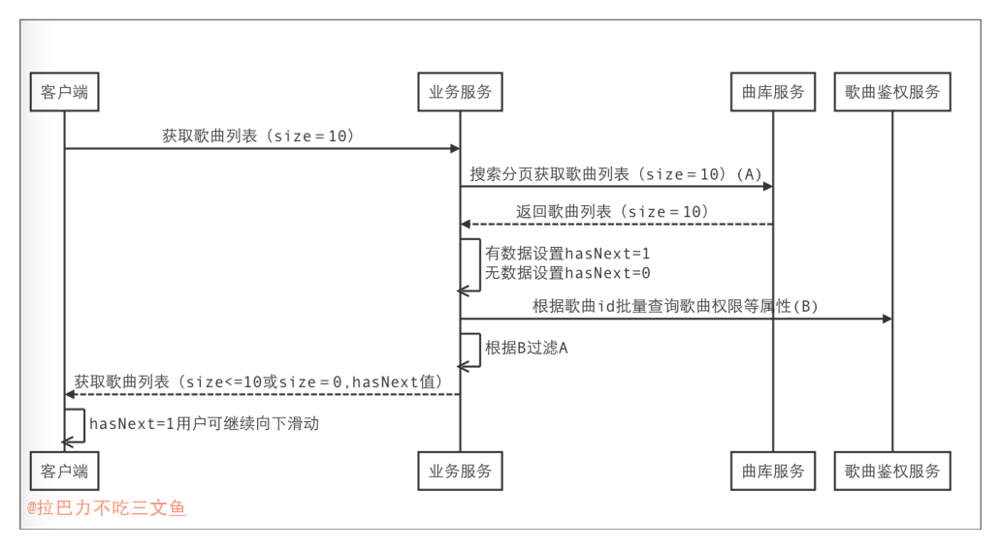

+ 移动互联网下微服务大行其道，服务之间按业务拆分精细，各司其职，通过服务发现rpc相互调用，实现各自的需求场景。
+ 一个简单的列表，如果不依赖其他服务，只依赖自身的数据库，可以简单的通过sql即可查询出来。
+ 而如果数据来源于其他服务，根据特定的需求场景，可能就需要调用多个服务，获取数据，判断属性，过滤数据，再展示，那么可能未免会出现分页的问题。
  
+ 以下面的场景为例：

+ 业务服务依赖两个底层服务的数据进行聚合，导致返回客户端的数据小于请求值10，甚至为空，客户端认为已经没数据了，从而错误提示用户“已经到底了”。
+ 解决方案：客户端不依赖返回数据的数量判断是否还有数据，由服务端返回"hasNext=1"来判断是否有数据，控制用户是否可继续滑动查看

+ 方案并不完美，极端情况下可能因为数据被过滤，导致返回前端数据太少设置没数据，影响体验。所以此方案只是不考虑极端场景的折中方案，另外的优化手段是初始请求size控制在一个合适的值，比如size=30

