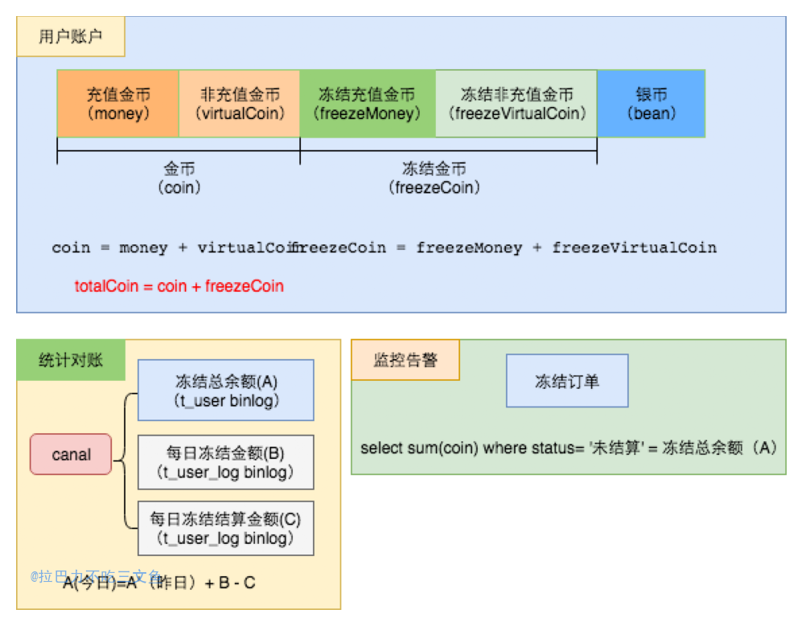

+ 在打赏类业务中，消费跟分成是紧紧挂钩的。比如在直播间送礼，用户通过花费虚拟货币给对方送礼，而对方则得到相应的分成。
+ 定义：用户花费的是“金币”，接受者得到的是“银币”。

### 设计概要

#### 一、用户货币类型组成

1. 用户通过充值或活动赠币等方式得到“金币(coin)”
   - 充值行为得到的是“充值金币(money)”
   - 活动赠币等非充值行为得到的是“非充值金币(virtualCoin)”
   - coin=money + virtualCoin
2. 消费行为的接受者（收益方）得到的是“银币(bean)”

#### 二、业务情况

所有的业务场景其实都是对上述几种货币类型的加减，主要分为以下几类：

1. 充值业务
2. 消费业务（伴随着分成）
3. 赠币业务（活动获取）
4. 兑换业务（“银币”可以兑换成“金币”进行消费）
5. 结算业务（“银币”可以进行提现）
6. 管理员调整（运营行为，对用户货币进行调整）

#### 三、冻结账户设计

针对消费场景，有两种形式的消费：
1. 即时消费(比如送礼)；
	- 用户消费的同时，收益方立即得到相应的分成
2. 延迟消费(比如申请上麦)
	- 先对用户的“金币“进行冻结，根据最终的结果，对用户冻结的金币进行结算或退回；用户的消费时间为实际结算的时间（不是冻结时的时间）。

+ 冻结&结算 和 消费&退款 在技术实现设计上的差异：
	1. 前者两次RPC，后者一次RPC
	2. 前者以结算时间作为消费完成时间；后者是以扣币时间作为消费完成时间，且退款会导致营收数据受影响

