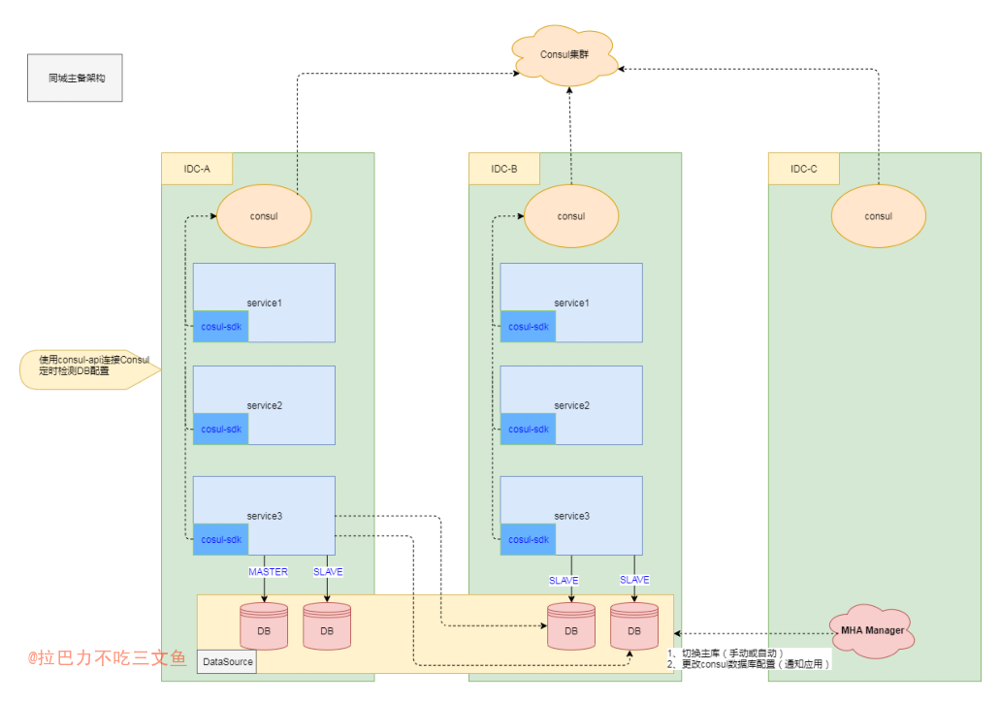
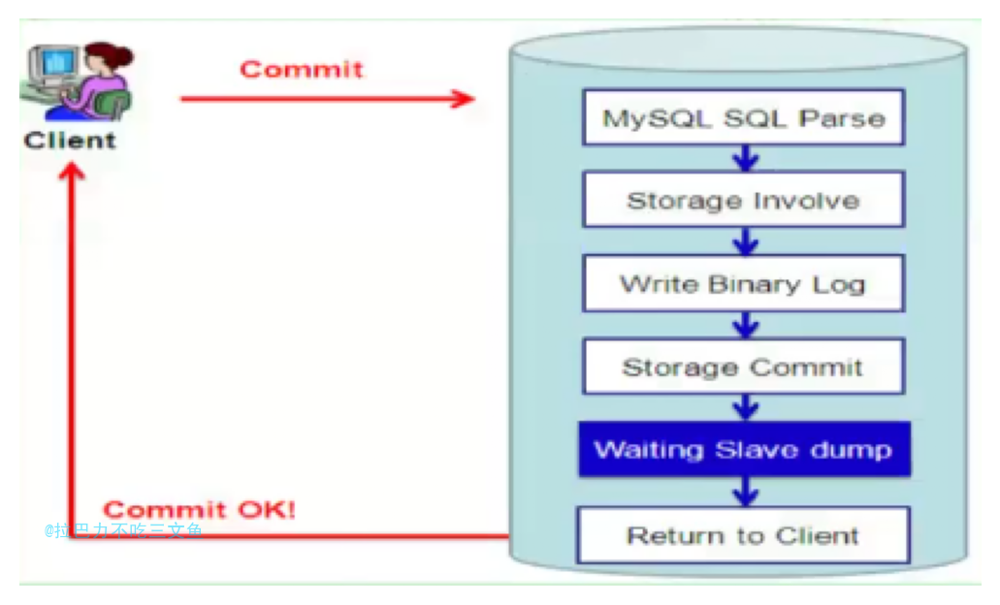
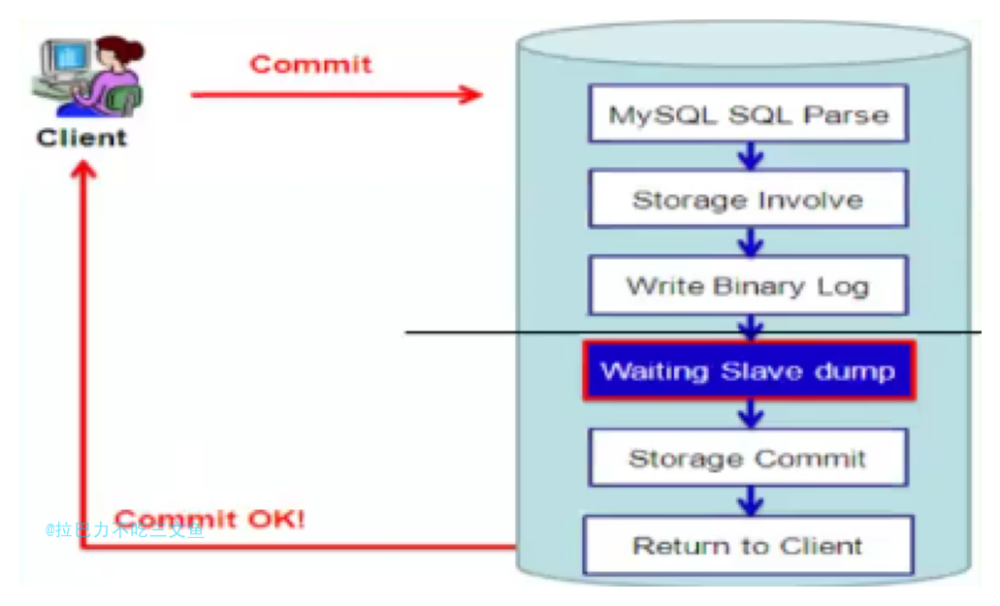
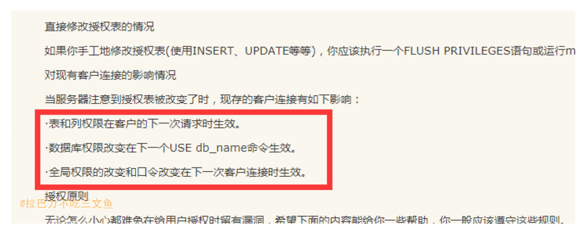

## 概述
MHA + Consul + MySQL的高可用方案，网上已经有很多资料，这里只是做一下简要的总结和思考。文章部分文字摘自Reference中的链接。
直接先上一张图

1. 图中的灾备架构适用于同城主备架构的业务，比如金钱业务；
2. DB层是一主多从，主库至在其中一个机房，并在DB集群上搭建跨IDC的MHA；同样Consul也是跨IDC的集群；
3. 业务的写主流量配置在主库机房的一侧，当主库故障发生DB切换产生新主库时，流量也跟从新主库一同切换；
4. 主库切换通过MHA完成，并通过Consul集群和应用的SDK通知到业务服务。
5. MySQL采用默认的异步复制方式

### 解决什么问题
1. 解决MySQL的单点问题。当主库发生故障时能提升从库为新的主库，且应用层能自动识别；从而缩短故障的处理时间；
2. 通过Consul能支持从库的故障切换以及从库扩容或下线；

### 每个组件各自的作用
1. MHA：监控主节点，可以在故障时自动或手动切换、非故障时手动主从切换。切换时会进行数据补齐，并将新的master信息更新到consul中。
2. Consul：MySQL服务注册并提供健康检查、记录最新的master；还可以提供其他配置性的服务，比如dns，可解析数据库域名。
3. SDK: sdk通过consul-api监控MySQL ip列表的变化，能连接新的库和去掉已下线的库。

下面的部分将对使用到的技术逐一简要描述和总结。

## MHA

### 介绍
<pre>
MySQL MHA架构介绍：

MHA（Master High Availability）目前在MySQL高可用方面是一个相对成熟的解决方案，它由日本DeNA公司youshimaton（现就职于Facebook公司）开发，是一套优秀的作为MySQL高可用性环境下故障切换和主从提升的高可用软件。在MySQL故障切换过程中，MHA能做到在0~30秒之内自动完成数据库的故障切换操作，并且在进行故障切换的过程中，MHA能在最大程度上保证数据的一致性，以达到真正意义上的高可用。

该软件由两部分组成：MHA Manager（管理节点）和MHA Node（数据节点）。MHA Manager可以单独部署在一台独立的机器上管理多个master-slave集群，也可以部署在一台slave节点上。MHA Node运行在每台MySQL服务器上，MHA Manager会定时探测集群中的master节点，当master出现故障时，它可以自动将最新数据的slave提升为新的master，然后将所有其他的slave重新指向新的master。整个故障转移过程对应用程序完全透明。

在MHA自动故障切换过程中，MHA试图从宕机的主服务器上保存二进制日志，最大程度的保证数据的不丢失，但这并不总是可行的。例如，如果主服务器硬件故障或无法通过ssh访问，MHA没法保存二进制日志，只进行故障转移而丢失了最新的数据。使用MySQL 5.5的半同步复制，可以大大降低数据丢失的风险。MHA可以与半同步复制结合起来。如果只有一个slave已经收到了最新的二进制日志，MHA可以将最新的二进制日志应用于其他所有的slave服务器上，因此可以保证所有节点的数据一致性。

目前MHA主要支持一主多从的架构，要搭建MHA,要求一个复制集群中必须最少有三台数据库服务器，一主二从，即一台充当master，一台充当备用master，另外一台充当从库，因为至少需要三台服务器，出于机器成本的考虑，淘宝也在该基础上进行了改造，目前淘宝TMHA已经支持一主一从。（出自：《深入浅出MySQL(第二版)》）
</pre>

<pre>
MHA工作原理总结为以下几条：
（1）从宕机崩溃的master保存二进制日志事件（binlog events）;
（2）识别含有最新更新的slave;
（3）应用差异的中继日志(relay log) 到其他slave;
（4）应用从master保存的二进制日志事件(binlog events);
（5）提升一个slave为新master;
（6）使用其他的slave连接新的master进行复制。
</pre>

<pre>
自带脚本：
自动切换脚本：/usr/local/bin/master_ip_failover
手动切换脚本：/usr/local/bin/master_ip_online_change
</pre>

### 图中的MHA阐述
1. 服务为主备架构，部署在IDC-A和IDC-B，其中主流量在IDC-A；MHA MANAGER则部署在IDC-C（第三个机房），这样才能保证任意一边的IDC出问题，都不影响MHA的切换；
2. 为了防止来回切导致严重数据问题。可以设置，当MHA发生自动切换时，MHA MANAGER无论成功与否都会退出；
3. MHA在故障时可以进行数据补齐。

## MySQL 半同步复制

### 主从复制的基本原理
1. [master] SQL操作存入binLog中;
2. [slave] 连接master，进行数据同步;
2. [master] dump thread 把binlog数据发送到slave中;
3. [slave] 创建I/O线程读取 master传输过来的binlog内容并写入到relay Log;
4. [slave] 创建SQL线程，从relay Log读取并执行。

### 主从复制的方式

1. 异步复制（Asynchronous replication）
	- MySQL默认的复制即是异步的，主库先提交事务，然后立即响应客户端。
	- 如果主库crash，且主库上已经提交的事务还没有同步到相应的从库上，那么当从库提升为主时，会导致新主上的数据不完整。
	- 性能最好
	
2. 全同步复制（Fully synchronous replication）
	- 当主库执行完一个事务，且所有的从库都同步完之后才响应客户端。
	- 性能差
	
3. 半同步复制（Semisynchronous replication）
	- AFTER_COMMIT；即参数 rpl_semi_sync_master_wait_point = after_commit
	- 介于异步复制和全同步复制之间，主库提交完事务之后不立即响应客户端，而是等待至少一个从库接收到并写到relay log中才响应客户端。相对于异步复制，半同步复制提高了数据的安全性，同时它也造成了一定程度的延迟，这个延迟最少是一个TCP/IP往返的时间。所以，半同步复制最好在低延时的网络中使用。
	- 等待的时间以rpl_semi_sync_master_timeout参数为准，默认为10秒。在这等待的10秒里，对其他会话该事务是可见的；所以一旦master发生宕机，对外就会产生不一致的影响
	- Slave ACK超时，将退化为异步复制模式 （所以半同步复制并不是严格意义上的半同步复制）

4. 增强半同步（Loss-less Semi-Synchronous）
	- AFTER_SYNC；即参数 rpl_semi_sync_master_wait_point = after_sync
	- after sync是MySQL5.7官方新加以解决MySQL5.6半同步缺陷的选项，也是官方推荐的方式。
	- 原理：客户端发送过来一个请求，经过mysql的SQL分析，存储引擎处理，写入binlog，然后		写入从库的relaylog，存储引擎层提交，最后返回给客户端。
	- 优点：主库把SQL操作先发给从库的relay log，然后再提交，再响应给客户端，这个过程即使		在storage commit之后主crash了，日志也已经写入到relay log中，从库和主库数据一致。
	- 在commit之前等待Slave ACK，可以堆积事务，利于group commit，有利于提升性能。
	- 在master接受到Slave ACK之前，数据的变化对其他会话时不可见的，因为此时并未提交，从	而也不会产生数据不一致的影响。
	- 同样，Ack超时，也将退化为异步复制模式

5. 组复制 MySQL Group Replication（MGR）
	- MGR内部实现了分布式数据一致性协议，paxos通过其来保证数据一致性。

### after_commit VS after_sync

- after_commit：master把每一个事务写到二进制日志并保存到磁盘上，并且提交（commit）事务，再把事务发送给从库，开始等待slave的应答。响应后master返回结果给客户端，客户端才可继续。
- after_sync  ：master把每一个事务写到二进制日志并保存磁盘上，并且把事务发送给从库，开始等待slave的应答。确认slave响应后，再提交（commit）事务到存储引擎，并返回结果给客户端，客户端才可继续。
- 半同步和增强半同步都是等待slave的ACK后才给客户端返回成功（也就是整个流程完成）

### 总结

+ 一致性要求高的，比如金融类的（相比其他业务TPS较低），可以考虑开启增强半同步复制

### 其他

1. MySQL 5.7新增了rpl_semi_sync_master_wait_for_slave_count系统变量，可以用来控制主库接收多少个从库写事务成功反馈，给高可用架构切换提供了灵活性。	当该变量值为2时，主库需等待两个从库的ACK。

## Consul

### 介绍

+ Consul is a tool for service discovery and configuration. Consul is distributed, highly available, and extremely scalable
+ Consul是一个服务管理软件。支持多数据中心下，分布式高可用的，服务发现和配置共享。采用 Raft 算法,用来保证服务的高可用。
+ Consul使用Gossip Protocol来管理成员资格并向集群广播消息。所有这些都是通过使用Serf库提供的。
+ 关于raft算法原理，可以后续再讲。

### 和MHA的结合使用

1. checkmysql 脚本部署到每台 consul server 中, 实现了多点检测 MySQL 是否正常;
2. checkmysql 脚本在超过半数的情况下调用 masterha_manager_consul 脚本进行主从切换;

#### 主从切换

+ MHA 是切换工具，控制数据库主从切换和数据补齐；
+ MHA 进行故障检测，故障时进行切换并通知Consul下发新的主库配置到应用服务。

#### 从库上下线

+ Consul可以对从库进行健康检查，通过配置下发控制从库上下线。

## 扩展

### CMDB
+ 配置管理数据库( Configuration Management Database,CMDB)
+ 自动化运维立足之本。在容灾切换管理工具中，可以直接一键从CMDB中同步所有业务系统，并能够非常灵活的定义每个业务系统的切换过程环节以及每个环节所有执行的具体操作。
+ [CMDB与容灾备份的关联](https://blog.51cto.com/031028/2426950)
+ [好的CMDB建设，应该具备这些要素](https://cloud.tencent.com/developer/news/302057)
+ [【运维探讨】如何实现更加简单、高效、安全的灾备切换管理？](https://blog.csdn.net/weixin_42556618/article/details/107345128)

### 脑裂

+ 脑裂问题是分布式多活建设必须面临的问题之一。
+ 以上面的架构进行描述，当IDC-A和IDC-B、IDC-C网络不通时，其实IDC-A就是一个网络孤岛。
这时候时IDC-B中的从库就会提升为主库，并开始接收写操作。因为IDC-A已经是个数据孤岛，服务的主从库并未发生改变(接收不到consul下发的配置)，此时也接受外部的写操作请求，那么就会造成两边数据都有写操作，错误的双主架构导致错误的数据问题。

#### 如何避免脑裂问题
1. 如何让IDC的服务可以判断自身是否孤岛，从而拒绝服务，避免数据问题呢？
2. 其中一个方案使用Consul作为选主服务来解决。后续另开文章叙述。
3. 使用etcd：[etcd 实现故障时主备秒级切换高可用架构](https://mp.weixin.qq.com/s/VFJg14JcapijOyhfJJMYUg)
4. 分布式锁服务Chubby（参见文献[Bur06]）集群锁服务提供一个与文件系统类似的API用来操作锁。Chubby 可以处理异地、跨机房级别的锁请求。Chubby 使用Paxos协议来提供分布式一致性（具体描述参看第23章）。Chubby 是实现主实例选举（Master-Election）过程的关键组件。例如，一个服务有5个冗余实例在同时运行，但是只有一个实例可以处理对外请求，一般的做法是通过Chubby进行自动选举，选择一个实例成为主实例。Chubby适合存放那种对一致性要求非常高的数据。---《SRE：Google运维解密》

#### 结合raft的思考
+ 为了避免脑裂，需要有选主机制，一般超半数的投票才能成为leader；Consul就是基于raft是实现的；
+ 在线上部署consul必须至少是三个机房，因为如果只有两个机房，其中一个机房挂了（刚好是大多数机器的机房），服务将不可用；
+ 分布式存储系统，需要解决数据的一致性问题和脑裂问题。
	1. raft有实现，但是首先得基于raft协议的文件存储；
	2. 使用MySQL作为存储，Consul作为选主服务的业务：Consul可以解决脑裂问题；而在数据的一致性则需要业务自身进行保证（比如比较业务流水）
		- MySQL的半同步复制机制 支持配置n个从库ack才响应客户端（其实和raft大多数结点写成功才算成功有点类似[Quorum机制]），可以很大程度的避免丢数据导致不一致。
+ 一般金钱业务使用同城两个机房，主备架构，那么不能完全和raft三机房匹配（三机房意味着一定每个机房至少有一个结点接收到数据才算成功）。因此半同步复制只能一定程度上解决机房网络无异常下，单个结点故障的情况下，数据的一致性。所以一般情况下，切完机房保持数据一致性或检查监控数据一致性的方案，需要业务方自行监控和修正。

## Q&A

### 为什么Dump和I/O线程不能多线程？
1. dump线程和IO线程都是负责网络传输，如果将这里扩展为多线程那么会将一份Binlog日志分割为多份，并行传输，那么在slave端将会要额外的增加代码考虑如何将多份日志还原为原来的Binlog，大大增加难度。
2. 性能瓶颈不在IO，扩展后也没有多大效率提升。
3. 为什么Redis 6.0使用IO多线程增强性能，MySQL这里使用IO多线程却不行？
	- Redis是多个Client节点一个Server节点（暂且这么看），IO线程需要处理多个不同Client来源的请求；MySQL主从复制，本质上是1个Client端一个Server端，增大IO线程也无济于事。

### 增强半同步是否会导致从有数据而主却没有？
+ 是。在Loss-less Semi-Synchronous模式下，master在调用binlog sync之后，engine层commit之前等待Slave ACK（需要收到至少一个Slave节点回复的ACK后）。这样只有在确认Slave收到事务events后，master事务才会提交，然后把结果返回给客户端。此时此事务才对其他事务可见。在这种模式下解决了after_commit模式带来的幻读和数据丢失问题，因为主库没有提交事务。但也会有个问题，假设主库在存储引擎提交之前挂了，那么很明显这个事务是不成功的，但由于对应的Binlog已经做了Sync操作，从库已经收到了这些Binlog，并且执行成功，相当于在从库上多了数据，也算是有问题的，但多了数据，问题一般不算严重。这个问题可以这样理解，作为MySQL，在没办法解决分布式数据一致性问题的情况下，它能保证的是不丢数据，多了数据总比丢数据要好。

### MHA本身就支持自动切，为什么还要使用Consul？
+ MHA本身提供了自动切换主库的功能，但是MHA本身没有提供通知应用等机制。因此采用比较成熟的方案MHA+consul，并以SDK的方式接入。

### 自动切换安全吗？
1. 直接启用masterha_manager 自动切换脚本并不安全，主要因为在网络抖动的情况下并不能保证数据库真的不能访问。不能仅通过一个点的检测就判断数据库不可访问。
2. 通过 Consul( Consul 提供 dns 接口)集群的特性, 增加多点检测机制, 在 n 个集群的环境中, 有超过半数的检测点检测到数据库有问题, 就认为数据库不可访问, 这时调用 masterha_manager 脚本进行切换。
3. 网络问题千变万化，在发生切换事件之后，需有相应的方案对主从流水数据进行对账或修正（确定基于binlog与应用日志的重要数据校验与补偿机制）。
4. 发生切换事件之后，在确定数据已经无异常之前，需要防止再自动切回去，造成严重的数据异常。所以一般情况下，只能自动切一次，直到人工介入确认无异常，重新设置为自动切模式。当然，有完善的监控比对数据异常机制的情况下，可以考虑做成自动化，无需依赖人工介入。

### MHA切换之后，主库禁写后，现有的连接是否还能继续写入?

mha切库禁写时，直接锁住整个实例，新操作无法写入，直接就设置read_only。

### 自动切的时机如何把握？
1. 自动切的最佳时机很难人为，必须经过多种故障场景的测试，确定合适尽可能安全的切换策略和参数。
2. 在实践中，初期可以先告警人工介入决定是否切换；确定好合适的切换策略和参数后，自动切在非核心业务中稳定正确运行一段时间后才在核心业务运用。

### MHA能保证数据一定不丢吗？
+ 在MHA自动故障切换过程中，MHA试图从宕机的主服务器上保存二进制日志，最大程度的保证数据的不丢失。但如上所述，网络等问题时无解的，理论上还是存在丢的可能性。一致性要求高的，比如金钱类的（相比其他业务TPS较低），可以考虑开启半同步复制，大大降低数据丢失的风险。

### 新的主库和原主库数据一致性问题如何解决？
1. MHA只能尽量保证数据补齐；
2. 主从延迟较大时，切主库有风险；
3. 开启半同步复制可以大大降低丢数据的风险，但也带来一定的性能损耗；
4. 要做好切库后，主从日志流水对比修复方案

### 不一致如何止损？
1. 根据业务情况进行实现，比如在发生切换事件的一端时间内(比如一个小时)，阻断大额交易操作，等待开发确认后再恢复；
2. 具体实现可以使用redis存储数据快照，执行前和数据库的数据进行对比判断是否阻断，或其他可行方案；
3. 是否应该阻断，公司的利益和用户的利益，这是个哲学问题。。。

### 扩展
+ 云数据库使用数据库代理进行连接:[读写分离扩展云数据库 MySQL 性能](https://cloud.tencent.com/document/product/236/72619)
+ [切换网络](https://cloud.tencent.com/document/product/236/35671)

## Reference
1. [基于 consul 架构的 MHA 自动切换](https://www.cnblogs.com/arstercz/p/6963920.html)
2. [基于MHA+consul的MySQL高可用设计](https://blog.csdn.net/yangjianrong1985/article/details/102479034)
3. [MySQL高可用之MHA的搭建](https://www.cnblogs.com/xuanzhi201111/p/4231412.html)
4. [MHA官方介绍](https://code.google.com/p/mysql-master-ha/)
5. [京东MySQL数据库主从切换自动化](https://mp.weixin.qq.com/s?__biz=MzA3MzYwNjQ3NA==&mid=2651297535&idx=1&sn=2138d7d09cf5294c73810b133eed67e3&chksm=84ff42dab388cbcc90d9642b6cd3ed5de8e524cc10737947ce0c46eb287e95f4bae62472fa24&mpshare=1&scene=1&srcid=0518czFAsyzFLKkM07SIauWS#rd)
6. [MySQL数据库的授权原则](https://www.cnblogs.com/sunss/archive/2010/10/05/1844204.html)
7. [MySQL MHA 搭建&测试](https://www.cnblogs.com/zhoujinyi/p/3808673.html)
8. [MySQL半同步复制](https://www.cnblogs.com/ivictor/p/5735580.html)
9. [MySQL - 异步复制，半同步复制，增强半同步复制，组复制，全告诉你](https://blog.csdn.net/qq_33330687/article/details/107496954)
10. [mysql 半同步复制](https://cloud.tencent.com/developer/article/1537291)
11. [增强半同步复制](https://www.cnblogs.com/allenhu320/p/11316276.html)
12. [【MySQL】5.7增强半同步AFTER SYNC&AFTER COMMIT](https://www.jianshu.com/p/3bfb0bfb8b34)