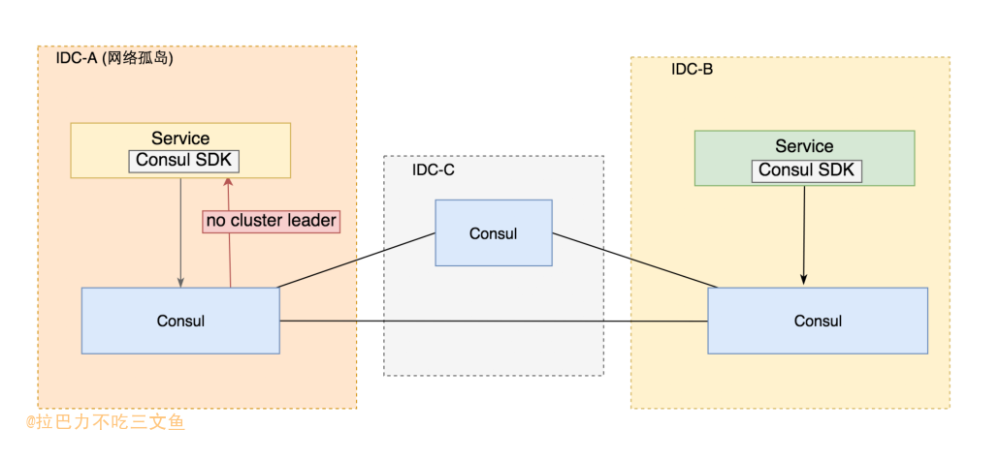

什么是“Split Brain”(脑裂)问题？

Split Brain 是指在同一时刻有两个认为自己处于 Active 状态的 NameNode。对于HA集群而言，确保同一时刻只有一个NameNode处于active状态是至关重要的。否则，两个NameNode的数据状态就会产生分歧，可能丢失数据，或者产生错误的结果。

### CAP理论
- Consistency (一致性): 副本一致性特指强一致性；
- Availiablity(可用性): 指系统在出现异常时已经可以提供服务;
- Tolerance to the partition of network (分区容忍): 指系统可以对网络分区这种异常情 况进行容错处理;

- CAP理论，对于P（分区容忍性）而言，是实际存在 从而无法避免的。因为，分布系统中的处理不是在本机，而是网络中的许多机器相互通信，故网络分区、网络通信故障问题无法避免。因此，只能尽量地在C 和 A 之间寻求平衡。
- 对于数据存储而言，为了提高可用性（Availability），采用了副本备份。某数据块所在的机器宕机了，就去该数据块副本所在的机器上读取。但是，当需要修改数据时，就需要更新所有的副本数据，这样才能保证数据的一致性（Consistency）。因此，就需要在 C(Consistency) 和 A(Availability) 之间权衡。
- Quorum机制，就是这样的一种权衡机制，一种将“读写转化”的模型。

### Quorum机制
1. Write-all-read-one(简称 WARO).(极端的方案)
    - 当Client请求向某副本写数据时(更新数据)，只有当所有的副本都更新成功之后，这次写操作才算成功，否则视为失败。
    - WARO牺牲了更新服务的可用性，最大程度地增强了读服务的可用性。而Quorum就是更新服务和读服务之间进行一个折衷。
2. Quorum 机制
	- 将 WARO 的条件进行松弛,从而使得可以在读写服务可用性之间做折中,得出 Quorum 机制。
	- Quorum机制是“抽屉原理”的一个应用。定义如下：假设有N个副本，更新操作wi 在W个副本中更新成功之后，才认为此次更新操作wi 成功。称成功提交的更新操作对应的数据为：“成功提交的数据”。对于读操作而言，至少需要读R个副本才能读到此次更新的数据。其中，W+R>N ，即W和R有重叠。一般，W+R=N+1
	- 仅仅依赖 quorum 机制是无法保证强一致性的。因为仅有 quorum 机制时无法确 定最新已成功提交的版本号,除非将最新已提交的版本号作为元数据由特定的元数据服务器或元数 据集群管理,否则很难确定最新成功提交的版本号。
		+ 1）如何读取最新的数据？---在已经知道最近成功提交的数据版本号的前提下，最多读R个副本就可以读到最新的数据了。
		+ 2）如何确定 最高版本号 的数据是一个成功提交的数据？---继续读其他的副本，直到读到的 最高版本号副本 出现了W次。
	- Quorum 机制的三个系统参数 N、W、R 控制了系统的可用性,也是系统对用户的服务承诺:数 据最多有 N 个副本,但数据更新成功 W 个副本即返回用户成功。对于一致性要求较高的 Quorum 系 统,系统还应该承诺任何时候不读取未成功提交的数据,即读取到的数据都是曾经在 W 个副本上成 功的数据。

### Lease 机制     
+ Lease 是由颁发者授予的在某一有效期内的承诺。颁发者一旦发出 lease,则无论接受方是否收到,也无论后续接收方处于何种状态,只要 lease 不过期,颁发者一 定严守承诺;另一方面,接收方在 lease 的有效期内可以使用颁发者的承诺,但一旦 lease 过期,接 收方一定不能继续使用颁发者的承诺。
+ Lease 机制依赖于有效期,这就要求颁发者和接收者的时钟是同步的。对于这种时钟不同步,实践中的通常做法是 将颁发者的有效期设置得比接收者的略大,只需大过时钟误差就可以避免对 lease 的有效性的影响。

### 解决脑裂的关键

#### raft是如何解决的？
0. 核心是“大多数成功”机制。Raft就是基于Quorum机制下实现的。
1. 看下以下这篇文章:[为 Raft 引入 leader lease 机制解决集群脑裂时的 stale read 问题](https://www.jianshu.com/p/072380e12657)
	- 这种方法牺牲了一定的可用性（在脑裂时部分客户端的可用性）换取了一致性的保证。
	- 多数派的网络分区挂了，岂不是直接不可写了 
2. 如何解决多数派的网络分区挂了，服务就不可用的问题？
	- 我的答案是部署不止两个网络分区，至少三个网络分区；这样任意一个分区挂了，服务都可用，除非三个分区的大多数分区挂了(挂了2个)；
3. 副本控制协议分为两大类:“中心化(centralized)副本控制协议”和“去中心化(decentralized) 副本控制协议”。解决脑裂的其中一个关键点是哪种 “去中心化的协议”，paxos和raft都是。

#### 使用非分布式存储的应用如何解决？
1. 上述处理脑裂问题的前提是：服务本身就是一个分布式存储服务，使用raft等一致性协议；那么普通的业务服务，使用MySQL的的情况下，怎么解决脑裂问题？
2. MySQL主从服务复制，这种存储服务本身就不是去中心的分布式数据库；
3. 解决问题的核心点是：引入第三方组件作为整个业务集群的“选主服务”(比如Consul、Etcd，都是基于Raft协议)；结合MySQL的半同步复制机制：支持配置n个从库ack才响应客户端（类似Quorum机制）和MHA，可以很大程度的避免丢数据导致不一致。
4. Consul本身就是基于raft协议，可以利用其去中心化的特性，作为选主服务，业务通过Consul识别到哪个集群是主集群之后，可定制进行相应的业务处理。

#### 选主服务
1. Consul、Etcd (Raft)
2. ZooKeeper (ZAB、Paxos )

### 使用Consul解决脑裂问题
+ 

#### 如何判断“孤岛”？
1. 在三个IDC部署一个Consul集群，该集群会存在一个leader，且每个IDC的service在网络正常的情况下，都能检测到哪个是leader；依赖Consul的raft协议选举判断网络孤岛；(为了后续描述简单，假设每个IDC只部署一个Consul结点)
2. 每个IDC的service只访问当前IDC对应的Consul结点；当访问返回“No cluster leader"时，说明该网络分区已经是"孤岛"；
<pre>
curl 'http://consul:8500/v1/health/service/nodeName?passing&wait=1s&index=1&tag=master'
No cluster leader
</pre>
3. 通过“No cluster leader"来判断孤岛的前提是，假设Consul是高可用的。因为当有两个Consul结点无法访问或挂掉的时候，也有能误判成没有leader（实际上并未出现网络孤岛，只是Consul集群异常）；
4. 引入双重检查机制，解决Consul集群因为可用性问题导致的误判的可能性；在Consul判断为网络孤岛的情况下，通过ping异地IDC的service的健康检查接口，二次确认；双重检查机制只能解决误判问题，若Consul集群不能高可用，那么判断孤岛的机制将失效。

#### 如何处理“孤岛”？
1. 判断为孤岛的网络分区的服务，如果接收到外网请求(因为是孤岛情况下其他IDC内网不通)，可以拒绝服务，也可以返回特殊的业务错误码或HTTP错误码，由上层服务或客户端重试到其他的机房。

#### "孤岛"消失后如何恢复？
1. 手动恢复。"孤岛"的网络分区服务不恢复提供服务，由开发人员确认DB等无异常后再手动恢复；
2. 自动恢复。需做好充分的检测手段才能启用自动恢复：DB是否发生切换、主从DB数据是否一致（如比对脚本）、判断网络是否已经恢复到策略(防止来回切)等。

### Q&A

#### 为什么每个IDC的service只访问当前IDC对应的Consul结点？(前提是Consul高可用性)
1. 假设IDC-A出现网络孤岛的情况下，IDC-A的service本身就无法访问IDC-B的Consul结点；
2. 假设IDC-B未出现网络孤岛，IDC-A的service只需要访问IDC-A的Consul结点即可判断；

#### 选主服务一定要选择基于去中心一致性协议的组件吗？
1. 不一定。使用选主服务只是利用组件高可用性和选举机制解决脑裂问题。Raft等去中心一致性的协议解决的的一致性问题及其leader的选举机制。换句话，只要该组件能高可用且在结点大多数存活（网络互通）的情况下，能选举出一个Leader即可，数据的一致性并不重要（因为没用到组件提供的数据存储功能）。
2. 一般情况下，业务使用MHA-Consul-MySQL作为DB切换的高可用方案；那么解决脑裂问题，也使用Consul组件，也可以减少服务对其他组件的依赖。

### 扩展
1. Group Replication
	- Group Replication由至少3个或更多个节点共同组成一个数据库集群，事务的提交必须经过半数以上节点同意方可提交，在集群中每个节点上都维护一个数据库状态机，保证节点间事务的一致性。Group Replication基于分布式一致性算法Paxos实现，允许部分节点故障，只要保证半数以上节点存活，就不影响对外提供数据库服务，是一个真正可用的高可用数据库集群技术。 Group Replication支持两种模式，单主模式和多主模式。在同一个group内，不允许两种模式同时存在，并且若要切换到不同模式，必须修改配置后重新启动集群。 在单主模式下，只有一个节点可以对外提供读写事务的服务，而其它所有节点只能提供只读事务的服务，这也是官方推荐的Group Replication复制模式。
2. NewSQL
	- 关于NewSQL的定义是：这是一类现代关系型的DBMS，旨在为NoSQL的OLTP读写负载提供相同的可扩展性能，同时仍然提供事务的ACID保证。
	- TiDB。TiDB 是一个分布式 NewSQL 数据库。它支持水平弹性扩展、ACID 事务、标准 SQL、MySQL 语法和 MySQL 协议，具有数据强一致的高可用特性，是一个不仅适合 OLTP 场景还适OLAP 场景的混合数据库。

### Reference
+ 刘杰：分布式原理介绍
+ [分布式系统理论之Quorum机制](https://www.cnblogs.com/hapjin/p/5626889.html)
+ [关于MHA_Consul_MySQL高可用方案的简单总结和思考](https://kingson4wu.gitee.io/2020/08/31/20200831-%E5%85%B3%E4%BA%8EMHA-Consul-MySQL%E9%AB%98%E5%8F%AF%E7%94%A8%E6%96%B9%E6%A1%88%E7%9A%84%E7%AE%80%E5%8D%95%E6%80%BB%E7%BB%93%E5%92%8C%E6%80%9D%E8%80%83/)
+ [MySQL · 引擎特性 · Group Replication内核解析](http://mysql.taobao.org/monthly/2017/08/01/)
+ [我们听到的TiDB到底是什么？](https://zhuanlan.zhihu.com/p/71073707)