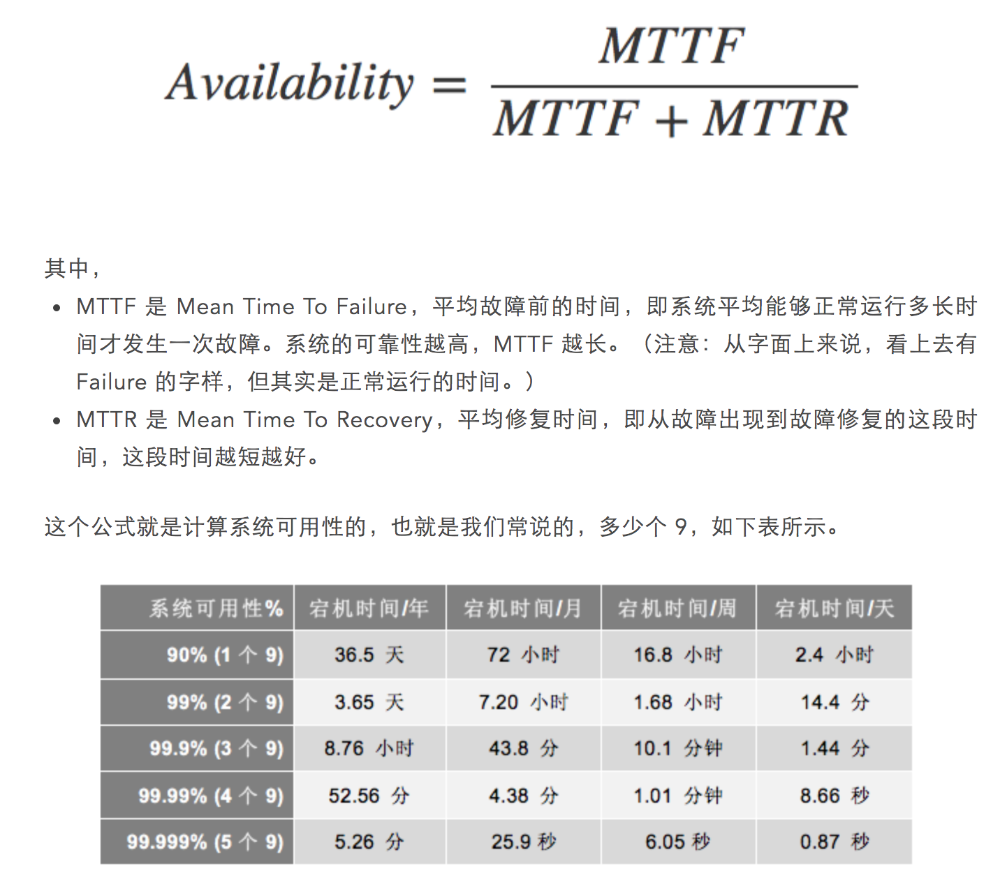
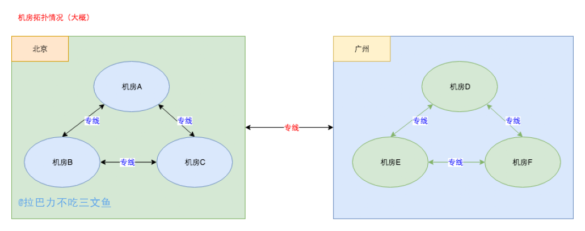
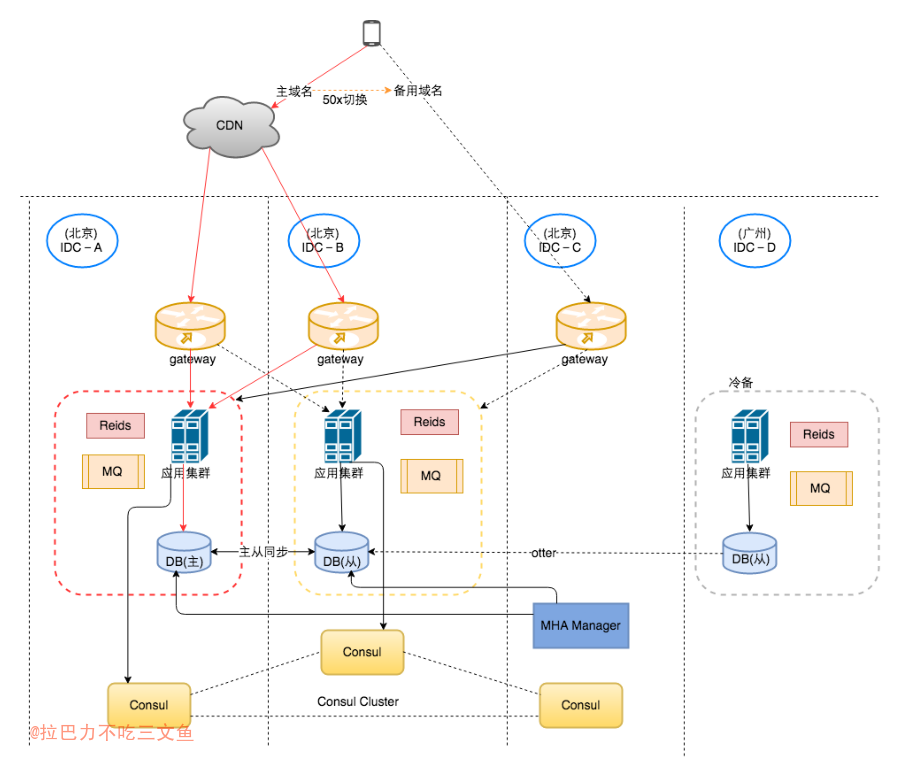

## 概述

+ 本文针对金融类(如用户虚拟货币)这类对数据准确性很敏感的业务的容灾架构；
+ 案例中的服务架构为同城主备架构；
+ 内容包括：容灾架构、故障切换、故障恢复、演练方案等；
+ 涉及技术点：MySQL、MHA、Consul等；
+ 本文基于
	1. [关于MHA-Consul-MySQL高可用方案的简单总结和思考](https://kingson4wu.gitee.io/2020/08/31/20200831-%E5%85%B3%E4%BA%8EMHA-Consul-MySQL%E9%AB%98%E5%8F%AF%E7%94%A8%E6%96%B9%E6%A1%88%E7%9A%84%E7%AE%80%E5%8D%95%E6%80%BB%E7%BB%93%E5%92%8C%E6%80%9D%E8%80%83/)
	2. [如何解决脑裂问题](https://kingson4wu.gitee.io/2020/09/05/20200905-%E5%A6%82%E4%BD%95%E8%A7%A3%E5%86%B3%E8%84%91%E8%A3%82%E9%97%AE%E9%A2%98/)
+ 由于某种原因，某些细节不会描述。
+ 关于系统可用性，收藏了一张网图

+ MTTF 是 Mean Time To Failure，平均故障前的时间，即系统平均能够正常运行多长时间才发生一次故障。系统的可靠性越高，MTTF 越长。（注意：从字面上来说，看上去有 Failure 的字样，但其实是正常运行的时间。）
+ MTTR 是 Mean Time To Recovery，平均修复时间，即从故障出现到故障修复的这段时间，这段时间越短越好。
+ 故障是正常的，而且是常见的。
故障是不可预测突发的，而且相当难缠。
我们要干的事儿就是想尽一切手段来降低 MTTR——故障的修复时间。
-- 陈皓

## 容灾架构

1. 红色线条为正常情况下的服务主链路；
2. 同城主备架构： 主－IDC-A；从－IDC-B;
3. 域名灾备：前端通过主域名访问后端接口，当响应超时或者返回50x的时候，前端将切换到备用域名访问后端接口；
	- 异常情况可能是后端服务异常或者用户所在地区网络不稳定等原因；
	- 针对不幂等的接口，应设置成只切换域名不进行重试；
	- 后端服务可以根据自身服务的异常情况，返回50x，让前端切换到备用域名
4. 主域名为CDN域名，连接北京两个机房，备用域名是非CDN域名，直接连接北京第三个机房；
	- 使用CDN域名的原因：不把回源点暴露出去，从而把核心机房暴露出去。
5. 使用MHA＋Consul作为DB的切换方案；
6. 每个IDC的gateway配置服务的主权重都是在IDC-A；发生故障切换时，gateway将把服务主权重切换到IDC-B，而通过外网进入IDC-A的流量，服务通过返回50x由前端切换到备用域名。

## 详细描述

### 故障切换

#### 触发故障切换的场景
1. 机房孤岛 (MHA＋Consul出发切换)
2. 网络抖动 (由决策服务通过健康检查手段决策)
3. 服务自身异常或机器问题等 (MHA＋Consul出发切换)

#### 1) MHA+Consul切换
+ 触发条件：1或3 (主库不可访问)
+ MHA＋Consul切换后，决策服务切换gateway的服务权重

#### 2) 决策服务切换
+ 触发条件：2 (网络抖动)
+ 决策服务健康检查异常后，通过MHA+Consul主动切换主库，并切换gateway的服务权重

### 机房容灾场景（单机房故障）

#### 1) 机房内外网不通
1. IDC-A故障
	1. 服务权重通过gateway切换到IDC-B
	2. 外网无法进入IDC-A，只能进入IDC-B
	3. CDN域名检测异常后剔除IDC-A的服务节点
	4. 故障瞬间由于IDC-A不通，cdn结点会重试到IDC-B或者返回前端50x，前端访问备用域名。
2. IDC-B故障
	1. 服务权重无需调整
	2. 外网无法进入IDC-B，只能进入IDC-A
	3. CDN域名检测异常后剔除IDC-B的服务节点
	4. 故障瞬间由于IDC-B不通，cdn结点会重试到IDC-A或者返回前端50x，前端访问备用域名。

#### 2) 机房孤岛（内网不通，外网通）
1. IDC-A故障
	1. 服务权重通过gateway切换到IDC-B
	2. 通过外网进入IDC-A的流量，服务自杀返回50x，前端访问备用域名
		- 服务自杀参考：[如何解决脑裂问题](https://kingson4wu.gitee.io/2020/09/05/20200905-%E5%A6%82%E4%BD%95%E8%A7%A3%E5%86%B3%E8%84%91%E8%A3%82%E9%97%AE%E9%A2%98/)
2. IDC-B故障
	1. 服务权重无需调整
	2. 通过外网进入IDC-B的流量，服务自杀返回50x，前端访问备用域名

#### 3) 机房网络抖动
机房服务异常（内外网都通，但该机房服务有问题，网络不稳定，丢包率高等，需机房切换）。
流量进入服务之后处理同2）只是切换策略不同。

### 决策服务
1. 通过Consul判断是否孤岛
2. 通过接口调用失败率，apm，监控网络丢包率等指标判断
3. 相关服务同步切

#### 单元化
1. 切换需要把相互依赖的服务整体进行切换，尽量避免跨机房调用。

### 实现

### gateway如何实现
+ 可以考虑结合服务发现，以localproxy代替nginx代替服务权重配置

### 其他注意事项
1. 定时任务是否要切换
2. MQ消费或生产是否要切换
3. 服务强依赖要单元化，比如强依赖方主备，自己的服务做双活也没用
4. MQ类发送异步进行
5. 留意nginx重试机制，如以下配置：`proxy_next_upstream error | timeout | invalid_header | http_500 | http_502 | http_503 | http_504;`，501是不重试的，超时和其他50x会重试。
	- [nginx的重试机制](https://blog.csdn.net/mj158518/article/details/49847119)

### 其他技巧
1. 服务所依赖的外部服务分为强依赖和弱依赖。弱依赖可以继续降级，而强依赖则不可以。
2. 强依赖可以进一步划分成读依赖和写依赖。通常情况下写依赖是几乎不可能优化的，只能依赖其高可用，比如扣费服务。而读依赖则有优化空间，读依赖可以分为实时性依赖和非实时性依赖，后者可以通过缓存来解决强依赖的问题，比如用户的信息。这部分数据通常的强依赖的，但是又可以缓存下来。
3. 强实时性读依赖的，故障情况下，可以考虑降级成非实时性依赖。比如采取先读远端数据，失败时降级成读缓存的策略。

### 演练方式
0. 前期：tcpcpoy线上流量，复制线上服务部署单独一台演练环境，包括应用和db
1. kill服务，killDB
2. iptables屏蔽端口
	- iptable和kill应用不一样。前者会有readtimeout，后者直接reset peer
	- kill应用的方式基本是平稳的，使用iptable屏蔽端口的方式，可能会有connectTimeout或readTimeout。
3. 线上停机房
	- 停专线一定是孤岛，不存在一边内网通，另一边内网不通的情况，是一个内网（看上图的网络拓扑图）。

### Q&A

1. 备用机房（IDC-B）正常情况下无流量？
	- 配置万分之一的流量，确保切换前已经可用。
	- 确保切换之前备机房是可用的，是否可用通过观察日志情况。
	- 备用机房异常应该及时告警。
2. 为什么跨机房同步使用MySQL主从同步而使用otter？
	- 一般主从同步只在同机房或者同城进行。
	- otter是阿里开源的一个分布式数据库同步系统，尤其是在跨机房数据库同步方面，有很强大的功能。 
	- ？？？？
3. 相关服务一同切换是否合理
	1. 机房异常一同切换可行；
	2. 如果只是单个服务异常，别的服务也要跟着切库不一定合理。决策服务应该支持业务自行配制切换策略。

