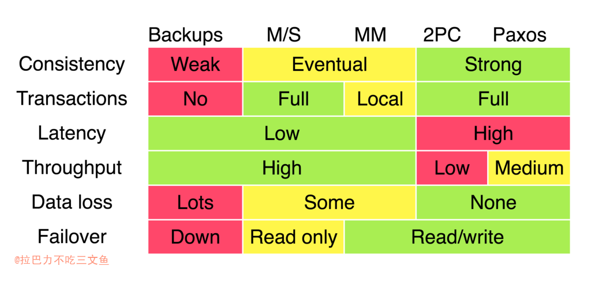

分布式一致性（共识）协议 (consensus protocol)
本文内容基本来源：网上资料总结

## 一致性模型

+ 一致性（Consistency）是指多副本（Replications）问题中的数据一致性。

1. 强一致性：数据更新成功后，任意时刻所有副本中的数据都是一致的，一般采用同步的方式实现。
2. 弱一致性：数据更新成功后，系统不承诺立即可以读到最新写入的值，也不承诺具体多久之后可以读到。
3. 最终一致性：弱一致性的一种形式，数据更新成功后，系统不承诺立即可以返回最新写入的值，但是保证最终会返回上一次更新操作的值。

## CAP
+ CAP是指在一个分布式系统中，一致性（Consistency）、可用性（Availability）、分区容错性（Partition tolerance）这三个要素最多只能同时实现两点，不可能三者兼顾。
+ CAP理论提出就是针对分布式环境的，所以，P 这个属性是必须具备的。

1. Consistency 一致性
一致性指“all nodes see the same data at the same time”，即更新操作成功并返回客户端完成后，所有节点在同一时间的数据完全一致。等同于所有节点拥有数据的最新版本。
CAP中的C指的是强一致性。
2. Availability 可用性
可用性指“Reads and writes always succeed”，即服务一直可用，而且是正常响应时间。
对于一个可用性的分布式系统，每一个非故障的节点必须对每一个请求作出响应。如果不考虑一致性，这个是很好实现的，立即返回本地节点的数据即可，而不需要等到数据一致才返回。
3. Partition Tolerance 分区容忍性
Tolerance也可以翻译为容错，分区容忍性具体指“the system continues to operate despite arbitrary message loss or failure of part of the system”，即系统容忍网络出现分区，分区之间网络不可达的情况，分区容忍性和扩展性紧密相关，Partition Tolerance特指在遇到某节点或网络分区故障的时候，仍然能够对外提供满足一致性和可用性的服务。

+ 传统数据库都是假设不保证P的，因为传统数据库都是单机或者很小的本地集群，假设网络不存在问题，出现问题手工修复。所以，损失分区容错(P)只保证CA相当于就是一个单体应用，根本不是分布式。
+ 分布式是要求单个节点故障(概率太高了)系统仍能完成运行。搭建分布式就是间接要求必须保证P，即P是现实，那C和A就无法同时做到，需要在这两者之间做平衡。
+ 像银行系统，是通过损失可用性(A)来保障CP，银行系统是内网，很少出现分区不可达故障状态，一旦出现，不可达的节点对应的ATM就没法使用，即变为不可用。同时如果数据在各分区未达到一致，ATM也是Loading状态即不可用。
+ 在互联网实践中，可用性又是极其重要的，因此大部分是通过损失一致性(C)来保障AP，当然也非完全牺牲一致性，使用弱一致性，即一定时间后一致的弱一致性，当数据还在同步时(WRITE之后)，使用上一次的数据。

+ Google 2009年 在Transaction Across DataCenter 的分享中，对一致性协议在业内的实践做了一简单的总结，如下图所示，这是 CAP 理论在工业界应用的实践经验。

### BASE 理论
- Basically Available（基本可用）
- Soft state（软状态）
- Eventually consistent（最终一致性）

+ BASE 理论是对 CAP 中的一致性和可用性进行一个权衡的结果，理论的核心思想就是：我们无法做到强一致，但每个应用都可以根据自身的业务特点，采用适当的方式来使系统达到最终一致性。

## 分类

### 按单主和多主进行分类
1. 单主协议，即整个分布式集群中只存在一个主节点。主备复制、2PC、 Paxos、Raft、ZAB。
	- （不允许数据分歧）：整个分布式系统就像一个单体系统，所有写操作都由主节点处理并且同步给其他副本。
2. 多主协议，即整个集群中不只存在一个主节点。Pow、Gossip协议。
	- （允许数据分歧）：所有写操作可以由不同节点发起，并且同步给其他副本。

+ 单主协议由一个主节点发出数据，传输给其余从节点，能保证数据传输的有序性。而多主协议则是从多个主节点出发传输数据，传输顺序具有随机性，因而数据的有序性无法得到保证，只保证最终数据的一致性。这是单主协议和多主协议之间最大的区别。

<pre>
－－－单主－－主备复制、2PC、 Paxos、Raft、ZAB
｜
－－－多主－－Pow、Gossip
</pre>

### 按CAP中的P分类
+ 分区容忍的一致性协议跟所有的单主协议一样，它也是只有一个主节点负责写入（提供顺序一致性），但它跟 2PC 的区别在于它只需要保证大多数节点（一般是超过半数）达成一致就可以返回客户端结果，这样可以提高了性能，同时也能容忍网络分区（少数节点分区不会导致整个系统无法运行）。分区容忍的一致性算法保证大多数节点数据一致后才返回客户端，同样实现了顺序一致性。

<pre>
－－－非P－－主备复制、2PC
｜
－－－P   －－Paxos、Raft
</pre>

## 算法简介

### 1、主备复制
+ 主备复制可以说是最常用的数据复制方法，也是最基础的方法，很多其他协议都是基于它的变种。 主备复制要求所有的写操作都在主节点上进行，然后将操作的日志发送给其他副本。可以发现由于主备复制是有延迟的，所以它实现的是最终一致性。
+ 主备复制的实现方式：主节点处理完写操作之后立即返回结果给客户端，写操作的日志异步同步给其他副本。这样的好处是性能高，客户端不需要等待数据同步，缺点是如果主节点同步数据给副本之前数据缺失了，那么这些数据就永久丢失了。MySQL 的主备同步就是典型的异步复制。

### 2、2PC
+ 2PC 是典型的 CA 系统，为了保证一致性和可用性，2PC 一旦出现网络分区或者节点不可用就会被拒绝写操作，把系统变成只读的。
+ 由于 2PC 容易出现节点宕机导致一直阻塞的情况，所以在数据复制的场景中不常用，一般多用于分布式事务中。

<pre>
｜－－－1. Prepare(Vote Request) 
｜
｜－－－2. Global Commit (1－ return (Vote Commit)) （正常流程）
｜
｜－－－2. Global Rollback (1－ return (Vote Abort)) （异常流程）
</pre>

+ 缺点：    
	1. 性能问题
	2. 协调者单点故障问题
	3. 丢失消息导致的数据不一致问题

### 3、3PC
+ 相对于2PC，3PC主要解决的单点故障问题，并减少阻塞。在2PC的基础上增加了CanCommit阶段，并引入了超时机制。一旦事务参与者迟迟没有收到协调者的Commit请求，就会自动进行本地commit，这样相对有效地解决了协调者单点故障的问题;但是性能问题和不一致问题仍然没有根本解决。

+ CanCommit阶段: 检查下自身状态的健康性，看有没有能力进行事务操作。

+ 和2PC区别：
	1. 相比较2PC而言，3PC对于协调者（Coordinator）和参与者（Partcipant）都设置了超时时间，而2PC只有协调者才拥有超时机制。这个优化点，主要是避免了参与者在长时间无法与协调者节点通讯（协调者挂掉了）的情况下，无法释放资源的问题，因为参与者自身拥有超时机制会在超时后，自动进行本地commit从而进行释放资源。而这种机制也侧面降低了整个事务的阻塞时间和范围。
	2. 通过CanCommit、PreCommit、DoCommit三个阶段的设计，相较于2PC而言，多设置了一个缓冲阶段保证了在最后提交阶段之前各参与节点的状态是一致的。

+ 无论是2PC还是3PC都无法彻底解决分布式的一致性问题。Google Chubby的作者Mike Burrows说过， there is only one consensus protocol, and that’s Paxos” – all other approaches are just broken versions of Paxos。意即世上只有一种一致性算法，那就是Paxos，所有其他一致性算法都是Paxos算法的不完整版。

### 4、Paxos协议
+ 作者在描述Paxos时，列举了希腊城邦选举的例子，所以该算法又被称为希腊城邦算法。
+ Paxos是非常经典的一致性协议，但是因为过于理论化，难以直接工程化，因此工业界出现了诸多基于Paxos思想出发的变种。虽然这些变种最终很多都和原始的Paxos有比较大的差距，甚至完全演变成了新的协议，但是作为奠基者的Paxos在分布式一致性协议中依然持有不可撼动的地位。

### 5、Raft协议
+ Raft协议是斯坦福的Diego Ongaro、John Ousterhout两人于2013年提出，作者表示流行的Paxos算法难以理解，且其过于理论化致使直接应用于工程实现时出现很多困难，因此作者希望提出一个能被大众比较容易地理解接受，且易于工程实现的协议。Raft由此应运而生。不得不说，Raft作为一种易于理解，且工程上能够快速实现一个较完整的原型的算法，受到业界的广泛追捧。

### Paxos和Raft的对比
+ Paxos算法和Raft算法有显而易见的相同点和不同点。二者的共同点在于，它们本质上都是单主的一致性算法，且都以不存在拜占庭将军问题作为前提条件。二者的不同点在于，Paxos算法相对于Raft，更加理论化，原理上理解比较抽象，仅仅提供了一套理论原型，这导致很多人在工业上实现Paxos时，不得已需要做很多针对性的优化和改进，但是改进完却发现算法整体和Paxos相去甚远，无法从原理上保证新算法的正确性，这一点是Paxos难以工程化的一个很大原因。相比之下Raft描述清晰，作者将算法原型的实现步骤完整地列在论文里，极大地方便了业界的工程师实现该算法，因而能够受到更广泛的应用。
+ 从根本上来看，Raft的核心思想和Paxos是非常一致的，甚至可以说，Raft是基于Paxos的一种具体化实现和改进，它让一致性算法更容易为人所接受，更容易得到实现。由此亦可见，Paxos在一致性算法中的奠基地位是不可撼动的。

### 6、Gossip算法
+ Gossip又被称为流行病算法，它与流行病毒在人群中传播的性质类似，由初始的几个节点向周围互相传播，到后期的大规模互相传播，最终达到一致性。
+ Gossip协议被广泛应用于P2P网络，同时一些分布式的数据库，如Redis集群的消息同步使用的也是Gossip协议，另一个重大应用是被用于比特币的交易信息和区块信息的传播。
+ 应用：数据同步

### 7、Proof-of-work（Pow）
+ Proof-of-work算法又被称为Pow算法。工作量证明算法。
+ Pow最为人所熟知的应用是比特币。

### Gossip算法和Pow算法对比
+ 同为去中心化算法，Gossip算法和Pow算法都能实现超大集群的一致性，但是它们的特性可谓有天壤之别。Gossip算法往往应用于超大集群快速达成一致性的目的。它的特性是如流感一般超强的传播速度，以及自身能够管理的数量可观的节点数。但是对于流传的消息没有特别的管控，无法辨别其中的虚假信息，并且只关注与最终的一致性，不关心消息的顺序性。而Pow算法则完全专注于尽可能地解决"拜占庭将军"问题，防止消息的篡改。它可以不计代价地去要求各个节点参与竞选，以付出巨大算力为代价保证平台的安全性。

## 应用
+ 区块链：Pow、Gossip

## 总结

### 2PC和TCC什么关系
1. 2PC在“分布式一致性协议“的范畴，属于CA层面的一个协议，一般作为和其他协议(PAXOS，Raft)进行对比的形式出现。
2. 2PC在“分布式事务“的范畴，属于数据库层面，XA协议的基础。TCC算是一种特殊的2PC。TCC事务的处理流程与2PC两阶段提交类似，不过2PC通常都是在跨库的DB层面，而TCC本质上就是一个应用层面的2PC，需要通过业务逻辑来实现。

## Reference
+ [分布式一致性协议概述](https://zhuanlan.zhihu.com/p/130974371)
+ [分布式系统：一致性协议](https://www.jianshu.com/p/558acf897628)
+ [分布式一致性协议](https://blog.csdn.net/demon7552003/article/details/86657767)
+ [分布式事务：深入理解什么是2PC、3PC及TCC协议](https://mp.weixin.qq.com/s/jQrPSmPhC_yNbIRcufR8KQ)

