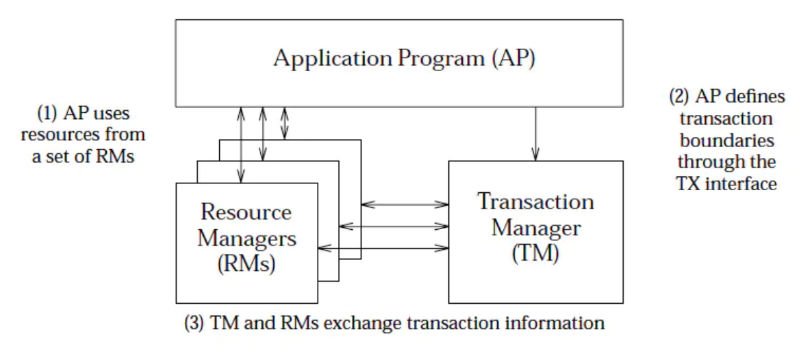
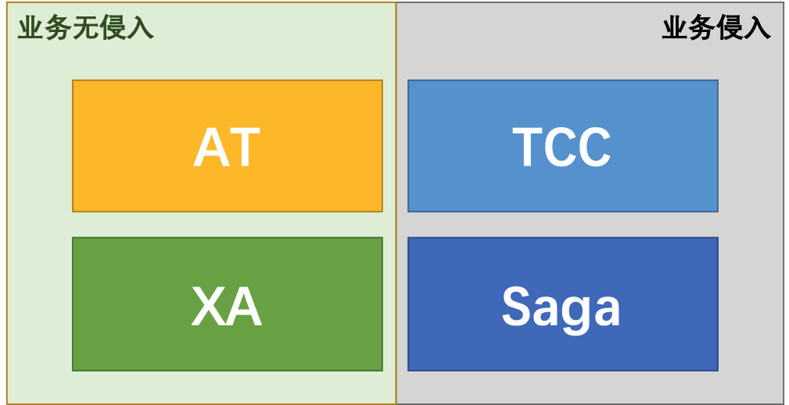
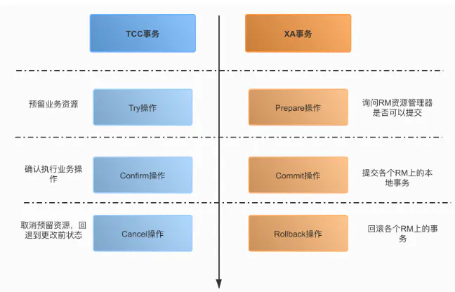

## 前言

+ 本文涉及一些理论基础
+ 业界目前的分布式事务的解决方案
+ 简单的分类和总结
+ 大部分内容来源网上

## 理论基础

### 事务

1. 事务：事务是由一组操作构成的可靠的独立的工作单元，事务具备ACID的特性，即原子性、一致性、隔离性和持久性。
2. 本地事务：当事务由资源管理器本地管理时被称作本地事务。本地事务的优点就是支持严格的ACID特性，高效，可靠，状态可以只在资源管理器中维护，而且应用编程模型简单。但是本地事务不具备分布式事务的处理能力，隔离的最小单位受限于资源管理器。
3. 全局事务：当事务由全局事务管理器进行全局管理时成为全局事务，事务管理器负责管理全局的事务状态和参与的资源，协同资源的一致提交回滚。

### ACID(数据库事务4个特性)
1. Atomicity（原子性）
2. Consistency（一致性)
3. Isolation（隔离性）
4. Durablity（持久性）

### 分布式事务
1. 分布式事务服务（Distributed Transaction Service，DTS）是一种分布式事务框架，用来确保在大规模分布式/微服务环境下端到端业务操作的最终一致性。
2. 在互联网技术里面，强调追求最终一致性。所谓异地多活就是围绕这一点来做的
3. 分布式事务从实质上看与数据库事务的概念是一致的，既然是事务也就需要满足事务的基本特性（ACID），只是分布式事务相对于本地事务而言其表现形式有很大的不同

#### 分布式事务的4种模式
1. AT - (无侵入的分布式事务解决方案)
2. TCC (业务层的2PC)
3. Saga (一种补偿协议，长事务解决方案)
4. XA (DB层的2PC)

+ 阿里seata框架 实现了这四种模式。

### 分布式一致性协议 (consensus protocol)
1. 两阶段提交协议（The two-phase commit protocol，2PC）
2. 3PC
3. PAXOS
4. Raft 等

+ 无论是二阶段提交还是三阶段提交都无法彻底解决分布式的一致性问题。Google Chubby的作者Mike Burrows说过， there is only one consensus protocol, and that’s Paxos” – all other approaches are just broken versions of Paxos。意即世上只有一种一致性算法，那就是Paxos，所有其他一致性算法都是Paxos算法的不完整版。

+ 详情看：TODO

### DTP(Distributed Transaction Processing)
+ DTP（Distributed Transaction Processing Reference Model）：分布式事务处理模型。TM、RM、AP等角色的分布式事务的模型。

+ AP（Application Program，应用程序）
+ TM（Transaction Manager，事务管理器）
+ RM（Resource Manager，资源管理器）
+ DTP规范中主要包含了AP、RM、TM三个部分，其中AP是应用程序，是事务发起和结束的地方；RM是资源管理器，主要负责管理每个数据库的连接数据源；TM是事务管理器，负责事务的全局管理，包括事务的生命周期管理和资源的分配协调等。

+ XA是DTP的一部分接口规范。

### 分类
+ 分布式事务实现方案从类型上去分刚性事务、柔型事务。刚性事务：通常无业务改造，强一致性，原生支持回滚/隔离性，低并发，适合短事务。柔性事务：有业务改造，最终一致性，实现补偿接口，实现资源锁定接口，高并发，适合长事务。
+ 刚性事务：XA 协议（2PC、JTA、JTS）、3PC；
柔型事务：TCC/FMT、Saga（状态机模式、Aop模式）、本地事务消息、消息事务（半消息）
+ 柔性事务（如分布式事务）为了满足可用性、性能与降级服务的需要，降低一致性（Consistency）与隔离性（Isolation）的要求，遵循 BASE 理论
+ 柔性事务和刚性事务
刚性事务满足ACID理论
柔性事务满足BASE理论（基本可用，最终一致）

#### 柔性事务
+ 柔性事务也部分遵循 ACID 规范：
原子性：严格遵循
一致性：事务完成后的一致性严格遵循；事务中的一致性可适当放宽
隔离性：并行事务间不可影响；事务中间结果可见性允许安全放宽
持久性：严格遵循

+ 柔性事务的分类
柔性事务分为：两阶段型、补偿型、异步确保型、最大努力通知型。

两阶段型
分布式事务二阶段提交，对应技术上的 XA、JTA/JTS，这是分布式环境下事务处理的典型模式。

补偿型
TCC 型事务（Try-Confirm-Cancel）可以归为补偿型。在 Try 成功的情况下，如果事务要回滚，Cancel 将作为一个补偿机制，回滚 Try 操作；TCC 各操作事务本地化，且尽早提交（没有两阶段约束）；当全局事务要求回滚时，通过另一个本地事务实现“补偿”行为。
TCC 是将资源层的二阶段提交协议转换到业务层，成为业务模型中的一部分。

异步确保型
将一些有同步冲突的事务操作变为异步操作，避免对数据库事务的争用，如消息事务机制。

最大努力通知型
通过通知服务器（消息通知）进行，允许失败，有补充机制。

针对不同的分布式场景业界常见的解决方案有2PC、TCC、可靠消息最终一致性、最大努力通知这几种。？？？？？

### 其他
+ JTA（Java Transaction API）：分布式事务的编程API，按照XA、DTP的模型和规范实现，在J2EE中，单库事务通过JDBC事务来支持，跨库事务通过JTA API来支持，通过JTA API可以协调和管理横跨多个数据库的分布式事务，一般来说会结合JNDI。

## 分布式事务的4种模式

+ 基本内容来自： [分布式事务的4种模式](https://zhuanlan.zhihu.com/p/78599954) 

### AT 
+ AT 模式是一种无侵入的分布式事务解决方案。
+ 在 AT 模式下，用户只需关注自己的“业务 SQL”，用户的 “业务 SQL” 作为一阶段，Seata 框架会自动生成事务的二阶段提交和回滚操作。
+ 一阶段：Seata 会拦截“业务 SQL”，首先解析 SQL 语义，找到“业务 SQL”要更新的业务数据，在业务数据被更新前，将其保存成“before image”，然后执行“业务 SQL”更新业务数据，在业务数据更新之后，再将其保存成“after image”，最后生成行锁。以上操作全部在一个数据库事务内完成，这样保证了一阶段操作的原子性。
+ 二阶段提交：因为“业务 SQL”在一阶段已经提交至数据库， 所以 Seata 框架只需将一阶段保存的快照数据和行锁删掉，完成数据清理即可。
+ 二阶段回滚：Seata 需要回滚一阶段已经执行的“业务 SQL”，还原业务数据。回滚方式便是用“before image”还原业务数据；但在还原前要首先要校验脏写，对比“数据库当前业务数据”和 “after image”，如果两份数据完全一致就说明没有脏写，可以还原业务数据，如果不一致就说明有脏写，出现脏写就需要转人工处理。

+ 人工处理。不太适合金钱业务，因为“after image”基本都是在变的。

### TCC
+ TCC（Try-Confirm-Cancel）的概念来源于 Pat Helland 发表的一篇名为“Life beyond Distributed Transactions:an Apostate’s Opinion”的论文。
+ TCC 提出了一种新的事务模型，基于业务层面的事务定义，锁粒度完全由业务自己控制，目的是解决复杂业务中，跨表跨库等大颗粒度资源锁定的问题。TCC 把事务运行过程分成 Try、Confirm / Cancel 两个阶段，每个阶段的逻辑由业务代码控制，避免了长事务，可以获取更高的性能。
+ Try 阶段失败可以 Cancel，如果 Confirm 和 Cancel 阶段失败了怎么办？
	- TCC 中会添加事务日志，如果 Confirm 或者 Cancel 阶段出错，则会进行重试，所以这两个阶段需要支持幂等；如果重试失败，则需要人工介入进行恢复和处理等。
+ TCC 的本质是把数据库的二阶段提交上升到微服务来实现，从而避免数据库二阶段中长事务引起的低性能风险。 
+ 相对于 AT 模式，TCC 模式对业务代码有一定的侵入性，但是 TCC 模式无 AT 模式的全局行锁，TCC 性能会比 AT 模式高很多。

#### 优点
1. 解决了跨服务的业务操作原子性问题，例如组合支付、下订单减库存等场景非常实用
2. TCC的本质原理是把数据库的二阶段提交上升到微服务来实现，从而避免数据库二阶段中锁冲突的长事务引起的低性能风险
3. TCC异步高性能，它采用了try先检查，然后异步实现confirm，真正提交是在confirm方法中

#### 缺点
1. 对微服务的侵入性强，微服务的每个事务都必须实现try、confirm、cancel等3个方法，开发成本高，今后维护改造的成本也高
2. 为了达到事务的一致性要求，try、confirm、cancel接口必须实现幂等性操作
3. 由于事务管理器要记录事务日志，必定会损耗一定的性能，并使得整个TCC事务时间拉长，建议采用Redis的方式来记录事务日志

#### 实践经验
+ 蚂蚁金服TCC实践,总结以下注意事项:
<pre>
➢业务模型分2阶段设计
➢并发控制
➢允许空回滚
➢防悬挂控制
➢幂等控制
</pre>

1. 允许空回滚
	- Cancel 接口设计时需要允许空回滚。在 Try 接口因为丢包时没有收到，事务管理器会触发回滚，这时会触发 Cancel 接口，这时 Cancel 执行时发现没有对应的事务 xid 或主键时，需要返回回滚成功。让事务服务管理器认为已回滚，否则会不断重试，而 Cancel 又没有对应的业务数据可以进行回滚。
	
2. 防悬挂控制
	- 悬挂的意思是：Cancel 比 Try 接口先执行，出现的原因是 Try 由于网络拥堵而超时，事务管理器生成回滚，触发 Cancel 接口，而最终又收到了 Try 接口调用，但是 Cancel 比 Try 先到。按照前面允许空回滚的逻辑，回滚会返回成功，事务管理器认为事务已回滚成功，则此时的 Try 接口不应该执行，否则会产生数据不一致，所以我们在 Cancel 空回滚返回成功之前先记录该条事务 xid 或业务主键，标识这条记录已经回滚过，Try 接口先检查这条事务xid或业务主键如果已经标记为回滚成功过，则不执行 Try 的业务操作。

### Saga

+ Saga 理论出自 Hector & Kenneth 1987发表的论文 Sagas。saga模式的实现，是长事务解决方案。
+ Saga 是一种补偿协议，在 Saga 模式下，分布式事务内有多个参与者，每一个参与者都是一个冲正补偿服务，需要用户根据业务场景实现其正向操作和逆向回滚操作。
+ 分布式事务执行过程中，依次执行各参与者的正向操作，如果所有正向操作均执行成功，那么分布式事务提交。如果任何一个正向操作执行失败，那么分布式事务会退回去执行前面各参与者的逆向回滚操作，回滚已提交的参与者，使分布式事务回到初始状态。
+ Saga 正向服务与补偿服务也需要业务开发者实现。因此是业务入侵的。
+ Saga 模式下分布式事务通常是由事件驱动的，各个参与者之间是异步执行的，Saga 模式是一种长事务解决方案。

+ 关键：每一个参与者都是一个冲正补偿服务、异步。

#### Saga 模式使用场景
+ Saga 模式适用于业务流程长且需要保证事务最终一致性的业务系统，Saga 模式一阶段就会提交本地事务，无锁、长流程情况下可以保证性能。
+ 事务参与者可能是其它公司的服务或者是遗留系统的服务，无法进行改造和提供 TCC 要求的接口，可以使用 Saga 模式。

####  优点
+ 一阶段提交本地数据库事务，无锁，高性能；
+ 参与者可以采用事务驱动异步执行，高吞吐；
+ 补偿服务即正向服务的“反向”，易于理解，易于实现；

####  缺点
+ Saga 模式由于一阶段已经提交本地数据库事务，且没有进行“预留”动作，所以不能保证隔离性。后续会讲到对于缺乏隔离性的应对措施。

#### 实践经验
+ 与TCC实践经验相同的是，Saga 模式中，每个事务参与者的冲正、逆向操作，需要支持：
	- 空补偿：逆向操作早于正向操作时；
	- 防悬挂控制：空补偿后要拒绝正向操作
	- 幂等

### XA (eXtended Architecture)
+ XA 规范 是 X/Open 组织定义的分布式事务处理（DTP，Distributed Transaction Processing）标准。
+ XA协议由Tuxedo首先提出的，并交给X/Open组织，作为资源管理器（数据库）与事务管理器的接口标准。XA 规范主要定义了事务协调者（Transaction Manager）和资源管理器（Resource Manager）之间的接口。
+ XA则规范了TM与RM之间的通信接口，在TM与多个RM之间形成一个双向通信桥梁，从而在多个数据库资源下保证ACID四个特性。
+ TM和RM之间使用2PC协议。在XA规范的描述中，2PC是TM协调RM们完成已定义的全局事务的方法，AP找TM申请/注册全局事务的动作并不是二阶段提交的保障内容。

+ 目前MySQL中只有InnoDB存储引擎支持XA协议。
	- <https://dev.mysql.com/doc/refman/5.7/en/xa.html>
+ XA模式下的 开源框架有atomikos，其开发公司也有商业版本。
+ XA模式缺点：事务粒度大。高并发下，系统可用性低。因此很少使用。

### 四种模式分析

四种分布式事务模式，分别在不同的时间被提出，每种模式都有它的适用场景

1. AT 模式是无侵入的分布式事务解决方案，适用于不希望对业务进行改造的场景，几乎0学习成本。
2. TCC 模式是高性能分布式事务解决方案，适用于核心系统等对性能有很高要求的场景。
3. Saga 模式是长事务解决方案，适用于业务流程长且需要保证事务最终一致性的业务系统，Saga 模式一阶段就会提交本地事务，无锁，长流程情况下可以保证性能，多用于渠道层、集成层业务系统。事务参与者可能是其它公司的服务或者是遗留系统的服务，无法进行改造和提供 TCC 要求的接口，也可以使用 Saga 模式。
4. XA模式是分布式强一致性的解决方案，但性能低而使用较少。

## Seata

+ [分布式事务如何实现？深入解读 Seata 的 XA 模式](https://zhuanlan.zhihu.com/p/163335038)

+ Seata 已经支持的 3 大事务模式：AT、TCC、Saga 都是 补偿型 的。
+ 补偿型 事务处理机制构建在 事务资源 之上（要么在中间件层面，要么在应用层面），事务资源 本身对分布式事务是无感知的。
+ 事务资源 对分布式事务的无感知存在一个根本性的问题：无法做到真正的 全局一致性 。

+ Seata 1.2.0 版本重磅发布新的事务模式：XA 模式，实现对 XA 协议的支持。
+ XA 的价值：与 补偿型 不同，XA 协议 要求 事务资源 本身提供对规范和协议的支持。因为 事务资源 感知并参与分布式事务处理过程，所以 事务资源（如数据库）可以保障从任意视角对数据的访问有效隔离，满足全局数据一致性。

+ 除了 全局一致性 这个根本性的价值外，支持 XA 还有如下几个方面的好处：
	1. 业务无侵入：和 AT 一样，XA 模式将是业务无侵入的，不给应用设计和开发带来额外负担。
	2. 数据库的支持广泛：XA 协议被主流关系型数据库广泛支持，不需要额外的适配即可使用。
	3. 多语言支持容易：因为不涉及 SQL 解析，XA 模式对 Seata 的 RM 的要求比较少，为不同语言开发 SDK 较之 AT 模式将更 薄，更容易。
	4. 传统基于 XA 应用的迁移：传统的，基于 XA 协议的应用，迁移到 Seata 平台，使用 XA 模式将更平滑。

+ 从编程模型上，XA 模式与 AT 模式保持完全一致。上层编程模型与 AT 模式完全相同。只需要修改数据源代理，即可实现 XA 模式与 AT 模式之间的切换。

## 总结

1. 金钱业务的冻结&结算 接口，其实就是TCC模式，而消费&退款 就是Saga模式。

## Q&A

### XA跟2PC什么关系？
1. XA规范中2PC是TM协调RM的方式。

### XA VS TCC
0. XA是数据库的2PC，TCC是业务层的2PC
1. XA是数据库的分布式事务，强一致性，在整个过程中，数据一张锁住状态，即从prepare到commit、rollback的整个过程中，TM一直把持着数据库的锁，如果有其他人要修改数据库的该条数据，就必须等待锁的释放，存在长事务风险。
2. TCC是业务的分布式事务，最终一致性，不会出现长事务的锁风险，try是本地事务，锁定资源后就提交事务，confirm／cancel也是本地事务，可以直接提交事务，所以多个短事务不会出现长事务的风险。

---
数据库事务，业务事务
2pc基础协议，普适性
xa－数据库
tcc－业务
支持数据库和业务？？
侵入型

## Reference

+ [XA 规范与 TCC 事务模型](https://ld246.com/article/1588748307781)
+ [分布式事务（4）XA规范](https://www.jianshu.com/p/d9e4982384a2)
+ [初识Open/X XA](https://www.jianshu.com/p/6c1fd2420274)
+ [Distributed Transaction Processing: The XA Specification](https://publications.opengroup.org/c193)
+ [TCC、XA 、DTP区别](https://www.cnblogs.com/agilestyle/p/11623047.html)
+ [XA 规范与 TCC 事务模型](https://ld246.com/article/1588748307781)
+ [柔性事务的定义与分类](https://help.aliyun.com/document_detail/132895.html)
+ [MySQL 中基于 XA 实现的分布式事务](https://zhuanlan.zhihu.com/p/48586408)
+ [分布式事务的4种模式](https://zhuanlan.zhihu.com/p/78599954) 
+ [分布式事务如何实现？深入解读 Seata 的 XA 模式](https://zhuanlan.zhihu.com/p/163335038)