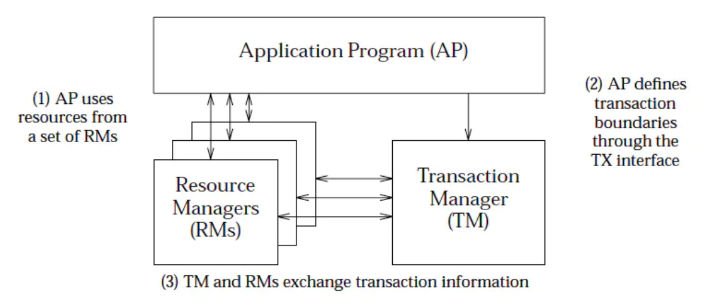

## 前言

+ 本文涉及一些理论基础
+ 业界目前的分布式事务的解决方案
+ 简单的分类和总结
+ 大部分内容来源网上

## 理论基础

### 基本概念

#### 事务

1. 事务：事务是由一组操作构成的可靠的独立的工作单元，事务具备ACID的特性，即原子性、一致性、隔离性和持久性。
2. 本地事务：当事务由资源管理器本地管理时被称作本地事务。本地事务的优点就是支持严格的ACID特性，高效，可靠，状态可以只在资源管理器中维护，而且应用编程模型简单。但是本地事务不具备分布式事务的处理能力，隔离的最小单位受限于资源管理器。
3. 全局事务：当事务由全局事务管理器进行全局管理时成为全局事务，事务管理器负责管理全局的事务状态和参与的资源，协同资源的一致提交回滚。

#### ACID(数据库事务4个特性)
1. Atomicity（原子性）
2. Consistency（一致性)
3. Isolation（隔离性）
4. Durablity（持久性）

#### 分布式事务
1. 分布式事务服务（Distributed Transaction Service，DTS）是一种分布式事务框架，用来确保在大规模分布式/微服务环境下端到端业务操作的最终一致性。
2. 在互联网技术里面，强调追求最终一致性。所谓异地多活就是围绕这一点来做的
3. 分布式事务从实质上看与数据库事务的概念是一致的，既然是事务也就需要满足事务的基本特性（ACID），只是分布式事务相对于本地事务而言其表现形式有很大的不同

#### 分布式一致性协议 (consensus protocol)
1. 两阶段提交协议（The two-phase commit protocol，2PC）
2. 3PC
3. PAXOS
4. Raft 等

无论是二阶段提交还是三阶段提交都无法彻底解决分布式的一致性问题。Google Chubby的作者Mike Burrows说过， there is only one consensus protocol, and that’s Paxos” – all other approaches are just broken versions of Paxos。意即世上只有一种一致性算法，那就是Paxos，所有其他一致性算法都是Paxos算法的不完整版。

#### DTP(Distributed Transaction Processing)

#### XA 规范
+ XA协议由Tuxedo首先提出的，并交给X/Open组织，作为资源管理器（数据库）与事务管理器的接口标准。XA 规范主要定义了事务协调者（Transaction Manager）和资源管理器（Resource Manager）之间的接口。

+ AP（Application Program，应用程序）
+ TM（Transaction Manager，事务管理器）
+ RM（Resource Manager，资源管理器）
+ CRM（Communication Resource Manager，通信资源管理器）

XA 规范 是 X/Open 组织定义的分布式事务处理（DTP，Distributed Transaction Processing）标准。

针对不同的分布式场景业界常见的解决方案有2PC、TCC、可靠消息最终一致性、最大努力通知这几种。？？？？？

#### 其他
+ DTP（Distributed Transaction Processing Reference Model）：分布式事务处理模型。TM、RM、AP等角色的分布式事务的模型。TODO 查
+ JTA（Java Transaction API）：分布式事务的编程API，按照XA、DTP的模型和规范实现，在J2EE中，单库事务通过JDBC事务来支持，跨库事务通过JTA API来支持，通过JTA API可以协调和管理横跨多个数据库的分布式事务，一般来说会结合JNDI。

## Q&A
1. XA跟2PC什么关系？
TODO

## Reference

+ [XA 规范与 TCC 事务模型](https://ld246.com/article/1588748307781)
+ [分布式事务（4）XA规范](https://www.jianshu.com/p/d9e4982384a2)
+ 
