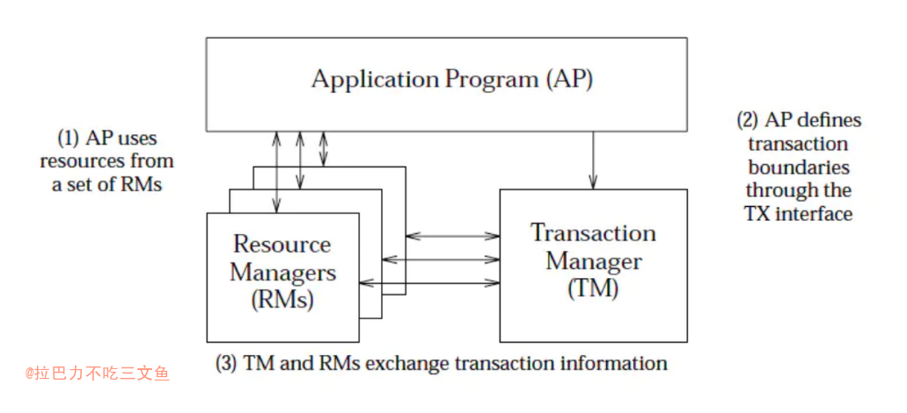
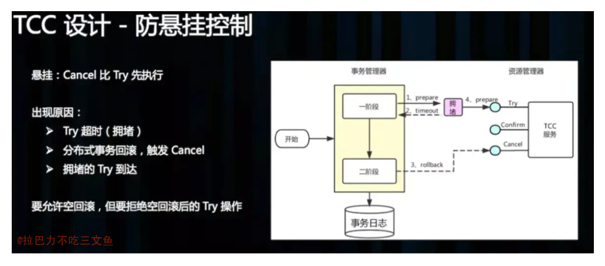
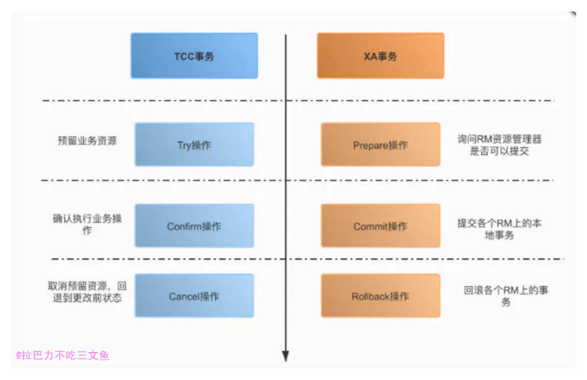

## 前言

+ 本文涉及一些理论基础
+ 业界目前的分布式事务的解决方案
+ 简单的分类和总结
+ 基本内容都来源网上

## 理论基础

### 事务

1. 事务：事务是由一组操作构成的可靠的独立的工作单元，事务具备ACID的特性，即原子性、一致性、隔离性和持久性。
2. 本地事务：当事务由资源管理器本地管理时被称作本地事务。本地事务的优点就是支持严格的ACID特性，高效，可靠，状态可以只在资源管理器中维护，而且应用编程模型简单。但是本地事务不具备分布式事务的处理能力，隔离的最小单位受限于资源管理器。
3. 全局事务：当事务由全局事务管理器进行全局管理时成为全局事务，事务管理器负责管理全局的事务状态和参与的资源，协同资源的一致提交回滚。

### ACID(数据库事务4个特性)
1. Atomicity（原子性）
2. Consistency（一致性)
3. Isolation（隔离性）
4. Durablity（持久性）

### 分布式事务 (Distributed Transaction)
1. 在互联网技术里面，强调追求最终一致性。异地多活就是围绕这一点来做的。
2. 分布式事务从实质上看与数据库事务的概念是一致的，既然是事务也就需要满足事务的基本特性（ACID），只是分布式事务相对于本地事务而言其表现形式有很大的不同。

### 分布式一致性协议 (consensus protocol)
1. 两阶段提交协议（The two-phase commit protocol，2PC）
2. 3PC
3. PAXOS
4. Raft 等

+ 无论是2PC还是3PC都无法彻底解决分布式的一致性问题。Google Chubby的作者Mike Burrows说过， ”there is only one consensus protocol, and that’s Paxos” – all other approaches are just broken versions of Paxos。意即世上只有一种一致性算法，那就是Paxos，所有其他一致性算法都是Paxos算法的不完整版。

+ 详情看：[分布式一致性协议概览](https://kingson4wu.gitee.io/2020/09/12/20200912-%E5%88%86%E5%B8%83%E5%BC%8F%E4%B8%80%E8%87%B4%E6%80%A7%E5%8D%8F%E8%AE%AE/)

### DTP(Distributed Transaction Processing)
+ DTP（Distributed Transaction Processing Reference Model）：分布式事务处理模型。TM、RM、AP等角色的分布式事务的模型。

+ AP（Application Program，应用程序）
+ TM（Transaction Manager，事务管理器）
+ RM（Resource Manager，资源管理器）
+ DTP规范中主要包含了AP、RM、TM三个部分，其中AP是应用程序，是事务发起和结束的地方；RM是资源管理器，主要负责管理每个数据库的连接数据源；TM是事务管理器，负责事务的全局管理，包括事务的生命周期管理和资源的分配协调等。

+ XA是DTP的一部分接口规范。

### 分布式事务框架
+ 大多数分布式事务框架，也多借鉴了DTP（Distributed Transaction Processing）模型
+ RM负责本地事务的提交，同时完成分支事务的注册、锁的判定，扮演事务参与者角色。
+ TM负责整体事务的提交与回滚的指令的触发，扮演事务的总体协调者角色。
+ 不同框架在实现时，各组件角色的功能、部署形态会根据需求进行调整，例如TM有的是以jar包形式与应用部署在一起，有的则剥离出来需要单独部署（例如Seata中将TM的主要功能放到一个逻辑上集中的Server上，叫做TC( Transaction Coordinator )）

+ 一个好的分布式事务框架应用尽可能满足以下特性：
业务改造成本低；1
性能损耗低；2
隔离性保证完整。3
但如同CAP，这三个特性是相互制衡

+ 基于业务补偿的Saga满足1.2；TCC满足2.3；Seata（AT模式）满足1.3 

### 分布式事务的4种模式
1. AT - (无侵入的分布式事务解决方案)
2. TCC (业务层的2PC)
3. Saga (一种补偿协议，长事务解决方案)
4. XA (DB层的2PC)

+ 阿里seata框架 实现了这四种模式。
+ [分布式事务的4种模式](https://zhuanlan.zhihu.com/p/78599954) 

+ 性能最高的是Saga，其次是TCC。
+ 隔离性最好的是XA（资源层），最差的是Saga。
+ 除了XA，其他三个为柔性事务，补偿式事务。

### 补偿型事务
补偿型事务处理机制构建在 事务资源 之上（要么在中间件层面，要么在应用层面），事务资源 本身对分布式事务是无感知的。

### 分类
+ 分布式事务实现方案从ACID的角度上，分刚性事务、柔型事务。
+ 刚性事务：通常无业务改造，强一致性，原生支持回滚/隔离性，低并发，适合短事务;
柔性事务：有业务改造，最终一致性，实现补偿接口，实现资源锁定接口，高并发，适合长事务。
+ 刚性事务满足ACID理论；柔性事务满足BASE理论（基本可用，最终一致）
+ 刚性事务：XA 协议（2PC、JTA、JTS）、3PC；
柔型事务：TCC/FMT、Saga（状态机模式、Aop模式）、本地事务消息、消息事务（半消息）。

### 柔性事务
+ 柔性事务（如分布式事务）为了满足可用性、性能与降级服务的需要，降低一致性（Consistency）与隔离性（Isolation）的要求，遵循 BASE 理论。
+ 柔性事务也部分遵循 ACID 规范：
	1. 原子性：严格遵循
	2. 一致性：事务完成后的一致性严格遵循；事务中的一致性可适当放宽
	3. 隔离性：并行事务间不可影响；事务中间结果可见性允许安全放宽
	4. 持久性：严格遵循

### 柔性事务的分类
柔性事务分为：两阶段型、补偿型、异步确保型、最大努力通知型。

1. 两阶段型 (这个并不算柔性事务，资源层，强一致性！)
分布式事务二阶段提交，对应技术上的 XA、JTA/JTS，这是分布式环境下事务处理的典型模式。
2. 补偿型
TCC 型事务（Try-Confirm-Cancel）可以归为补偿型。在 Try 成功的情况下，如果事务要回滚，Cancel 将作为一个补偿机制，回滚 Try 操作；TCC 各操作事务本地化，且尽早提交（没有两阶段约束）；当全局事务要求回滚时，通过另一个本地事务实现“补偿”行为。
TCC 是将资源层的二阶段提交协议转换到业务层，成为业务模型中的一部分。
4. 异步确保型
将一些有同步冲突的事务操作变为异步操作，避免对数据库事务的争用，如消息事务机制。
3. 最大努力通知型
通过通知服务器（消息通知）进行，允许失败，有补充机制。

+ 针对不同的分布式场景业界常见的解决方案有2PC、TCC、可靠消息最终一致性、最大努力通知这几种。

### 其他
+ JTA（Java Transaction API）：分布式事务的编程API，按照XA、DTP的模型和规范实现，在J2EE中，单库事务通过JDBC事务来支持，跨库事务通过JTA API来支持，通过JTA API可以协调和管理横跨多个数据库的分布式事务，一般来说会结合JNDI。

## 分布式事务解决方案

### 本地消息服务方案(ebay)
+ eBay 事件队列方案——最终一致性
+ eBay 的架构师Dan Pritchett，曾在一篇解释BASE 原理的论文《Base：An Acid Alternative》中提到一个eBay 分布式系统一致性问题的解决方案。它的核心思想是将需要分布式处理的任务通过消息或者日志的方式来异步执行，消息或日志可以存到本地文件、数据库或消息队列，再通过业务规则进行失败重试，它要求各服务的接口是幂等的。
+ (任务表，定时任务或人工自动重试)。

+ 优点：
  - 消息的时效性比较高；
  - 从应用设计的角度实现了消息数据的可靠性，消息数据的可靠性不依赖于MQ中间件，弱化了对MQ中间件特性的依赖；
  - 方案轻量级，容易实现。
+ 缺点：
  - 与具体的业务场景绑定，耦合性强，不可以共用；
  - 消息数据与业务数据同步，占用业务系统资源；
  - 业务系统在使用关系型数据库的情况下消息服务性能会受到关系型数据库的并发性能限制。

+ 本地消息表:一种非常经典的实现，基本避免了分布式事务，实现了“最终一致性”。但是，关系型数据库的吞吐量和性能方面存在瓶颈，频繁的读写消息会给数据库造成压力。所以，在真正的高并发场景下，该方案也会有瓶颈和限制的。

+ 其他类似方案：[去哪儿网消息队列设计与实现](https://www.infoq.cn/article/b4VPvP3m8DA-PM7ZqMGZ)
+ [事件驱动架构(EDA)编码实践](https://insights.thoughtworks.cn/backend-development-eda/) (事件表方式)

### 消息队列MQ事务
+ 2PC、3PC的时候我们说没有根本解决性能问题，而如果通过MQ的事务消息来进行异步解耦，并实现系统的数据的最终一致性的话会不会好很多呢？实际上这就是我们下一篇文章要继续讲述的《分布式事务之如何基于RocketMQ的事务消息特性实现分布式系统的最终一致性？:https://blog.csdn.net/u014532775/article/details/100830995

#### 以支付系统为例

1. 上游服务（支付系统）如何确保完成自身支付成功状态更新后消息100%的能够投递到下游服务（用户余额系统）指定的Topic中？
1)在这个流程中上游服务在进行本地数据库事务操作前，会先发送一个状态为“待确认”的消息至可靠消息服务，而不是直接将消息投递到MQ服务的指定Topic。
2)之后上游服务就会开启本地数据库事务执行业务逻辑操作，这里支付系统就会将该笔支付订单状态更新为“已成功”。
3)如果上游服务本地数据库事务执行成功，则继续向可靠消息服务发送消息确认消息，此时可靠消息服务就会正式将消息投递到MQ服务，并且同时更新消息数据库中的消息状态为“已发送”。
4)相反，如果上游本地数据库事务执行失败，则需要向可靠消息服务发送消息删除消息，可靠消息服务此时就会将消息删除，这样就意味着事务在上游消息投递过程中就被回滚了，而流程也就此结束了
<pre>
实现数据一致性是一个复杂的活。在这个方案中可靠消息服务作为基础性的服务除了执行正常的逻辑外，还得处理复杂的异常场景。在实现过程中可靠消息服务需要启动相应的后台线程，不断轮训消息的状态，这里会轮训消息状态为“待确认”的消息，并判断该消息的状态的持续时间是否超过了规定的时间，如果超过规定时间的消息还处于“待确认”的状态，就会触发上游服务状态询问机制。

可靠消息服务就会调用上游服务提供的相关借口，询问这笔消息的处理情况，如果这笔消息在上游服务处理成功，则后台线程就会继续触发上图中的步骤5，更新消息状态为“已发送”并投递消息至MQ服务；反之如果这笔消息上游服务处理失败，可靠消息服务则会进行消息删除。通过这样以上机制就确保了“上游服务本地事务成功处理+消息成功投递”处于一个原子操作了。
</pre>
2. 下游服务（用户余额系统）如何确保对MQ服务Topic消息的消费100%都能处理成功？
<pre>
在正常的流程中，下游服务等待消费Topic的消息并进行自身本地数据库事务的处理，如果处理成功则会主动通知可靠消息服务，可靠消息服务此时就会将消息的状态更新为“已完成”；反之，处理失败下游服务就无法再主动向可靠消息服务发送通知消息了。

此时，与消息投递过程中的异常逻辑一样，可靠消息服务也会启动相应的后台线程，轮询一直处于“已发送”状态的消息，判断状态持续时间是否超过了规定时间，如果超时，可靠消息服务就会再次向MQ服务投递此消息，从而确保消息能被再次消费处理。（注意，也可能出现下游服务处理成功，但是通知消息发送失败的情况，所以为了确保幂等，下游服务也需要在业务逻辑上做好相应的防重处理）。
</pre>

+ 事实上，支付系统的数据一致性是一个复杂的问题，原因在于支付流程的各个环节都存在异步的不确定性，例如支付系统需要跟第三方渠道进行交互，不同的支付渠道交互流程存在差异，并且有异步支付结果回调的情况。
+ 除此以外，支付系统内部本身又是由多个不同子系统组成，除核心支付系统外，还有账务系统、商户通知系统等等，而核心支付系统本身也会被拆分为多个不同的服务模块，如风控、路由等用以实现不同的功能逻辑。某些场景我们无法通过分布式事务来实现数据一致性，只能通过额外的业务补偿手段，如二次轮训、支付对账等来实现数据最终一致性。
+ 综上所述，支付系统是一个复杂的系统，要完全实现数据的一致性单靠某一种手段是无法实现的，大部分情况下我们可以通过额外的业务补偿逻辑来实现数据最终一致性，只是这样补偿逻辑需要以更多的业务开发逻辑为代价，并且在时效性上会存在延迟的问题。

+ MQ（事务消息）(notify-两阶段提交加回调机制)－ RocketMQ

#### RocketMQ 
+ 很像阿里的notify
+ 事务发起方首先发送 prepare 消息到 MQ。
在发送 prepare 消息成功后执行本地事务。
根据本地事务执行结果返回 commit 或者是 rollback。
如果消息是 rollback，MQ 将删除该 prepare 消息不进行下发，如果是 commit 消息，MQ 将会把这个消息发送给 consumer 端。
如果执行本地事务过程中，执行端挂掉，或者超时，MQ 将会不停的询问其同组的其他 producer 来获取状态。
Consumer 端的消费成功机制有 MQ 保证。
+ 从用户侧来说，用户需要分别实现本地事务执行以及本地事务回查方法，因此只需关注本地事务的执行状态即可；而在 service 层，则对事务消息的两阶段提交进行了抽象，同时针对超时事务实现了回查逻辑，通过不断扫描当前事务推进状态，来不断反向请求 Producer 端获取超时事务的执行状态，在避免事务挂起的同时，也避免了 Producer 端的单点故障。而在存储层，RocketMQ 通过 Bridge 封装了与底层队列存储的相关操作，用以操作两个对应的内部队列，用户也可以依赖其他存储介质实现自己的 service，RocketMQ 会通过 ServiceProvider 加载进来。
从上述事务消息设计中可以看到，RocketMQ 事务消息较好的解决了事务的最终一致性问题，事务发起方仅需要关注本地事务执行以及实现回查接口给出事务状态判定等实现，而且在上游事务峰值高时，可以通过消息队列，避免对下游服务产生过大压力。
事务消息不仅适用于上游事务对下游事务无依赖的场景，还可以与一些传统分布式事务架构相结合，而 MQ 的服务端作为天生的具有高可用能力的协调者，使得我们未来可以基于 RocketMQ 提供一站式轻量级分布式事务解决方案，用以满足各种场景下的分布式事务需求。

+ RocketMQ 阿里开源的消息中间件,原来叫做MetaQ; RocketMQ的各个环节,包括生产者,消费者,broker都是分布式的,所以基本可以保障由于网络原因丢掉,且RocketMQ存在重复消费的问题,所以文档明确表明了应该业务方自己实现幂等性.

+ Pulsar、RocketMQ、NSQ、RabbitMQ、Kafka TODO

#### 注意
+ 如果由于上游程序bug，下游程序又有二次校验，会导致消息迟迟没消费成功而堆积。（如上游出仓，下游加分成等）

### AT (自动模式)
+ AT 模式是一种无侵入的分布式事务解决方案。下面以Seata为例。
+ Seata实现了AT模式：[Seata AT 模式](http://seata.io/zh-cn/docs/dev/mode/at-mode.html)

+ 在 AT 模式下，用户只需关注自己的“业务 SQL”，用户的 “业务 SQL” 作为一阶段，Seata 框架会自动生成事务的二阶段提交和回滚操作。
+ 一阶段：Seata 会拦截“业务 SQL”，首先解析 SQL 语义，找到“业务 SQL”要更新的业务数据，在业务数据被更新前，将其保存成“before image”，然后执行“业务 SQL”更新业务数据，在业务数据更新之后，再将其保存成“after image”，最后生成行锁。以上操作全部在一个数据库事务内完成，这样保证了一阶段操作的原子性。
+ 二阶段提交：因为“业务 SQL”在一阶段已经提交至数据库， 所以 Seata 框架只需将一阶段保存的快照数据和行锁删掉，完成数据清理即可。
+ 二阶段回滚：Seata 需要回滚一阶段已经执行的“业务 SQL”，还原业务数据。回滚方式便是用“before image”还原业务数据；但在还原前要首先要校验脏写，对比“数据库当前业务数据”和 “after image”，如果两份数据完全一致就说明没有脏写，可以还原业务数据，如果不一致就说明有脏写，出现脏写就可能需要转人工处理。

+ 写隔离
一阶段本地事务提交前，需要确保先拿到 全局锁 。
拿不到 全局锁 ，不能提交本地事务。
拿 全局锁 的尝试被限制在一定范围内，超出范围将放弃，并回滚本地事务，释放本地锁。
+ 读隔离
在数据库本地事务隔离级别 读已提交（Read Committed） 或以上的基础上，Seata（AT 模式）的默认全局隔离级别是 读未提交（Read Uncommitted） 。
如果应用在特定场景下，必需要求全局的 读已提交 ，目前 Seata 的方式是通过 SELECT FOR UPDATE 语句的代理。

#### 回滚
+ 如果要人工处理。不太适合金钱业务，因为“after image”基本都是在变的。
+ 官方回答：
<pre>
Q: 5.脏数据回滚失败如何处理?
A:
1.脏数据需手动处理，根据日志提示修正数据或者将对应undo删除（可自定义实现FailureHandler做邮件通知或其他）
2.关闭回滚时undo镜像校验，不推荐该方案。

注：建议事前做好隔离保证无脏数据
</pre>
+ 实践验证：TODO

### TCC
+ TCC（Try-Confirm-Cancel）的概念来源于 Pat Helland 发表的一篇名为“Life beyond Distributed Transactions:an Apostate’s Opinion”的论文。
+ TCC 提出了一种新的事务模型，基于业务层面的事务定义，锁粒度完全由业务自己控制，目的是解决复杂业务中，跨表跨库等大颗粒度资源锁定的问题。TCC 把事务运行过程分成 Try、Confirm / Cancel 两个阶段，每个阶段的逻辑由业务代码控制。
+ Try 阶段失败可以 Cancel，如果 Confirm 和 Cancel 阶段失败了怎么办？
	- TCC 中会添加事务日志，如果 Confirm 或者 Cancel 阶段出错，则会进行重试，所以这两个阶段需要支持幂等；如果重试失败，则需要人工介入进行恢复和处理等。 
+ 相对于 AT 模式，TCC 模式对业务代码有一定的侵入性，但是 TCC 模式无 AT 模式的全局行锁，TCC 性能会比 AT 模式高很多。
+ 关键属性：应用层面的两阶段操作(应用的侵入性非常强，实现成本高), 强隔离性（预提交校验），性能并非最佳。

#### 优点
1. 解决了跨服务的业务操作原子性问题，例如组合支付、下订单减库存等场景非常实用
2. TCC的本质原理是把数据库的二阶段提交上升到微服务来实现，从而避免数据库二阶段中锁冲突的长事务引起的低性能风险
3. TCC异步高性能，它采用了try先检查，然后异步实现confirm，真正提交是在confirm方法中。

#### 缺点
1. 对微服务的侵入性强，微服务的每个事务都必须实现try、confirm、cancel等3个方法，开发成本高，今后维护改造的成本也高
2. 为了达到事务的一致性要求，try、confirm、cancel接口必须实现幂等性操作
3. 由于事务管理器要记录事务日志，必定会损耗一定的性能，并使得整个TCC事务时间拉长，可以考虑采用Redis的方式来记录事务日志

#### 实践经验
+ 蚂蚁金服TCC实践,总结以下注意事项:
<pre>
➢业务模型分2阶段设计
➢并发控制
➢允许空回滚
➢防悬挂控制
➢幂等控制
</pre>

1. 允许空回滚
	- Cancel 接口设计时需要允许空回滚。在 Try 接口因为丢包时没有收到，事务管理器会触发回滚，这时会触发 Cancel 接口，这时 Cancel 执行时发现没有对应的事务 xid 或主键时，需要返回回滚成功。让事务服务管理器认为已回滚，否则会不断重试，而 Cancel 又没有对应的业务数据可以进行回滚。

	
2. 防悬挂控制
	- 悬挂的意思是：Cancel 比 Try 接口先执行，出现的原因是 Try 由于网络拥堵而超时，事务管理器生成回滚，触发 Cancel 接口，而最终又收到了 Try 接口调用，但是 Cancel 比 Try 先到。按照前面允许空回滚的逻辑，回滚会返回成功，事务管理器认为事务已回滚成功，则此时的 Try 接口不应该执行，否则会产生数据不一致，所以我们在 Cancel 空回滚返回成功之前先记录该条事务 xid 或业务主键，标识这条记录已经回滚过，Try 接口先检查这条事务xid或业务主键如果已经标记为回滚成功过，则不执行 Try 的业务操作。

### Saga ['sɑɡə]

+ Saga 理论出自 Hector & Kenneth 1987发表的论文 Sagas。Saga 模式是一种长事务解决方案。
+ Saga 是一种补偿协议，在 Saga 模式下，分布式事务内有多个参与者，每一个参与者都是一个冲正补偿服务，需要用户根据业务场景实现其正向操作和逆向回滚操作。
+ 分布式事务执行过程中，依次执行各参与者的正向操作，如果所有正向操作均执行成功，那么分布式事务提交。如果任何一个正向操作执行失败，那么分布式事务会退回去执行前面各参与者的逆向回滚操作，回滚已提交的参与者，使分布式事务回到初始状态。
+ Saga 正向服务与补偿服务也需要业务开发者实现。因此是业务入侵的。
+ Saga可以看做一个异步的、利用队列实现的补偿事务。Saga 模式下分布式事务通常是由事件驱动的，各个参与者之间是异步执行。

+ 使用 Saga 模式开发分布式事务时，有两种协调不同服务的方式，一种是协同（Choreography），另一种是编排（Orchestration）
	1. 选择使用协同的方式处理事务时，服务之间的通信其实就是通过事件进行的，每一个本的事务最终都会向服务的下游发送一个新的事件，既可以是消息队列中的消息，也可以是 RPC 的请求，只是下游提供的接口需要保证幂等和重入
	2. 编排的方式引入了中心化的协调器节点，我们通过一个 Saga 对象来追踪所有的子任务的调用情况，根据任务的调用情况决定是否需要调用对应的补偿方案，并在网络请求出现超时时进行重试
	- (下游约束)使用 Saga 对分布式事务进行开发时，会对分布式事务的参与者有一定的约束，每一个事务的参与者都需要保证：
      1. 提供接口和补偿副作用的接口；
      2. 接口支持重入并通过全局唯一的 ID 保证幂等

+ Saga定义了两种恢复策略：
	1. 向后恢复，对整个Saga的执行结果撤销。
	2. 向前恢复，适用于必须要成功的场景。

+ 使用 Saga 实现分布式事务的优点有：
  - **微服务架构：**通过对一些基础服务进行组合 / 编排来完成各种业务需求。
  - **数据库兼容性高：**对每个服务使用何种数据库技术没有任何要求，服务甚至可以不使用数据库。

+ 使用 Saga 实现分布式事务的缺点有：
  - **要求服务提供补偿接口：**增加了开发和维护的成本。
  - **不符合 ACID：**没有涉及 Isolation 和 Durability。

+ Saga 从流程上，还可分为两种模式：Orchestration（交响乐）和 Choreography（齐舞）。

+ 关键：每一个参与者都是一个冲正补偿服务、异步。
+ 关键定义：补偿式事务的 Saga
+ 关键属性：性能较好，隔离性较差

#### 方案例子
1. Ebay提出的基于消息表，即可靠消息最终一致模型，但本质上这也属于Saga模式的一种特定实现。
2. 消息队列MQ事务(可靠消息)(支持事务的消息中间件) 
	- Apache开源的RocketMQ中间件能够支持一种事务消息机制，确保本地操作和发送消息的异步处理达到本地事务的结果一致。
3. Saga Orchestration（引入了类似 XA 中的协调者的角色，来驱动整个流程）；基于 Saga Orchestration 和 Kafka 的分布式事务：[微服务中台技术解析之分布式事务方案和实践](https://mp.weixin.qq.com/s/o11kXLV94hUn9YylcQ2ayA)

#### Saga详细说明
+ 最直接的方法就是按照逻辑依次调用服务，但出现异常怎么办?那就对那些已经成功的进行补偿，补偿成功就一致了，这种朴素的模型就是Saga。但Saga这种方式并不能保证隔离性，于是出现了TCC。在实际交易逻辑前先做业务检查、对涉及到的业务资源进行“预留”，或者说是一种“中间状态”，如果都预留成功则完成这些预留资源的真正业务处理，典型的如票务座位等场景。
+ 当然还有像Ebay提出的基于消息表，即可靠消息最终一致模型，但本质上这也属于Saga模式的一种特定实现，它的关键点有两个：
基于应用共享事务记录执行轨迹；
然后通过异步重试确保交易最终一致（这也使得这种方式不适用那些业务上允许补偿回滚的场景）。
+ 仔细对比这些方案与XA，会发现这些方案本质上都是将两阶段提交从资源层提升到了应用层。

1. Saga的核心就是补偿，一阶段就是服务的正常顺序调用（数据库事务正常提交），如果都执行成功，则第二阶段则什么都不做；但如果其中有执行发生异常，则依次调用其补偿服务（一般多逆序调用未已执行服务的反交易）来保证整个交易的一致性。应用实施成本一般。
2. TCC的特点在于业务资源检查与加锁，一阶段进行校验，资源锁定，如果第一阶段都成功，二阶段对锁定资源进行交易逻辑，否则，对锁定资源进行释放。应用实施成本较高。
3. 基于可靠消息最终一致，一阶段服务正常调用，同时同事务记录消息表，二阶段则进行消息的投递，消费。应用实施成本较低。

#### Saga 模式使用场景
+ Saga 模式适用于业务流程长且需要保证事务最终一致性的业务系统，Saga 模式一阶段就会提交本地事务，无锁、长流程情况下可以保证性能。
+ 事务参与者可能是其它公司的服务或者是遗留系统的服务，无法进行改造和提供 TCC 要求的接口，可以使用 Saga 模式。

####  优点
+ 一阶段提交本地数据库事务，无锁，高性能；
+ 参与者可以采用事务驱动异步执行，高吞吐；
+ 补偿服务即正向服务的“反向”，易于理解，易于实现；

####  缺点
+ Saga 模式由于一阶段已经提交本地数据库事务，且没有进行“预留”动作，所以不能保证隔离性。

#### 实践经验
+ 与TCC实践经验相同的是，Saga 模式中，每个事务参与者的冲正、逆向操作，需要支持：
	- 空补偿：逆向操作早于正向操作时；
	- 防悬挂控制：空补偿后要拒绝正向操作
	- 幂等

#### 注意
+ 这里要注意的是，在Saga模式中不能保证隔离性，因为没有锁住资源，其他事务依然可以覆盖或者影响当前事务。隔离性导致在金钱业务的情景中，可能出现"不够扣"的情况（给用户加钱之后，无法撤销，因为被用户花完了）。

### XA (eXtended Architecture)
+ XA 规范 是 X/Open 组织定义的分布式事务处理（DTP，Distributed Transaction Processing）标准。
+ XA协议由Tuxedo首先提出的，并交给X/Open组织，作为资源管理器（数据库）与事务管理器的接口标准。XA 规范主要定义了事务协调者（Transaction Manager）和资源管理器（Resource Manager）之间的接口。
+ XA则规范了TM与RM之间的通信接口，在TM与多个RM之间形成一个双向通信桥梁，从而在多个数据库资源下保证ACID四个特性。
+ TM和RM之间使用2PC协议。在XA规范的描述中，2PC是TM协调RM们完成已定义的全局事务的方法，AP找TM申请/注册全局事务的动作并不是二阶段提交的保障内容。
+ 目前MySQL中只有InnoDB存储引擎支持XA协议。
	- <https://dev.mysql.com/doc/refman/5.7/en/xa.html>
+ XA模式下的 开源框架有atomikos，其开发公司也有商业版本。
+ 优点：
  - **强一致性：**实现了数据在多个数据库上的强一致提交。
  - **业务侵入性小：**完全靠数据库本身的支持实现分布式事务，不需要改动业务逻辑。
+ 缺点：
  + **单点故障：**协调者或者任意一个 XA 数据库都是能引起故障的单点（Single point of failure)。
  + **低性能：**支持 XA 特性的数据库在设计上有大量的阻塞和资源占位操作， 数据体量和吞吐量扩展性差。
  + **数据库选型限制：**对于服务的数据库选型引入了支持 XA 协议这个限制。
+ XA 在设计上没有考虑到分布式系统的特点，事实上是一个强一致、低可用的设计方案，对网络分隔的容忍度较差。
+ XA模式缺点：事务粒度大。高并发下，系统可用性低。因此很少使用。
+ 关键属性：DB层面（资源层）

#### Seata 的XA模式
+ [分布式事务如何实现？深入解读 Seata 的 XA 模式](https://zhuanlan.zhihu.com/p/163335038)

+ Seata 已经支持的 3 大事务模式：AT、TCC、Saga 都是 补偿型 的。
+ 补偿型 事务处理机制构建在 事务资源 之上（要么在中间件层面，要么在应用层面），事务资源 本身对分布式事务是无感知的。
+ 事务资源 对分布式事务的无感知存在一个根本性的问题：无法做到真正的 全局一致性 。

+ Seata 1.2.0 版本重磅发布新的事务模式：XA 模式，实现对 XA 协议的支持。
+ XA 的价值：与 补偿型 不同，XA 协议 要求 事务资源 本身提供对规范和协议的支持。因为 事务资源 感知并参与分布式事务处理过程，所以 事务资源（如数据库）可以保障从任意视角对数据的访问有效隔离，满足全局数据一致性。

+ 除了 全局一致性 这个根本性的价值外，支持 XA 还有如下几个方面的好处：
	1. 业务无侵入：和 AT 一样，XA 模式将是业务无侵入的，不给应用设计和开发带来额外负担。
	2. 数据库的支持广泛：XA 协议被主流关系型数据库广泛支持，不需要额外的适配即可使用。
	3. 多语言支持容易：因为不涉及 SQL 解析，XA 模式对 Seata 的 RM 的要求比较少，为不同语言开发 SDK 较之 AT 模式将更 薄，更容易。
	4. 传统基于 XA 应用的迁移：传统的，基于 XA 协议的应用，迁移到 Seata 平台，使用 XA 模式将更平滑。

+ 从编程模型上，XA 模式与 AT 模式保持完全一致。上层编程模型与 AT 模式完全相同。只需要修改数据源代理，即可实现 XA 模式与 AT 模式之间的切换。

### 最大努力通知型
+ 回调客户端确认：支付宝会每间隔一段时间后，再向客户方发起回调请求，直到输出成功标识为止。

### 其他
1. 为了交易系统更可靠，我们一般会在类似交易这种高级别的服务代码中，加入详细日志记录的，一旦系统内部引发类似致命异常（如超时情况），会有邮件通知。同时，后台会有定时任务扫描和分析此类日志，检查出这种特殊的情况，会尝试通过程序来补偿并邮件通知相关人员。
2. 在某些特殊的情况下，还会有“人工补偿”的，这也是最后一道屏障。

##  Seata

+ 阿里开源分布式事务解决方案 Fescar:<https://mp.weixin.qq.com/s/TFGRcHV6EgeLB45OEJPRXw>
+ <https://github.com/seata/seata>
+ <https://seata.io/zh-cn/docs/overview/what-is-seata.html>

### 四种模式分析

四种分布式事务模式，分别在不同的时间被提出，每种模式都有它的适用场景

1. AT 模式是无侵入的分布式事务解决方案，适用于不希望对业务进行改造的场景，几乎0学习成本。
2. TCC 模式是高性能分布式事务解决方案，适用于核心系统等对性能有很高要求的场景。
3. Saga 模式是长事务解决方案，适用于业务流程长且需要保证事务最终一致性的业务系统，Saga 模式一阶段就会提交本地事务，无锁，长流程情况下可以保证性能，多用于渠道层、集成层业务系统。事务参与者可能是其它公司的服务或者是遗留系统的服务，无法进行改造和提供 TCC 要求的接口，也可以使用 Saga 模式。
4. XA模式是分布式强一致性的解决方案，但性能低而使用较少。

## 总结

1. 金钱业务的冻结&结算 接口，其实就是TCC模式，而消费&退款 就是Saga模式。
2. 数据库事务对应刚性事务，以XA模式为例；业务事务对应柔性事务，以TCC，Saga，AT模式为例。
3. 2PC一般是分布式事务的基础协议，具有普适性。
4. 要多考虑“防悬挂控制“、”允许空回滚“。

### 分类归纳

1. 分布式事务两种大分类
	1. 按模式分类：XA、AT、TCC、Saga。
	2. 按柔性事务分类：补偿型、异步确保型、最大努力通知型。

2. 补偿型(资源之上－业务层或中间件)：AT、TCC、Saga。
3. 业务无侵入：XA、AT；业务侵入：TCC、Saga。
4. 性能：Saga > TCC> XA、AT。
5. 隔离型：XA>TCC、AT>Saga。
6. 刚性事务满足ACID理论；柔性事务满足BASE理论（基本可用，最终一致）。
7. 刚性事务：XA；柔性事务：AT、TCC、Saga。
8. 异步确保型（可靠消息最终一致性）：本地消息服务方案(ebay)、消息队列MQ事务；异步回调：最大努力通知型。
9. Saga：普通RPC重试、异步确保型（主动）、异步回调（被动）。(异步只是提升性能的一种方式)
10. 总结
	1. 一致性保证：XA > TCC = SAGA > 事务消息
	2. 业务友好性：XA > 事务消息 > SAGA > TCC
	3. 性能损耗：XA > TCC > SAGA = 事务消息
11. 分布式事务的解决方案都很难做到有高一致性的同时，也有高性能，同时在实现上也有一定的难度。在业务允许的情况下，我们通常处理分布式事务的一般原则应是：业务规避 > 最终一致 > 强一致。

## Q&A

### XA跟2PC什么关系？
1. XA规范中2PC是TM协调RM的方式。

### XA VS TCC
0. XA是数据库的2PC，TCC是业务层的2PC
1. XA是数据库的分布式事务，强一致性，在整个过程中，数据一张锁住状态，即从prepare到commit、rollback的整个过程中，TM一直把持着数据库的锁，如果有其他人要修改数据库的该条数据，就必须等待锁的释放，存在长事务风险。
2. TCC是业务的分布式事务，最终一致性，不会出现长事务的锁风险，try是本地事务，锁定资源后就提交事务，confirm／cancel也是本地事务，可以直接提交事务，所以多个短事务不会出现长事务的风险。

### XA如何在分布式事务中如何保证隔离性？
1. 由RM直接连接各个数据源(支持XA协议)，RM一般是个单独的服务？
2. 后续通过Seata的XA模式深入了解TODO

### 分布式事务一致性与Paxos一致性的思考
+ [聊一聊分布式事务](https://mp.weixin.qq.com/s/zp1kJ895zBb9vA7fgJ20eQ)
+ 分布式事务解决方案，如TCC、Saga、本地消息表等，其本质都是2PC。
+ Paxos算法解决的问题是一个分布式系统如何就某个值（决议）达成一致。
+ 2PC和Paxos都是解决关于“一致性”的问题，其实细想它们解决的问题不在一个层面。
	- 2PC要求分布式系统中的每个节点要不全部成功，要不全部失败，强调的是原子性。
	- Paxos要求多个副本之间的数据一致性，其实这里用“一致性”并不准确，应该用“共识（Consensus）”才对。例如2PC中的协调者单点的问题可以用Paxos算法通过选举出新的协调者来解决。

## 扩展
1. [GTS-阿里巴巴全新分布式事务解决方案](https://developer.aliyun.com/article/598758)
	- GTS既不在资源层也不在应用层，它是在中间件层解决事务的问题，这是它们本质的区别。
	- GTS有两个使用模式，AT和MT。AT是自动模式，可以完全自动回滚，可以覆盖90%左右的业务场景，所以比较推荐使用AT模式，它对业务无侵入，高效，强一致性。还有一种MT模式是GTS推出的兼容TCC的模式，因为有一些情况下是无法避免的要使用TCC模式。
	- 强一致？感觉不是。

## Reference

+ [XA 规范与 TCC 事务模型](https://ld246.com/article/1588748307781)
+ [分布式事务（4）XA规范](https://www.jianshu.com/p/d9e4982384a2)
+ [初识Open/X XA](https://www.jianshu.com/p/6c1fd2420274)
+ [Distributed Transaction Processing: The XA Specification](https://publications.opengroup.org/c193)
+ [TCC、XA 、DTP区别](https://www.cnblogs.com/agilestyle/p/11623047.html)
+ [XA 规范与 TCC 事务模型](https://ld246.com/article/1588748307781)
+ [柔性事务的定义与分类](https://help.aliyun.com/document_detail/132895.html)
+ [MySQL 中基于 XA 实现的分布式事务](https://zhuanlan.zhihu.com/p/48586408)
+ [分布式事务的4种模式](https://zhuanlan.zhihu.com/p/78599954) 
+ [分布式事务如何实现？深入解读 Seata 的 XA 模式](https://zhuanlan.zhihu.com/p/163335038)
+ [讲清楚分布式事务选型：XA、2PC、TCC、Saga、阿里Seata](https://www.sohu.com/a/336224977_673711)
+ [分布式事务：深入理解什么是2PC、3PC及TCC协议](https://mp.weixin.qq.com/s/jQrPSmPhC_yNbIRcufR8KQ)
+ [一种提高微服务架构的稳定性与数据一致性的方法](http://mp.weixin.qq.com/s/ROVuCPr2Rg3G1m_daYu-Vg)
+ [分布式系统事务一致性解决方案](http://www.infoq.com/cn/articles/solution-of-distributed-system-transaction-consistency)
+ [分布式事务中的三种解决方案详解](https://blog.51cto.com/xvjunjie/2420402)
+ [分布式事务的实现原理](https://draveness.me/distributed-transaction-principle)
+ [关于如何实现一个TCC分布式事务框架的一点思考](https://mp.weixin.qq.com/s/omtkduEIZxVIIgkdTlzzSQ)
+ [还不理解“分布式事务”？这篇给你讲清楚！](https://www.sohu.com/a/295542601_505827)
+ [RocketMQ 4.3正式发布，支持分布式事务](https://mp.weixin.qq.com/s?__biz=MzI4MTY5NTk4Ng==&mid=2247488985&amp;idx=1&amp;sn=cafd8ce4b47bf098c7e87846318eff4d&source=41#wechat_redirect)
+ [事件驱动架构(EDA)编码实践](https://insights.thoughtworks.cn/backend-development-eda/)
+ [微服务中台技术解析之分布式事务方案和实践](https://mp.weixin.qq.com/s/o11kXLV94hUn9YylcQ2ayA)