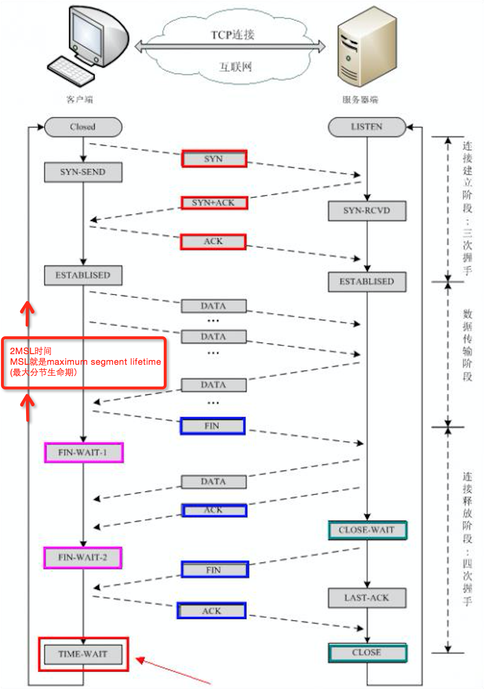
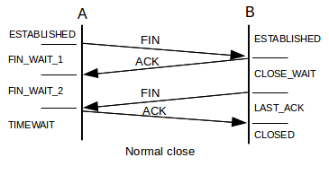

ESTABLISHED 表示正在进行网络连接的数量 
TIME_WAIT 表示表示等待系统主动关闭网络连接的数量 
CLOSE_WAIT 表示被动等待程序关闭的网络连接数量

0. 查看系统TCP状态的命令：`netstat -n | awk '/^tcp/ {++S[$NF]} END {for(a in S) print a, S[a]}'`
1. CLOSE_WAIT 是被动关闭产生的一种状态，当用户程序正常close之后将变成LAST_ACK状态。
2. TIME_WAIT状态可以通过优化服务器参数得到解决(当然也有可能是程序处理不当产生太多连接)。而CLOSE_WAIT数目过大一般是由于程序被动关闭连接处理不当导致的。
3. 以HttpClient为例
```java
        try {
            String resp = "";
            HttpResponse response = client.execute(get);
            if (response.getStatusLine().getStatusCode() != 200) {
                get.abort();
                return "";
            }
            HttpEntity entity = response.getEntity();
            if (entity != null) {
                in = entity.getContent();
                resp = in.xxx;
                //xxx
            }
            return resp;
        } catch (Exception e) {
            get.abort();
            return "";
        } finally {
            if (in != null) {
                in.close();
            }
        }
```
在异常时显示调用abort，直接中止本次连接，避免in未赋值导致连接未关闭的问题。
4. HttpClient连接关闭。一种是主动，一种是被动。在代码API的使用上没进行区分。主动关闭时当调用Close()，发出FIN包由ESTABLISHED进入FIN_WAIT_1 状态；被动关闭时当调用Close()，发出FIN包由CLOSE_WAIT进入LAST_ACK状态。
5. 使用PoolingClientConnectionManager？

## 扩展
### httpclient 的timeout参数
+ [httpclient SocketTimeout ConnectTimeout ConnectionRequestTimeout](https://blog.csdn.net/btlas/article/details/53710854)
+ ConnectionRequestTimeout
	- httpclient使用连接池来管理连接，这个时间就是从连接池获取连接的超时时间，可以想象下数据库连接池；
+ ConnectTimeout
	- 连接建立时间，三次握手完成时间；
+ SocketTimeout
	- 关于readimeout的含义: Defines a timeout for reading a response from the proxied server. The timeout is set only between two successive read operations, not for the transmission of the whole response. If the proxied server does not transmit anything within this time, the connection is closed.
	- 数据传输过程中数据包之间间隔的最大时间；
	- SocketTimeout的值表示的是“a”、”b”、”c”这三个报文，每两个相邻的报文的间隔时间不能超过SocketTimeout
	- 虽然报文(“abc”)返回总共用了6秒，如果SocketTimeout设置成4秒，实际程序执行的时候是不会抛出java.net.SocketTimeoutException: Read timed out异常的

## Reference
+ [服务器TIME_WAIT和CLOSE_WAIT详解和解决办法](https://www.cnblogs.com/sunxucool/p/3449068.html)
+ [HttpClient连接池抛出大量ConnectionPoolTimeoutException: Timeout waiting for connection异常排查](https://blog.csdn.net/shootyou/article/details/6615051)
