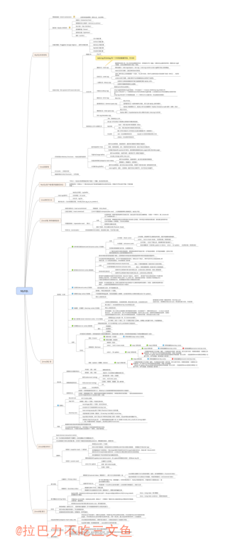

## 思维导图

## InnoDB 事务隔离级别

|隔离级别	|脏读	|不可重复读	|幻读|
| ----|  ----  | ----  | ----  |
|未提交读(RUC)	|NO	|NO	|NO|
|已提交读(RC)	|YES	|NO	|NO|
|可重复读(RR)	|YES	|YES	|NO|
|可串行化	|YES	|YES	|YES|

## InnoDB 锁类型

### 共享/排它锁(Shared and Exclusive Locks) 
在InnoDb中实现了两个标准的行级锁，可以简单的看为两个读写锁:
1. S-共享锁：又叫读锁，其他事务可以继续加共享锁，但是不能继续加排他锁。
2. X-排他锁: 又叫写锁，一旦加了写锁之后，其他事务就不能加锁了。

+ 兼容性:是指事务A获得一个某行某种锁之后，事务B同样的在这个行上尝试获取某种锁，如果能立即获取，则称锁兼容，反之叫冲突。

+ 纵轴是代表已有的锁，横轴是代表尝试获取的锁。
|.|  X   | S |
| ----|  ----  | ----  |
|X| 冲突  | 冲突 |
|S| 冲突  | 兼容 |

### 意向锁(Intention Locks)
+ InnoDB为了支持多粒度锁机制(multiple granularity locking)，即允许行级锁与表级锁共存，而引入了意向锁(intention locks)。意向锁是指，未来的某个时刻，事务可能要加共享/排它锁了，先提前声明一个意向。

1. 意向共享锁:表达一个事务想要获取一张表中某几行的共享锁。
2. 意向排他锁:表达一个事务想要获取一张表中某几行的排他锁。

+ 事务要获得某些行的S/X锁，必须先获得表对应的IS/IX锁，意向锁仅仅表明意向，意向锁之间相互兼容;虽然意向锁之间互相兼容，但是它与共享锁/排它锁互斥
+ 如果请求事务与当前存在的锁兼容，则授予锁。如果冲突则不会授予，事务会进行等待，直到冲突的锁被释放。永远不会在冲突情况下授予锁，因为会导致数据库的死锁
+ 意向共享锁/意向排他锁属于表锁，且取得意向共享锁/意向排他锁是取得共享锁/排他锁的前置条件。

|.	|IX	|IS	|X	|S|
| ----|  ----  | ----|  ----  | ----  |
|IX	|兼容	|兼容	|冲突	|冲突|
|IS	|兼容	|兼容	|冲突	|兼容|
|X	|冲突	|冲突	|冲突	|冲突|
|S	|冲突	|兼容	|冲突	|兼容|

#### 意向锁的意义在哪里？
1. IX，IS是表级锁，不会和行级的X，S锁发生冲突。只会和表级的X，S发生冲突
2. 意向锁是在添加行锁之前添加。
3. 如果没有意向锁，当向一个表添加表级X锁时，就需要遍历整张表来判断是否存行锁，以免发生冲突
4. 如果有了意向锁，只需要判断该意向锁与表级锁是否兼容即可。

## MVCC
+ MVCC，多版本并发控制技术。在InnoDB中，在每一行记录的后面增加两个隐藏列，记录创建版本号和删除版本号。通过版本号和行锁，从而提高数据库系统并发性能。

## InnoDB 索引
+ InnoDB的主键索引与行记录是存储在一起的，故叫做聚集索引（Clustered Index）：

### InnoDB的表必须要有聚集索引
1. 如果表定义了PK，则PK就是聚集索引；
2. 如果表没有定义PK，则第一个非空unique列是聚集索引；
3. 否则，InnoDB会创建一个隐藏的row-id作为聚集索引；

+ 聚集索引，也只能够有一个，因为数据行在物理磁盘上只能有一份聚集存储。

+ InnoDB的普通索引可以有多个，它与聚集索引是不同的：普通索引的叶子节点，存储主键（也不是指针）

### 索引使用
+ where条件中的and前后的顺序，不会影响索引的命中
+ 负向查询肯定不可以命中索引

## InnoDB log
+ binlog 可以给备库使用，也可以保存起来用于恢复数据库历史数据。它是实现在 server 层的，所有引擎可以共用。redo log 是 InnoDB 特有的日志，用来支持 crash-safe 能力。

## MySQL EXPLAIN

### Extra

该列包含MySQL解决查询的详细信息,有以下几种情况：

1. Using where:列数据是从仅仅使用了索引中的信息而没有读取实际的行动的表返回的，这发生在对表的全部的请求列都是同一个索引的部分的时候，表示mysql服务器将在存储引擎检索行后再进行过滤
2. Using temporary：表示MySQL需要使用临时表来存储结果集，常见于排序和分组查询
3. Using filesort：MySQL中无法利用索引完成的排序操作称为“文件排序”
4. Using join buffer：改值强调了在获取连接条件时没有使用索引，并且需要连接缓冲区来存储中间结果。如果出现了这个值，那应该注意，根据查询的具体情况可能需要添加索引来改进能。
5. Impossible where：这个值强调了where语句会导致没有符合条件的行。
6. Select tables optimized away：这个值意味着仅通过使用索引，优化器可能仅从聚合函数结果中返回一行

### type 

找到所需行的方式

1. ALL: 扫描全表
2. index: 扫描全部索引树
3. range: 索引范围扫描
4. ref: 非唯一性索引扫描
5. eq_ref：唯一性索引扫描
5. const：常量扫描，比如主键。

### 总结
+ Using filesort：当Query 中包含order by 操作，而且无法利用索引完成排序操作的时候，MySQL Query Optimizer 不得不选择相应的排序算法来实现。
+ Using temporary：在某些操作中必须使用临时表时，在 Extra 信息中就会出现Using temporary ,主要常见于 GROUP BY 和 ORDER BY 等操作中

## 主要命令
1. `SHOW ENGINES;` 命令查看 MySQL 支持的存储引擎。
2. `SHOW TABLE STATUS;` 命令查看当前库中的表使用的是什么存储引擎。
3. `select * from information_schema.INNODB_LOCKS` TODO
4. `show variables like '%tx_isolation%';`查看事务隔离级别
5. `show engine innodb status` 输出innodb监控可以查看到意向锁的信息

## 其他
1. 在 MySQL 数据库中，Database 和 Schema 是一对一的，所以 Database 和 Schema 是一个概念。
2. 唯一索引会降级记录锁，这么做的理由是:非唯一索引加next-key锁由于不能确定明确的行数有可能其他事务在你查询的过程中，再次添加这个索引的数据，导致隔离性遭到破坏，也就是幻读。唯一索引由于明确了唯一的数据行，所以不需要添加间隙锁解决幻读。
3. 间隙锁之间是兼容的。插入意向锁（IX）和间隙锁冲突。间隙锁 属于S锁？？？这样才符合表格的描述。
4. 删除记录时，先查询出需要删除的记录主键，通过主键索引进行删除，可以避免产生间隙锁（唯一索引会降级记录锁）。
5. 间隙锁(gap lock)与临键锁(next-key lock) 只在RR以上的级别生效，RC下会失效 

## 注意事项
1. 以固定的顺序访问表和行。交叉访问更容易造成事务等待回路。
2. 尽量避免大事务，占有的资源锁越多，越容易出现死锁。建议拆成小事务。
3. 降低隔离级别。如果业务允许(上面4.3也分析了，某些业务并不能允许)，将隔离级别调低也是较好的选择，比如将隔离级别从RR调整为RC，可以避免掉很多因为gap锁造成的死锁。
4. 为表添加合理的索引。防止没有索引出现表锁，出现的死锁的概率会突增。
5. 在删除之前，可以通过快照查询(不加锁)，如果查询没有结果，则直接插入，如果有通过主键进行删除。如果查询的索引不含有唯一属性，不会降级成记录锁，而是间隙锁，插入时容易死锁。

## Q&A

### InnoDB选择什么列作为主键
1. 不能为空的列；
2. 不能重复的列；
3. 很少改变的列；(行是按照聚集索引物理排序的，如果主键频繁改变，物理顺序会改变，性能会急剧降低。)
4. 经常被检索(where key=XXX)的列； (被检索的列上要建立索引，如果该索引是聚集索引，能够避免回表，性能提升几乎一倍。)
5. 不是太长的列;(普通索引叶子节点会存储主键值，如果主键值太长，会增加普通索引的大小。)

## 扩展

### InnoDB一棵B+树可以存放多少行数据?
+ <https://www.cnblogs.com/leefreeman/p/8315844.html>
+ 约2千万。(高度为3的B+树)；一个高度为 3 的 B+ 树大概可以存放 1170 × 1170 × 16 = 21902400 行数据，已经是千万级别的数据量了。
+ InnoDB存储引擎最小储存单元——页（Page），一个页的大小是16K。
+ 假设一行记录的数据大小为1k，实际上现在很多互联网业务数据记录大小通常就是1K左右
+ 非叶子节点能存放多少指针：假设主键ID为bigint类型，长度为8字节，而指针大小在InnoDB源码中设置为6字节，这样一共14字节，我们一个页中能存放多少这样的单元，其实就代表有多少指针，即16384/14=1170。那么可以算出一棵高度为2的B+树，能存放1170  × 16=18720条这样的数据记录。
+ 在InnoDB中B+树高度一般为1-3层，它就能满足千万级的数据存储。在查找数据时一次页的查找代表一次IO，所以通过主键索引查询通常只需要1-3次IO操作即可查找到数据。

### MySQL InnoDB 引擎 RR 隔离级别是否解决了幻读?
+ <https://mp.weixin.qq.com/s?__biz=MzI3ODcxMzQzMw==&mid=2247489575&idx=2&sn=410aa5a43cb2cdc265dcd39e31128f17&chksm=eb539d11dc24140743b6b6f1369e958417cbe86b9f53809afe2744872f86675e753d9884f9e3&xtrack=1&scene=90&subscene=93&sessionid=1559142508&clicktime=1559142541&ascene=56&devicetype=android-26&version=2700043b&nettype=WIFI&abtest_cookie=BQABAAoACwASABMAFQAHACOXHgBWmR4AyJkeANyZHgDzmR4AA5oeAAyaHgAAAA%3D%3D&lang=zh_CN&pass_ticket=W5ig5maP6tmaLevaqwsMcnXl28LHoqSmvBuqMPbg7dOQBytHnUWtVKFBwtS2hFz6&wx_header=1>
+ Mysql官方给出的幻读解释是：只要在一个事务中，第二次select多出了row就算幻读。
+ a事务先select，b事务insert确实会加一个gap锁，但是如果b事务commit，这个gap锁就会释放（释放后a事务可以随意dml操作），a事务再select出来的结果在MVCC下还和第一次select一样，接着a事务不加条件地update，这个update会作用在所有行上（包括b事务新加的），a事务再次select就会出现b事务中的新行，并且这个新行已经被update修改了，实测在RR级别下确实如此。
如果这样理解的话，Mysql的RR级别确实防不住幻读。

+ 在快照读读情况下，mysql通过mvcc来避免幻读。
在当前读读情况下，mysql通过next-key来避免幻读。
select * from t where a=1;属于快照读
select * from t where a=1 lock in share mode;属于当前读

不能把快照读和当前读得到的结果不一样这种情况认为是幻读，这是两种不同的使用。所以MySQL 存储引擎 InnoDB 隔离级别 RR 解决了幻读问题。

#### 结论
1. MySQL 存储引擎 InnoDB 隔离级别 RR 解决了幻读问题。
2. 不能把快照读和当前读得到的结果不一样这种情况认为是幻读，这是两种不同的使用。
3. 如果要update，不能出现幻读的情况，之前应该加上for update查询；不需要update，只是读，快照读已经使用mvcc解决幻读问题。

## Reference
+ [MySQL 体系结构-概述](https://www.yuque.com/yinjianwei/vyrvkf/bq2ib3)
+ [MySQL 体系结构-主要文件](https://www.yuque.com/yinjianwei/vyrvkf/miwe1h)
+ [MySQL 参数- Innodb_File_Per_Table（独立表空间）](https://www.cnblogs.com/wt645631686/p/8258070.html)
+ [为什么开发人员必须要了解数据库锁？](https://mp.weixin.qq.com/s/yzXbbutzVJ1hIZgVszIBgw)
+ [主键，不少人以为自己懂了，却不透彻...](https://mp.weixin.qq.com/s?__biz=MjM5ODYxMDA5OQ==&mid=2651962952&idx=1&sn=aa1d3aaa3a61a811a8656cbfaa45c0a0&chksm=bd2d0b948a5a82822c8a87c2b154a2fb3bdd76a21288db2e1ac97cbb35fd08b43dd5f69c0b58&mpshare=1&scene=1&srcid=&sharer_sharetime=1572482536085&sharer_shareid=dcfe0eae58d1da3d4cc1d60a98c3905c#rd)
+ [如何避免回表查询？什么是索引覆盖？](https://mp.weixin.qq.com/s?__biz=MjM5ODYxMDA5OQ==&mid=2651962609&idx=1&sn=46e59691257188d33a91648640bcffa5&chksm=bd2d092d8a5a803baea59510259b28f0669dbb72b6a5e90a465205e9497e5173d13e3bb51b19&scene=21#wechat_redirect)
+ [InnoDB架构，一幅图秒懂！](https://mp.weixin.qq.com/s?__biz=MjM5ODYxMDA5OQ==&mid=2651962899&idx=1&sn=a7f2458680c8f6d295e8c324c7e86cc7&chksm=bd2d0bcf8a5a82d9ac8cc016d21a34b5e3b3be9e235dae29393c6670244dbd53c57ed3b1df16&mpshare=1&scene=1&srcid=&sharer_sharetime=1571143294900&sharer_shareid=dcfe0eae58d1da3d4cc1d60a98c3905c#rd)
+ [事务已提交，数据却丢了，赶紧检查下这个配置](https://mp.weixin.qq.com/s?__biz=MjM5ODYxMDA5OQ==&mid=2651962887&idx=1&sn=4806f481448b1c3ddfbbd53e732a7bb5&chksm=bd2d0bdb8a5a82cd50bc155ed2ba57f105bfd76ff78992823ed85214b5c767eef17e691a2255&scene=21#wechat_redirect)
+ [丁奇：MySQL 中 6 个常见的日志问题](https://mp.weixin.qq.com/s/JAzbWvHK6qsb5-NsIftnXQ)
+ [再深入一点|binlog 和 relay-log 到底长啥样？](https://xie.infoq.cn/article/e870100a489edb0224a318b62)
+ [MySQL InnoDB 引擎中的 7 种锁类型，你都知道吗？](https://www.jianshu.com/p/61933a9ca85f)
+ [锁机制与 InnoDB 锁算法](https://cloud.tencent.com/developer/article/1485755)
+ [MySQL常见的七种锁详细介绍](https://blog.csdn.net/Saintyyu/article/details/91269087) !!
+ [MySQL中InnoDB的锁分类](https://juejin.im/post/6844903856560668680)
+ [浅谈MySQL的七种锁](https://yq.aliyun.com/articles/646976)
+ [别废话，各种SQL到底加了什么锁？](https://mp.weixin.qq.com/s?__biz=MjM5ODYxMDA5OQ==&mid=2651961508&idx=1&sn=9f31a95e5b8ec16fa0edc7de6087d2a1&chksm=bd2d0d788a5a846e3bf16d300fb9723047bd109fd22682c39bdf7ed4e77b167e333460f6987c&scene=21#wechat_redirect)
+ [MySQL Explain详解](https://www.cnblogs.com/xuanzhi201111/p/4175635.html)
+ [记一次 MySQL 性能优化过程](https://mp.weixin.qq.com/s/has0jQ3FCqHZHEw2U2VLuA?)

  