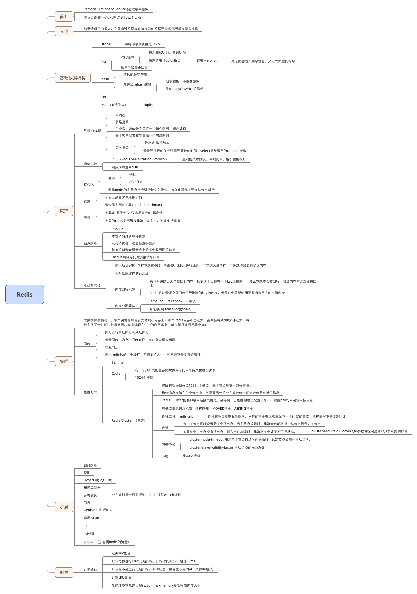

## 脑图



## 命令
+ info memory 可查看Redis使用了jemalloc
+ Redis Config Get 命令 - 获取指定配置参数的值：<https://www.redis.net.cn/order/3667.html>
+ cluster nodes

## Redis 客户端
+ <https://redis.io/clients#java>
+ Jedis
+ lettuce
+ Redisson

### Jedis

#### 连接方式
1. Jedis直连
```java
Jedis jedis = new Jedis("127.0.0.1",6379);
```
2. Jedis连接池
```java
GenericObjectPoolConfig poolConfig = new GenericObjectPoolConfig();
          JedisPool jedisPool = new JedisPool(poolConfig, "127.0.0.1", 6379);
```
+ Jedis是redis的java客户端，JedisCluster则是Jedis根据Redis集群的特性提供的集群客户端。

### Jedis客户端如何定位到对应的主节点
+ [你不知道的Redis：RedisCluster与JedisCluster](https://zhuanlan.zhihu.com/p/69800024)
+ JedisClusterInfoCache：关于缓存数据的获取及更新实际是由JedisClusterInfoCache的discoverClusterNodesAndSlots方法实现， 主要是通过cluster slots 命令获取集群内的槽位分布数据，然后解析该命令的返回结果，为每个主节点初始化一个连接池，然后将节点与连接池、节点负责的所有槽位与连接池的映射关系缓存
+ 初始化主要分为一下几部分：
	1. 连接一个节点执行cluster slots命令，获取槽位分布以及集群节点信息；
	2. 为每一个节点都初始化一个连接池，并跟节点建立映射关系缓存；
	3. 将每个主节点负责的槽位一一与主节点连接池建立映射缓存。
	4. 初始化工作中缓存的映射信息，在JedisCluster的使用过程中起到了至关重要的作用。但也正是因为JedisCluster在本地内存中缓存节点数据并且为每个节点维护一个连接池，在使用节点特别多的庞大集群时，客户端也会消耗更多内存。

## Redis基本数据类型原理
1. 字符串：redis没有直接使用C语言传统的字符串表示，而是自己实现的叫做简单动态字符串SDS的抽象类型。C语言的字符串不记录自身的长度信息，而SDS则保存了长度信息，这样将获取字符串长度的时间由O(N)降低到了O(1)，同时可以避免缓冲区溢出和减少修改字符串长度时所需的内存重分配次数。
2. 链表linkedlist：redis链表是一个双向无环链表结构，很多发布订阅、慢查询、监视器功能都是使用到了链表来实现，每个链表的节点由一个listNode结构来表示，每个节点都有指向前置节点和后置节点的指针，同时表头节点的前置和后置节点都指向NULL。
3. 字典hashtable：用于保存键值对的抽象数据结构。redis使用hash表作为底层实现，每个字典带有两个hash表，供平时使用和rehash时使用，hash表使用链地址法来解决键冲突，被分配到同一个索引位置的多个键值对会形成一个单向链表，在对hash表进行扩容或者缩容的时候，为了服务的可用性，rehash的过程不是一次性完成的，而是渐进式的。
4. 跳跃表skiplist：跳跃表是有序集合的底层实现之一，redis中在实现有序集合键和集群节点的内部结构中都是用到了跳跃表。redis跳跃表由zskiplist和zskiplistNode组成，zskiplist用于保存跳跃表信息（表头、表尾节点、长度等），zskiplistNode用于表示表跳跃节点，每个跳跃表的层高都是1-32的随机数，在同一个跳跃表中，多个节点可以包含相同的分值，但是每个节点的成员对象必须是唯一的，节点按照分值大小排序，如果分值相同，则按照成员对象的大小排序。
5. 整数集合intset：用于保存整数值的集合抽象数据结构，不会出现重复元素，底层实现为数组。
6. 压缩列表ziplist：压缩列表是为节约内存而开发的顺序性数据结构，他可以包含多个节点，每个节点可以保存一个字节数组或者整数值。

基于这些基础的数据结构，redis封装了自己的对象系统，包含字符串对象string、列表对象list、哈希对象hash、集合对象set、有序集合对象zset，每种对象都用到了至少一种基础的数据结构。

redis通过encoding属性设置对象的编码形式来提升灵活性和效率，基于不同的场景redis会自动做出优化。不同对象的编码如下：

1. 字符串对象string：int整数、embstr编码的简单动态字符串、raw简单动态字符串
2. 列表对象list：ziplist、linkedlist
3. 哈希对象hash：ziplist、hashtable
4. 集合对象set：intset、hashtable
5. 有序集合对象zset：ziplist、skiplist

## Redis为什么快
redis的速度非常的快，单机的redis就可以支撑每秒10几万的并发，相对于mysql来说，性能是mysql的几十倍。速度快的原因主要有几点：

1. 完全基于内存操作
2. C语言实现，优化过的数据结构，基于几种基础的数据结构，redis做了大量的优化，性能极高
3. 使用单线程，无上下文的切换成本
4. 基于非阻塞的IO多路复用机制

### Redis6.0之后改用多线程
+ redis使用多线程并非是完全摒弃单线程，redis还是使用单线程模型来处理客户端的请求，只是使用多线程来处理数据的读写和协议解析，执行命令还是使用单线程。
+ 这样做的目的是因为redis的性能瓶颈在于网络IO而非CPU，使用多线程能提升IO读写的效率，从而整体提高redis的性能。

## 主从同步的原理
1. slave发送sync命令到master
2. master收到sync之后，执行bgsave，生成RDB全量文件
3. master把slave的写命令记录到缓存
4. bgsave执行完毕之后，发送RDB文件到slave，slave执行
5. master发送缓存中的写命令到slave，slave执行

## 配置参数

### cluster-require-full-coverage
#### cluster-require-full-coverage= yes
1. 任一master宕机	集群可用
2. 同一组master和slave宕机	集群不可用
3. 半数及以上master宕机	集群不可用
#### cluster-require-full-coverage= no
1. 同一组master和slave宕机	集群可用
2. 半数及以上master宕机	集群不可用

## 源码系列
+ [全面阐释Redis常见对象类型的底层数据结构](https://mp.weixin.qq.com/s/QVxwJb6F99E17ZaGQlhVTQ)

### 字符串SDS
+ 扩容策略：长度小于1M时每次扩容加倍；长度大于1M后每次扩容加1M

### 字典
+ 由两个hashtable组成，通常情况下只有一个有值。扩容时搬迁过程中两个都有值；
+ hashtable第一维是数组，第二维是链表；
+ 渐进式rehash：在后续的hset，hdel等指令逐步搬迁，同时有定时任务进行搬迁(单线程，一次性搬迁太耗时)

### 压缩列表(ziplist)
+ zset和hash在元素较少时使用ziplist存储
+ ziplist是连续的内存空间，元素紧凑存储，支持双向遍历

### 快速列表(quicklist)

### 跳跃列表(skiplist)

### 紧凑列表(listpack)
+ Redis 5.0

### 基数树(rax)

### LFU 
+ Least Frequently Used, 按最近的访问频率进行淘汰，比LRU更精准表示一个key的访问热度


## 工具
+ Redis Memory Analyzer:<https://scalegrid.io/blog/the-top-6-free-redis-memory-analysis-tools/>, <https://stackoverflow.com/questions/49388547/get-the-redis-key-value-size-in-memory>


## Reference
+ [redis深度历险：核心原理与应用实践]
+ [关于Redis，你扛得住这夺命连环11问吗？](https://mp.weixin.qq.com/s/M9ImkchlYfB5yc7chJs0uQ)


