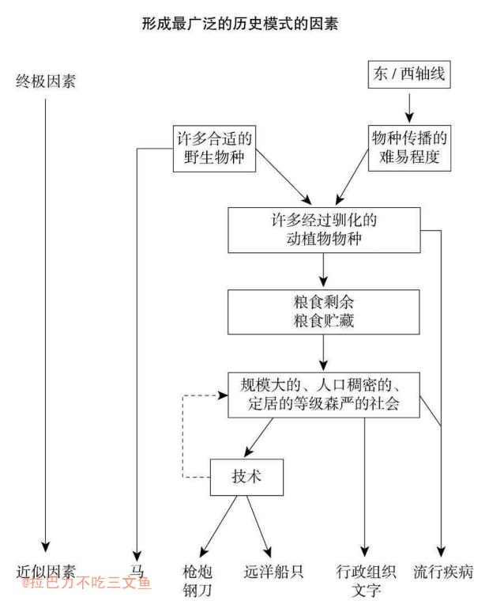
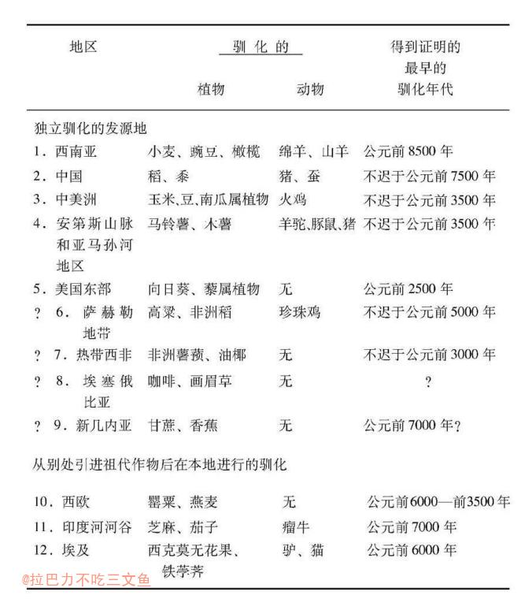

+ 为什么最后带来枪炮、凶恶的病菌和钢铁的竟是欧洲人，而不是非洲人或印第安人？
+ 对本书来说，这样的一句话就是：“不同民族的历史遵循不同的道路前进，其原因是民族环境的差异，而不是民族自身在生物学上的差异。”

### 第一章 走上起跑线
+ 随着人类在澳大利亚/新几内亚的定居，现在人类已占据了可以居住的5个大陆中的3个。（在本书中，我始终把欧亚大陆算作一个大陆，我没有把南极大陆计算在内，因为南极大陆直到19世纪才有人到达，而且从来没有任何自给自足的居民。）这样就只剩下两个大陆：北美洲和南美洲。它们无疑是最后两个有人定居的大陆，这原因很明显，因为从旧世界到达美洲要么用船（甚至在印度尼西亚直到4万年前才有证据表明已有了船，而欧洲要晚得多才有船）去渡海，要么得先占有西伯利亚（直到大约2万年前才有人居住）以便通过白令陆桥。
+ 克罗维的猎人们在美洲向南推进，遇到了以前从未见过人的大型动物。他们可能发现这些美洲动物很容易杀死，于是就把它们消灭了。
+ 在可以住人的5个大陆中，北美洲和南美洲是人类史前史最短的两个大陆。
+ 在过去的700年中，唯一的无人居住、等待欧洲探险者光顾的地区就只剩下大西洋和印度洋中那些最偏远的岛屿（如亚速尔群岛和塞舌尔群岛）和南极大陆了。
+ 如果现代人类的确是在大约10万年前出现在非洲，然后向其他大陆扩散，那么其他地方在这期间积累起来的优势都会被一扫而光，从而使非洲人取得新的领先优势。而且，人类遗传的多样性以非洲为最高；也许更多样的人类集体会带来更多样的发明创造。不过，我们的这位考古学家那时可能会想：就本书的论题来说，究竟什么是“领先优势”？

### 第二章 历史的自然实验
+ 一般地说，人口越多，人口密度越高，技术和组织就越复杂，专业程度就越高。简言之，人口密度高时，只有一部分人最后成为农民，但他们被调动起来去专门从事集约型的粮食生产，从而生产出剩余粮食去养活非生产者。能够调动农民的非生产者包括首领、神职人员、官员和战士。

#### 总结
+ 人口密度的重要性！

### 第三章 卡哈马卡的冲突
+ 现代最大的人口变迁是欧洲人对新大陆的移民，以及随之发生的对美洲土著（美洲印第安人）的征服、土著人数的减少或完全消失。
+ 阿塔瓦尔帕在卡哈马卡的出现突出了世界史上的一个关键因素：具有相当免疫力的入侵民族把疾病传染给没有免疫力的民族。天花、麻疹、流行性感冒、斑疹伤寒、腺鼠疫以及其他一些在欧洲流行的传染病，毁灭了其他大陆的许多民族，从而在欧洲人的征服中起了一种决定性的作用。
+ 我并不是要暗示历史上疾病的作用只限于为欧洲人的扩张铺平道路。疟疾、黄热病以及热带非洲、印度、东南亚和新几内亚的一些其他疾病，是欧洲在这些热带地区进行殖民的最大障碍。
+ 皮萨罗成功的直接原因包括：以枪炮、钢铁武器和马匹为基础的军事技术；欧亚大陆的传染性流行病；欧洲的航海技术；欧洲国家集中统一的行政组织和文字。
+ 为什么这种直接优势总是在欧洲一边，而不是在新大陆一边。为什么不是印加人发明枪炮和钢刀，骑上像战马一样的令人生畏的牲口，携带对欧洲人来说没有抵抗力的疾病，修造远洋船只和建立先进的行政组织，并能从几千年有文字记载的历史吸取经验？

#### 总结
+ 病菌的影响

### 第四章 农民的力量
+ 从间接的意义说，粮食生产是枪炮、病菌和钢铁发展的一个先决条件。
+ 第一个因果关系是最直接的因果关系：能够获得更多的可消耗的卡路里就意味着会有更多的人。在野生的动植物物种中，只有很少一部分可供人类食用，或值得猎捕或采集。

+ 通往使某些民族能够征服另一些民族的近似因素（如枪炮、马匹和疾病）的因果关系链。例如，人类的各种各样疾病是在有许多适于驯化的动植物物种的地区演化的，这一部分是由于生产出的农作物和饲养的牲畜帮助养活了使流行疾病得以保持的人口稠密的社会；一部分是由于这些疾病是从驯化的动物身上的病菌演化而来。
+ 作为传统社会中的一个燃料来源，动物粪便也有其价值。此外，最大的驯化哺乳动物与驯化植物相互作用，以增加粮食产量，这表现在它们可以用来拉犁，从而使人们可以去耕种以前如用来耕种则代价太高的土地。
+ 许多狩猎采集社会里的人经常跑来跑去寻找野生食物，但农民必须留在他们的田地和果园附近。因此而产生的固定居所由于缩短了生育间隔期而促使人口变得更稠密起来。
+ 事实上，到处流浪的以狩猎采集为生的人通过哺乳期无月经、禁欲、杀婴和堕胎等办法，把孩子出生的间隔安排为大约每4年一个。相比之下，定居的部族由于没有在迁移途中携带小孩这种问题的限制，他们可以多生多养，只要养得活就行。
+ 评论：采集社会时期的人类同样采取抛弃弱小，这样做用现代评价标准就是灭绝人性，但在当时是不得不采取的手段。
+ 定居生活的另一个结果是人们可以把多余的粮食贮藏起来，因为如果人们不能留在附近看管贮藏的粮食，那么贮藏就是毫无意义的。虽然有些到处流浪的狩猎采集部族可能偶尔也把几天吃不完的食品收藏起来，但这种富余对他们几乎毫无用处，因为他们不能保护它。但贮藏的粮食对于养活不生产粮食的专门人材是必不可少的，而对于养活全村社的人肯定是必不可少的。因此，到处流浪的狩猎采集社会几乎没有或完全没有这类专职的专门人材，这种人材首先出现在定居社会中。
+ 一旦有了粮食储备，行政上层人物就可以控制别人生产的粮食，维护征税的权利，无需去养活自己，而以全部时间从事行政活动
+ 通过税收建立剩余粮食储备，除了养活国王和官员外，还能养活其他专职的专门人材。与征服战争关系最直接的是，剩余粮食储备可以用来养活职业军人。这是不列颠帝国最终打败新西兰武装精良的本土毛利人的决定性因素。
+ 至此，我已着重指出了作为粮食的农作物和家畜的直接和间接的价值。然而，它们还有其他用途，例如帮我们保暖和向我们提供有价值的材料。农作物和家畜生产出的天然纤维，可以用来做衣服、毯子、网和绳子。
+ 驯化的大型哺乳动物在19世纪铁路发展起来之前成为我们主要的陆路运输手段，从而进一步使人类社会发生了革命性的剧变。最后以蒙古人于公元13世纪和14世纪征服亚洲和俄罗斯的许多地方而达到高潮。只是由于在第一次世界大战中采用了卡车和坦克，马的作用才最后被取代，而不再是战争中主要的突击手段和快速运输的工具。
+ 在征服战争中同样重要的是在驯养动物的社会中演化的病菌。像天花、麻疹和流行性感冒这类传染病作为人类的专化病菌出现了，它们原是动物所感染的十分类似的祖代病菌由于突变而衍生出来的
驯养动物的人成了这些新演化出来的病菌的第一个受害者，而这些人接着又逐步形成了对这些新的疾病的强大的抵抗力。当这些有部分免疫力的人与以前从来没有接触过这种病菌的人接触时，流行病于是产生了，99%的以前没有接触过这种病菌的人因之而丧命。从驯养的动物那里最后获得的病菌，在欧洲人对美洲、澳大利亚、南非和太平洋诸岛的土著的征服中起了决定性的作用。
+ 总之，动植物的驯化意味着人类的粮食越来越多，因而也就意味着人口越来越稠密。因此而带来的粮食剩余和（在某些地区）利用畜力运输剩余粮食，成了定居的、行政上集中统一的、社会等级分明的、经济上复杂的、技术上富有革新精神的社会的发展的先决条件。因此，能否利用驯化的动植物，最终说明了为什么帝国、知书识字和钢铁武器在欧亚大陆最早发展起来，而在其他大陆则发展较晚，或根本没有发展起来。

#### 总结
1. 粮食生产的重要
2. 定居生活
3. 病菌的产生

### 第五章 历史上的穷与富
+ 为什么粮食生产首先在看似相当贫瘠的土地上形成，只是到后来才在今天最肥沃的农田和牧场发展起来？所有这些问题都涉及不同的发展阶段，而正是这些不同的发展阶段决定了哪些民族成了历史上的贫穷民族，哪些民族成了历史上的富有民族。

+ 世界上只有几个地区发展了粮食生产，而且这些地区发展粮食生产的时间也差异甚大。一些邻近地区的狩猎采集族群从这些核心地区学会了粮食生产，而其他一些邻近地区的族群则被来自这些核心地区的粮食生产者所更替了——更替的时间仍然差异甚大。最后，有些族群虽然生活在一些生态条件适于粮食生产的地区，但他们在史前期既没有发展出农业，也没有学会农业；他们始终以狩猎采集为生，直到现代世界最后将他们淘汰。在粮食生产上具有领先优势的那些地区里的族群，因而在通往枪炮、病菌和钢铁的道路上也取得了领先的优势。其结果就是富有社会与贫穷社会之间一系列的长期冲突。

### 第六章 种田还是不种田
+ 由于粮食生产较狩猎采集有更高的每英亩可摄入卡路里数，人口密度也倾向于更高。而在另一方面，整个更新世后期的人口密度本来就在持续上升，归因于人类采集加工野生食物的技术进步。随着人口增长，粮食生产越来越受青睐，因为它提供了给养所有人所必需的粮食增产。这就是说，采纳粮食生产为所谓的自身催化过程提供了例证——这是一个在正反馈循环中自身催化的过程，这个过程一旦开始，速度就越来越快。人口密度的逐步增加，迫使人们去奖励那些无意中增加了粮食产量的人，以获得更多的粮食。一旦人们开始生产粮食并过定居的生活，他们就能够缩短生育间隔期，生出更多的人来，从而也就需要更多的粮食。粮食生产与人口密度之间的这种双向关系，说明了一种矛盾的现象，即粮食生产一方面增加了每英亩可摄入的卡路里的数量，一方面却又使这些粮食生产者的营养不及他们所承继的那些以狩猎采集为生的人。这种矛盾之所以产生，是因为人口密度的增加速度要稍高于粮食的增加速度。

### 第七章 怎样识别杏仁
+ 植物驯化可以定义为：栽种某一植物并由此有意或无意地使其发生不同于其野生祖先的、更有利于人类消费的遗传变化。
+ 不同的植物由于十分不同的或甚至相反的特点而得到选择。有些植物（如向日葵）由于大得多的种子而得到选择，而另一些植物（如香蕉）则由于种子小或没有种子而得到选择。选择生菜则取其茂盛的叶子而舍其种子或果实；选择小麦和向日葵则取其种子而舍其叶；选择南瓜则取其果实而舍其叶。特别有意思的是，由于不同的目的，对于一种野生植物可以有不同的选择，从而产生了外观十分不同的作物。
+ 新月沃地的小麦和大麦是被称之为谷物（属禾本科）的那类作物的代表，而新月沃地的豌豆和兵豆则是豆类（属豆科，包括大豆）的代表。谷类作物的优点是生长快，碳水化合物含量高，每公顷耕地可产1吨食物。因此，今天的谷物占人类消耗的全部卡路里的半数以上，并包括现代世界上12种主要作物中的5种（小麦、玉米、稻米、大麦和高粱）。许多谷类作物蛋白质含量低，但这一缺陷可以由豆类来弥补，因为豆类的蛋白质通常达25%（大豆为38%）。因此，谷物和豆类一起为均衡饮食提供了许多必不可少的成分。

### 第八章 问题在苹果还是在印第安人
+ 人类历史的主要事实之一，是西南亚的那个叫做新月沃地的地区（因其在地图上的新月状高地而得名，见图8.1）在人类发展早期的重要性。那个地区似乎是包括城市、文字、帝国以及我们所说的文明（不论是福是祸）在内的一连串新情况发生的地方。而所有这些新情况之所以发生，都是由于有了稠密的人口，有了剩余粮食的贮存，以及可以养活不从事农业的专门人材，凡此种种之所以可能又都是由于出现了以作物栽培和牲口饲养为形式的粮食生产。粮食生产是新月沃地出现的那些重要新事物中的第一个新事物。因此，如果想要了解现代世界的由来，就必须认真对待这样的问题，即为什么新月沃地的驯化动植物使它获得了如此强大的领先优势。
+ 原来地中海气候带，尤其是在新月沃地那个地区，具有胜过其他地中海气候带的5个有利条件。第一，欧亚大陆西部显然是世界上属于地中海气候带的最大地区。因此，那里的野生动植物品种繁多，超过了澳大利亚西南部和智利这些比较小的地中海气候带。第二，在地中海气候带中，欧亚大陆西部的地中海气候带的气候变化最大，每一季、每一年气候都有不同。这种气候变化有利于植物群中数量特别众多的一年生植物的演化。物种多和一年生植物多这两个因素结合起来，就意味着欧亚大陆西部的地中海气候带显然是一年生植物品种最繁多的地区。智利的地中海型气候带只有2种，加利福新月沃地的地中海气候带的第三个有利条件，是它在短距离内高度和地形的富于变化。它的高度从地球上的最低点（死海）到18000英尺的高山（在德黑兰附近），应有尽有，从而保证了环境的相应变化，也因此保证品种繁多的野生植物可供成为作物的祖先。
+ 地球上不同地区的当地作物并不是同样多产的。
+ 采纳粮食生产涉及粮食生产的生活方式与狩猎采集的生活方式之间的竞争。而受到损害的则是那些没有这种机会或意愿的部落。因此，新几内亚土生土长的粮食生产所受到的限制与新几内亚的族群没有任何关系，而是与新几内亚的生物区系和环境有着最密切的关系。
+ 事实上，在整个大陆和其他一些包含数以百计的互相竞争的广大地区，有些社会对新事物可能比较开放，有些社会对新事物可能比较抵制。那些接受新作物、新牲畜或新技术的社会因而可能吃得更好，繁殖得更快，从而取代、征服或杀光那些抵制新事物的社会。
+ 澳大利亚这个据称最“落后的”大陆很好地说明了这个问题。澳大利亚东南部是这个大陆上水源充足、最适合粮食生产的地方。那里的土著社会在最近的几千年里似乎一直在按照一种可能最终导致本地粮食生产的发展轨迹在演化。它们已经建立了过冬的村庄。它们已经开始加强利用它们的环境，建造渔栅、编织渔网，甚至挖掘长长的水渠来从事渔业生产。如果欧洲人没有在1788年向澳大利亚殖民，从而中途破坏了那个独立的发展轨迹，那么澳大利亚土著也许不消几千年就可成为粮食生产者，照料一池池驯化了的鱼，种植驯化了的澳大利亚薯蓣和小籽粒的禾本科植物。根据这一点，我现在就能够回答包含在本章标题里的那个问题。我提出的那个问题是：北美印第安人未能驯化北美苹果的原因是在印第安人还是在苹果。
+ 在欧洲人到达时印第安人仍未能驯化北美的苹果，其原因不在印第安人，也不在苹果。就苹果驯化必要的生物条件而言，北美印第安农民和欧亚大陆农民一样，北美的野生苹果也和欧亚大陆的野生苹果一样。事实上，本章读者现在正在津津有味地吃着的从超市上买来的苹果，有些品种就是不久前将欧亚大陆的苹果同北美的野生苹果进行杂交而培育出来的。印第安人未能驯化苹果的原因却是在于印第安人所能得到的整个野生动植物组合。这个组合的微弱的驯化潜力，就是北美粮食生产很晚才开始的主要原因。

#### 总结
1. 新月沃地(地中海气候)
2. 美洲整个野生动植物组合，微弱的驯化潜力。

### 第九章 斑马、不幸的婚姻和安娜·卡列尼娜原则
+ 驯养的大型哺乳动物对那些拥有它们的人类社会产生重大影响的那许多方面。最显著的是，这些动物提供了肉食、奶制品、肥料、陆上运输、皮革、军事突击手段、犁具牵引、毛绒以及使先前没有抵抗力的民族失去生命的病菌。
+ 各大陆之间野生祖先的这种十分不均匀的分布，成了欧亚大陆人而不是其他大陆的人最后得以拥有枪炮、病菌和钢铁的一个重要原因。
+ 欧亚大陆何以一直是大型哺乳动物驯化的主要场所，对这个问题的部分解释是：它是一个一开始就拥有最多的可供驯化的野生哺乳动物的大陆，在过去的40000年中，那里这样的动物因绝种而消失的也最少。
+ 在驯化动物方面现代尝试的失败，提供了最后一个证据，表明过去在驯化剩下的大批候补野生动物方面的失败是由于这些动物本身的缺点，而不是由于古代人的缺点。
+ 每一次某种动物在吃某种植物或另一种动物时，食物生物量转换为取食者生物量的效率远远低于100%：通常在10%左右。就是说，要花费10000磅左右的玉米才能喂养出一头1000磅重的牛。
+ 动物的日常食物、生长速度、交配习惯、性情、容易受惊的倾向以及群居组织的几个不同的特点。只有很少一部分野生哺乳动物由于在上述所有这些方面都能协调一致而最终得以和人类结成美满的婚姻。
+ 欧亚大陆的民族碰巧比其他大陆的民族继承了多得多的可驯化的大型野生的哺乳类食草动物。这一结果及其为欧亚大陆社会带来的全部利益，来自哺乳动物地理学、历史和生物学这3个基本事实。
+ 欧亚大陆由于其广大面积和生态的多样性，一开始就拥有最多的可供驯化的候补动物。其次，澳大利亚和美洲，而不是欧亚大陆或非洲，在更新世晚期动物灭绝的大规模浪潮中失去了它们大多数可供驯化的候补动物——这可能是因为前两个大陆的哺乳动物不幸首先突然接触到人类，而且这时已是我们的进化史的后期阶段，我们的狩猎技巧已经得到了高度的发展。

#### 总结
+ 欧亚大陆的民族碰巧比其他大陆的民族继承了多得多的可驯化的大型野生的哺乳类食草动物。

### 第十章 辽阔的天空与偏斜的轴线
+ 轴线走向的差异所产生的巨大的、有时是悲剧性的后果。轴线走向影响了作物和牲口的传播速度，可能还影响文字、车轮和其他发明的传播速度。
+ 某种作物的迅速传播可能不但抢先阻止了同一植物的野生祖先在其他某个地方的驯化，而且也阻止了有亲缘关系的野生植物的驯化。
+ 许多不同的现象归结为同一个结论：粮食生产从西南亚向外传播的速度要比在美洲快，而且也可能比在非洲撒哈拉沙漠以南的地区快。这些现象包括：粮食生产完全未能到达某些生态条件适合于粮食生产的地区；粮食生产传播的速度和选择性方面存在着差异；以及最早驯化的作物是否抢先阻止了对同一种植物的再次驯化或对近亲植物的驯化方面也存在着差异。
+ 提出所有这些差异，并不就是说分布很广的作物是值得赞美的，也不是说这些差异证明了欧亚大陆早期农民具有过人的智慧。这些差异只是反映了欧亚大陆轴线走向与美洲或非洲大陆轴线相比较的结果。历史的命运就是围绕这些轴线旋转的。

### 第十一章 牲畜的致命礼物
+ 粮食生产这个终极原因是如何导致病菌、文化修养、技术和集中统一的政府这些直接原因的。
+ 过去战争中的胜利者并不总是那些拥有最优秀的将军和最精良的武器的军队，而常常不过是那些携带有可以传染给敌人的最可怕病菌的军队。
+ 虽然被那些杀人不眨眼的西班牙征服者杀死的印第安人不计其数，但凶恶的西班牙病菌杀死的印第安人却要多得多。为什么在欧洲和美洲之间这种可怕的病菌的交流是这样不对等？为什么印第安人的疾病没有大批杀死西班牙入侵者，并传回欧洲，消灭掉欧洲95%的人口？同样的问题也出现在被欧亚病菌大批杀死的其他土著身上，以及企图征服亚非热带地区的欧洲人身上。
+ 作为流行病有几个共同的特点。首先，它们从一个受感染的人迅速而高效地传给近旁健康的人，结果使整个人口在很短时间内受到感染。其次，它们都是“急性”病：在很短时间内，你要么死掉，要么完全康复。第三，我们当中的确获得康复的那些幸运的人产生了抗体，使我们在很长时间内，也可能是一辈子不用担心这种病会复发。最后，这些病往往只在人类中传播；引起这些病的病菌往往不是生活在土壤中或其他动物身上。所有这4个特点也适用于美国人所认为的那些习见的儿童急性传染病，其中包括麻疹、风疹、急性腮腺炎、百日咳和天花。这4个特点结合起来往往造成了某种疾病的流行，其原因不难理解。简单地说，情况是这样的：病菌的迅速传播和症状的迅速发展，意味着当地人口中的每一个人很快就受到感染，之后不久他或者死去，或者康复并获得免疫力。仍然会受到感染的人都不会活下来。但由于这种病菌除了在活人体内是不可能生存的，所以人死了这种病也就消失了，直到又一批儿童达到易受感染的年纪——直到一个受到感染的外来人使一场流行病重新开始。
+ 关于这些疾病是怎样流行起来的，有一个典型的事例是大西洋上叫做法罗群岛[插图]的与世隔绝的岛屿上的麻疹病史。1781年，一场严重的麻疹流行病到达法罗群岛，接着又消失了，其后该群岛就不再有麻疹发生，直到1846年，一个受到感染的木匠从丹麦坐船到来。不出3个月，法罗群岛的几乎全部人口（7782人）都得了麻疹，于是有的人死去，有的人康复，麻疹病毒又一次消失，直到下一次流行。一些研究表明，麻疹可能会在任何少于50万人的人口中消失。只有在比较多的人口中，这种病才会从一个地区转移到另一个地区，直到原先受感染地区里出生的婴儿达到足够的数目，麻疹又会卷土重来。适用于法罗群岛上麻疹的情况，也适用于世界上其他一些我们所熟悉的急性传染病。为了维持自身的存在，这些病需要有足够多的人口，足够拥挤的稠密人口，这样，到这种病不然就会衰退的时候，又有一大批易受感染的儿童成为感染对象。因此，麻疹和一些类似的疾病也叫做人群病。
+ 人群病不可能在小群狩猎采集族群和刀耕火种的农民中存在下去。现代亚马孙河地区印第安人和太平洋岛民的悲惨经历表明，整个小部落可能被一个外来人带来的一种流行病几乎全部消灭——因为这个小部落中没有一个人有任何抵抗这种病菌的抗体。小部落人口少，这一点不但说明了为什么他们承受不住从外面带来的流行病，而且也说明了为什么他们没有能演化出自己的流行病去回敬外来人。
+ 为什么农业的出现会成为我们人群传染病形成的开端？其中一个原因前面已经提到，那就是农业比狩猎采集的生活方式维持了高得多的人口密度——平均要高10倍到100倍。另外，狩猎采集族群经常变换营地，留下了一堆堆排泄物，上面聚集了大量病菌和寄生虫的幼虫。但农民是定居的，他们生活在自己排放出来的污水之中，从而为病菌从一个人的身体进入另一个人的饮用水源提供了捷径。有些农业人口把自己的粪便收集起来，当作肥料撒到人们劳动的田里，从而使粪便中的病菌和寄生虫去感染新的受害者变得甚至更加容易。
+ 在动物中，流行病同样需要稠密的大种群，而不是只去折磨任何某一只动物：这些流行病主要发生在需要有大的种群的群居动物中。因此，当我们驯养牛和猪这类群居动物时，它们已经受到了一些流行病的折磨，只不过在等待着转移给我们罢了。所有这些病菌仍然处在向人类病原体演化的早期阶段。
+ 美洲之所以未能出现流行的致命的人群病的主要原因就一定会变得很清楚。这个问题就是，想象一下这些疾病可能会从什么病菌演化而来？我们已经看到，欧亚大陆的人群病是从欧亚大陆驯化的群居动物的疾病演化而来的。尽管欧亚大陆有许多这样的动物，但在美洲驯化的动物只有5种：墨西哥和美国西南部的火鸡、安第斯山脉地区的美洲驼/羊驼和豚鼠、热带南美的美洲家鸭和整个美洲的狗。反过来，我们也看到，新大陆驯化动物的这种极端缺乏，反映了用以启动驯化的野生动物的缺乏。在大约13000年前上一次冰期结束时，美洲有大约80%的大型野生哺乳动物便已灭绝了。
+ 源于动物的疾病在历史上的重要性，远远超过了旧大陆与新大陆之间的冲突。欧亚大陆的病菌在大量消灭世界上其他许多地方的土著民族方面起了关键的作用。
+ 毫无疑问，欧洲人在武器、技术和行政组织方面拥有对他们所征服的大多数非欧洲民族的巨大优势。但仅仅这种优势还不能完全说明开始时那么少的欧洲移民是如何取代美洲和世界上其他一些地区那么多的土著的。如果没有欧洲送给其他大陆的不祥礼物——从欧亚大陆人与家畜的长期密切关系中演化出来的病菌，这一切也许是不会发生的。

#### 总结
1. 流行病(人群病)

### 第十二章 蓝图和借用字母
+ 知识带来力量。因此，文字也给现代社会带来了力量，用文字来传播知识可以做到更准确、更大量和更详尽，在地域上可以做到传播得更远，在时间上可以做到传播得更久。
+ 文字同武器、病菌和集中统一的行政组织并驾齐驱，成为一种现代征服手段。
+ 发明的传播形式有一系列形式。形式的一端是“蓝图复制”，就是对现有的一幅详尽的蓝图进行复制或修改。另一端是“思想传播”，就是仅仅把基本思想接受过来，然后必须去重新创造细节。
+ 虽然蓝图的复制和修改是传播技术的最直接的选择，但有时候这种选择不一定能够得到。蓝图可能被隐藏起来，而且不是深于此道的人对蓝图也不一定能够读懂。对于在远处某个地方发明了某个东西，人们可能有所耳闻，但详细情况则可能无从知晓。也许所知道的只是这样的基本思想：某人以某种方法成功地取得了某种最后的成果。然而，知道了这一点，可能就是通过思想传播去启发别人设计他们自己的取得此种成果的途径。
+ 大多数有文字的社会之所以获得文字，或是通过向邻近的社会借用，或是由于受到它们的启发而发明出文字，而不是靠自己独立创造出来的。
+ 文字史引人注目地表明了类似的情况：地理和生态条件影响了人类发明的传播。

### 第十三章 需要之母
+ 事实上，许多发明或大多数发明都是一些被好奇心驱使的人或喜欢动手修修补补的人搞出来的，当初并不存在对他们所想到的产品的任何需要。一旦发明了一种装置，发明者就得为它找到应用的地方。只有在它被使用了相当一段时间以后，消费者才会感到他们“需要”它。还有一些装置本来是只为一个目的而发明出来的，最后却为其他一些意料之外的目的找到了它们的大多数用途。
+ 寻求使用的这些发明包括现代大多数重大的技术突破，从飞机和汽车到内燃机和电灯泡再到留声机和晶体管，应有尽有。了解到这一点，也许会令人感到吃惊。因此，发明常常是需要之母，而不是相反。
+ 有一项大发明最终得到使用，就会有不计其数的其他发明得不到使用。甚至有些发明当初本来是为了满足特定的需要而设计的，后来可能在满足意外需要方面证明是更有价值的。虽然詹姆士·瓦特设计他的蒸汽机是为了从煤矿里抽水，但它很快就为棉纺厂提供动力，接着又（以大得多的利润）推动着机车和轮船前进。
+ 技术的发展是长期积累的，而不是靠孤立的英雄行为；技术在发明出来后大部分都得到了使用，而不是发明出来去满足某种预见到的需要。
+ 一旦发明家发现了一项新技术的用途，下一步就是说服社会来采用它。仅仅有一种更大、更快、更有效的工作装置还不能保证人们会乐于接受。无数的此类技术要么根本没有被采用，要么只是在长期的抵制之后才被采用。
+ 即使在同一个大陆上，各社会之间在发展和接受新事物方面也是大不相同的。即使是在同一个社会内，在时间上也会有所不同。在任何时候，在任何大陆上都有富于创新精神的社会，也有保守的社会。此外，在同一个地区内，对新事物的接受能力迟早会产生波动。
+ 一个用途广泛的发明在一个社会出现后，接着它便往往以两种方式向外传播。一种方式是：其他社会看到或听说了这个发明，觉得可以接受，于是便采用了。另一种方式是：没有这种发明的社会发现与拥有这种发明的社会相比自己处于劣势，如果这种劣势大到一定程度，它们就会被征服并被取而代之。
+ 在发明的传播中最容易接受发明的社会是大陆上的一些根基深厚的社会。在这些社会中技术发展最快，因为它们不但积累了自己的发明，而且也积累了其他社会的发明。
+ 我们往往想当然地认为，有用的技术一旦获得，就必然会流传下去，直到有更好的技术来取而代之。事实上，技术不但必须获得，而且也必须予以保持，而这也取决于许多不可预测的因素。任何社会都要经历一些社会运动和时尚，此时一些没有经济价值的东西变得有价值起来，而一些有用的东西也变得暂时失去了价值。今天，当地球上几乎所有社会相互联系在一起的时候，我们无法想象某种时尚会发展到使人们竟然抛弃一项重要的技术。一个著名的例子是日本放弃枪支。
+ 在同时代的欧洲也有一些鄙视枪支并竭力限制枪支使用的统治者。但这些限制措施在欧洲并未发生多大作用，因为任何一个欧洲国家，哪怕是短暂地放弃了火器，很快就会被用枪支武装起来的邻国打垮。只是因为日本是一个人口众多的孤立的海岛，它才没有因为拒绝这种具有巨大作用的新军事技术而受到惩罚。日本拒绝枪支和中国抛弃远洋船只（以及抛弃机械钟和水力驱动纺纱机），是历史上孤立或半孤立社会技术倒退的著名例子。
+ 在这漫长的加速发展的历史中，我们可以挑出两次意义特别重大的飞跃。第一次飞跃发生在100000年到50000年前，其所以能够发生，大概是由于我们身体的遗传变化，即人体的现代解剖学进化使现代语言或现代大脑功能或两者成为可能。这次飞跃产生了骨器、专用石器和复合工具。第二次飞跃来自我们选定的定居生活方式，这种生活方式在世界的不同地区发生的时间不同，在有些地区早在13000年前就发生了，在另一些地区即使在今天也还没有发生。就大多数情况而言，选定定居的生活方式是同我们采纳粮食生产联系在一起的，因为粮食生产要求我们留在我们的作物、果园和剩余粮食储备的近旁。
+ 定居生活对技术史具有决定性的意义，因为这种生活使人们能够积累不便携带的财产。四处流浪的狩猎采集族群只能拥有可以携带的技术。如果你经常迁移而且又没有车辆或役畜，那么你的财产就只能是小孩、武器和最低限度的其他一些便于携带的小件必需品。你在变换营地时不能有陶器和印刷机之类的累赘。这种实际困难或许可以说明何以有些技术出现得惊人地早，接着停了很长时间才有了进一步的发展。

#### 总结
1. 发明常常是需要之母，而不是相反。
2. 不接受新事物，很可能会被征服并被取而代之。
3. 日本放弃枪支；
4. 定居生活的意义；

#### 总结(重点!!!)
+ 现在，让我们来总结一下，粮食生产开始的时间、技术传播的障碍和人口的多寡这3大因素的变化，是怎样直接导致我们所看到的各大陆之间在技术发展方面的差异的。
+ 欧亚大陆（实际上也包括北非在内）是世界上最大的陆块，包含有数量最多的互相竞争的社会。它也是最早开始拥有粮食生产的两个中心的陆块，这两个中心就是新月沃地和中国。它的东西向的主轴线，使欧亚大陆一个地区采用的许多发明得以较快地传播到欧亚大陆具有相同纬度和气候的其他地区的社会。它的沿次轴线（南北轴线）的宽度，同美洲巴拿马地峡的狭窄形成了对照。它没有把美洲和非洲的主轴线切断的那种严峻的生态障碍。因此，对技术传播的地理和生态障碍，在欧亚大陆没有在其他大陆那样严峻。由于所有这些因素，后更新世技术的加速发展，在欧亚大陆开始得最早，从而导致了本地最大的技术积累。
+ 北美洲和南美洲在传统上被看作是两个不同的大陆，但它们连接在一起已有几百万年之久，有着类似的历史问题，因此可以把它们放在一起来考虑，以便和欧亚大陆相比较。美洲构成了世界上第二大的陆块，但比欧亚大陆小得多。不过，它们在地理和生态上却支离破碎：巴拿马地峡宽不过40英里，等于在地理上把美洲给腰斩了，就像这个地峡上的达里安雨林和墨西哥北部的沙漠在生态上所做的那样。墨西哥北部的沙漠把中美洲人类的先进社会同北美洲的社会分隔开了，而巴拿马地峡则把中美洲的先进社会同安第斯山脉地区和亚马孙河地区的社会分隔开了。此外，美洲的主轴线是南北走向，从而使大部分的技术传播不得不逆纬度（和气候）的梯度而行，而不是在同一纬度内发生。例如，轮子是在中美洲发明的，而美洲驼是不迟于公元前3000年在安第斯山脉中部驯化的，但过了5000年，美洲的这唯一的役畜和唯一的轮子仍然没有碰头，虽然中美洲玛雅社会同印加帝国北部边界之间的距离（1200英里）比同时享有轮子和马匹的法国同中国之间6000英里的距离要短得多。在我看来，这些因素足以说明美洲在技术上落后于欧亚大陆这个事实。
+ 非洲撒哈拉沙漠以南地区是世界上第三大的陆块，但比美洲小得多。在人类的大部分历史中，到欧亚大陆比到美洲容易多了，但撒哈拉沙漠仍然是一个主要的生态障碍，把非洲撒哈拉沙漠以南地区同欧亚大陆和北非隔开。非洲的南北轴线造成了欧亚大陆与非洲撒哈拉沙漠以南地区之间以及撒哈拉沙漠以南地区本身内部技术传播的又一障碍。作为后一障碍的例子，陶器和炼铁术出现在或到达非洲撒哈拉沙漠以南的萨赫勒地带（赤道以北），至少同它们到达西欧一样早。然而，陶器直到公元元年才到达非洲的南端，而冶金术在从欧洲由海路到达非洲南端时，还不曾由陆路传播到那里。最后，澳大利亚是最小的一个大陆。澳大利亚大部分地区雨量稀少，物产贫乏，因此，就其所能养活的人口来说，它实际上就显然甚至更小。它也是一个最孤立的大陆。加之，粮食生产也从来没有在澳大利亚本地出现过。这些因素加在一起，就使澳大利亚成为唯一的在现代仍然没有金属制品的大陆。
+ 人口多意味着搞发明的人和互相竞争的社会也多。
+ 各大陆之间在面积、人口、技术传播的难易程度和粮食生产的开始时间等方面存在着差异，而这些差异又对技术的出现产生了种种影响，但所有这些影响都被夸大了，因为技术可以催化自身。欧亚大陆在开始时的巨大优势因此就变成了自1492年[插图]起的巨大的领先优势——其原因是欧亚大陆独特的地理条件，而不是那里的人特别聪明。我所认识的那些新几内亚人中就有潜在的爱迪生。不过，他们把自己的聪明才智用于解决适合自己情况的技术问题：不靠任何进口物品而在新几内亚丛林中生存的问题，而不是发明留声机的问题。

### 第十四章 从平等主义到盗贼统治
+ 有些社会最早实现了集中统一的政府和有组织的宗教，而这些社会的子孙后代最后主宰了现代世界。政府和宗教就是这样结合起来发挥了作用，它们是产生历史最广泛模式的4组主要的直接动力之一，另外3组动力是病菌、文字和技术。
+ 超越族群的那些阶段中的第一个阶段是部落。部落与族群的区别是它比较大（一般有几百人，而不是几十人），而且通常有固定的居住地。然而，有些部落，甚至有些由酋长管辖的部落，却是由随季节而迁移的牧人组成的部落是由不止一个的得到正式承认的亲属群体所组成，这些群体称为氏族，氏族之间互相通婚。土地属于某个氏族，不属于整个部落。然而，部落的人数仍然很少，每一个人都知道另外每一个人的名字和他的各种亲属关系。对人类其他类型的群体来说也是一样，在一个群体里如要做到彼此了解，这个群体的人数最多似乎以“几百人”为宜。
+ 早期的国王本人就是国家宗教的领袖，否则就另外设立一个大祭司。美索不达米亚的寺庙不但是宗教活动的中心，而且也是经济再分配、文字和手工技术的中心。
+ 同样明显的是，国家在与较简单的实体发生冲突时所以能取得胜利，部分原因是国家拥有武器和其他技术方面的优势，同时也拥有人口数量上的优势。但酋长管辖地和国家还有另外两个固有的潜在优势。首先，中央决策者拥有集中军队和资源的优势。其次，许多国家的官方宗教和爱国热忱使它们的军队在作战中视死如归，心甘情愿地为国捐躯。在现代国家中，乐于为国牺牲的思想由我们的学校、教会和政府大力灌输给我们公民，使我们忘记了它标志着同以往人类历史的彻底决裂。
+ “几百人”是个界限，在这个界限内每个人能够认识另外每个人，一旦超过这个界限，越来越多的两人组合就成了一对对没有亲属关系的陌生人了。当陌生人打架时，在场的人很少会是打架双方的朋友或亲属，没有什么私利要他们去制止打架。相反，如果许多旁观者是打架一方的朋友或亲属，他们就会站在他的一边，这样，本来是两个人的打架结果就逐步升级为一场乱哄哄的群殴。因此，一个继续把冲突交给全体成员去解决的大型社会必然会分崩离析。随着人口的增加，共同决策越来越难以做到。
+ 部落之间进行征服或兼并以达到了酋长管辖地的规模，酋长管辖地之间进行征服或兼并以达到了国家的规模，国家之间进行征服或兼并以形成帝国。更一般地说，大的单位可能拥有对各个小的单位的某种优势。小型社会的领袖和大型社会的领袖一样，珍惜自己的独立和特权。合并的发生不外乎下面的两种方式之一：在外力的威胁下合并，或通过实际的征服。
+ 战败民族的命运取决于人口的密度，这有3种可能的后果：凡是人口密度很低的地方，就像在狩猎采集族群占据的地区所常见的那样，战败群体的幸存者只要离开他们的敌人远一点就行了。新几内亚和亚马孙河地区游牧部族之间战争的结果往往就是这样。凡是人口密度中等的地方，就像粮食生产部落占据的地区那样，没有大片空旷的地方可以让战败族群的幸存者逃避。但是，
+ 没有集约型粮食生产的部落社会不使用奴隶，也不能生产出可以作为很大一部分贡品的足够的剩余粮食。因此，战败部落的幸存者对胜利者来说毫无用途，除非娶他们的女人为妻。战败的男人都被杀死了，他们的地盘也可能为胜利者所占有。
+ 凡是人口密度高的地方，就像国家或酋长管辖地所占有地区那样，被打败的人仍然无处可逃，但胜利者不杀死他们而有了利用他们的两种选择。由于酋长管辖地社会和国家社会已出现了经济专业化，被打败的人可以当奴隶来使用，就像在《圣经》时代通常发生的那样。或者，由于许多这样的社会已经有了能够生产大量剩余粮食的集约型粮食生产系统，胜利者可以让战败者仍然从事原来的劳作，只是剥夺了他们的政治自主权，要他们定期地用粮食或货物来纳贡，并把他们的社会合并入获胜的国家或酋长管辖地。

+ 粮食生产及社会之间的竞争与混合，产生了征服的直接原动力：病菌、文字、技术和中央集权的政治组织。这些原动力往往是相互联系着一起出现的，不过这种联系并不是绝对的。

#### 总结
1. 中央集权政治组织
2. 精神控制手段
3. 大型社会必须要有复杂组织主要有四个原因：陌生人之间的人际冲突调节，共同决策越来越难做到，货物交换变得复杂，土地面积不变人口的增加使得人们从别的地区获得需要品。

### 第十五章 耶利的族人

+ 澳大利亚是最干燥、最小、最平坦、最贫瘠、气候最变化无常、生物品种最稀少的大陆。
+ 由于新几内亚人是粮食生产者，不是以狩猎采集为生的人，所以他们的平均人口密度比澳大利亚人高得多：新几内亚的面积只有澳大利亚的十分之一，但它所养活的当地人口却数倍于澳大利亚。
+ 新几内亚有几个不利于它的生物因素和地理因素。首先，虽然本地的粮食生产的确是在新几内亚高原地区出现的，但我们已在第八章中看到，它产出的蛋白质很少。当地的主食都是低蛋白的根用作物，而仅有的驯化动物（猪和鸡）的产量又太低，不能为人们提供大量的蛋白质。既然无法把猪或鸡套起来拉车，高原地区的居民除了两臂力气外，仍然没有其他动力来源，而且也未能发展出流行疾病以击退终于侵入的欧洲人。对高原地区人口数量的第二个限制，是能够利用的土地面积有限：新几内亚高原地区只有几处宽阔的谷地（最显著的是瓦吉谷地和巴利姆谷地）能够养活稠密的人口。第三个限制是这样的现实，即4000英尺至9000英尺之间的中间山地森林地带，是新几内亚唯一适于集约型粮食生产的高程地带。在9000英尺以上的新几内亚高山生境根本没有任何粮食生产，在4000英尺至1000英尺之间的山坡上几乎没有什么粮食生产，而在低地地区也只有低密度的刀耕火种农业。因此，在不同海拔高度专门从事不同类型粮食生产的一些社会之间对粮食的大规模经济交换，在新几内亚从未发展起来。在安第斯山脉、阿尔卑斯山脉和喜马拉雅山脉，这种交换不但向各个海拔高度的人提供一种比较均衡的饮食，从而增加了这些地区的人口密度，而且也促进了地区的经济和政治一体化。
+ 任何在澳大利亚本地出现的粮食生产，都可能会由于可驯化的动植物的缺乏以及土壤贫瘠和气候恶劣而受到限制。流浪的生活、狩猎采集的生活方式以及对住所和财物的最小的投资，是因受澳大利亚厄尔尼诺南移影响而无法预知可以得到何种资源时的明智的适应行为。在当地条件恶化时，土著居民只是迁往一个暂时条件较好的地区。

#### 总结
+ 新几内亚地区环境比澳大利亚大陆好，相对比较"先进"，但还是比不上亚欧大陆。
+ 总结一下，新几内亚社会发展落后的几大原因：一是可供驯化的动植物品种少且蛋白质低；二是可利用的土地资源少；三是（基于以上原因）人口少密度低，且分散化严重，彼此争斗不休；四是外部地理的隔绝，难以传入借鉴先进的技术和思想。

### 第十六章 中国是怎样成为中国人的中国的
+ 近代民族大熔炉这一普遍现象的重大例外是世界上人口最多的国家——中国。
+ 中国过去也曾经是形形色色、变化多端的，就像其他所有人口众多的国家现在仍然表现出来的那样。中国的不同之处仅仅在于它在早得多的时候便已统一了。
+ 虽然中国的南北梯度妨碍了作物的传播，但这种梯度在中国不像在美洲或非洲那样成为一种障碍，因为中国的南北距离较短；同时也因为中国的南北之间既不像非洲和墨西哥北部那样被沙漠阻断，也不像中美洲那样被狭窄的地峡隔开。倒是中国由西向东的大河（北方的黄河、南方的长江）方便了沿海地区与内陆之间作物和技术的传播，而中国东西部之间的广阔地带和相对平缓的地形最终使这两条大河的水系得以用运河连接起来，从而促进了南北之间的交流。所有这些地理因素促成了中国早期的文化和政治统一，而西方的欧洲虽然面积和中国差不多，但地势比较高低不平，也没有这样连成一体的江河，所以欧洲直到今天都未能实现文化和政治的统一。
+ 在中国，有些新事物是由南向北传播的，尤其是铁的冶炼和水稻的栽培。但主要的传播方向是由北向南。这个趋向在文字上表现得最为明显：欧亚大陆西部曾产生过太多的书写系统，如苏美尔的楔形文字、埃及的象形文字、赫梯文字[插图]、弥诺斯文字和闪语字母。中国则不同，它只产生了一种得到充分证明的书写系统。它在华北得到完善，并流传各地，预先制止了任何其他不成熟的书写系统的发展或取而代之，最后演化为今天仍在中国使用的文字。
+ 中国的3个最早的王朝——夏、商、周都是在公元前第二个一千年间在华北兴起的。现存的公元前第一个千年的著作表明，当时的华夏族就已常常（就像今天许多人仍然在做的那样）觉得在文化上比非华夏族的“野蛮人”优越，而华北人也常常甚至把华南人也看作野蛮人。
+ 由于东亚最早的农民所取得的成就，中国成了中国人的中国。

#### 总结
1. 南北距离较短，且无地理隔离
2. 很早就文化统一
3. 有粮食生产

### 第十七章 驶向波利尼西亚的快艇

+ 南岛语系的4个语族中有3个集中在台湾，这表明台湾就是今天各地南岛语的故乡，在过去几千年的大部分时间里，这些语言一直在台湾使用，因此有最长的时间来产生分化。这样看来，从马达加斯加到复活节岛，所有其他南岛语可能都起源于台湾向外的人口扩张。
+ 南岛人在新几内亚地区扩张的结果与在印度尼西亚和菲律宾扩张的结果全然不同。在印度尼西亚和菲律宾，当地的人口消失了——大概是被这些入侵者赶走、杀死、用传染病害死或甚至同化了。而在新几内亚，当地的人口多半把这些入侵者挡在外面。
+ 中国的华南人发展了本地的粮食生产和技术，接受了华北的文字、更多的技术和政治组织，又进而向热带东南亚和台湾移民，大规模地取代了这些地区的原有居民。
+ 与澳大利亚和美洲不同，东亚和大多数太平洋岛屿仍然为东亚民族和太平洋民族所占有。

#### 总结
+ 学会粮食生产的重要性。可以很大程度确保最终不会被替代。

### 第十八章 两个半球的碰撞
+ 过去13000年中最大的人口更替是新、旧大陆社会之间新近的碰撞引起的。我们在第三章看到，这种碰撞的最富戏剧性也最具决定性的时刻，是皮萨罗的小小西班牙军队俘虏了印加帝国皇帝阿塔瓦尔帕。阿塔瓦尔帕是最大、最富有、人口最多、管理和技术最先进的印第安国家的独裁统治者，他的被俘成了欧洲人征服美洲的象征，因为造成这一事件的相同的各种近似因素，也是欧洲人征服其他印第安社会的部分原因。
+ 为什么是欧洲人到达了印第安人的国家并征服了它，而不是相反？我们讨论的起始点就是把欧亚大陆社会和印第安社会作一比较，时间是到公元1492年即哥伦布“发现”美洲的那一年为止。
+ 粮食生产方面的这些差异，构成了欧亚大陆社会与印第安社会之间差异的一个重要的终极原因。在由此而产生的实现征服的近似因素中，最重要的因素包括病菌、技术、政治组织和文字方面的差异。
+ 其中与粮食生产方面的差异关系最直接的差异是病菌。有些传染病经常光顾人口拥挤的欧亚大陆社会，许多欧亚大陆人因而逐步形成了免疫力或遗传抵抗力。这些传染病包括历史上所有最致命的疾病：天花、麻疹、流行性感冒、瘟疫、肺结核、斑疹伤寒、霍乱、疟疾和其他疾病。对照这个令人望而生畏的疾病名单，唯一可以有把握归之于哥伦布以前印第安人社会的群众传染病是非梅毒密螺旋体病。
+ 大陆之间在有害的病菌方面的这种差异竟是来自有用的牲畜方面的差异。在拥挤的人类社会引起传染病的大多数病菌，是从引起家畜传染病的那些十分相似的祖代病菌演化而来的，而在大约10000年前，粮食生产者就已开始每天同这些家畜进行密切的接触了。
+ 在帮助欧洲征服美洲的一些直接因素中，可与病菌相提并论的是技术的各方面的差距。这些差距归根到底是由于欧亚大陆有历史悠久得多的依靠粮食生产的人口稠密、经济专业化、政治集中统一、相互作用、相互竞争的社会。
+ 为什么所有主要发展结果的发展轨迹在年代上美洲要晚于欧亚大陆？这有4组原因：起步晚，可用于驯化的野生动植物系列比较有限，较大的传播障碍，以及稠密的人口在美洲生活的地区可能比在欧亚大陆小，或者可能比在欧亚大陆孤立。
+ 与欧亚大陆始终如一的东西宽度不同，新大陆在中美洲的那一段特别是在巴拿马变窄了。尤其是，美洲被一些不适于粮食生产也不适于稠密人口的地区分割开来。
这些生态障碍包括：把中美洲社会同安第斯山脉地区和亚马孙河地区社会分隔开来的巴拿马地峡雨林；把中美洲社会同美国西南部和东南部社会分隔开来的墨西哥北部沙漠；把美国西南部同东南部分隔开来的得克萨斯州干旱地区；把本来可能适于粮食生产的美国太平洋沿岸地区隔开的沙漠和高山。因此，在中美洲、美国东部、安第斯山脉地区和亚马孙河地区这些新大陆的中心之间，完全没有家畜、文字和政治实体方面的交流，以及只有在作物和技术方面的有限的缓慢的交流。
+ 起源于东地中海的字母从英格兰到印度尼西亚，传遍了欧亚大陆的各个复杂社会，只有东亚地区是例外，因为中国书写系统派生出来的文字已在那里占主导地位。
+ 我们已经找到了3组有利于欧洲人入侵美洲的终极因素：欧亚大陆人类定居时间长的领先优势；由于欧亚大陆可驯化的野生植物尤其是动物的资源比较丰富而引起的比较有效的粮食生产；欧亚大陆范围内对传播交流的地理和生态障碍并非那样难以克服。
+ 在不适宜大部分粮食生产的纬度过高地区，在欧洲穷国之一的无力支持下，几个古挪威人手中的铁器没有斗得过爱斯基摩人和印第安狩猎采集族群手中的石器、骨器和木器，要知道这后两种人是世界上掌握在北极地区生存技巧的最杰出的大师！在适合欧洲的粮食生产和欧洲人生理机能的气候最温和的地区，人口众多的印第安社会被消灭了。

#### 总结
+ 粮食生产差异－>病菌差异
+ 在帮助欧洲征服美洲的一些直接因素中，可与病菌相提并论的是技术的各方面的差距。这些差距归根到底是由于欧亚大陆有历史悠久得多的依靠粮食生产的人口稠密、经济专业化、政治集中统一、相互作用、相互竞争的社会。
+ 3组有利于欧洲人入侵美洲的终极因素：欧亚大陆人类定居时间长的领先优势；由于欧亚大陆可驯化的野生植物尤其是动物的资源比较丰富而引起的比较有效的粮食生产；欧亚大陆范围内对传播交流的地理和生态障碍并非那样难以克服。

### 第十九章 非洲是怎样成为黑人的非洲的
+ 在白人殖民主义者来到之前，已经生活在非洲的不仅有黑人，还有（我们将要看到）世界上6大人种中的5种，其中3种只生活在非洲。世界上的语言，有四分之一仅仅在非洲才有人说。没有哪一个大陆在人种的多样性方面可以与非洲相提并论。
+ 非洲多样化的人种来自它的多样化的地理条件和悠久的史前史。非洲是唯一的地跨南北温带的大陆，同时它也有几处世界上最大的沙漠、最大的热带雨林和最高的赤道山脉。人类在非洲生活的时间比在任何其他地方都要长得多。
+ 到公元1000年，这5个主要的人类群体已经把非洲当作自己的家园。外行人不严密地把他们称为黑人、白人、非洲俾格米人、科伊桑人和亚洲人。
+ 地球上所有人类群体只要和其他每一个群体中的人接触，就会发生婚配关系。
+ 俾格米人的家园被淹没在入侵的黑人农民的汪洋大海之中，硕果仅存的一些俾格米人采用了这些农民的语言，而他们原来的语言只在某些词和发音上留下了一些蛛丝马迹。
+ 科伊桑人和俾格米人之所以未能发展出农业，不是由于他们没有农民的资格，而仅仅是由于碰巧非洲南部的野生植物大都不适于驯化。无论是班图农民还是白人农民，尽管他们继承了几千年的农业经验，后来还是没有能把非洲南部的本地植物培育成粮食作物。
+ 至于非洲的驯化动物，概括地介绍起来可以比介绍植物快得多，因为那里的驯化动物实在太少。
+ 现代南非的问题至少一部分源自地理上的偶然因素。好望角科伊桑人的家园碰巧很少有适于驯化的野生植物；班图人碰巧从他们5000年前的祖先那里继承了适应夏雨的作物；而欧洲人碰巧从他们近10000年前的祖先那里继承了适应冬雨的作物。
+ 正如他们与印第安人遭遇时的情况一样，进入非洲的欧洲人拥有三重优势：枪炮和其他技术、普及的文化以及为维持探险和征服的昂贵计划所必不可少的政治组织。从历史上看，所有这三者都来自粮食生产的发展。但粮食生产在非洲撒哈拉沙漠以南地区被延误了（与欧亚大陆相比），其原因是非洲缺少可以驯化的本地动植物物种，它的适于本地粮食生产的小得多的面积，以及它的妨碍粮食生产和发明的传播的南北轴向。第二个因素是非洲撒哈拉沙漠以南地区和欧亚大陆之间在可驯化的植物方面的一种虽然不是那样极端但也相当大的差异。第三个因素是非洲的面积仅及欧亚大陆的面积的一半左右。
+ 总之，欧洲在非洲的殖民并不像某些白人种族主义者所认为的那样与欧洲民族和非洲民族本身之间的差异有关。恰恰相反，这是由于地理学和生物地理学的偶然因素所致——特别是由于这两个大陆之间不同的面积、不同的轴线方向和不同的动植物品种所致。就是说，非洲和欧洲的不同历史发展轨迹归根到底来自它们之间的“不动产”的差异。

+ 非洲历史悠久，是人类生活时间最长的大陆，拥有世界上最大的沙漠、最大的热带雨林和最高的赤道山脉，人种多样化，世界上6大人种有5种生活在非洲（其中3种只生活在非洲），语言、文化也是世界最复杂的。但非洲过去没有文字，使得我们很难正确还原非洲历史。
+ 非洲的5个主要人类群体：黑人、白人、俾格米人、科伊桑人、亚洲人，在1000年已经定居在非洲。其中俾格米人与黑人一样有着深色皮肤和浓密头发，但身材矮小得多、批复为红色较多黑色较少、体毛较多、前额眼镜和牙齿较突出，分布在中非的雨林中，大多过着狩猎采集生活；科伊桑人以前分布在非洲南部，他们皮肤微黄，头发浓密且卷曲，由于被欧洲殖民者入侵，科伊桑人数量大大减少，幸存者与欧洲人生下混血种；非洲白人主要分布在北部，因为与近东和欧洲邻近地区往来较多。
+ 非洲落后于欧亚大陆的原因与美洲类似：缺乏可驯化的动物，驯化的植物无法大规模种植，撒哈拉沙漠阻止了南北的传播，大陆面积较小。归根到底也是地理学和生物地理学的偶然因素所致。
+ 非洲是怎样成为黑人的非洲的：天意。黑人的这个部落在恰当的时间和恰当的地点得到了恰当的作物，促进了人口和其他一切的增长，开始了“淹没”。

#### 总结
+ 非洲有粮食生产（黑人），但有地理原因，没能发展壮大。所以也没被完全替换。

### 尾声 人类史作为一门科学的未来
+ 耶利的问题触及了人类现状的实质，也是更新世后人类历史的关键所在。既然我们已经完成了这次对各大陆的短暂的巡视，我们将怎样来回答耶利呢？我会对耶利这样说：各大陆民族长期历史之间的显著差异，不是源自这些民族本身的天生差异，而是源自他们环境的差异。
+ 耶利的问题触及了人类现状的实质，也是更新世后人类历史的关键所在。既然我们已经完成了这次对各大陆的短暂的巡视，我们将怎样来回答耶利呢？我会对耶利这样说：各大陆民族长期历史之间的显著差异，不是源自这些民族本身的天生差异，而是源自他们环境的差异。我猜想，如果在更新世晚期能够使澳大利亚土著人口和欧亚大陆土著人口互换位置，那么，原来的澳大利亚土著现在可能不但占领了欧亚大陆，而且也占领了美洲和澳大利亚的大部分地区，而原来的欧亚大陆土著现在可能已沦为澳大利亚的一些遭受蹂躏的零星分散的人口。对于这种说法，你一开始可能会认为毫无意义而不屑一顾，因为这个实验是想象出来的，而我所说的那种结果也是不可能被证明的。但历史学家却能用回溯试验法对有关的假说进行评价。

+ 第一组差异是各大陆在可以用作驯化的起始物种的野生动植物品种方面的差异。这是因为，粮食生产之所以具有决定性的意义，在于它能积累剩余粮食以养活不从事粮食生产的专门人材，同时也在于它能形成众多的人口，从而甚至在发展出任何技术和政治优势之前，仅仅凭借人多就可以拥有军事上的优势。由于这两个原因，从小小的不成熟的酋长管辖地阶段向经济上复杂的、社会上分层次的、政治上集中的社会发展的各个阶段，都是以粮食生产为基础的。但大多数野生的动植物品种证明是不适于驯化的：粮食生产的基础一直是比较少的几种牲畜和作物。原来，各大陆在可以用于驯化的野生动植物的数量方面差异很大，因为各大陆的面积不同，而且在更新世晚期大型哺乳动物灭绝的情况也不同。大型哺乳动物灭绝的情况，在澳大利亚和美洲要比在欧亚大陆或非洲严重得多。因此，就生物物种来说，欧亚大陆最为得天独厚，非洲次之，美洲又次之，而澳大利亚最下，就像耶利的新几内亚那种情况（新几内亚的面积为欧亚大陆的七十分之一，而且其原来的大型哺乳动物在更新世晚期即已灭绝）。
+ 在每一个大陆，动植物的驯化集中在只占该大陆总面积很小一部分的几个条件特别有利的中心地。就技术创新和政治体制来说，大多数社会从其他社会获得的要比它们自己发明的多得多。因此，一个大陆内部的传播与迁移，对它的社会的发展起着重要的促进作用，而从长远来看，由于毛利人的新西兰火枪战争以如此简单的形式所揭示的过程，这些社会又（在环境许可的情况下）分享彼此的发展成果。就是说，起初缺乏某种有利条件的社会或者从拥有这种条件的社会那里得到，或者（如果做不到这一点）被其他这些社会所取代。
+ 因此，第二组因素就是那些影响传播和迁移速度的因素，而这种速度在大陆与大陆之间差异很大。在欧亚大陆速度最快，这是由于它的东西向主轴线和它的相对而言不太大的生态与地理障碍。对于作物和牲畜的传播来说，这个道理是最简单不过的，因为这种传播大大依赖于气候因而也就是大大依赖于纬度。同样的道理也适用于技术的发明，如果不用对特定环境加以改变就能使这些发明得到最充分的利用的话。传播的速度在非洲就比较缓慢了，而在美洲就尤其缓慢，这是由于这两个大陆的南北向主轴线和地理与生态障碍。在传统的新几内亚，这种传播也很困难，因为那里崎岖的地形和高山漫长的主脉妨碍了政治和语言统一的任何重大进展。
+ 与影响大陆内部传播的这些因素有关的，是第三组影响大陆之间传播的因素，这些因素也可能有助于积累一批本地的驯化动植物和技术。大陆与大陆之间传播的难易程度是不同的，因为某些大陆比另一些大陆更为孤立。在过去的6000年中，传播最容易的是从欧亚大陆到非洲撒哈拉沙漠以南地区，非洲大部分牲畜就是通过这种传播得到的。但东西两半球之间的传播，则没有对美洲的复杂社会作出过任何贡献，这些社会在低纬度与欧亚大陆隔着宽阔的海洋，而在高纬度又在地形和适合狩猎采集生活的气候方面与欧亚大陆相去甚远。对于原始的澳大利亚来说，由于印度尼西亚群岛的一道道水上障碍把它同欧亚大陆隔开，欧亚大陆对它的唯一的得到证明的贡献就是澳洲野狗。
+ 第四组也是最后一组因素是各大陆之间在面积和人口总数方面的差异。更大的面积或更多的人口意味着更多的潜在发明者，更多的互相竞争的社会，更多的可以采用的发明创造——以及更大的采用和保有发明创造的压力，因为任何社会如果不这样做就往往会被竞争对手所淘汰。

+ 非洲的俾格米人和其他许多被农民取代的狩猎采集群体，就曾碰到这样的命运。相反的例子是格陵兰岛上顽固保守的古挪威农民，他们也碰到了被爱斯基摩狩猎采集族群所取代的命运，因为在格陵兰的条件下，这些爱斯基摩人的生存方法和生存技术都比这些古挪威人优越得多。在全世界的陆块中，欧亚大陆的面积最大，相互竞争的社会的数量也最多，澳大利亚和新几内亚在这方面就差得多，而塔斯马尼亚更是瞠乎其后。美洲的总面积虽然很大，但却在地理上和生态上支离破碎，实际上就像几个没有紧密联系的较小的大陆。这4组因素构成了环境的巨大差异，这些差异可以客观地用数量来表示，而且不会引起争议。
+ 所有的人类社会都拥有有发明才能的人。事情恰恰是有些环境比另一些环境提供了更多的起始物种和利用发明的更有利的条件。

+ 在欧亚大陆范围内，为什么是欧洲社会，即在美洲和澳大利亚殖民的那些社会，而不是新月沃地的社会或中国和印度的社会，在技术上领先，并在现代世界上占据政治和经济的支配地位？如果一个历史学家生活在从公元前8500年到公元1450年的任何一段时间内，如果他当时试图预测未来的历史发展轨迹，他肯定会认为，欧洲最终的支配地位是最不可能发生的结果，因为欧洲在过去那1万年的大部分时间里是旧大陆的那3个地区中最落后的一个地区。
+ 从公元前8500年开始，直到公元500年后希腊与意大利的先后兴起这一段时间里，欧亚大陆西部几乎所有的重大发明——动物驯化、植物驯化、文学、冶金术、轮子、国家等等——都是在新月沃地或其附近出现的。在水磨于大约公元900年后大量传播之前，阿尔卑斯山以西或以北的欧洲没有对旧大陆的技术或文明作出过任何有意义的贡献，它只是一个从地中海以东、新月沃地和中国接受发展成果的地方。甚至从公元1000年到1450年，科学和技术绝大多数都是从印度与北非之间的伊斯兰社会传入欧洲，而不是相反。就在那几个世纪中，中国在技术上走在世界的前列，几乎和新月沃地一样早地开始了粮食生产。那么，为什么新月沃地和中国把它们几千年的巨大的领先优势最后让给了起步晚的欧洲？当然，人们可以指出促使欧洲兴起的一些直接因素：它的商人阶级、资本主义和对发明的专利保护的逐步形成，它未能产生的专制独裁君主和使人不堪重负的税收，以及它的希腊——犹太教——基督教的批判经验主义调查研究的传统。不过，对于所有这些直接原因，人们一定会提出关于终极原因的问题：为什么这些直接因素出现在欧洲，而不是出现在中国或新月沃地？
+ 新月沃地和东地中海社会不幸在一个生态脆弱的环境中兴起。它们破坏了自己的资源基础，无异于生态自杀。从东方（新月沃地）最古老的社会开始，每一个东地中海社会都在轮流地自挖墙脚，而就在这个过程中，权力西移了。欧洲北部和西部没有遭到同样的命运，这不是因为那里的居民比较明智，而是因为他们运气好，碰巧生活在一个雨量充沛、植被再生迅速的好环境里。在粮食生产传入7000年之后，欧洲北部和西部的广大地区今天仍能维持高产的集约农业。事实上，欧洲是从新月沃地得到它的作物、牲畜、技术和书写系统的，而新月沃地后来反而使自己失去了作为一个主要的权力和发明中心的地位。这就是新月沃地失去它对欧洲的巨大的早期领先优势的情形。
+ 为什么中国也失去了这种领先优势呢？中国的落后起初是令人惊讶的，因为中国拥有无可置疑的有利条件：粮食生产的出现似乎同在新月沃地一样早；从华北到华南，从沿海地区到西藏高原的高山地区的生态多样性，产生了一批不同的作物、动物和技术；幅员广阔，物产丰富，养活了这一地区世界上最多的人口；一个不像新月沃地那样干旱或生态脆弱的环境，使中国在将近10000年之后仍能维持高产的集约农业，虽然它的环境问题日益增多，而且比欧洲西部严重。
+ 这些有利条件和领先优势使得中世纪的中国在技术上领先世界。中国一长串重大的技术第一包括铸铁、罗盘、火药、纸、印刷术以及前面提到过的其他许多发明。它在政治权力、航海和海上管制方面也曾在世界上领先。15世纪初，它派遣宝船队[插图]横渡印度洋，远达非洲东海岸，每支船队由几百艘长达400英尺的船只和总共28000名船员组成。这些航行在时间上也比哥伦布率领3艘不起眼的小船渡过狭窄的大西洋到达美洲东海岸要早好几十年。法斯科·达·伽马率领他的3艘不起眼的小船，绕过非洲的好望角向东航行，使欧洲开始了对东亚的殖民。为什么中国的船只没有在伽马之前绕过好望角向西航行并在欧洲殖民？为什么中国的船只没有横渡太平洋到美洲西海岸来殖民？简而言之，为什么中国把自己在技术上的领先优势让给原先十分落后的欧洲呢？
+ 中国西洋舰队的结局给了我们一条线索。从公元1405年到1433年，这些船队一共有7次从中国扬帆远航。后来，由于世界上任何地方都可能发生的局部政治变化，船队出海远航被中止了：中国朝廷上的两派（太监和反对他们的人）之间发生了权力斗争。前一派支持派遣和指挥船队远航。因此，当后一派在权力斗争中取得上风时，它停止派遣船队，最后还拆掉船坞并禁止远洋航运。这一事件使我们想起了19世纪80年代伦敦的扼杀公共电灯照明的立法、第一次和第二次世界大战之间美国的孤立主义和许多国家全都由于局部的政治争端而引发的许多倒退措施。但在中国，情况有所不同，因为那整个地区在政治上是统一的。一个决定就使整个中国停止了船队的航行。那个一时的决定竟是不可逆转的，因为已不再有任何船坞来造船以证明那个一时决定的愚蠢，以及用作重建新船坞的中心。
+ 现在来对比一下中国的这些事件，和探险船队开始从政治上分裂的欧洲远航时所发生的事情。克里斯托弗·哥伦布出生在意大利，后来转而为法国的昂儒公爵服务，又后来改事葡萄牙国王。哥伦布曾请求国王派船让他向西航行探险。他的请求被国王拒绝了，于是他就求助于梅迪纳——塞多尼亚公爵，也遭到了拒绝，接着他又求助于梅迪纳——塞利伯爵，依然遭到拒绝，最后他又求助于西班牙的国王和王后，他们拒绝了他的第一次请求，但后来在他再次提出请求时总算同意了。如果欧洲在这头3个统治者中任何一个的统治下统一起来，它对美洲的殖民也许一开始就失败了。事实上，正是由于欧洲是分裂的，哥伦布才成功地于第五次在几百个王公贵族中说服一个来赞助他的航海事业。一旦西班牙这样开始了欧洲对美洲的殖民，其他的欧洲国家看到财富滚滚流入西班牙，立刻又有6个欧洲国家加入了对美洲殖民的行列。对于欧洲的大炮、电灯照明、印刷术、小型火器和无数的其他发明，情况也是如此：每一项发明在欧洲的一些地方由于人们的习性起先或者被人忽视，或者遭人反对，但一旦某个地区采用了它，它最后总能传播到欧洲的其余地区。
+ 欧洲分裂所产生的这些结果与中国统一所产生的结果形成了鲜明的对比。除了作出停止海外航行的决定外，中国的朝廷还作出停止其他一些活动的决定：放弃开发一种精巧的水力驱动的纺纱机，在14世纪从一场产业革命的边缘退了回来，在制造机械钟方面领先世界后又把它拆毁或几乎完全破坏了，以及在15世纪晚期以后不再发展机械装置和一般技术。统一的这些潜在的有害影响在现代中国又死灰复燃，特别是20世纪60年代和70年代“文化大革命”中的那种狂热，当时一个或几个领导人的决定就把全国的学校系统关闭了5年之久。
+ 中国的经常统一与欧洲的永久分裂都由来已久。
+ 现代中国的最肥沃地区于公元前221年第一次在政治上统一起来，并从那时以来的大部分时间里一直维持着这个局面。中国自有文字以来就一直只有一种书写系统，长期以来只有一种占支配地位的语言，以及2000年来牢固的文化统一。相比之下，欧洲与统一始终相隔十万八千里：14世纪时它仍然分裂成1000个独立的小国，公元1500年有小国500个，20世纪80年代减少到最低限度的25国，而现在就在我写这句话的时候又上升到将近40个国家。欧洲仍然有45种语言，每种语言都有自己的经过修改的字母表，而文化的差异甚至更大。欧洲内部的分歧今天在继续挫败甚至是想要通过欧洲经济共同体（EEC）来实现欧洲统一的并不过分的企图，这就表明欧洲对分裂的根深蒂固的执著。
+ 了解中国把政治和技术的卓越地位让给欧洲的关键所在就是去了解中国的长期统一和欧洲的长期分裂的问题。答案又一次用地图表示出来（见下图）。欧洲海岸线犬牙交错，它有5大半岛，每个半岛都近似孤悬海中的海岛，在所有这些半岛上形成了独立的语言、种族和政府：希腊、意大利、伊比利亚半岛、丹麦和挪威/瑞典。中国的海岸线则平直得多，只有附近的朝鲜半岛才获得了作为单独岛屿的重要性。欧洲有两个岛（大不列颠岛和爱尔兰岛），它们的面积都相当大，足以维护自己的政治独立和保持自己的语言和种族特点，其中的一个岛（大不列颠岛）因为面积大，离欧洲大陆又近，所以成了一个重要的欧洲独立强国。
+ 但即使是中国的两个最大的岛——台湾岛和海南岛，面积都不到爱尔兰岛的一半，这两个岛都不是重要独立的政体；而日本在地理上的孤立地位使它在现代以前一直处于与亚洲大陆的政治隔绝状态，其程度远远超过了大不列颠与欧洲大陆的政治隔绝状态。欧洲被一些高山（阿尔卑斯山脉、比利牛斯山脉、喀尔巴阡山脉和挪威边界山脉）分隔成一些独立的语言、种族和政治单位，而中国在西藏高原以东的山脉则不是那样难以克服的障碍。中国的中心地带从东到西被肥沃的冲积河谷中两条可通航的水系（长江和黄河）连接了起来，从南到北又由于这两大水系（最后有运河连接）之间比较方便的车船联运而成为一体。因此，中国很早就受到了地域广阔的两个高生产力核心地区的决定性影响，而这两个地区本来彼此只有微不足道的阻隔，最终又合并为一个中心。欧洲的两条最大的河流——莱茵河与多瑙河则比较小，在欧洲流经的地方也少得多。与中国不同，欧洲有许多分散的小的核心地区，没有一个大到足以对其他核心地区产生长期的决定性影响，而每一个地区又都是历史上一些独立国家的中心。中国一旦于公元前221年最后获得统一，就再没有任何其他的独立国家有可能在中国出现并长期存在下去。虽然在公元前221年后有几个时期出现了分裂局面，但最后总是重新归于统一。但欧洲的统一就连查理曼[插图]、拿破仑和希特勒这些下定决心的征服者都无能为力；甚至罗马帝国在其鼎盛时期所控制的地区也没有超过欧洲的一半。因此，地理上的四通八达和非常一般的内部障碍，使中国获得了一种初始的有利条件。华北、华南、沿海地区和内陆的不同作物、牲畜、技术和文化特点，为中国的最后统一作出了贡献。例如，黍的栽培、青铜技术和文字出现在华北，而水稻的栽培和铸铁技术则出现在华南。我用本书的很大篇幅着重讨论了在没有难以克服的障碍的情况下技术的传播问题。但中国在地理上的四通八达最后却成了一个不利条件，某个专制君主的一个决定就能使改革创新半途而废，而且不止一次地这样做了。相比之下，欧洲在地理上的分割形成了几十个或几百个独立的、相互竞争的小国和发明创造的中心。如果某个国家没有去追求某种改革创新，另一个国家会去那样做的，从而迫使邻国也这样去做，否则就会被征服或在经济上处于落后地位。欧洲的地理障碍足以妨碍政治上的统一，但还不足以使技术和思想的传播停止下来。欧洲还从来没有哪一个专制君王能够像在中国那样切断整个欧洲的创造源泉。
+ 这些比较表明，地理上的四通八达对技术的发展既有积极的影响，也有消极的影响。因此，从长远来看，在地理便利程度不太高也不太低而是中等适度的地区，技术可能发展得最快。中国、欧洲，可能还有印度次大陆的过去1000多年的技术发展过程便是例子，它分别表明了高、中、低3种不同程度的地理便利条件所产生的实际效果。
+ 新月沃地的居间的地理位置，控制了把中国和印度与欧洲连接起来的贸易路线，以及中国距离欧亚大陆其他先进的文明国家路途遥远，使中国实际上成为一个大陆内的一个巨大孤岛。中国的相对孤立状态与它先是采用技术后来又排斥技术这种做法有着特别重要的关系，这使人想起了塔斯马尼亚岛和其他岛屿排斥技术的情形（第十三章和第十五章）。不过，这一简略的讨论至少可以表明，环境因素不但与历史的最广泛模式有关，而且也与较小规模和较短时期的历史模式有关。
+ 新月沃地和中国的历史还为现代世界留下了一个有益的教训：环境改变了，过去是第一并不能保证将来也是第一
+ 物理学家和化学家能够在宏观的层次上系统地阐述带有普遍性的决定论的规律，但生物学家和历史学家只能系统地阐述统计学上的趋势。
+ 历史系统尽管有其终极的确定性，但其复杂性和不可预测性是不待言的。描述这种复杂性和不可预测性的另一个办法就是指出，长长的一连串因果关系可能把最后结果同存在于那一科学领域之外的终极原因分开。例如，一颗小行星对地球的撞击可能导致了恐龙的灭绝，但那颗小行星的轨道却是完全由古典力学的定律决定的。但如果有古生物学家生活在6700万年前，他们也不可能预测到恐龙的灭亡迫在眉睫，因为小行星属于一个在其他方面都与恐龙生物学关系疏远的科学领域研究的对象。同样，公元1300年至1500年之间的小冰期也是格陵兰岛上古挪威人灭绝的部分原因，但没有哪个历史学家，也许甚至也没有哪一个现代气候学家能够预测到小冰期的到来。
+ 因此，历史学家在确定人类社会史的因果关系时所碰到的困难，大致上类似于天文学家、气候学家、生态学家、演化生物学家、地质学家和古生物学家所碰到的困难。

### 日本人乃何许人也
+ 至于阿伊努人，他们独特的相貌也招致了关于其由来和亲缘的众多研究，数量之多超过了地球上任何其他的民族。阿伊努男子胡须浓密，体毛之丰居各人种之首。这个体征，加上其它一些遗传性状如指纹和耳垢类型，使得他们常常被归入不知何故从欧亚东迁最终落脚日本的高加索人种（即所谓白人）。但是，纵观其基因特征，阿伊努人和包括日本人、朝鲜人和冲绳人这些东亚人种还是有瓜葛。
+ 阿伊努人是日本以采集涉猎为生的原住民后代，而日本人则是晚近从亚洲大陆而来的入侵者。
+ 边境之外的日本最北端岛屿北海道和居住在那里的阿伊努涉猎采集者甚至都不被视为日本国的一部分，直到19世纪这里才加入日本。
+ 来自朝鲜的移民确实对现代日本民族作出了巨大贡献，虽然我们尚不能确信起因是因为移民本就人数众多，还是因为数量不多的移民凭借高速人口增长而扩张的结果。阿伊努人的基因更接近日本古代绳纹居民，又掺杂了弥生殖民者和现代日本人的朝鲜基因。
+ 早期的朝鲜编年史告诉我们，不同的王国拥有不同的语言。虽然被新罗打败的两个王国的语言已鲜为人知，但作为战败国之一的高句丽（Koguryo），其留存下的少数几个词汇与古日语词汇的近似程度远胜于现代朝鲜语词汇。在政治统一进程到达三足鼎立的阶段之前，公元前400年的朝鲜语，也许多样性更甚。我怀疑公元前400年传入日本并发展成为现代日语的朝鲜语，与发展成为现代朝鲜语的新罗语大不相同。因此，现代日本人和朝鲜人之间的外形和基因的相似性远超两种语言的近似性，我们对此不应该感到奇怪。
+ 考虑到日本民族和朝鲜民族目前的相互仇视，这个结论很可能在日本和朝鲜都同样不受欢迎。历史给了他们对彼此产生厌恶的充分原因，而其中又尤以朝鲜人对日本人的厌恶为甚。正如阿拉伯人和犹太人，朝鲜人和日本人是血脉相连的民族，但又深陷积怨的迷障。而积怨具有双向的毁灭性，这一点在东亚和中东都是如此。即便日本人和朝鲜人都不愿意承认，事实上，他们就像一对共享了成长岁月的孪生兄弟。在很大程度上，东亚的政治前景取决于他们是否能够成功地重新找回联系彼此的古老纽带。

####  总结
1. 日本来自朝鲜的移民
2. 和日本当地其他族融合并替换

### 附录 2003后记：《枪炮、病菌与钢铁》今日谈
+ 公元前400年左右，朝鲜农民扩张到了日本西南，继而朝着日本列岛的东北挺进。迁移的农民带来了精细的水稻农业和铁制工具，并与日本原住民（现代阿伊努人的祖先）融合产生了现代日本人，就像扩张的新月沃地农民与欧洲的土著狩猎采集人群融合产生了现代欧洲人。
+ 我认为欧洲超越中国的背后原因，比多数历史学家所提出的直接因素要来得深远（例如中国的儒家理论vs.欧洲的犹太基督教传统，西方科学的崛起，欧洲重商主义和资本主义的崛起，英国的毁林兴矿等等）。在上述以及其他直接因素背后，我看到了一个“最优分裂原则”：伴随着欧洲始终的分裂，导致中国较早统一并保持相对统一的终极地理因素。促成技术、科学的进步，带来推动各国竞争，以可替代的资源支持并提供给发明者，并为他们提供可躲避迫害的庇护所，并由此孕育资本主义的，不是中国的统一，而是欧洲的分裂。历史学家们后来也向我指出，欧洲的分裂，中国的统一，还有欧洲和中国的相对优势之复杂程度，都超出我书中的讲述。可以被分成“欧洲”和“中国”的政治/社会半径的地理边界在过去几个世纪内一直处于变动之中。直到至少15世纪以前，中国在技术上一直走在欧洲前面，在未来也有可能重续辉煌，那样的话，“为什么是欧洲，而非中国？”的问题可能就只是一种转瞬即逝的现象，没有深层原因可挖。政治分裂的复杂影响远不止提供一个用于竞争的建设性平台，例如，竞争有可能是建设性的，也有可能是破坏性的（想想一战和二战）。分裂本身是个多层面而非单一的概念，其对于创新的影响力依赖于自由等要素，如此，创意和人员才能在各个碎片之间跨界流动，不管这些碎片是独一无二的，还是彼此的克隆。至于分裂是否最优也随使用的最优衡量尺度而异，对于技术创新最优的政治分裂程度，也许就经济生产力、政治稳定或人类福祉而言并非最优。
+ 印度在地理上较欧洲更为分裂，但是其技术创新却不及欧洲。这让我想到了“最优分裂原则”：创新在带有最优中间程度分裂的社会里发展得最快：太过统一的社会处于劣势，太过分裂的社会也不占优。

---

### 不完全总结

#### 美洲落后的原因？
1. 整个野生动植物组合微弱的驯化潜力；
2. 南北轴线，且南北接触地狭小，地理和生态上却支离破碎 (影响传播)；
3. 人少和可驯化动植物少导致不能产生很多流行病

#### 澳大利亚落后的原因？

1. 澳大利亚是最干燥、最小、最平坦、最贫瘠、气候最变化无常、生物品种最稀少的大陆;澳大利亚是最小的一个大陆。澳大利亚大部分地区雨量稀少，物产贫乏，因此，就其所能养活的人口来说，它实际上就显然甚至更小。它也是一个最孤立的大陆。

#### 非洲落后的原因？

1.表面上是一个大陆，实际上由于气候和地形原因，隔离成很多个地区(影响传播);
撒哈拉沙漠仍然是一个主要的生态障碍，把非洲撒哈拉沙漠以南地区同欧亚大陆和北非隔开。非洲的南北轴线造成了欧亚大陆与非洲撒哈拉沙漠以南地区之间以及撒哈拉沙漠以南地区本身内部技术传播的又一障碍。

#### 欧亚大陆

1. 欧亚大陆何以一直是大型哺乳动物驯化的主要场所，对这个问题的部分解释是：它是一个一开始就拥有最多的可供驯化的野生哺乳动物的大陆，在过去的40000年中，那里这样的动物因绝种而消失的也最少。
2. 东西轴线，同纬度易于传播

#### 各大陆的差异

+ 各大陆之间在面积、人口、技术传播的难易程度和粮食生产的开始时间等方面存在着差异，而这些差异又对技术的出现产生了种种影响，但所有这些影响都被夸大了，因为技术可以催化自身。欧亚大陆在开始时的巨大优势因此就变成了自1492年[插图]起的巨大的领先优势——其原因是欧亚大陆独特的地理条件，而不是那里的人特别聪明。
+ 第一组差异是各大陆在可以用作驯化的起始物种的野生动植物品种方面的差异。
+ 第二组因素就是那些影响传播和迁移速度的因素，而这种速度在大陆与大陆之间差异很大。
+ 与影响大陆内部传播的这些因素有关的，是第三组影响大陆之间传播的因素，这些因素也可能有助于积累一批本地的驯化动植物和技术。大陆与大陆之间传播的难易程度是不同的，因为某些大陆比另一些大陆更为孤立。
+ 第四组因素是各大陆之间在面积和人口总数方面的差异。更大的面积或更多的人口意味着更多的潜在发明者，更多的互相竞争的社会，更多的可以采用的发明创造

#### 欧洲领先的原因

+ 在欧亚大陆范围内，为什么是欧洲社会，即在美洲和澳大利亚殖民的那些社会，而不是新月沃地的社会或中国和印度的社会，在技术上领先，并在现代世界上占据政治和经济的支配地位？如果一个历史学家生活在从公元前8500年到公元1450年的任何一段时间内，如果他当时试图预测未来的历史发展轨迹，他肯定会认为，欧洲最终的支配地位是最不可能发生的结果，因为欧洲在过去那1万年的大部分时间里是旧大陆的那3个地区中最落后的一个地区。
+ 新月沃地和东地中海社会不幸在一个生态脆弱的环境中兴起。它们破坏了自己的资源基础，无异于生态自杀。
+ 但在中国，情况有所不同，因为那整个地区在政治上是统一的。一个决定就使整个中国停止了船队的航行。那个一时的决定竟是不可逆转的，因为已不再有任何船坞来造船以证明那个一时决定的愚蠢，以及用作重建新船坞的中心。
+ 事实上，正是由于欧洲是分裂的，哥伦布才成功地于第五次在几百个王公贵族中说服一个来赞助他的航海事业。一旦西班牙这样开始了欧洲对美洲的殖民，其他的欧洲国家看到财富滚滚流入西班牙，立刻又有6个欧洲国家加入了对美洲殖民的行列。对于欧洲的大炮、电灯照明、印刷术、小型火器和无数的其他发明，情况也是如此：每一项发明在欧洲的一些地方由于人们的习性起先或者被人忽视，或者遭人反对，但一旦某个地区采用了它，它最后总能传播到欧洲的其余地区。
+ 欧洲分裂所产生的这些结果与中国统一所产生的结果形成了鲜明的对比。除了作出停止海外航行的决定外，中国的朝廷还作出停止其他一些活动的决定：放弃开发一种精巧的水力驱动的纺纱机，在14世纪从一场产业革命的边缘退了回来，在制造机械钟方面领先世界后又把它拆毁或几乎完全破坏了，以及在15世纪晚期以后不再发展机械装置和一般技术。统一的这些潜在的有害影响在现代中国又死灰复燃，特别是20世纪60年代和70年代“文化大革命”中的那种狂热，当时一个或几个领导人的决定就把全国的学校系统关闭了5年之久。
+ 中国的经常统一与欧洲的永久分裂都由来已久。
+ 欧洲海岸线犬牙交错，它有5大半岛，每个半岛都近似孤悬海中的海岛，在所有这些半岛上形成了独立的语言、种族和政府：希腊、意大利、伊比利亚半岛、丹麦和挪威/瑞典。中国的海岸线则平直得多，只有附近的朝鲜半岛才获得了作为单独岛屿的重要性。欧洲有两个岛（大不列颠岛和爱尔兰岛），它们的面积都相当大，足以维护自己的政治独立和保持自己的语言和种族特点，其中的一个岛（大不列颠岛）因为面积大，离欧洲大陆又近，所以成了一个重要的欧洲独立强国。
+ 中国在地理上的四通八达最后却成了一个不利条件，某个专制君主的一个决定就能使改革创新半途而废，而且不止一次地这样做了。相比之下，欧洲在地理上的分割形成了几十个或几百个独立的、相互竞争的小国和发明创造的中心。如果某个国家没有去追求某种改革创新，另一个国家会去那样做的，从而迫使邻国也这样去做，否则就会被征服或在经济上处于落后地位。欧洲的地理障碍足以妨碍政治上的统一，但还不足以使技术和思想的传播停止下来。欧洲还从来没有哪一个专制君王能够像在中国那样切断整个欧洲的创造源泉。
+ 地理上的四通八达对技术的发展既有积极的影响，也有消极的影响。因此，从长远来看，在地理便利程度不太高也不太低而是中等适度的地区，技术可能发展得最快。中国、欧洲，可能还有印度次大陆的过去1000多年的技术发展过程便是例子，它分别表明了高、中、低3种不同程度的地理便利条件所产生的实际效果。
+ 新月沃地的居间的地理位置，控制了把中国和印度与欧洲连接起来的贸易路线，以及中国距离欧亚大陆其他先进的文明国家路途遥远，使中国实际上成为一个大陆内的一个巨大孤岛。中国的相对孤立状态与它先是采用技术后来又排斥技术这种做法有着特别重要的关系
+ 新月沃地和中国的历史还为现代世界留下了一个有益的教训：环境改变了，过去是第一并不能保证将来也是第一
+ “最优分裂原则”：创新在带有最优中间程度分裂的社会里发展得最快：太过统一的社会处于劣势，太过分裂的社会也不占优。
+ 总结：
	1. 过于统一
	2. “最优分裂原则”；有时需要多种声音，多样化，才能更加健康发展。

#### 中国落后的原因？

1. 中央集权决策错误闭关锁国
2. 日本拒绝枪支和中国抛弃远洋船只（以及抛弃机械钟和水力驱动纺纱机），是历史上孤立或半孤立社会技术倒退的著名例子。

#### 新月沃地落后的原因？
+ 新月沃地从领先到落后欧洲发展的原因：农业领先优势从技术传到西方后，由于西方的面积地域优势，逐步发展起来，并超过了新月沃地。另一方面，由于新月沃地过渡自然砍伐破坏，地貌上发生了根本性的变化，成为了沙漠，不利于更长久的发展，最终落后于欧洲。

### 个人总结

1. 一旦发明家发现了一项新技术的用途，下一步就是说服社会来采用它。仅仅有一种更大、更快、更有效的工作装置还不能保证人们会乐于接受。无数的此类技术要么根本没有被采用，要么只是在长期的抵制之后才被采用。(现在的游戏直播，打赏，虚拟主播等，都是想办法让用户逐步接受)
2. 事实上，在整个大陆和其他一些包含数以百计的互相竞争的广大地区，有些社会对新事物可能比较开放，有些社会对新事物可能比较抵制。那些接受新作物、新牲畜或新技术的社会因而可能吃得更好，繁殖得更快，从而取代、征服或杀光那些抵制新事物的社会。（接收新事物才不会被淘汰）
3. 流行病(人群病)。拥有流行病的族类是战胜没流行病族类的重要因素。
	+ 拥有流行病首先要死一部分人，你愿意成为拥有你族类的炮灰吗？
	+ 如果处于无流行病的族群，那么可能当前是好的，但是对你后代不利；有流行病的族类则相反；
	+ 族类之间相互融合，有时很难说清你究竟属于哪个族类；
	+ 认清你觉得最重要的事情或人，作出相应的选择；在某些大环境下，作出选择后，可能需要欺骗自己，以更好的实施，保持政治正确；族类的精神控制
4. “最优分裂原则”
5. 一个人的命运，要靠自我奋斗，但也要考虑到历史的进程。外部环境则是历史进程的基础与原生动力。

#### 其他网友
+ 读到这里对教育有了一些思考，终归还是要把孩子放出去多与其他人接触交流合作，才会受到伤害，才会由此产生自我认知，才会成长。而如果只是把孩子孤立起来，与社会少有接触，那就会像免疫力差的一碰即亡。
+ 人总是要吃饱饭才有力气干活，事实证明当劳动的效率越高，人们获得的能量也就越多也就促进了文明的发展，毕竟只有劳动之后的能量有剩余才能够养得起专职人员。
+ 让一群各自为战的人团结起来的最好办法    就是树立一个共同的敌人和威胁！