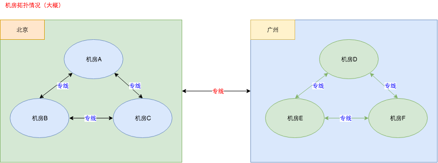
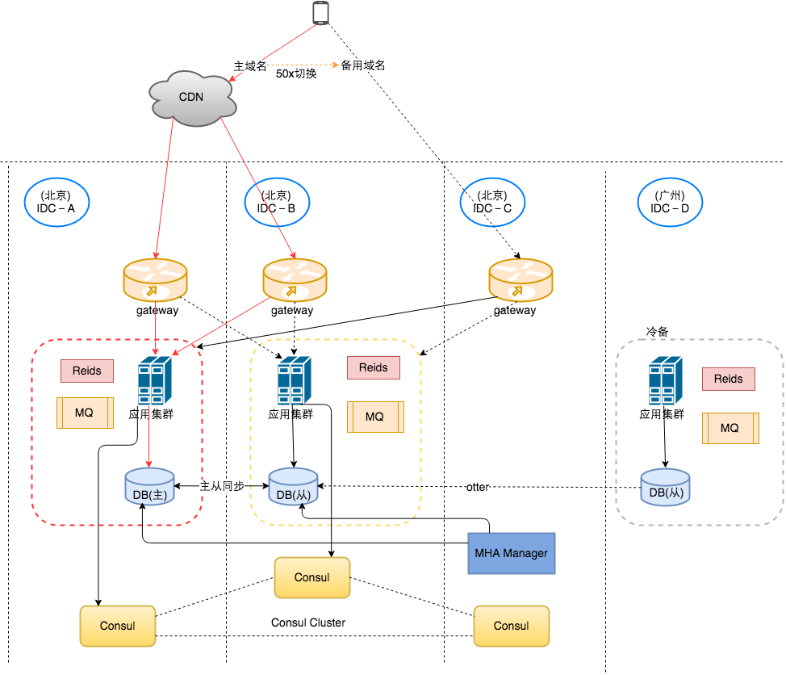

## 概述

+ 本文针对金融类(如用户虚拟货币)这类对数据准确性很敏感的业务的容灾架构；
+ 案例中的服务架构为同城主备架构；
+ 内容包括：容灾架构、故障切换、故障恢复、演练方案等；
+ 涉及技术点：MySQL、MHA、Consul等；
+ 本文基于
	1. [关于MHA-Consul-MySQL高可用方案的简单总结和思考](https://kingson4wu.gitee.io/2020/08/31/20200831-%E5%85%B3%E4%BA%8EMHA-Consul-MySQL%E9%AB%98%E5%8F%AF%E7%94%A8%E6%96%B9%E6%A1%88%E7%9A%84%E7%AE%80%E5%8D%95%E6%80%BB%E7%BB%93%E5%92%8C%E6%80%9D%E8%80%83/)
	2. [如何解决脑裂问题](https://kingson4wu.gitee.io/2020/09/05/20200905-%E5%A6%82%E4%BD%95%E8%A7%A3%E5%86%B3%E8%84%91%E8%A3%82%E9%97%AE%E9%A2%98/)
+ 由于某种原因，某些细节不会描述。

## 容灾架构

1. 红色线条为正常情况下的服务主链路；
2. 同城主备架构： 主－IDC-A；从－IDC-B;
3. dd
4. 域名灾备：前端通过主域名访问后端接口，当响应超时或者返回50x的时候，前端将切换到备用域名访问后端接口；
	- 异常情况可能是后端服务异常或者用户所在地区网络不稳定等原因；
	- 针对不幂等的接口，应设置成只切换域名不进行重试；
	- 后端服务可以根据自身服务的异常情况，返回50x，让前端切换到备用域名
5. 

     

---

+ 单元化
+ 跨机房为什么不用主从用otter

### 切换条件
1. 机房孤岛
2. 网络抖动
3. 机器异常等

具体实现：结合服务发现，以localproxy代替nginx

### Q&A

1. 备用机房正常情况下无流量？

