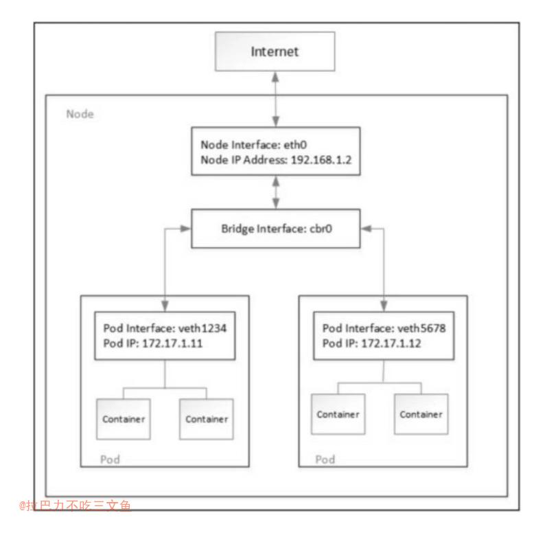
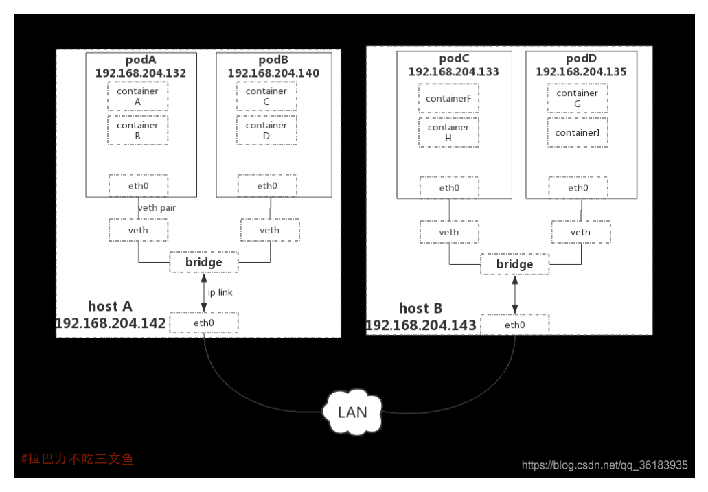

## 整体架构

+ 图来源：[k8s-整体概述和架构](https://www.cnblogs.com/wwchihiro/p/9261607.html)

## 关键名词
+ CNCF（Cloud Native Computing Foundation，云原生计算基金会）

##  关键总结
1. 自动化
2. Docker是其目前支持的底层容器技术之一
3. 服务弹性扩容机制应对突发流量
4. Kubernetes视为云计算时代的操作系统

## 核心组件

### Kubernetes API Server
+ Kubernetes API Server的核心功能是提供Kubernetes各类资源对象（如Pod、RC、Service等）的增、删、改、查及Watch等HTTP Rest接口，成为集群内各个功能模块之间数据交互和通信的中心枢纽，是整个系统的数据总线和数据中心。除此之外，它还有以下一些功能特性。
	1. 是集群管理的API入口。
	2. 是资源配额控制的入口。
	3. 提供了完备的集群安全机制。
+ 可以通过命令行工具kubectl来与Kubernetes API Server交互，它们之间的接口是RESTful API；另一种方式是通过编程方式调用Kubernetes API Server。
+ Kubernetes API Server本身也是一个Service，它的名称就是kubernetes，并且它的Cluster IP地址是Cluster IP地址池里的第1个地址。
+ 由于API Server是Kubernetes集群数据的唯一访问入口，因此安全性与高性能就成为API Server设计和实现的两大核心目标。通过采用HTTPS安全传输通道与CA签名数字证书强制双向认证的方式，API Server的安全性得以保障。此外，为了更细粒度地控制用户或应用对Kubernetes资源对象的访问权限，Kubernetes启用了RBAC访问控制策略。
+ API层：主要以REST方式提供各种API接口，除了有Kubernetes资源对象的CRUD和Watch等主要API，还有健康检查、UI、日志、性能指标等运维监控相关的API。
+ etcd数据库：用于持久化存储Kubernetes资源对象的KV数据库。
+ 借助etcd提供的Watch API接口，API Server可以监听（Watch）在etcd上发生的数据操作事件，比如Pod创建事件、更新事件、删除事件等，在这些事件发生后，etcd会及时通知API Server。
+ 为了让Kubernetes中的其他组件在不访问底层etcd数据库的情况下，也能及时获取资源对象的变化事件，API Server模仿etcd的Watch API接口提供了自己的Watch接口，这样一来，这些组件就能近乎实时地获取它们感兴趣的任意资源对象的相关事件通知了。
+ Kubernetes API Server最主要的REST接口是资源对象的增、删、改、查接口，除此之外，它还提供了一类很特殊的REST接口——Kubernetes Proxy API接口，这类接口的作用是代理REST请求，即Kubernetes API Server把收到的REST请求转发到某个Node上的kubelet守护进程的REST端口，由该kubelet进程负责响应。
+ Kubernetes Proxy API里关于Node的相关接口、关于Pod的相关接口
+ 在Kubernetes集群之外访问某个Pod容器的服务（HTTP服务）时，可以用Proxy API实现，这种场景多用于管理目的，比如逐一排查Service的Pod副本，检查哪些Pod的服务存在异常。Proxy API也有Service的Proxy接口，其接口定义与Pod的接口定义基本一样：/api/v1/proxy/namespaces/{namespace}/services/{name}。

### Controller Manager
+ Kubernetes集群中，每个Controller都是这样的一个“操作系统”，它们通过API Server提供的（List-Watch）接口实时监控集群中特定资源的状态变化，当发生各种故障导致某资源对象的状态发生变化时，Controller会尝试将其状态调整为期望的状态。
+ Controller Manager是Kubernetes中各种操作系统的管理者，是集群内部的管理控制中心，也是Kubernetes自动化功能的核心。

### kubelet
+ kubelet进程在启动时通过API Server注册自身的节点信息，并定时向API Server汇报状态信息，API Server在接收到这些信息后，会将这些信息更新到etcd中。在etcd中存储的节点信息包括节点健康状况、节点资源、节点名称、节点地址信息、操作系统版本、Docker版本、kubelet版本等。
+ 在Kubernetes集群中，在每个Node（又称Minion）上都会启动一个kubelet服务进程。该进程用于处理Master下发到本节点的任务，管理Pod及Pod中的容器。每个kubelet进程都会在API Server上注册节点自身的信息，定期向Master汇报节点资源的使用情况，并通过cAdvisor监控容器和节点资源。

### kube-proxy
+ 每个Node上的kube-proxy进程获取每个Service的Endpoints，实现了Service的负载均衡功能。
+ Service只是一个概念，而真正将Service的作用落实的是它背后的kube-proxy服务进程
+ 在Kubernetes集群的每个Node上都会运行一个kube-proxy服务进程，我们可以把这个进程看作Service的透明代理兼负载均衡器，其核心功能是将到某个Service的访问请求转发到后端的多个Pod实例上。
+ Service的Cluster IP与NodePort等概念是kube-proxy服务通过iptables的NAT转换实现的，kube-proxy在运行过程中动态创建与Service相关的iptables规则，这些规则实现了将访问服务（Cluster IP或NodePort）的请求负载分发到后端Pod的功能。由于iptables机制针对的是本地的kube-proxy端口，所以在每个Node上都要运行kube-proxy组件，这样一来，在Kubernetes集群内部，我们可以在任意Node上发起对Service的访问请求。综上所述，由于kube-proxy的作用，在Service的调用过程中客户端无须关心后端有几个Pod，中间过程的通信、负载均衡及故障恢复都是透明的。
+ kube-proxy进程转发Service流量方式
	1. userspace（用户空间代理）模式。（是一个真实的TCP/UDP代理，类似HA Proxy，负责从Service到Pod的访问流量的转发。当某个Pod以Cluster IP方式访问某个Service的时候，这个流量会被Pod所在本机的iptables转发到本机的kube-proxy进程，然后由kube-proxy建立起到后端Pod的TCP/UDP连接，随后将请求转发到某个后端Pod上，并在这个过程中实现负载均衡功能。）
	2. iptables模式。Kubernetes从1.2版本开始，将iptables作为kube-proxy的默认模式。iptables模式下的kube-proxy不再起到Proxy的作用，其核心功能：通过API Server的Watch接口实时跟踪Service与Endpoint的变更信息，并更新对应的iptables规则，Client的请求流量则通过iptables的NAT机制“直接路由”到目标Pod。根据Kubernetes的网络模型，一个Node上的Pod与其他Node上的Pod应该能够直接建立双向的TCP/IP通信通道，所以如果直接修改iptables规则，则也可以实现kube-proxy的功能，只不过后者更加高端，因为是全自动模式的。与第1代的userspace模式相比，iptables模式完全工作在内核态，不用再经过用户态的kube-proxy中转，因而性能更强。
	3. IPVS模式。iptables模式虽然实现起来简单，但存在无法避免的缺陷：在集群中的Service和Pod大量增加以后，iptables中的规则会急速膨胀，导致性能显著下降，在某些极端情况下甚至会出现规则丢失的情况，并且这种故障难以重现与排查，于是Kubernetes从1.8版本开始引入第3代的IPVS（IP Virtual Server）模式，如图5.16所示。IPVS在Kubernetes 1.11中升级为GA稳定版。
iptables与IPVS虽然都是基于Netfilter实现的，但因为定位不同，二者有着本质的差别：iptables是为防火墙而设计的；IPVS则专门用于高性能负载均衡，并使用更高效的数据结构（Hash表），允许几乎无限的规模扩张，因此被kube-proxy采纳为第三代模式。在IPVS模式下，kube-proxy又做了重要的升级，即使用iptables的扩展ipset，而不是直接调用iptables来生成规则链。ipset则引入了带索引的数据结构，因此当规则很多时，也可以很高效地查找和匹配。

### Scheduler
+ Kubernetes Scheduler在整个系统中承担了“承上启下”的重要功能，“承上”是指它负责接收Controller Manager创建的新Pod，为其安排一个落脚的“家”——目标Node；“启下”是指安置工作完成后，目标Node上的kubelet服务进程接管后继工作，负责Pod生命周期中的“下半生”。
+ 在整个调度过程中涉及三个对象，分别是待调度Pod列表、可用Node列表，以及调度算法和策略。

## 命令

### kubectl
1. 创建RC： `kubectl create -f mysql-rc.yaml`;  `kubectl get rc`
2. 创建Service：`kubectl create -f mysql-svc.yaml`; `kubectl get svc`
3. 查看在集群中有多少个Node：`kubectl get nodes`
4. 查看某个Node的详细信息：`kubectl describe node` 
5. 修改RC的副本数量，来实现Pod的动态缩放（Scaling）：`kubectl scale rc redis-slave --replicas=3`
6. 创建Deployment：`kubectl create -f tomcat-deployment.yaml`
7. 查看Deployment的信息： `kubectl get deployments`
8. 查看对应的Replica Set：  `kubectl get rs`
9. 查看创建的Pod：`kubectl get pods`
10. 查看Deployment的更新过程：`kubectl rollout status`
11. 检查Deployment部署的历史记录：`kubectl rollout history`

### Kubernetes
+ Kubernetes里的3种IP，这3种IP分别如下
	- Node IP：Node的IP地址。
	- Pod IP：Pod的IP地址。
	- Cluster IP：Service的IP地址。
+ node IP是Kubernetes集群中每个节点的物理网卡的IP地址，是一个真实存在的物理网络。，所有属于这个网络的服务器都能通过这个网络直接通信，不管其中是否有部分节点不属于这个Kubernetes集群。这也表明在Kubernetes集群之外的节点访问Kubernetes集群之内的某个节点或者TCP/IP服务时，都必须通过Node IP通信。（未打通Pod IP网络的情况下）
+ Pod IP是每个Pod的IP地址，它是Docker Engine根据docker0网桥的IP地址段进行分配的，通常是一个虚拟的二层网络。Kubernetes要求位于不同Node上的Pod都能够彼此直接通信，所以Kubernetes里一个Pod里的容器访问另外一个Pod里的容器时，就是通过Pod IP所在的虚拟二层网络进行通信的，而真实的TCP/IP流量是通过Node IP所在的物理网卡流出的。
+ Service的Cluster IP，它也是一种虚拟的IP，但更像一个“伪造”的IP网络，原因有以下几点。
	- Cluster IP仅仅作用于Kubernetes Service这个对象，并由Kubernetes管理和分配IP地址（来源于Cluster IP地址池）。
	- Cluster IP无法被Ping，因为没有一个“实体网络对象”来响应。
	- Cluster IP只能结合Service Port组成一个具体的通信端口，单独的Cluster IP不具备TCP/IP通信的基础，并且它们属于Kubernetes集群这样一个封闭的空间，集群外的节点如果要访问这个通信端口，则需要做一些额外的工作。
	- 在Kubernetes集群内，Node IP网、Pod IP网与Cluster IP网之间的通信，采用的是Kubernetes自己设计的一种编程方式的特殊路由规则，与我们熟知的IP路由有很大的不同。
	- Service的Cluster IP属于Kubernetes集群内部的地址，无法在集群外部直接使用这个地址。

### ConfigMap
+ 把所有的配置项都当作key-value字符串，当然value可以来自某个文本文件，比如配置项password=123456、user=root、host=192.168.8.4用于表示连接FTP服务器的配置参数。这些配置项可以作为Map表中的一个项，整个Map的数据可以被持久化存储在Kubernetes的Etcd数据库中，然后提供API以方便Kubernetes相关组件或客户应用CRUD操作这些数据，上述专门用来保存配置参数的Map就是Kubernetes ConfigMap资源对象。
+ Kubernetes提供了一种内建机制，将存储在etcd中的ConfigMap通过Volume映射的方式变成目标Pod内的配置文件，不管目标Pod被调度到哪台服务器上，都会完成自动映射。进一步地，如果ConfigMap中的key-value数据被修改，则映射到Pod中的“配置文件”也会随之自动更新。于是，Kubernetes ConfigMap就成了分布式系统中最为简单（使用方法简单，但背后实现比较复杂）且对应用无侵入的配置中心。
+ ConfigMap供容器使用的典型用法如下。
	1. 生成为容器内的环境变量。
	2. 设置容器启动命令的启动参数（需设置为环境变量）。
	3. 以Volume的形式挂载为容器内部的文件或目录。
+ 不使用YAML文件，直接通过kubectl create configmap也可以创建ConfigMap，可以使用参数--from-file或--from-literal指定内容，并且可以在一行命令中指定多个参数。
+ 容器应用对ConfigMap的使用有以下两种方法。
	1. 通过环境变量获取ConfigMap中的内容。
	2. 通过Volume挂载的方式将ConfigMap中的内容挂载为容器内部的文件或目录。
+ Kubernetes从1.6版本开始，引入了一个新的字段envFrom，实现了在Pod环境中将ConfigMap（也可用于Secret资源对象）中所有定义的key=value自动生成为环境变量。

### Master
+ 负责整个集群的管理和控制
+ 在Master上运行着以下关键进程
	- Kubernetes API Server（kube-apiserver）
	- Kubernetes Controller Manager（kube-controller-manager）
	- Kubernetes Scheduler（kube-scheduler）

### Node
+ Pod运行在一个被称为节点（Node）的环境中，这个节点既可以是物理机，也可以是私有云或者公有云中的一个虚拟机，通常在一个节点上运行几百个Pod。
+ Node除了Master，Kubernetes集群中的其他机器被称为Node。与Master一样，Node可以是一台物理主机，也可以是一台虚拟机。
+ 每个Node上都运行着以下关键进程
	- kubelet
	- kube-proxy
	- Docker Engine（docker）
+ Node可以在运行期间动态增加到Kubernetes集群中，在默认情况下kubelet会向Master注册自己，这也是Kubernetes推荐的Node管理方式。

### Pod
+ 由一组容器组成
+ 每个Pod都有一个特殊的被称为“根容器”的Pause容器
+ Kubernetes为每个Pod都分配了唯一的IP地址，称之为Pod IP，一个Pod里的多个容器共享Pod IP地址。
+ Kubernetes要求底层网络支持集群内任意两个Pod之间的TCP/IP直接通信，一个Pod里的容器与另外主机上的Pod容器能够直接通信。
+ Pod其实有两种类型：普通的Pod及静态Pod（Static Pod）。
+ Pod的IP加上这里的容器端口（containerPort），组成了一个新的概念——Endpoint，它代表此Pod里的一个服务进程的对外通信地址。（一个Pod也存在具有多个Endpoint的情况）
+ 在Kubernetes里，一个计算资源进行配额限定时需要设定以下两个参数。
	- Requests：该资源的最小申请量，系统必须满足要求。
	- Limits：该资源最大允许使用的量，不能被突破，当容器试图使用超过这个量的资源时，可能会被Kubernetes“杀掉”并重启。通常，我们会把Requests设置为一个较小的数值，符合容器平时的工作负载情况下的资源需求，而把Limit设置为峰值负载情况下资源占用的最大量。
+ Pod的管理对象，除了RC和Deployment，还包括ReplicaSet、DaemonSet、StatefulSet、Job等，分别用于不同的应用场景中。
+ Pod定义详解YAML格式的Pod定义文件的完整内容
+ 静态Pod是由kubelet进行管理的仅存在于特定Node上的Pod
	- 创建静态Pod有两种方式：配置文件方式和HTTP方式。
+ 在容器内获取Pod信息（Downward API）
	- Downward API有什么价值呢？
	- 在某些集群中，集群中的每个节点都需要将自身的标识（ID）及进程绑定的IP地址等信息事先写入配置文件中，进程在启动时会读取这些信息，然后将这些信息发布到某个类似服务注册中心的地方，以实现集群节点的自动发现功能。
+ Pod的重启策略（RestartPolicy）包括Always、OnFailure和Never，默认值为Always。
	- kubelet重启失效容器的时间间隔以sync-frequency乘以2n来计算，例如1、2、4、8倍等，最长延时5min，并且在成功重启后的10min后重置该时间。
	- Pod的重启策略与控制方式息息相关，当前可用于管理Pod的控制器包括ReplicationController、Job、DaemonSet及直接通过kubelet管理（静态Pod）。每种控制器对Pod的重启策略要求如下。◎ RC和DaemonSet：必须设置为Always，需要保证该容器持续运行。◎ Job：OnFailure或Never，确保容器执行完成后不再重启。◎ kubelet：在Pod失效时自动重启它，不论将RestartPolicy设置为什么值，也不会对Pod进行健康检查。
+ Pod健康检查和服务可用性检查
	- Kubernetes对Pod的健康状态可以通过两类探针来检查： LivenessProbe和ReadinessProbe，kubelet定期执行这两类探针来诊断容器的健康状况。
	- LivenessProbe探针：用于判断容器是否存活（Running状态）；ReadinessProbe探针：用于判断容器服务是否可用（Ready状态）
	- LivenessProbe和ReadinessProbe均可配置以下三种实现方式。
		1. ExecAction：在容器内部执行一个命令，如果该命令的返回码为0，则表明容器健康。
		2. TCPSocketAction：通过容器的IP地址和端口号执行TCP检查，如果能够建立TCP连接，则表明容器健康。
		3. HTTPGetAction：通过容器的IP地址、端口号及路径调用HTTP Get方法，如果响应的状态码大于等于200且小于400，则认为容器健康。
	- Kubernetes的ReadinessProbe机制可能无法满足某些复杂应用对容器内服务可用状态的判断，所以Kubernetes从1.11版本开始，引入Pod Ready++特性对Readiness探测机制进行扩展，在1.14版本时达到GA稳定版，称其为Pod Readiness Gates。通过Pod Readiness Gates机制，用户可以将自定义的ReadinessProbe探测方式设置在Pod上，辅助Kubernetes设置Pod何时达到服务可用状态（Ready）。
+ init container（初始化容器）与应用容器在本质上是一样的，但它们是仅运行一次就结束的任务，并且必须在成功执行完成后，系统才能继续执行下一个容器

#### Pod的核心：pause容器

+ Kubernetes的Pod抽象基于Linux的namespace和cgroups，为容器提供了隔离的环境。从网络的角度看，同一个Pod中的不同容器犹如运行在同一个主机上，可以通过localhost进行通信。
+ Docker容器非常适合部署单个软件单元。但是当你想要一起运行多个软件时，尤其是在一个容器里管理多个进程时，这种模式会变得有点麻烦。Kubernetes非常不建议“富容器”这种方式，认为将这些应用程序部署在部分隔离并且部分共享资源的容器组中更为有用。为此，Kubernetes为这种使用场景提供了一个称为Pod的抽象。
+ 原则上，任何人都可以配置Docker来控制容器组之间的共享级别——只需创建一个父容器，并创建与父容器共享资源的新容器，然后管理这些容器的生命周期。在Kubernetes中，pause容器被当作Pod中所有容器的“父容器”，并为每个业务容器提供以下功能：·在Pod中，它作为共享Linux namespace（Network、UTS等）的基础；·启用PID namespace共享，它为每个Pod提供1号进程，并收集Pod内的僵尸进程。
+ 这个pause容器运行一个非常简单的进程，它不执行任何功能，一启动就永远把自己阻塞住了（见pause（）系统调用）。正如你看到的，它当然不会只知道“睡觉”。它执行另一个重要的功能——即它扮演PID 1的角色，并在子进程成为“孤儿进程”的时候，通过调用wait（）收割这些僵尸子进程。这样就不用担心我们的Pod的PID namespace里会堆满僵尸进程了。这也是为什么Kubernetes不随便找个容器（例如Nginx）作为父容器，让用户容器加入的原因。

### Pod的调度
+ 在Kubernetes平台上，我们很少会直接创建一个Pod，在大多数情况下会通过RC、Deployment、DaemonSet、Job等控制器完成对一组Pod副本的创建、调度及全生命周期的自动控制任务。
+ RC也出现了新的继任者——Deployment，用于更加自动地完成Pod副本的部署、版本更新、回滚等功能。RC的继任者其实并不是Deployment，而是ReplicaSet，因为ReplicaSet进一步增强了RC标签选择器的灵活性。
+ 与RC不同，ReplicaSet被设计成能控制多个不同标签的Pod副本。一种常见的应用场景是，应用MyApp目前发布了v1与v2两个版本，用户希望MyApp的Pod副本数保持为3个，可以同时包含v1和v2版本的Pod，就可以用ReplicaSet来实现这种控制
+ Kubernetes的滚动升级就是巧妙运用ReplicaSet的这个特性来实现的，同时，Deployment也是通过ReplicaSet来实现Pod副本自动控制功能的。我们不应该直接使用底层的ReplicaSet来控制Pod副本，而应该使用管理ReplicaSet的Deployment对象来控制副本，这是来自官方的建议。
+ 在真实的生产环境中的确也存在一种需求：希望某种Pod的副本全部在指定的一个或者一些节点上运行，比如希望将MySQL数据库调度到一个具有SSD磁盘的目标节点上，此时Pod模板中的NodeSelector属性就开始发挥作用了。
+ 如果NodeSelector选择的Label不存在或者不符合条件，比如这些目标节点此时宕机或者资源不足，该怎么办？如果要选择多种合适的目标节点，比如SSD磁盘的节点或者超高速硬盘的节点，该怎么办？Kubernates引入了NodeAffinity（节点亲和性设置）来解决该需求。
+ 与单独的Pod实例不同，由RC、ReplicaSet、Deployment、DaemonSet等控制器创建的Pod副本实例都是归属于这些控制器的，这就产生了一个问题：控制器被删除后，归属于控制器的Pod副本该何去何从？在Kubernates 1.9之前，在RC等对象被删除后，它们所创建的Pod副本都不会被删除；在Kubernates 1.9以后，这些Pod副本会被一并删除。如果不希望这样做，则可以通过kubectl命令的--cascade=false参数来取消这一默认特性。
+ Deployment或RC：全自动调度：Deployment或RC的主要功能之一就是自动部署一个容器应用的多份副本，以及持续监控副本的数量，在集群内始终维持用户指定的副本数量。
+ 除了使用系统自动调度算法完成一组Pod的部署，Kubernetes也提供了多种丰富的调度策略，用户只需在Pod的定义中使用NodeSelector、NodeAffinity、PodAffinity、Pod驱逐等更加细粒度的调度策略设置，就能完成对Pod的精准调度。
+ 亲和性调度功能包括节点亲和性（NodeAffinity）和Pod亲和性（PodAffinity）两个维度的设置。NodeAffinity意为Node亲和性的调度策略，是用于替换NodeSelector的全新调度策略。亲和性的操作符也包括In、NotIn、Exists、DoesNotExist、Gt、Lt。

### Pod的扩缩容
+ Kubernetes对Pod的扩缩容操作提供了手动和自动两种模式，手动模式通过执行kubectl scale命令或通过RESTful API对一个Deployment/RC进行Pod副本数量的设置，即可一键完成。自动模式则需要用户根据某个性能指标或者自定义业务指标，并指定Pod副本数量的范围，系统将自动在这个范围内根据性能指标的变化进行调整。
+ 自动扩缩容机制：HPA控制器基于Master的kube-controller-manager服务启动参数--horizontal-pod-autoscaler-sync-period定义的探测周期（默认值为15s），周期性地监测目标Pod的资源性能指标，并与HPA资源对象中的扩缩容条件进行对比，在满足条件时对Pod副本数量进行调整。
+ Kubernetes从1.11版本开始，弃用基于Heapster组件完成Pod的CPU使用率采集的机制，全面转向基于Metrics Server完成数据采集。从1.10版本开始，Kubernetes引入了对外部系统指标的支持。

### Label
+ 一个Label是一个key=value的键值对，其中key与value由用户自己指定。Label可以被附加到各种资源对象上，例如Node、Pod、Service、RC等，一个资源对象可以定义任意数量的Label，同一个Label也可以被添加到任意数量的资源对象上。Label通常在资源对象定义时确定，也可以在对象创建后动态添加或者删除。
+ 过Label Selector（标签选择器）查询和筛选拥有某些Label的资源对象
+ 有两种Label Selector表达式：基于等式的（Equality-based）和基于集合的（Set-based）
+ 使用Label可以给对象创建多组标签，Label和Label Selector共同构成了Kubernetes系统中核心的应用模型，使得被管理对象能够被精细地分组管理，同时实现了整个集群的高可用性。

### Annotation
+  Annotation（注解）与Label类似，也使用key/value键值对的形式进行定义。不同的是Label具有严格的命名规则，它定义的是Kubernetes对象的元数据（Metadata），并且用于Label Selector。Annotation则是用户任意定义的附加信息，以便于外部工具查找。在很多时候，Kubernetes的模块自身会通过Annotation标记资源对象的一些特殊信息。通常来说，用Annotation来记录的信息如下。◎ build信息、release信息、Docker镜像信息等，例如时间戳、release id号、PR号、镜像Hash值、Docker Registry地址等。◎ 日志库、监控库、分析库等资源库的地址信息。◎ 程序调试工具信息，例如工具名称、版本号等。◎ 团队的联系信息，例如电话号码、负责人名称、网址等。

### Service
+ Service是分布式集群架构的核心，一个Service对象拥有如下关键特征。
+ 拥有一个虚拟IP（Cluster IP、Service IP或VIP）和端口号。
+ 通过Label关联Pod和Service。
+ 并不是每个Pod和它里面运行的容器都能被映射到一个Service上，只有提供服务（无论是对内还是对外）的那组Pod才会被映射为一个服务。
+ 通常，Cluster IP是在Service创建后由Kubernetes系统自动分配的，其他Pod无法预先知道某个Service的Cluster IP地址，因此需要一个服务发现机制来找到这个服务。
+ Kubernetes的Service定义了一个服务的访问入口地址，前端的应用（Pod）通过这个入口地址访问其背后的一组由Pod副本组成的集群实例，Service与其后端Pod副本集群之间则是通过Label Selector来实现无缝对接的。RC的作用实际上是保证Service的服务能力和服务质量始终符合预期标准。
+ 运行在每个Node上的kube-proxy进程其实就是一个智能的软件负载均衡器，负责把对Service的请求转发到后端的某个Pod实例上，并在内部实现服务的负载均衡与会话保持机制。
+ Service没有共用一个负载均衡器的IP地址，每个Service都被分配了一个全局唯一的虚拟IP地址，这个虚拟IP被称为Cluster IP。这样一来，每个服务就变成了具备唯一IP地址的通信节点，服务调用就变成了最基础的TCP网络通信问题。
+ Pod的Endpoint地址会随着Pod的销毁和重新创建而发生改变，因为新Pod的IP地址与之前旧Pod的不同。而Service一旦被创建，Kubernetes就会自动为它分配一个可用的Cluster IP，而且在Service的整个生命周期内，它的Cluster IP不会发生改变。
+ Kubernetes提供了Headless Service，即不为Service设置ClusterIP（入口IP地址），仅通过Label Selector将后端的Pod列表返回给调用的客户端。
+ Service只是一个概念，而真正将Service的作用落实的是它背后的kube-proxy服务进程

#### 服务发现
+ 每个Kubernetes中的Service都有唯一的Cluster IP及唯一的名称。
+ 如何通过Service的名称找到对应的Cluster IP。Kubernetes通过Add-On增值包引入了DNS系统，把服务名作为DNS域名，这样程序就可以直接使用服务名来建立通信连接了。目前，Kubernetes上的大部分应用都已经采用了DNS这种新兴的服务发现机制。
+ Service具有稳定的IP地址（区别于容器不固定的IP地址）和端口，并会在一组匹配的后端Pod之间提供负载均衡，匹配的条件就是Service的Label Selector与Pod的Labels相匹配。
+ Kubernetes的Service代表的是Kubernetes后端服务的入口，它主要包含服务的访问IP（虚IP）和端口，因此工作在L4。既然Service只存储服务入口信息，那如何关联后端Pod呢？前文已经提到Service通过Label Selector选择与之匹配的Pod。那么被Service选中的Pod，当它们运行且能对外提供服务后，Kubernetes的Endpoints Controller会生成一个新的Endpoints对象，记录Pod的IP和端口，这就解决了前文提到的后端实例健康检查问题。
+ Kubernetes会从集群的可用服务IP池中为每个新创建的服务分配一个稳定的集群内访问IP地址，称为Cluster IP。Kubernetes还会通过添加DNS条目为Cluster IP分配主机名。Cluster IP和主机名在集群内是独一无二的，并且在服务的整个生命周期内不会更改。只有将服务从集群中删除，Kubernetes才会释放Cluster IP和主机名。用户可以使用服务的Cluster IP或主机名访问正常运行的Pod。
+ Kubernetes使用Kube-proxy组件管理各服务与之后端Pod的连接，该组件在每个节点上运行。
+ Kube-proxy是一个基于出站流量的负载平衡控制器，它监控Kubernetes API Service并持续将服务IP（包括Cluster IP等）映射到运行状况良好的Pod，落实到主机上就是iptables/IPVS等路由规则。访问服务的IP会被这些路由规则直接DNAT到Pod IP，然后走底层容器网络送到对应的Pod。
+ 服务分配的Cluster IP是一个虚拟IP，刚接触Kubernetes Service的人经常犯的错误是试图ping这个IP，然后发现它没有任何响应。实际上，这个虚拟IP只有和它的port一起使用才有作用，直接访问该IP或者想访问该IP的其他端口都是徒劳。
+ Kubernetes Service能够支持TCP、UDP和SCTP三种协议，默认是TCP协议。
+ 当Service的后端Pod准备就绪后，Kubernetes会生成一个新的Endpoints对象，而且这个Endpoints对象和Service同名。
+ Service的三个port先来看一个最简单的Service定义：Service的几个port的概念很容易混淆，它们分别是port、targetPort和NodePort。port表示Service暴露的服务端口，也是客户端访问用的端口，例如Cluster IP:port是提供给集群内部客户访问Service的入口。需要注意的是，port不仅是Cluster IP上暴露的端口，还可以是external IP和Load Balancer IP。Service的port并不监听在节点IP上，即无法通过节点IP:port的方式访问Service。NodePort是Kubernetes提供给集群外部访问Service入口的一种方式（另一种方式是Load Balancer），所以可以通过Node IP:nodePort的方式提供集群外访问Service的入口。需要注意的是，我们这里说的集群外指的是Pod网段外，例如Kubernetes节点或因特网。targetPort很好理解，它是应用程序实际监听Pod内流量的端口，从port和NodePort上到来的数据，最终经过Kube-proxy流入后端Pod的targetPort进入容器。在配置服务时，可以选择定义port和targetPort的值重新映射其监听端口，这也被称为Service的端口重映射。Kube-proxy通过在节点上iptables规则管理此端口的重新映射过程。
+ Kubernetes Service有几种类型：Cluster IP、Load Balancer和NodePort。
+ 其中，Cluster IP是默认类型，自动分配集群内部可以访问的虚IP——Cluster IP。
+ Cluster IP的主要作用是方便集群内Pod到Pod之间的调用。
+ Cluster IP主要在每个node节点使用iptables，将发向Cluster IP对应端口的数据转发到后端Pod中
+ NodePort的实现机制是Kube-proxy会创建一个iptables规则，所有访问本地NodePort的网络包都会被直接转发至后端Port。
+ NodePort的问题集中体现在性能和可对宿主机端口占用方面。一旦服务多起来，NodePort在每个节点上开启的端口会变得非常庞大且难以维护
+ 最早的时候，Kubernetes采用了Docker曾经使用过的方法——环境变量。Kubelet创建每个Pod时，会把系统当前所有服务的IP和端口信息都通过环境变量的方式注入容器。这样Pod中的应用可以通过读取环境变量获取所需服务的地址信息。
+ 但这种方式的缺点也很明显：·容易环境变量洪泛，Docker启动参数过长会影响性能，甚至直接导致容器启动失败；·Pod想要访问的任何Service必须在Pod自己被创建之前创建，否则这些环境变量就不会被注入。更理想的方案是，应用能够直接使用服务的名字，不需要关心它实际的IP地址，中间的转换能够自动完成。名字和IP之间的转换即DNS，DNS的方式并没有以上两个限制。在Kubernetes中使用域名服务，即假设Service（my-svc）在namespace（my-ns）中，暴露名为http的TCP端口，那么在Kubernetes的DNS服务器中会生成两种记录，分别是A记录：域名（my-svc.my-ns）到Cluster IP的映射和SRV记录。
+ 所谓的无头（headless）Service即没有selector的Service。Servcie抽象了该如何访问Kubernetes Pod，也能够抽象其他类型的backend

#### Kubernetes Service的工作原理
+ 主要涉及的Kubernetes组件有Controller Manager（包括Service Controller和Endpoints Controller）和Kube-proxy
+ IPVS是LVS的负载均衡模块，亦基于netfilter，但比iptables性能更高，具备更好的可扩展性。
+ IPVS支持三种负载均衡模式：Direct Routing（简称DR）、Tunneling（也称ipip模式）和NAT（也称Masq模式）。
+ Kube-proxy实现的是分布式负载均衡，而非集中式负载均衡。何谓分布式负载均衡器呢？就是每个节点都充当一个负载均衡器，每个节点上都会被配置一模一样的转发规则。上文提到，受制于iptables的实现，iptables模式的转发策略底层实现其实就是随机法，即将请求随机地分配到各个后端Pod（可能在不同节点上）。由概率统计理论得知，随着客户端调用服务端次数的增加，其实际效果越来越接近评价分配，也就是轮询（rr）的结果。缺点也比较明显，就是没有考虑机器的性能问题。根据木桶原理，Service的性能瓶颈会受性能最差的节点影响。那么，支持多种Load Balancer算法的IPVS模式呢？例如，lc（最小连接数）策略能否奏效？受制于Kube-proxy的分布式负载均衡架构，恐怕很难。同一个后端Pod可能有不同的Kube-proxy把请求转发给它，因此任何一个Kube-proxy都无法准确估计其后端Pod的连接数，故最小连接数这种转发策略无法派上用场。不过，可以尝试IPVS模式的sed（最短时延）转发策略。

#### Ingress
+ Ingress Controller将Ingress入口地址和后端Pod地址的映射关系（规则）实时刷新到Load Balancer的配置文件中，再让负载均衡器重载（reload）该规则，便可实现服务的负载均衡和自动发现。
+ Kubernetes为什么要发明Ingress这个概念呢？笔者认为，其中一个重要的原因便是服务动态发现和负载均衡。在微服务的开发模式下，外部网络要通过域名、UR路径、负载均衡等转发到后端私有网络中，微服务之所以称为微，是因为它是动态变化的，它会经常被增加、删除或更新。传统的反向代理对服务动态变化的支持不是很方便，也就是服务变更后，不是很容易马上改变配置和热加载。Nginx Ingress Controller的出现就是为了解决这个问题，它可以时刻监听服务注册或服务编排API，随时感知后端服务变化，自动重新更改配置并重新热加载，期间服务不会暂停或停止，这对用户来说是无感知的。
+ 因为微服务架构及Kubernetes等编排工具最近几年才开始逐渐流行，所以一开始的反向代理服务器（例如Nginx和HA Proxy）并未提供对微服务的支持，才会出现Nginx Ingress Controller这种中间层做Kubernetes和负载均衡器（例如Nginx）之间的适配器（adapter）。Nginx Ingress Controller的存在就是为了与Kubernetes交互，同时刷新Nginx配置，还能重载Nginx。而号称云原生边界路由的Traefik设计得更彻底，首先它是个反向代理，其次原生提供了对Kubernetes的支持，也就是说，Traefik本身就能跟Kubernetes打交道，感知Kubernetes集群服务的更新。Traefik是原生支持Kubernetes Ingress的，因此用户在使用Traefik时无须再开发一套Nginx Ingress Controller，受到了广大运维人员的好评。相比Nginx和HA Proxy这类老古董，Traefik设计思想比较先进，有点“Envoy+Istio”降维打击Nginx的意思。

### RC（Replication Controller）
+ 为需要扩容的Service关联的Pod创建一个RC（定义Pod副本数量，Label等）
+ RC是Kubernetes系统中的核心概念之一，简单来说，它其实定义了一个期望的场景，即声明某种Pod的副本数量在任意时刻都符合某个预期值。
+ RC的定义包括如下几个部分。
	- Pod期待的副本数量。
	- 用于筛选目标Pod的Label Selector。
	- 当Pod的副本数量小于预期数量时，用于创建新Pod的Pod模板（template）。
+ 定义了一个RC并将其提交到Kubernetes集群中后，Master上的Controller Manager组件就得到通知，定期巡检系统中当前存活的目标Pod，并确保目标Pod实例的数量刚好等于此RC的期望值。
+ 最佳的系统升级方式是旧版本的Pod每停止一个，就同时创建一个新版本的Pod，在整个升级过程中此消彼长，而运行中的Pod数量始终是10个，几分钟以后，当所有的Pod都已经是新版本时，系统升级完成。通过RC机制，Kubernetes很容易就实现了这种高级实用的特性，被称为“滚动升级”（Rolling Update）
+ 总结一下Replication Controller的职责，如下所述。
	1. 确保在当前集群中有且仅有N个Pod实例，N是在RC中定义的Pod副本数量。
	2. 通过调整RC的spec.replicas属性值来实现系统扩容或者缩容。
	3. 通过改变RC中的Pod模板（主要是镜像版本）来实现系统的滚动升级。

#### Replica Set
+ Replication Controller由于与Kubernetes代码中的模块Replication Controller同名，同时“Replication Controller”无法准确表达它的本意，所以在Kubernetes 1.2中，升级为另外一个新概念——Replica Set，官方解释其为“下一代的RC”。Replica Set与RC当前的唯一区别是，Replica Sets支持基于集合的Label selector（Set-based selector），而RC只支持基于等式的Label Selector（equality-based selector），这使得Replica Set的功能更强。
+ kubectl命令行工具适用于RC的绝大部分命令同样适用于Replica Set。此外，我们当前很少单独使用Replica Set，它主要被Deployment这个更高层的资源对象所使用，从而形成一整套Pod创建、删除、更新的编排机制。我们在使用Deployment时，无须关心它是如何创建和维护Replica Set的，这一切都是自动发生的。
+ Replica Set与Deployment这两个重要的资源对象逐步替代了之前RC的作用，是Kubernetes 1.3里Pod自动扩容（伸缩）这个告警功能实现的基础

+ 总结一下RC（Replica Set）的一些特性与作用。
	- 在大多数情况下，我们通过定义一个RC实现Pod的创建及副本数量的自动控制。
	- 在RC里包括完整的Pod定义模板。
	- RC通过Label Selector机制实现对Pod副本的自动控制。
	- 通过改变RC里的Pod副本数量，可以实现Pod的扩容或缩容。
	- 通过改变RC里Pod模板中的镜像版本，可以实现Pod的滚动升级。

### Deployment
+ Deployment是Kubernetes在1.2版本中引入的新概念，用于更好地解决Pod的编排问题。为此，Deployment在内部使用了Replica Set来实现目的，无论从Deployment的作用与目的、YAML定义，还是从它的具体命令行操作来看，我们都可以把它看作RC的一次升级，两者的相似度超过90%。Deployment相对于RC的一个最大升级是我们可以随时知道当前Pod“部署”的进度。
+ Deployment的典型使用场景有以下几个。
	- 创建一个Deployment对象来生成对应的Replica Set并完成Pod副本的创建。
	- 检查Deployment的状态来看部署动作是否完成（Pod副本数量是否达到预期的值）。
	- 更新Deployment以创建新的Pod（比如镜像升级）。
	- 如果当前Deployment不稳定，则回滚到一个早先的Deployment版本。
	- 暂停Deployment以便于一次性修改多个PodTemplateSpec的配置项，之后再恢复Deployment，进行新的发布。
	- 扩展Deployment以应对高负载。
	- 查看Deployment的状态，以此作为发布是否成功的指标。
	- 清理不再需要的旧版本ReplicaSets。除了API声明与Kind类型等有所区别，Deployment的定义与Replica Set的定义很类似。
+ Pod的升级和回滚：如果Pod是通过Deployment创建的，则用户可以在运行时修改Deployment的Pod定义（spec.template）或镜像名称，并应用到Deployment对象上，系统即可完成Deployment的自动更新操作。如果在更新过程中发生了错误，则还可以通过回滚操作恢复Pod的版本。
	- 通过kubectl set image命令为Deployment设置新的镜像名称
	- 使用kubectl rollout status命令查看Deployment的更新过程
	- 用kubectl rollout history命令检查这个Deployment部署的历史记录
	- 撤销本次发布并回滚到上一个部署版本：  kubectl rollout undo deployment/nginx-deployment
	- 使用--to-revision参数指定回滚到的部署版本号：kubectl rollout undo deployment/nginx-deployment --to-revision=2
	- 运行kubectl rolling-update命令完成Pod的滚动升级
	- 如果在更新过程中发现配置有误，则用户可以中断更新操作，并通过执行kubectl rolling- update --rollback完成Pod版本的回滚

### RC、Deployment、ReplicaSet
+ 

### StatefulSet
+ StatefulSet从本质上来说，可以看作Deployment/RC的一个特殊变种，它有如下特性。	
	- StatefulSet里的每个Pod都有稳定、唯一的网络标识，可以用来发现集群内的其他成员。假设StatefulSet的名称为kafka，那么第1个Pod叫kafka-0，第2个叫kafka-1，以此类推。
	- StatefulSet控制的Pod副本的启停顺序是受控的，操作第n个Pod时，前n-1个Pod已经是运行且准备好的状态。
	- StatefulSet里的Pod采用稳定的持久化存储卷，通过PV或PVC来实现，删除Pod时默认不会删除与StatefulSet相关的存储卷（为了保证数据的安全）。
+ StatefulSet除了要与PV卷捆绑使用以存储Pod的状态数据，还要与Headless Service配合使用，即在每个StatefulSet定义中都要声明它属于哪个Headless Service。Headless Service与普通Service的关键区别在于，它没有Cluster IP，如果解析Headless Service的DNS域名，则返回的是该Service对应的全部Pod的Endpoint列表。
+ StatefulSet的更新策略Kubernetes从1.6版本开始，针对StatefulSet的更新策略逐渐向Deployment和DaemonSet的更新策略看齐，也将实现RollingUpdate、Paritioned和OnDelete这几种策略，以保证StatefulSet中各Pod有序地、逐个地更新，并且能够保留更新历史，也能回滚到某个历史版本。
+ 使用StatefulSet搭建MongoDB集群
  + 在创建StatefulSet之前，需要确保在Kubernetes集群中管理员已经创建好共享存储，并能够与StorageClass对接，以实现动态存储供应的模式。
  + 创建StatefulSet为了完成MongoDB集群的搭建，需要创建如下三个资源对象。
    - 一个StorageClass，用于StatefulSet自动为各个应用Pod申请PVC。
    - 一个Headless Service，用于维护MongoDB集群的状态。
    - 一个StatefulSet。
  + MongoDB集群的扩容：假设在系统运行过程中，3个mongo实例不足以满足业务的要求，这时就需要对mongo集群进行扩容。仅需要通过对StatefulSet进行scale操作，就能实现在mongo集群中自动添加新的mongo节点。使用kubectl scale命令将StatefulSet设置为4个实例：        # kubectl scale --replicas=4 statefulset mongo，同时，系统也为mongo-3分配了一个新的PVC用于保存数据
  + 自动故障恢复（MongoDB集群的高可用）：Kubernetes使用StatefulSet来搭建有状态的应用集群（MongoDB、MySQL等），同部署无状态的应用一样简便。Kubernetes能够保证StatefulSet中各应用实例在创建和运行的过程中，都具有固定的身份标识和独立的后端存储；还支持在运行时对集群规模进行扩容、保障集群的高可用等非常重要的功能。

### HPA
+ Horizontal Pod Autoscaling（Pod横向自动扩容，HPA）。HPA与之前的RC、Deployment一样，也属于一种Kubernetes资源对象。。
+ HPA有以下两种方式作为Pod负载的度量指标。
	- CPUUtilizationPercentage。
	- 应用程序自定义的度量指标，比如服务在每秒内的相应请求数（TPS或QPS）。 

### Job
+ Job所控制的Pod副本是短暂运行的，可以将其视为一组Docker容器，其中的每个Docker容器都仅仅运行一次。当Job控制的所有Pod副本都运行结束时，对应的Job也就结束了。Job在实现方式上与RC等副本控制器不同，Job生成的Pod副本是不能自动重启的，对应Pod副本的RestartPoliy都被设置为Never。因此，当对应的Pod副本都执行完成时，相应的Job也就完成了控制使命，即Job生成的Pod在Kubernetes中是短暂存在的。Kubernetes在1.5版本之后又提供了类似crontab的定时任务——CronJob，解决了某些批处理任务需要定时反复执行的问题。
+ Job所控制的Pod副本的工作模式能够多实例并行计算，以TensorFlow框架为例，可以将一个机器学习的计算任务分布到10台机器上，在每台机器上都运行一个worker执行计算任务，这很适合通过Job生成10个Pod副本同时启动运算。

### DaemonSet
+ 在每个Node上调度并且仅仅创建一个Pod副本。这种调度通常用于系统监控相关的Pod，比如主机上的日志采集、主机性能采集等进程需要被部署到集群中的每个节点，并且只能部署一个副本，这就是DaemonSet这种特殊Pod副本控制器所解决的问题。
+ 这种用法适合有这种需求的应用。◎ 在每个Node上都运行一个GlusterFS存储或者Ceph存储的Daemon进程。◎ 在每个Node上都运行一个日志采集程序，例如Fluentd或者Logstach。◎ 在每个Node上都运行一个性能监控程序，采集该Node的运行性能数据，例如Prometheus Node Exporter、collectd、New Relic agent或者Ganglia gmond等。
+ 目前DaemonSet的升级策略包括两种：OnDelete和RollingUpdate。

### Volume
+ Volume（存储卷）是Pod中能够被多个容器访问的共享目录。Kubernetes的Volume概念、用途和目的与Docker的Volume比较类似，但两者不能等价。首先，Kubernetes中的Volume被定义在Pod上，然后被一个Pod里的多个容器挂载到具体的文件目录下；其次，Kubernetes中的Volume与Pod的生命周期相同，但与容器的生命周期不相关，当容器终止或者重启时，Volume中的数据也不会丢失。最后，Kubernetes支持多种类型的Volume，例如GlusterFS、Ceph等先进的分布式文件系统。
+ Volume的使用也比较简单，在大多数情况下，我们先在Pod上声明一个Volume，然后在容器里引用该Volume并挂载（Mount）到容器里的某个目录上。
+ Kubernetes的Volume还扩展出了一种非常有实用价值的功能，即容器配置文件集中化定义与管理，这是通过ConfigMap这种新的资源对象来实现的。
+ Volume是被定义在Pod上的，属于计算资源的一部分，而实际上，网络存储是相对独立于计算资源而存在的一种实体资源。
+ 同一个Pod中的多个容器能够共享Pod级别的存储卷Volume。
+ PV可以被理解成Kubernetes集群中的某个网络存储对应的一块存储，它与Volume类似，但有以下区别。
	- PV只能是网络存储，不属于任何Node，但可以在每个Node上访问。
	- PV并不是被定义在Pod上的，而是独立于Pod之外定义的。
	- PV目前支持的类型包括：gcePersistentDis。

### PV、PVC、StorageClass
+ [k8s之PV、PVC、StorageClass详解](https://cloud.tencent.com/developer/article/1755618)
+ PV是对底层网络共享存储的抽象，将共享存储定义为一种“资源”，比如Node也是容器应用可以消费的资源。PV由管理员创建和配置，与共享存储的具体实现直接相关。
+ PVC则是用户对存储资源的一个“申请”，就像Pod消费Node资源一样，PVC能够消费PV资源。PVC可以申请特定的存储空间和访问模式。（PVC 的全称是：PersistentVolumeClaim（持久化卷声明），PVC 是用户存储的一种声明）
+ StorageClass，用于标记存储资源的特性和性能，管理员可以将存储资源定义为某种类别，正如存储设备对于自身的配置描述（Profile）。根据StorageClass的描述可以直观的得知各种存储资源的特性，就可以根据应用对存储资源的需求去申请存储资源了。存储卷可以按需创建。
+ 数据的容灾由具体安装部署的服务自行实现，k8s只负责资源的分配。

### Namespace
+ Namespace在很多情况下用于实现多租户的资源隔离。Namespace通过将集群内部的资源对象“分配”到不同的Namespace中，形成逻辑上分组的不同项目、小组或用户组，便于不同的分组在共享使用整个集群的资源的同时还能被分别管理。
+ Kubernetes集群在启动后会创建一个名为default的Namespace，通过kubectl可以查看： `kubectl get namespaces`
+ 如果不特别指明Namespace，则用户创建的Pod、RC、Service都将被系统创建到这个默认的名为default的Namespace中。
+ 一旦创建了Namespace，我们在创建资源对象时就可以指定这个资源对象属于哪个Namespace。
+ 当给每个租户创建一个Namespace来实现多租户的资源隔离时，还能结合Kubernetes的资源配额管理，限定不同租户能占用的资源，例如CPU使用量、内存使用量等

### CRI
+ CRI（容器运行时接口）详解
+ 归根结底，Kubernetes Node（kubelet）的主要功能就是启动和停止容器的组件，我们称之为容器运行时（Container Runtime），其中最知名的就是Docker了。为了更具扩展性，Kubernetes从1.5版本开始就加入了容器运行时插件API，即Container Runtime Interface，简称CRI。
+ kubelet使用gRPC框架通过UNIX Socket与容器运行时（或CRI代理）进行通信
+ Protocol Buffers API包含两个gRPC服务：ImageService和RuntimeService。
+ kubelet的职责在于通过RPC管理容器的生命周期，实现容器生命周期的钩子，存活和健康监测，以及执行Pod的重启策略等。
+ 要尝试新的Kubelet-CRI-Docker集成，只需为kubelet启动参数加上--enable-cri=true开关来启动CRI。这个选项从Kubernetes 1.6开始已经作为kubelet的默认选项了

#### CRI介绍
+ [从零开始入门 K8s：理解容器运行时接口 CRI](https://www.infoq.cn/article/EAH8zM3VH8MgwOt5Hokc)
+ 在 CRI 出现之前（也就是 Kubernetes v1.5 之前），Docker 作为第一个容器运行时，Kubelet 通过内嵌的 dockershim 操作 Docker API 来操作容器，进而达到一个面向终态的效果。在这之后，又出现了一种新的容器运行时 - rkt，它也想要成为 Kubernetes 支持的一个容器运行时，当时它也合到了 Kubelet 的代码之中。这两个容器运行时的加入使得 Kubernetes 的代码越来越复杂、难以维护。之后 hyber.sh 加入社区，也想成为第三个容器运行时。
+ 此时就有人站出来说，我们能不能对容器运行时的操作抽象出一个接口，将 Kubelet 代码与具体的容器运行时的实现代码解耦开，只要实现了这样一套接口，就能接入到 Kubernetes 的体系中，这就是我们后来见到的 Container Runtime Interface (CRI)。

### 监控
+ 所有以非API Server方式创建的Pod都叫作Static Pod
+ 在新的Kubernetes监控体系中，Metrics Server用于提供Core Metrics（核心指标），包括Node和Pod的CPU和内存使用数据。其他Custom Metrics（自定义指标）则由第三方组件（如Prometheus）采集和存储。

---

## 网络部分

+ Docker时代，需要将容器的端口映射到宿主机端口，以便在外部访问。
	- k8s: type=NodePort和nodePort=30001的两个属性表明此Service开启了NodePort方式的外网访问模式。
+ Kubernetes集群的网络配置在多个Node组成的Kubernetes集群内，跨主机的容器间网络互通是Kubernetes集群能够正常工作的前提条件。
+ Kubernetes本身并不会对跨主机的容器网络进行设置，这需要额外的工具来实现。除了谷歌公有云GCE平台提供的网络设置，一些开源的工具包括Flannel、Open vSwitch、Weave、Calico等都能够实现跨主机的容器间网络互通。随着CNI网络模型的逐渐成熟，Kubernetes将优先使用CNI网络插件打通跨主机的容器网络。
+ Kubernetes网络模型设计的一个基础原则是：每个Pod都拥有一个独立的IP地址，并假定所有Pod都在一个可以直接连通的、扁平的网络空间中。所以不管它们是否运行在同一个Node（宿主机）中，都要求它们可以直接通过对方的IP进行访问。设计这个原则的原因是，用户不需要额外考虑如何建立Pod之间的连接，也不需要考虑如何将容器端口映射到主机端口等问题。
+ Kubernetes的网络依赖于Docker，Docker的网络又离不开Linux操作系统内核特性的支持

### IP-per-Pod模型
+ 将IP地址和端口在Pod内部和外部都保持一致，也就不需要使用NAT来进行地址转换了
+ IP-per-Pod模式和Docker原生的通过动态端口映射方式实现的多节点访问模式有什么区别呢？主要区别是后者的动态端口映射会引入端口管理的复杂性，而且访问者看到的IP地址和端口与服务提供者实际绑定的不同（因为NAT的缘故，它们都被映射成新的地址或端口了），这也会引起应用配置的复杂化。
+ 同时，标准的DNS等名字解析服务也不适用了，甚至服务注册和发现机制都将迎来挑战，因为在端口映射情况下，服务自身很难知道自己对外暴露的真实的服务IP和端口，外部应用也无法通过服务所在容器的私有IP地址和端口来访问服务。总的来说，IP-per-Pod模型是一个简单的兼容性较好的模型。从该模型的网络的端口分配、域名解析、服务发现、负载均衡、应用配置和迁移等角度来看，Pod都能够被看作一台独立的虚拟机或物理机。
+ 按照这个网络抽象原则，Kubernetes对网络有什么前提和要求呢？Kubernetes对集群网络有如下要求。
	1. 所有容器都可以在不用NAT的方式下同别的容器通信。
	2. 所有节点都可以在不用NAT的方式下同所有容器通信，反之亦然。
	3. 容器的地址和别人看到的地址是同一个地址。

### Docker网络基础
+ 网络命名空间（Network Namespace）、Veth设备对、网桥、Iptables和路由。
+ 标准的Docker支持以下4类网络模式
  1. host模式：使用--net=host指定。
  2. container模式：使用--net=container:NAME_or_ID指定。(同一个Pod内的容器)
  3. none模式：使用--net=none指定。
  4. bridge模式：使用--net=bridge指定，为默认设置。
+ Docker的网络局限从Docker对Linux网络协议栈的操作可以看到，Docker一开始没有考虑到多主机互联的网络解决方案。
+ 之后，Docker开启了一个宏伟的虚拟化网络解决方案——Libnetwork，这个概念图没有了IP，也没有了路由，已经颠覆了我们的网络常识，对于不怎么懂网络的大多数人来说，它的确很有诱惑力，未来是否会对虚拟化网络的模型产生深远冲击，我们还不得而知，但它仅仅是Docker官方当前的一次“尝试”。
+ Docker容器端口映射原理都是在本地的iptable的nat表中添加相应的规则，将访问本机IP地址:hostport的网包进行一次DNAT，转换成容器IP:containerport。
+ 怎么从容器内访问外网呢？一般情况下需要两个因素：ip_forward和SNAT/MASQUERADE。
在默认情况下，容器可以访问外部网络的连接，因为容器的默认网络接口为docker0网桥上的接口，即主机上的本地接口。其原理是通过Linux系统的转发功能实现的（把主机当交换机）。至于SNAT/MASQUERADE，Docker会自动在iptables的POSTROUTING链上创建形如下面的规则：即从容器网段出来访问外网的包，都要做一次MASQUERADE，即出去的包都用主机的IP地址替换源地址。

#### Network Namespace
+ network namespace的增删改查功能已经集成到Linux的ip工具的netns子命令中

+ 为了支持网络协议栈的多个实例，Linux在网络栈中引入了网络命名空间，这些独立的协议栈被隔离到不同的命名空间中。处于不同命名空间中的网络栈是完全隔离的，彼此之间无法通信，就好像两个“平行宇宙”。通过对网络资源的隔离，就能在一个宿主机上虚拟多个不同的网络环境。Docker正是利用了网络的命名空间特性，实现了不同容器之间的网络隔离。

+ 在Linux的网络命名空间中可以有自己独立的路由表及独立的iptables设置来提供包转发、NAT及IP包过滤等功能。为了隔离出独立的协议栈，需要纳入命名空间的元素有进程、套接字、网络设备等。进程创建的套接字必须属于某个命名空间，套接字的操作也必须在命名空间中进行。同样，网络设备也必须属于某个命名空间。因为网络设备属于公共资源，所以可以通过修改属性实现在命名空间之间移动。当然，是否允许移动与设备的特征有关。

+ Linux的网络协议栈是十分复杂的，为了支持独立的协议栈，相关的这些全局变量都必须被修改为协议栈私有。最好的办法就是让这些全局变量成为一个Net Namespace变量的成员，然后为协议栈的函数调用加入一个Namespace参数。这就是Linux实现网络命名空间的核心。同时，为了保证对已经开发的应用程序及内核代码的兼容性，内核代码隐式地使用了命名空间中的变量。程序如果没有对命名空间有特殊需求，就不需要编写额外的代码，网络命名空间对应用程序而言是透明的。

#### tun/tap
+ 它是一组通用的虚拟驱动程序包，里面包含了两个设备，分别是用于网络数据包处理的虚拟网卡驱动，以及用于内核空间与用户空间交互的字符设备（Character Devices，这里具体指/dev/net/tun）驱动。
+ tun和tap是两个相对独立的虚拟网络设备，其中tap模拟了以太网设备，操作二层数据包（以太帧），tun则模拟了网络层设备，操作三层数据包（IP报文）。
+ 使用tun/tap设备的目的是实现把来自协议栈的数据包先交由某个打开了/dev/net/tun字符设备的用户进程处理后，再把数据包重新发回到链路中。你可以通俗地将它理解为这块虚拟化网卡驱动一端连接着网络协议栈，另一端连接着用户态程序，而普通的网卡驱动则是一端连接则网络协议栈，另一端连接着物理网卡。只要协议栈中的数据包能被用户态程序截获并加工处理，程序员就有足够的舞台空间去玩出各种花样，譬如数据压缩、流量加密、透明代理等功能都能够以此为基础来实现，比如典型的VPN应用程序。
+ 使用tun/tap设备传输数据需要经过两次协议栈，不可避免地会有一定的性能损耗，如果条件允许，容器对容器的直接通信并不会把tun/tap作为首选方案，一般是基于稍后介绍的veth来实现的。但是tun/tap没有veth那样要求设备成对出现、数据要原样传输的限制，数据包到用户态程序后，程序员就有完全掌控的权力，要进行哪些修改，要发送到什么地方，都可以编写代码去实现，因此tun/tap方案比起veth方案有更广泛的适用范围。

+ tun/tap设备到底是什么？从Linux文件系统的角度看，它是用户可以用文件句柄操作的字符设备；从网络虚拟化角度看，它是虚拟网卡，一端连着网络协议栈，另一端连着用户态程序。
+ tun表示虚拟的是点对点设备，tap表示虚拟的是以太网设备
+ tun/tap设备可以将TCP/IP协议栈处理好的网络包发送给任何一个使用tun/tap驱动的进程，由进程重新处理后发到物理链路中。tun/tap设备就像是埋在用户程序空间的一个钩子，我们可以很方便地将对网络包的处理程序挂在这个钩子上，OpenVPN、Vtun、flannel都是基于它实现隧道包封装的。
+ 从网络协议栈的角度看，tun/tap设备这类虚拟网卡与物理网卡并无区别。只是对tun/tap设备而言，它与物理网卡的不同表现在它的数据源不是物理链路，而是来自用户态！这也是tun/tap设备的最大价值所在
+ flannel的UDP模式的技术要点就是tun/tap设备。
+ tun/tap设备其实就是利用Linux的设备文件实现内核态和用户态的数据交互，而访问设备文件则会调用设备驱动相应的例程，要知道设备驱动也是内核态和用户态的一个接口。
+ 普通的物理网卡通过网线收发数据包，而tun设备通过一个设备文件（/dev/tunX）收发数据包。所有对这个文件的写操作会通过tun设备转换成一个数据包传送给内核网络协议栈。当内核发送一个包给tun设备时，用户态的进程通过读取这个文件可以拿到包的内容。当然，用户态的程序也可以通过写这个文件向tun设备发送数据。tap设备与tun设备的工作原理完全相同，区别在于：·tun设备的/dev/tunX文件收发的是IP包，因此只能工作在L3，无法与物理网卡做桥接，但可以通过三层交换（例如ip_forward）与物理网卡连通；·tap设备的/dev/tapX文件收发的是链路层数据包，可以与物理网卡做桥接。
+ tun/tap设备的用处是将协议栈中的部分数据包转发给用户空间的应用程序，给用户空间的程序一个处理数据包的机会。常见的tun/tap设备使用场景有数据压缩、加密等，最常见的是VPN，包括tunnel及应用层的IPSec等。我们将使用tun设备搭建一个基于UDP的VPN

#### veth pair（Veth设备对）
+ veth全称是(Virtual Ethernet)虚拟以太网，其原理类似linux管道，在一个veth设备写入网络包，其对端的veth设备可以读取到对应的网络包。
+ veth实际上不是一个设备，而是一对设备，因而也常被称作veth pair。要使用veth，必须在两个独立的网络名称空间中进行才有意义，因为veth pair是一端连着协议栈，另一端彼此相连的，在veth设备的其中一端输入数据，这些数据就会从设备的另外一端原样不变地流出。
+ 引入Veth设备对是为了在不同的网络命名空间之间通信，利用它可以直接将两个网络命名空间连接起来。
+ 创建Veth设备对：       ` ip link add veth0 type veth peer name veth1`
+ veth pair的缺点
	- veth pair相当于网线连接两个网口，打个比喻，我们平时使用电脑插路由器网线，在你电脑的网口和路由器的lan口就是veth pair。
	- 其不足也在这里，只能连接两个network namespace，如果要多个network namespace进行通信，会非常复杂，你会建立一系列的veth pair，整个关系网是点对点的，也就是任意两个network namespace都需要veth pair来通信。
	- 这个问题的解决办法需要依赖linux网桥(bridge)，利用网桥来将多个veth设备连接起来。
+ 由于两个容器之间采用veth通信不需要反复多次经过网络协议栈，这让veth比起tap/tun具有更好的性能，也让veth pair的实现变的十分简单。

#### bridge（网桥）
+ 网桥是一个二层的虚拟网络设备，把若干个网络接口“连接”起来，以使得网络接口之间的报文能够互相转发。网桥能够解析收发的报文，读取目标MAC地址的信息，和自己记录的MAC表结合，来决策报文的转发目标网络接口。为了实现这些功能，网桥会学习源MAC地址（二层网桥转发的依据就是MAC地址）。在转发报文时，网桥只需要向特定的网口进行转发，来避免不必要的网络交互。如果它遇到一个自己从未学习到的地址，就无法知道这个报文应该向哪个网络接口转发，就将报文广播给所有的网络接口（报文来源的网络接口除外）。在实际的网络中，网络拓扑不可能永久不变。设备如果被移动到另一个端口上，却没有发送任何数据，网桥设备就无法感知到这个变化，网桥还是向原来的端口转发数据包，在这种情况下数据就会丢失。所以网桥还要对学习到的MAC地址表加上超时时间（默认为5min）。如果网桥收到了对应端口MAC地址回发的包，则重置超时时间，否则过了超时时间后，就认为设备已经不在那个端口上了，它就会重新广播发送。

+ 在Linux的内部网络栈里实现的网桥设备，作用和上面的描述相同。过去Linux主机一般都只有一个网卡，现在多网卡的机器越来越多，而且有很多虚拟的设备存在，所以Linux的网桥提供了在这些设备之间互相转发数据的二层设备。Linux内核支持网口的桥接（目前只支持以太网接口）。但是与单纯的交换机不同，交换机只是一个二层设备，对于接收到的报文，要么转发，要么丢弃。运行着Linux内核的机器本身就是一台主机，有可能是网络报文的目的地，其收到的报文除了转发和丢弃，还可能被送到网络协议栈的上层（网络层），从而被自己（这台主机本身的协议栈）消化，所以我们既可以把网桥看作一个二层设备，也可以把它看作一个三层设备。

+ 容器先创建veth设备对（veth0、veth1），再把veth1连到同一个bridge。
+ 配置例子：
<pre>
网桥br0：分配IP地址192.168.31.1；
容器：三个网络名称空间（容器），分别编号为1、2、3，均使用veth pair接入网桥，且有如下配置：
在容器一端的网卡名为veth0，在网桥一端网卡名为veth1、veth2、veth3；
三个容器中的veth0网卡分配IP地址：192.168.1.10、192.168.1.11、192.168.1.12；
三个容器中的veth0网卡设置网关为网桥，即192.168.31.1；
网桥中的veth1、veth2、veth3无IP地址；
物理网卡eth0：分配的IP地址14.123.254.86；
外部网络：外部网络中有一台服务器，地址为122.246.6.183
</pre>

+ 混杂模式（Promiscuous mode），简称Promisc mode，俗称“监听模式”
	- 混杂模式是指一个网卡会把它接收的所有网络流量都交给CPU，而不是只把它想转交的部分交给CPU。
	- 在IEEE 802定的网络规范中，每个网络帧都有一个目的MAC地址。在非混杂模式下，网卡只会接收目的MAC地址是它自己的单播帧，以及多播及广播帧；在混杂模式下，网卡会接收经过它的所有帧
	- 将网络设备加入Linux bridge后，会自动进入混杂模式。

#### iptables
+ 在Linux网络协议栈中有一组回调函数挂接点，通过这些挂接点挂接的钩子函数可以在Linux网络栈处理数据包的过程中对数据包进行一些操作，例如过滤、修改、丢弃等。整个挂接点技术叫作Netfilter和iptables。
+ Netfilter负责在内核中执行各种挂接的规则，运行在内核模式中；而iptables是在用户模式下运行的进程，负责协助和维护内核中Netfilter的各种规则表。二者互相配合来实现整个Linux网络协议栈中灵活的数据包处理机制。

#### 路由
+ 路由功能由IP层维护的一张路由表来实现。当主机收到数据报文时，它用此表来决策接下来应该做什么操作。当从网络侧接收到数据报文时，IP层首先会检查报文的IP地址是否与主机自身的地址相同。如果数据报文中的IP地址是主机自身的地址，那么报文将被发送到传输层相应的协议中。如果报文中的IP地址不是主机自身的地址，并且主机配置了路由功能，那么报文将被转发，否则，报文将被丢弃。
+ Linux的路由表至少包括两个表（当启用策略路由时，还会有其他表）：一个是LOCAL，另一个是MAIN。在LOCAL表中会包含所有的本地设备地址。LOCAL路由表是在配置网络设备地址时自动创建的。LOCAL表用于供Linux协议栈识别本地地址，以及进行本地各个不同网络接口之间的数据转发。可以通过下面的命令查看LOCAL表的内容：` ip route show table local type local`
+ MAIN表用于各类网络IP地址的转发。它的建立既可以使用静态配置生成，也可以使用动态路由发现协议生成。动态路由发现协议一般使用组播功能来通过发送路由发现数据，动态地交换和获取网络的路由信息，并更新到路由表中。路由表的查看我们可以使用ip route list命令查看当前的路由表：` ip route list`
+ Netstat -rn 是另一个查看路由表的工具：
在它显示的信息中，如果标志是U，则说明是可达路由；如果标志是G，则说明这个网络接口连接的是网关，否则说明这个接口直连主机。

#### Linux隧道：ipip
+ tun设备也叫作点对点设备，之所以叫这个名字，是因为tun经常被用来做隧道通信（tunnel）。
+ Linux原生支持下列5种L3隧道：
	- ipip：即IPv4 in IPv4，在IPv4报文的基础上封装一个IPv4报文；
	- GRE：即通用路由封装（Generic Routing Encapsulation），定义了在任意一种网络层协议上封装其他任意一种网络层协议的机制，适用于IPv4和IPv6；
	- sit：和ipip类似，不同的是sit用IPv4报文封装IPv6报文，即IPv6 over IPv4；
	- ISATAP：即站内自动隧道寻址协议（Intra-Site Automatic Tunnel Addressing Protocol），与sit类似，也用于IPv6的隧道封装；
	- VTI：即虚拟隧道接口（Virtual Tunnel Interface），是思科提出的一种IPSec隧道技术。下面我们以ipip为例，介绍Linux隧道通信的基本原理。：
+ Linux L3隧道底层实现原理都基于tun设备。我们熟知的各种VPN软件，其底层实现都离不开这5种隧道协议。其他隧道实现方式与ipip隧道的大同小异。

#### VXLAN
+ 目前比较常见的封装报文的技术有VxLAN和隧道（gre、ipip等），其中vxlan是通过udp协议进行封装的，隧道方式是通过ip层封装的。
+ VXLAN（Virtual eXtensible LAN，虚拟可扩展的局域网），是一种虚拟化隧道通信技术。它是一种overlay（覆盖网络）技术，通过三层的网络搭建虚拟的二层网络。
+ 简单来讲，VXLAN是在底层物理网络（underlay）之上使用隧道技术，依托UDP层构建的overlay的逻辑网络，使逻辑网络与物理网络解耦，实现灵活的组网需求。
+ 它不仅能适配虚拟机环境，还能用于容器环境。由此可见，VXLAN这类隧道网络的一个特点是对原有的网络架构影响小，不需要对原网络做任何改动，就可在原网络的基础上架设一层新的网络。
+ 不同于其他隧道协议，VXLAN是一个一对多的网络，并不仅是一对一的隧道协议。一个VXLAN设备能通过像网桥一样的学习方式学习到其他对端的IP地址，也可以直接配置静态转发表。
+ VLAN技术的缺陷是VLAN Header预留的长度只有12 bit，故最多只能支持2的12次方（4096）子网的划分，无法满足云计算场景下主机数量日益增长的需求。VXLAN能突破VLAN的最多4096个子网的数量限制，以满足大规模云计算数据中心的需求。
+ VXLAN的报文就是MAC in UDP，即在三层网络的基础上构建一个虚拟的二层网络。为什么这么说呢？VXLAN的封包格式显示原来的二层以太网帧（包含MAC头部、IP头部和传输层头部的报文），被放在VXLAN包头里进行封装，再套到标准的UDP头部（UDP头部、IP头部和MAC头部），用来在底层网络上传输报文。
+ 总的来说，VXLAN报文的转发过程就是：原始报文经过VTEP，被Linux内核添加上VXLAN包头及外层的UDP头部，再发送出去，对端VTEP接收到VXLAN报文后拆除外层UDP头部，并根据VXLAN头部的VNI把原始报文发送到目的服务器。
+ 传统的局域网是怎么构建的(非虚拟lan)，要构成一个局域网，需要一台路由器设备作为网关和其他接入该路由器的设备，这时候lan是这样定义的：接在同一台路由器上（物理）且具有相同网络号（逻辑）的设备在同一个局域网下。那么vxlan可以使得局域网的构建可以打破物理上的限制，构建逻辑上的lan——评论

#### Macvlan
+ 通常，我们在自定义Docker与外部网络通信的网络时会用到NAT，还有Linux bridge、Open vSwitch、Macvlan几种选择，相比之下，Macvlan拥有更好的性能。
+ 在Macvlan出现之前，我们可以通过网卡别名（例如eth0:1）的方式为一块以太网卡添加多个IP地址，却不能为其添加多个MAC地址。原因是以太网卡是以MAC地址为唯一识别的，而网卡别名并没有改变这些网卡的MAC地址。Macvlan接口可以看作是物理以太网接口的虚拟子接口。Macvlan允许用户在主机的一个网络接口上配置多个虚拟的网络接口，每个Macvlan接口都有自己的区别于父接口的MAC地址，并且可以像普通网络接口一样分配IP地址。因此，使用Macvlan技术带来的效果是一块物理网卡上可以绑定多个IP地址，每个IP地址都有自己的MAC地址。
+ 使用Macvlan的虚拟机或者容器网络与主机在同一个网段，即同一个广播域中。
+ Macvlan支持5种模式，分别是bridge、VEPA、Private、Passthru和Source模式。
+ 在Macvlan虚拟网络世界中，物理网卡（父接口）相当于一个交换机，对于进出其子Macvlan网卡的数据包，物理网卡只转发数据包而不处理数据包，于是也就造成了使用本机Macvlan网卡的IP无法和物理网卡的IP通信。总结，Macvlan只为虚拟机或容器提供访问外部物理网络的连接。
+ Macvlan是将虚拟机或容器通过二层连接到物理网络的一个不错的方案，但它也有一些局限性，例如：·因为每个虚拟网卡都要有自己的MAC地址，所以Macvlan需要大量的MAC地址，而Linux主机连接的交换机可能会限制一个物理端口的MAC地址数量上限，而且许多物理网卡的MAC地址数量也有限制，超过这个限制就会影响到系统的性能；·IEEE 802.11标准（即无线网络）不喜欢同一个客户端上有多个MAC地址，这意味着你的Macvlan子接口没法在无线网卡上通信。我们可以通过复杂的办法突破以上这些限制，但还有一种更简单的办法。那就是使用IPvlan。

#### IPvlan
+ Macvlan和IPvlan虚拟网络模型提供的功能看起来差不多，那么，什么时候需要用到IPvlan呢？要回答这个问题，先来看看Macvlan先天存在的不足：·无法支持大量的MAC地址；·无法工作在无线网络环境中。
+ 与Macvlan类似，IPvlan也是从一个主机接口虚拟出多个虚拟网络接口。区别在于IPvlan所有的虚拟接口都有相同的MAC地址，而IP地址却各不相同。因为所有的IPvlan虚拟接口共享MAC地址，所以特别需要注意DHCP使用的场景。DHCP分配IP地址的时候一般会用MAC地址作为机器的标识。因此，在使用Macvlan的情况下，客户端动态获取IP的时候需要配置唯一的Client ID，并且DHCP服务器也要使用该字段作为机器标识，而不是使用MAC地址。
+ 外部网络默认情况下是不知道IPvlan虚拟出来的网络的，如果不在外部路由器上配置好对应的路由规则，那么IPvlan的网络是不能被外部直接访问的。
+ 我们将IPvlan称为Macvlan的“救护员”是因为IPvlan除了能够完美解决以上问题，还允许用户基于IPvlan搭建比较复杂的网络拓扑，不再基于Macvlan的简单的二层网络，而是能够与BGP（Boader Gateway Protocol，边界网关协议）等协议扩展我们的网络边界。

#### Docker的四大网络模式
+ 从网络的角度看容器，就是network namespace+容器的组网方案。利用network namespace，可以为Docker容器创建隔离的网络环境。容器具有完全独立的网络栈，与宿主机隔离。用户也可以让Docker容器共享主机或者其他容器的network namespace。
+ 容器的网络方案可以分为三大部分：
	1. 单机的容器间通信；
	2. 跨主机的容器间通信；
	3. 容器与主机间通信。
+ Docker有以下4种网络模式：
	1. bridge模式，通过--network=bridge指定；(Docker容器的默认组网模式)
		- 连接在docker0上的所有容器的默认网关均为docker0，即访问非本机容器网段要经过docker0网关转发，而同主机上的容器（同网段）之间通过广播通信。
		- bridge模式为Docker容器创建独立的网络栈，保证容器内的进程使用独立的网络环境，使容器和容器、容器和宿主机之间能实现网络隔离。
	2. host模式，通过--network=host指定；
		- 连接到host网络的容器共享Docker host的网络栈，容器的网络配置与host完全一样。host模式下容器将不会获得独立的network namespace，而是和宿主机共用一个network namespace。容器将不会虚拟出自己的网卡，配置自己的IP等，而是使用宿主机的IP和端口。
		- host模式下的容器可以看到宿主机的所有网卡信息，甚至可以直接使用宿主机IP地址和主机名与外界通信，无须额外进行NAT，也无须通过Linux bridge进行转发或者进行数据包的封装。
		- 当然，host模式有利有弊，优点是没有性能损耗且配置方便，缺点也很明显，例如：·容器没有隔离、独立的网络栈：容器因与宿主机共用网络栈而争抢网络资源，并且容器崩溃也可能使主机崩溃，导致网络的隔离性不好；
		- 端口资源冲突：宿主机上已经使用的端口就不能再用了。
	3. container模式，通过--network=container:NAME_or_ID指定，即joiner容器；
		- 创建容器时使用--network=container:NAME_or_ID模式，在创建新的容器时指定容器的网络和一个已经存在的容器共享一个network namespace，但是并不为Docker容器进行任何网络配置，这个Docker容器没有网卡、IP、路由等信息，需要手动为Docker容器添加网卡、配置IP等。需要注意的是，container模式指定新创建的容器和已经存在的任意一个容器共享一个network namespace，但不能和宿主机共享。新创建的容器不会创建自己的网卡，配置自己的IP，而是和一个指定的容器共享IP、端口范围等。同样，两个容器除了网络方面，其他的如文件系统、进程列表等还是隔离的。两个容器的进程可以通过lo网卡设备通信。
		- Kubernetes的Pod网络采用的就是Docker的container模式网络，我们将在后面的章节详细介绍。
	4. none模式，通过--network=none指定。
+ 连接在docker0上的所有容器的默认网关均为docker0，即访问非本机容器网段要经过docker0网关转发，而同主机上的容器（同网段）之间通过广播通信。
	- none模式下的容器只有lo回环网络，没有其他网卡
	- none模式网络可以在容器创建时通过--network=none指定。这种类型的网络没有办法联网，属于完全封闭的网络。唯一的用途是客户有充分的自由度做后续的配置。这种模式下的Docker容器拥有自己的network namespace，但是并不为Docker容器进行任何网络配置。也就是说，这个Docker容器没有网卡、IP、路由等信息，需要我们自己为Docker容器添加网卡、配置IP等。

### 容器组网的挑战
+ 容器网络的挑战：“以隔离的方式部署容器，在提供隔离自己容器内数据所需功能的同时，保持有效的连接性”，提炼两个关键词便是“隔离”和“连接”。
+ 容器网络最大的挑战在跨容器通信层面，具体有以下几点：
	1. 虚拟机拥有较强的隔离机制，虚拟网卡与硬件网卡在使用上没有什么区别。由于容器基于网络隔离能力较弱的network namespace，容器网络的设计首要考虑隔离性和安全性；
	2. 出于安全考虑，很多情况下容器会被部署在虚拟机内部，这种嵌套部署对应一个新的组网模型；
	3. 原生Docker容器不解决跨主机通信问题，而大规模的容器部署势必涉及不同主机上的网络通信；
	4. 容器相较虚拟机生命周期更短，重启更加频繁，重启后IP地址将发生变化，需要进行高效的网络地址管理，因此静态的IP地址分配或DHCP（耗费数秒才能生效）将不起作用；
	5. 在创建虚拟机的时候，IP地址的分配是一种静态方式。但是在容器上面，IP地址的分配通常是动态的。在创建容器时，通常我们不知道它的IP是什么，只有真正运行后才能知道；
	6. 容器相较虚拟机发生迁移的频率更高，且原生的Docker容器不支持热迁移，迁移后的容器面临IP地址漂移，而且经常出现不在同一网段的情况，对应的网络策略的刷新要及时跟上；
	7. 容器的部署数量远大于虚拟机，如果为每个容器分配一个主机网络的IP地址，则可能会导致不够分配；
	8. 大规模跨机部署带来多主机间的ARP洪泛，造成大量的资源浪费；
	9. 大部分的容器网络方案都会使用iptables和NAT，NAT的存在会造成通信两端看不到彼此的真实IP地址，并且iptable和NAT的结合使用限制了可扩展性和性能，这让使用容器的主要优势之一荡然无存；
	10. 大规模部署使用veth设备会影响网络性能，最严重时甚至会比裸机降低50%；
	11. 过多的MAC地址。当MAC地址超过限制时，主机中的物理网络接口卡虽然可以切换到混杂模式，但会导致性能下降，而且顶级机架（ToR）交换机可支持的MAC地址数量也有上限。

+ 针对以上挑战，有一些针对性的解决方案。例如，可以使用Macvlan和IPvlan替代veth，以降低处理veth网络的性能开销。当使用IPvlan驱动时，IPvlan工作在L3，而L3网络不会受到洪泛影响，因此只有主机的物理网卡MAC地址可见，容器MAC地址不会暴露在网络中，从而解决数据中心可见MAC地址过多给ToR交换机带来的影响。容器网络对NAT的依赖及NAT自身的局限性，而避免NAT的基本思想是将容器和虚拟机、主机同等对待。我们可以直接将容器连接到主机的网络接口来实现这一点，即容器与主机共享本地局域网（LAN）的资源，通过DHCP服务器或静态地址分配的方式给容器分配LAN的IP地址。这样一来，所有L4的容器网络端口完全暴露，虽然这种直接的暴露比管理映射端口更好，但保证安全状态需要网络策略的加持。直接连接到物理接口，即把容器的veth/Macvlan网卡与连通互联网的物理网卡桥接。不过，这种方法需要修改物理接口，即移除IP地址并将其分配到桥接接口上。
+ 消除NAT的第二种方法是把主机变成全面的路由器，甚至是使用BGP的路由器。主机会将前缀路由到主机中的容器，每个容器会使用全球唯一的IP地址。尽管在IPv4地址空间已经耗尽的今天，给每个容器提供一个完全可路由的IPv4地址有些不太实际，但IPv6将使这种主机作为路由器的容器组网技术变得可能，事实上很多公有云都已经支持IPv6。以上这些都只是针对某个具体问题的，而非整体的端到端的方案，例如IP地址管理、跨主机通信、消除NAT、安全策略等。Docker最初并没有提供必要的此类能力，在开始的很长一段时间内，只支持使用Linux bridge+iptables的单机网络部署方式，这种方式下容器的可见性只存在于主机内部，这严重地限制了容器集群的规模及可用性！
+ Docker目前拥有两种网络解决方案
	- 一种是原生方式，即Docker官方支持且无须配置的开箱即用。
	- 允许第三方网络管理工具以插件方式替代Docker中内置的网络功能，接口标准便是CNM。
	- 所以docker + calico + k8s 使用的是CNM还是CNI？？TODO

+ 对相对成熟的第三方容器解决方案进行分类，则大致可以分为隧道方案和路由方案。
	
+ 当前主流的容器网络虚拟化技术有Linux bridge、Macvlan、IPvlan、Open vSwitch、flannel、Weave、Calico等。而容器网络最基础的一环是为容器分配IP地址，主流的方案有本地存储+固定网段的host-local，DHCP，分布式存储+IPAM的flannel和SDN的Weave等。任何一个主流的容器组网方案无非就是网络虚拟机+IP地址分配，即Linux bridge、Macvlan、IPvlan、Open vSwitch、flannel、Weave、Calico等虚拟化技术和host-local、DHCP、flannel、Weave任取两样的排列组合。
+ calico方案是使用哪种IP地址分配方案？？？k8s pod ip是k8s分配的，使用calico只需要规划好node ip的分配。

+ overlay网络
	- 隧道网络也称为overlay网络，有时也被直译为覆盖网络。
	- overlay网络最大的优点是适用于几乎所有网络基础架构，它唯一的要求是主机之间的IP连接。但overlay网络的问题是随着节点规模的增长，复杂度也会随之增加，而且用到了封包，因此出了网络问题定位起来比较麻烦。
	- 典型的基于overlay的网络插件有：
		- Weave：源自Weaveworks，包括Weave Net、Weave Scope和Weave Flux。Weave Net是一种用于构建和部署Docker容器的网络工具；
		- Open vSwitch（OVS）：基于VXLAN和GRE协议，但是性能方面损失比较严重；
		- flannel：源自CoreOS，支持自研的UDP封包及Linux内核的VXLAN协议。
	- Weave和flannel用到的封包技术特点类似，不过使用的是VXLAN。另外，Weave的思路是共享IP而非绑定。在传输层先找到目的地址，然后把包发到对端，节点之间互相通过协议共享信息。使用UDP进行封包的时候性能损失在50%以上，使用VXLAN也会有20%～30%的损耗。

+ 路由方案
	- 路由方案回过头来想一下，我们为什么要封包？其实它是改包，主要解决的问题是同一个问题，即在容器网络里，主机间不知道对方的目的地址，没有办法把IP包投递到正确的地方。传统的三层网络是用路由来互相访问的，不需要封包。至于路由规则怎么维护？传统的网络解决方案是利用BGP部署一个分布式的路由集群。　传统BGP分布式路由集群方案通过路由来实现，比较典型的网络插件有：
	- Calico：源自Tigera，基于BGP的路由方案，支持很细致的ACL控制，对混合云亲和度比较高；	- Macvlan：从逻辑和Kernel层来看，是隔离性和性能最优的方案，基于二层隔离，需要二层路由器支持，大多数云服务商不支持，因此混合云上比较难以实现；
	- Metaswitch：容器内部配一个路由指向自己宿主机的地址，这是一个纯三层的网络不存在封包，因此性能接近原生网络。路由方案的另一个优点是出了问题也很容易排查。路由方案往往需要用户了解底层网络基础结构，因此使用和运维门槛较高。
	- Calico是一个纯三层网络方案。不同主机上的每个容器内部都配一个路由，指向自己所在的IP地址；每台服务器变成路由器，配置自己的路由规则，通过网卡直接到达目标容器，整个过程没有封包。
	- 那么，路由交换是不是很难呢？用传统的BGP技术就可以实现。这个协议在大规模应用下是一个很好的场景，而且BGP有一个自治域的概念。在这个场景下会有一个问题，路由之间的信息交换实际上基于TCP，每两个之间都有一个TCP连接，规模大了维护这些连接的开销会非常高。
	- Calico的设计灵感源自通过将整个互联网的可扩展IP网络原则压缩到数据中心级别。Calico在每一个计算节点，利用Linux Kernel实现高效的vRouter来负责数据转发，而每个vRouter通过BGP把自己节点上的工作负载的路由信息向整个Calico网络传播。小规模部署可以直接互联，大规模下可通过指定的BGP Route Reflector完成。保证最终所有的容器之间的数据流量都是通过IP路由的方式完成互联的。

#### 容器网络组网类型
+ 关于容器网络对overlay和underlay的分类，常见的非主机网络（host network）的容器组网类型有L2 overlay、L3 overlay、L2 underlay和L3 underlay。

1. overlay网络
	- overlay网络是在传统网络上虚拟出一个虚拟网络，承载的底层网络不再需要做任何适配。在容器的世界里，物理网络只承载主机网络通信，虚拟网络只承载容器网络通信。overlay网络的任何协议都要求在发送方对报文进行包头封装，接收方剥离包头。
	1. L2 overlay
		- 传统的二层网络的范围有限，L2 overlay网络是构建在底层物理网络上的L2网络，相较于传统的L2网络，L2 overlay网络是个“大二层”的概念，其中“大”的含义是可以跨越多个数据中心（即容器可以跨L3 underlay进行L2通信），而“二层”指的是通信双方在同一个逻辑的网段内，例如172.17.1.2/16和172.17.2.3/16。VXLAN就是L2 overlay网络的典型实现，其通过在UDP包中封装原始L2报文，实现了容器的跨主机通信。L2 overlay网络容器可在任意宿主机间迁移而不改变其IP地址的特性，使得构建在大二层overlay网络上的容器在动态迁移时具有很高的灵活性。
	2. L3 overlay
		- L3 overlay组网类似L2 overlay，但会在节点上增加一个网关。每个节点上的容器都在同一个子网内，可以直接进行二层通信。跨节点的容器间通信只能走L3，都会经过网关转发，性能相比于L2 overlay较弱。牺牲的性能获得了更高的灵活性，跨节点通信的容器可以存在于不同的网段中，例如192.168.1.0/24和172.17.16.0/24。flannel的UDP模式采用的就是L3 overlay模型。L3 overlay网络容器在主机间迁移时可能需要改变其IP地址。

2. underlay网络
	+ underlay网络一般理解为底层网络，传统的网络组网就是underlay类型，区别于上文提到的overlay网络。
	1. L2 underlay
		- L2 underlay网络就是链路层（L2）互通的底层网络。IPvlan L2模式和Macvlan属于L2 underlay类型的网络。
	2. L3 underlay
		- 在L3 underlay组网中，可以选择IPvlan的L3模式，该模式下IPvlan有点像路由器的功能，它在各个虚拟网络和主机网络之间进行不同网络报文的路由转发工作。只要父接口相同，即使虚拟机/容器不在同一个网络，也可以互相ping通对方，因为IPvlan会在中间做报文的转发工作。IPvlan的L3模式，flannel的host-gw模式和Calico的BGP组网方式都是L3 underlay类型的网络。

### Kubernetes网络
+ Kubernetes网络包括网络模型、CNI、Service、Ingress、DNS等。在Kubernetes的网络模型中，每台服务器上的容器有自己独立的IP段，各个服务器之间的容器可以根据目标容器的IP地址进行访问。
+ 为了实现这一目标，重点解决以下两点：
	- 各台服务器上的容器IP段不能重叠，所以需要有某种IP段分配机制，为各台服务器分配独立的IP段；
	- 从某个Pod发出的流量到达其所在服务器时，服务器网络层应当具备根据目标IP地址，将流量转发到该IP所属IP段对应的目标服务器的能力。总结起来，实现Kubernetes的容器网络重点需要关注两方面：IP地址分配和路由。

+ Kubernetes网络策略
	- 与Kubernetes Ingress API类似，Kubernetes只提供了Network Policy的API定义，不负责具体实现。
	- 通常，Policy Controller是由Kubernetes网络插件提供的。支持Network Policy的网络插件有Calico、Cilium、Weave Net、Kube-router、Romana等。需要注意的是，flannel不在这个名单中。

#### IP地址分配
+ Kubernetes使用各种IP范围为节点、Pod和服务分配IP地址。
+ 系统会从集群的VPC网络为每个节点分配一个IP地址。该节点IP用于提供从控制组件（如Kube-proxy和Kubelet）到Kubernetes Master的连接；
+ 系统会为每个Pod分配一个地址块内的IP地址。用户可以选择在创建集群时通过--pod-cidr指定此范围；
+ 系统会从集群的VPC网络为每项服务分配一个IP地址（称为ClusterIP）。
大部分情况下，该VPC与节点IP地址不在同一个网段，而且用户可以选择在创建集群时自定义VPC网络。
#### Pod出站流量
+ Kubernetes处理Pod的出站流量的方式主要分为以下三种：
+ Pod到Pod
	- 在Kubernetes集群中，每个Pod都有自己的IP地址，运行在Pod内的应用都可以使用标准的端口号，不用重新映射到不同的随机端口号。所有的Pod之间都可以保持三层网络的连通性，比如可以相互ping对方，相互发送TCP/UDP/SCTP数据包。CNI就是用来实现这些网络功能的标准接口。
+ Pod到Service
	- Pod的生命周期很短暂，但客户需要的是可靠的服务，因此Kubernetes引入了新的资源对象Service，其实它就是Pod前面的4层负载均衡器。Service总共有4种类型，其中最常用的类型是ClusterIP，这种类型的Service会自动分配一个仅集群内部可以访问的虚拟IP。Kubernetes通过Kube-proxy组件实现这些功能，每台计算节点上都运行一个Kubeproxy进程，通过复杂的iptables/IPVS规则在Pod和Service之间进行各种过滤和NAT。
+ Pod到集群外
	- 从Pod内部到集群外部的流量，Kubernetes会通过SNAT来处理。SNAT做的工作就是将数据包的源从Pod内部的IP:Port替换为宿主机的IP:Port。当数据包返回时，再将目的地址从宿主机的IP:Port替换为Pod内部的IP:Port，然后发送给Pod。当然，中间的整个过程对Pod来说是完全透明的，它们对地址转换不会有任何感知。

#### Kubernetes网络架构综述
+ 谈到Kubernetes的网络模型，就不能不提它著名的“单Pod单IP”模型，即每个Pod都有一个独立的IP，Pod内所有容器共享network namespace（同一个网络协议栈和IP）。
+ “单Pod单IP”网络模型为我们勾勒了一个Kubernetes扁平网络的蓝图，在这个网络世界里：容器是一等公民，容器之间直接通信，不需要额外的NAT，因此不存在源地址被伪装的情况；Node与容器网络直连，同样不需要额外的NAT。扁平化网络的优点在于：没有NAT带来的性能损耗，而且可追溯源地址，为后面的网络策略做铺垫，降低网络排错的难度等。
+ 总体而言，集群内访问Pod，会经过Service；集群外访问Pod，经过的是Ingress。Service和Ingress是Kubernetes专门为服务发现而抽象出来的相关概念。
+ Kubernetes Ingress提供了负载平衡器的典型特性：HTTP路由、黏性会话、SSL终止、SSL直通、TCP和UDP负载平衡等
+ 与CRI之于Kubernetes的runtime类似，Kubernetes使用CNI作为Pod网络配置的标准接口。需要注意的是，CNI并不支持Docker网络，也就是说，docker0网桥会被大部分CNI插件“视而不见”。
+ 当然也有例外，Weave就是一个会处理docker0的CNI插件。

+ 图中描绘了当用户在Kubernetes里创建了一个Pod后，CRI和CNI协同创建Pod所属容器，并为它们初始化网络协议栈的全过程。具体过程如下：
	1. 当用户在Kubernetes的Master里创建了一个Pod后，Kubelet观察到新Pod的创建，于是首先调用CRI（后面的runtime实现，比如dockershim、containerd等）创建Pod内的若干个容器。
	2. 在这些容器里，第一个被创建的pause容器是比较特殊的，这是Kubernetes系统“赠送”的容器，也称pause容器。里面运行着一个功能十分简单的C程序，具体逻辑是一启动就把自己永远阻塞在那里。一个永远阻塞而且没有实际业务逻辑的pause容器到底有什么用呢？用处很大。我们知道容器的隔离功能利用的是Linux内核的namespace机制，而只要是一个进程，不管这个进程是否处于运行状态（挂起亦可），它都能“占”用着一个namespace。因此，每个Pod内的第一个系统容器pause的作用就是占用一个Linux的network namespace。
	3. Pod内其他用户容器通过加入这个network namespace的方式共享同一个network namespace。用户容器和pause容器之间的关系有点类似于寄居蟹和海螺。因此，Container runtime创建Pod内的用户容器时，调用的都是同一个命令：docker run--net=none。意思是只创建一个network namespace，不初始化网络协议栈。如果这个时候通过nsenter方式进入容器，会看到里面只有一个本地回环设备lo。
	4. 容器的eth0是怎么创建出来的呢？答案是CNI。CNI主要负责容器的网络设备初始化工作。Kubelet目前支持两个网络驱动，分别是Kubenet和CNI。Kubenet是一个历史产物，即将废弃，因此本节不过多介绍。CNI有多个实现，官方自带的插件就有p2p、bridge等，这些插件负责初始化pause容器的网络设备，也就是给pause容器内的eth0分配IP等，到时候，Pod内其他容器就使用这个IP与其他容器或节点进行通信。Kubernetes主机内容器的默认组网方案是bridge。flannel、Calico这些第三方插件解决容器之间的跨机通信问题，典型的跨机通信解决方案有bridge和overlay等。

#### Kubernetes主机内组网模型
+ Kubernetes经典的主机内组网模型是veth pair+bridge的方式。
+ 当Kubernetes调度Pod在某个节点上运行时，它会在该节点的Linux内核中为Pod创建network namespace，供Pod内所有运行的容器使用。从容器的角度看，Pod是具有一个网络接口的物理机器，Pod中的所有容器都会看到此网络接口。因此，每个容器通过localhost就能访问同一个Pod内的其他容器。
+ Kubernetes使用veth pair将容器与主机的网络协议栈连接起来，从而使数据包可以进出Pod。容器放在主机根network namespace中veth pair的一端连接到Linux网桥，可让同一节点上的各Pod之间相互通信。

+ 如果Kubernetes集群发生节点升级、修改Pod声明式配置、更新容器镜像或节点不可用，那么Kubernetes就会删除并重新创建Pod。在大部分情况下，Pod创建会导致容器IP发生变化。也有一些CNI插件提供Pod固定IP的解决方案，例如Weave、Calico等。

+ 使用新建的bridge网桥（CNI bridge）代替docker0网桥（docker0也可以继续保留，常规容器还是用docker0，而需要互通的容器可以借助于这个工具给docker容器新建虚拟网卡并绑定IP桥接到bridge）
+ bridge和主机eth0之间是也是利用veth pair这个技术。

#### Kubernetes跨节点组网模型
+ Kubernetes典型的跨机通信解决方案有bridge、overlay等。
+ bridge网络本身不解决容器的跨机通信问题，需要显式地书写主机路由表，映射目标容器网段和主机IP的关系，集群内如果有N个主机，需要N-1条路由表项。
+ 至于overlay网络，它是构建在物理网络之上的一个虚拟网络，其中VXLAN是主流的overlay标准。VXLAN就是用UDP包头封装二层帧，即所谓的MAC in UDP。和bridge网络类似，Pod同样接在Linux网桥上，目的地址落在本机Pod网段的网络包同样发给Linux网桥cni0。不同的是，目的Pod在其他节点上的路由表规则。
+ bridge和overlay是Kubernetes最早采用的跨机通信方案，但随着集成Weave和Calico等越来越多的CNI插件，Kubernetes也支持虚拟路由等方式。

#### Pod的hosts文件
+ 与宿主机一样，容器也有/etc/hosts文件，用来记录容器的hostname和IP地址的映射关系。通过向Pod的/etc/hosts文件中添加条目，可以在Pod级别覆盖对hostname的解析。
+ 一个Pod内如果有多个容器，修改任意一个容器的hostname都会影响其他容器，因为Pod共享UTS namespace。

#### 打通CNI与Kubernetes：Kubernetes网络驱动
+ Kubernetes支持两种网络驱动，分别是Kubenet和CNI，其中：
·CNI plugins：遵守appc/CNI规范，允许自由接入多个符合CNI标准的网络插件；
·Kubenet plugins：基于cbr0的一个单机容器网络方案，同时使用CNI的bridge和host-local插件实现一些功能。
+ CNI是容器网络的标准化，试图通过JSON描述一个容器网络配置。CNI是Kubernetes与底层网络插件之间的一个抽象层，为Kubernetes屏蔽了底层网络实现的复杂度，同时解耦了Kubernetes的具体网络插件实现。
+ CNI主要有两类接口：分别是在创建容器时调用的配置网络接口：[插图]和删除容器时调用的清理网络接口
+ 不论是配置网络接口还是清理网络接口，都有两个入参，分别是网络配置和runtime配置。网络配置很好理解，runtime配置则主要是容器运行时传入的网络namespace信息。
+ 可以简单理解就是cni就是一个开发网络插件的规范，这个规范规定了这个插件要实现的子命令(add delete)。所以如果你自己开发了一个k8网络同时实现了针对自己网络的cni插件，就是一个可执行命令，那么你的网络方案就可以被kubernetes使用。——评论

#### Kubernetes网络策略
+ 网络策略就是基于Pod源IP（所以Kubernetes网络不能随随便便做SNAT）的访问控制列表，限制的是Pod之间的访问。通过定义网络策略，用户可以根据标签、IP范围和端口号的任意组合限制Pod的入站/出站流量。网络策略作为Pod网络隔离的一层抽象，用白名单实现了一个访问控制列表（ACL），从Label Selector、namespace selector、端口、CIDR这4个维度限制Pod的流量进出。
+ Egress表示出站流量，即Pod作为客户端访问外部服务，Pod地址作为源地址。策略可以定义目的地址和目的端口，可以根据ports和to定义规则。ports字段用来指定目的端口和协议。to（目的地址）分为IP地址段、Pod selector和Kubernetes namespace selector；
+ Ingress表示入站流量，Pod地址和服务作为服务端（目的地址），提供外部访问。与Egress类似，策略可以定义源地址和端口，可以根据ports和from定义规则。ports字段同样用来指定目的端口和协议。from（源地址）分为IP地址段、Pod selector和Kubernetes namespace selector

#### Kubernetes网络故障定位指南

+ Kubernetes网络利用Linux内核Netfilter模块设置低级别的集群IP负载均衡，除了iptables和IPVS（前面已经详细解析过，这里不再赘述），还需要用到两个关键的模块：IP转发（IP forward）和桥接。
+ IP转发是一种内核态设置，允许将一个接口的流量转发到另一个接口，该配置是Linux内核将流量从容器路由到外部所必需的。
+ 如果一个容器请求外部的服务，由于容器IP是不可路由的，则远程服务器不知道应该把响应发到哪里。但事实上，只要每个主机对容器到外部的连接做一次SNAT或是Masquerade就能实现。
+ 我们的Docker主机能够和数据中心的其他机器通信，它们有可路由的IP。当一个容器尝试访问一个外部服务时，运行容器的主机将网络包中的容器IP用它本身的IP替换，即Masquerade（SNAT的一种）。对于外部服务，看起来像是和主机建立了连接。当响应返回到主机的时候，它进行一个逆转换（把网络包中的主机IP替换成容器IP）。对于容器，这个操作完全是透明的，它不知道发生了这样的一个转换。Kubernetes NodePort的实现默认就开启了Kube-proxy的--masq-all=true选项。
+ SNAT导致Linux内核丢包的原因在于其conntrack的实现。SNAT代码在POSTROUTING链上被调用两次。
+ 解决方法需要在masquerade规则中设置flag NF_NAT_RANGE_PROTO_RANDOM_FULLY。
+ 通过使用打了补丁的flannel和Kube-proxy，能够显著降低conntrack表的插入错误，使整个集群中的丢包错误的数目从每几秒一次下降到每几个小时一次。需要注意的是，iptabels的--ramdom-fully选项只能缓解集群SNAT带来的这个问题，而并不能根治。因此，并不推荐在生产环境使用NodePort。

+ pod 访问集群外的pod和访问集群外的服务ip转化过程区别，是否NAT？TODO
	- pod 访问集群外的pod不需要NAT，访问集群外的服务取决于是否打通网络和如何配置。

#### Kubernetes DNS架构演进之路
+ Kubernetes DNS服务目前有两个实现，分别是Kube-dns和CoreDNS。
+ 无论是Kube-dns还是CoreDNS，基本原理都是利用watch Kubernetes的Service和Pod，生成DNS记录，然后通过重新配置Kubelet的DNS选项让新启动的Pod使用Kube-dns或CoreDNS提供的Kubernetes集群内域名解析服务。

#### Kubernetes网络插件生态
+ Docker自己的网络方案比较简单，就是每个宿主机上会跑一个非常纯粹的Linux bridge，这个bridge可以认为是一个二层的交换机，但它的能力有限，只能做一些简单的学习和转发。出网桥的流量会经过iptables，经过NAT，最后通过路由转发在宿主之间进行通信。当真正用Docker原生的网络模型部署一个比较复杂的业务时，会遇到诸如：容器重启之后IP就变了；每台宿主机会分配固定的网段，因此同一个容器迁到不同宿主机时，除了IP发生变化，网段也会变化，随之而来的网络策略都需要调整等问题。另外，NAT的存在会造成两端在通信时看到对方的地址是不真实的，而且NAT本身也有性能损耗。这些问题都对Docker自身网络方案的应用造成了障碍。
+ 一些最常见的术语包括：
	- 第2层网络：OSI（Open Systems Interconnections，开放系统互连）网络模型的“数据链路”层。第2层网络会处理网络上两个相邻节点之间的帧传递。第2层网络的一个典型示例是以太网。
	- 第3层网络：OSI网络模型的“网络”层。第3层网络的主要关注点，是在第2层连接之上的主机之间路由数据包。IPv4、IPv6和ICMP是第3层网络协议的示例。
	- VXLAN：即虚拟可扩展的LAN。首先，VXLAN用于通过在UDP数据包中封装第2层以太网帧帮助实现大型云部署。VXLAN虚拟化与VLAN类似，但提供更大的灵活性和功能（VLAN仅限于4096个网络ID）。VXLAN是一种overlay协议，可在现有网络之上运行。
	- overlay网络：是建立在现有网络之上的虚拟逻辑网络。overlay网络通常用于在现有网络之上提供有用的抽象，并分离和保护不同的逻辑网络。
	- 封装：是指在附加层中封装网络数据包以提供其他上下文和信息的过程。
	- 在overlay网络中，封装被用于从虚拟网络转换到底层地址空间，从而能路由到不同的位置（数据包可以被解封装，并继续到其目的地）。
	- 网状网络：是指每个节点连接到许多其他节点以协作路由，并实现更大连接的网络。
	- 网状网络（mesh network）允许通过多个路径进行路由，从而提供更可靠的网络。网状网格的缺点是每个附加节点都会增加大量开销。
	- BGP：代表“边界网关协议”，用于管理边缘路由器之间数据包的路由方式。BGP通过考虑可用路径、路由规则和特定网络策略等因素，将数据包从一个网络发送到另一个网络。BGP有时被用作容器网络的路由机制，但不会用在overlay网络中。

#### CNI标准的胜出：从此江湖没有CNM
+ CNI即容器网络接口（Container Network Interface）。Kubernetes采用CNI而非CNM（容器网络模型），这背后有很长的一段故事，核心的原因就是CNI对开发者的约束更少，更开放，不依赖于Docker工具，而CNM对Docker有非常强的依赖，无法作为通用的容器网络标准。在CNI标准中，网络插件是独立的可执行文件，被上层的容器管理平台调用。网络插件只有两件事情要做：把容器加入网络或把容器从网络中删除。调用插件的配置通过两种方式传递：环境变量和标准输入。
+ CNI很简单，只需要：
  -	1个配置文件，配置文件描述插件的版本、名称、描述等基本信息；
  - 1个可执行文件，可执行文件就是CNI插件本身会在容器需要建立网络和需要销毁容器时被调用；
  - 读取6个环境变量，获得需要执行的操作、目标网络Namespace、容器的网卡必要信息；
  - 接受1个命令行参数，同样用于获得需要执行的操作、目标网络Namespace、容器的网卡必要信息；
  - 实现2个操作（ADD/DEL）。
  - 
+ Kubernetes使用CNI网络插件的工作流程
	- Kubernetes调用CRI创建pause容器，生成对应的network namespace；
	- 调用网络driver（因为配置的是CNI，所以会调用CNI的相关代码）；
	- CNI driver根据配置调用具体的CNI插件；
	- CNI插件给pause容器配置正确的网络，Pod中的其他容器都是用pause容器的网络栈。

+ CNI的初衷是创建一个框架，用于在配置或销毁容器时动态配置适当的网络配置和资源。CNI规范概括了用于配制网络的插件接口，这个接口可以让容器运行时与插件进行协调。CNI插件负责为每个容器分配IP地址，为容器接口配置和管理IP地址，以及多主机连接相关的功能。容器运行时（runtime）会调用网络插件，从而在容器启动时分配IP地址并配置网络，并在删除容器时再次调用它以清理这些资源。容器运行时决定了容器应该加入哪个网络及它需要调用哪个插件。然后，插件会将网络接口添加到容器网络命名空间中（例如，作为一个veth pair的一端）。接着，它会在主机上进行相关配置（例如，将veth的其他部分连接到网桥上）。最后，CNI会通过调用单独的IPAM（IP地址管理）插件分配IP地址并设置路由。在Kubernetes中，Kubelet可以在适当的时间调用它找到的插件，为通过Kubelet启动的Pod进行自动的网络配置。

+ CNI的最大价值在于提供了一致的容器网络操作界面，不论是什么网络插件都使用一致的API，提高了网络配置的自动化程度和一致性的体验。

+ Kubernetes是一个支持多容器的运行环境，而Docker只是其中一个容器而已。每一个运行环境都会配置网络环境，所以当人们问“Kubernetes会支持CNM吗？”时，他们真正的意思是“Kubernetes是否在Docker运行时下支持CNM？”。当然，我们希望同一个网络插件支持所有的运行环境，但这并不是一个绝对目标。
+ Kubernetes认为CNI更适合快速开发和迭代。早期的实验尝试证明，Kubernetes可以利用CNI插件替代几乎所有Kubelet中硬编码的网络逻辑。
+ 考虑到Kubernetes和Docker项目的独立性等种种原因，促使Kubernetes选择CNI作为网络模型。这将带来诸如：docker inspect命令显示不了Pod的IP地址，直接被Docker启动的容器可能无法和被Kubernetes启动的容器通信等问题。
+ 但Kubernetes必须做一个权衡：选择CNI，使Kubernetes网络配置更简单、灵活并且不需要额外的配置（例如，配置Docker使用Kubernetes或其他网络插件的网桥）。

### SDN
+ 软件定义网络（Software Defined Network，SDN）
+ 有了虚拟化网络设备后，下一步就是要使用这些设备组成网络，容器分布在不同的物理主机上，每一台物理主机都有物理网络相互联通，然而这种网络的物理拓扑结构是相对固定的，很难跟上云原生时代的分布式系统的逻辑拓扑结构变动频率，譬如服务的扩缩、断路、限流，等等，都可能要求网络跟随做出相应的变化。正因如此，软件定义网络（Software Defined Network，SDN）的需求在云计算和分布式时代变得前所未有地迫切。
+ SDN的核心思路是在物理的网络之上再构造一层虚拟化的网络，将控制平面和数据平面分离开来，实现流量的灵活控制，为核心网络及应用的创新提供良好的平台。SDN里位于下层的物理网络被称为Underlay，它着重解决网络的连通性与可管理性，位于上层的逻辑网络被称为Overlay，它着重为应用提供与软件需求相符的传输服务和网络拓扑。

+ VLAN的全称是“虚拟局域网”（Virtual Local Area Network）
+ VXLAN，这是三层虚拟化网络（Network Virtualization over Layer 3，NVO3）的标准技术规范之一，是一种典型的Overlay网络。
+ 副本网卡：MACVLAN

### Kubernetes的网络实现
+ Kubernetes网络的设计主要致力于解决以下问题。
	1. 容器到容器之间的直接通信。
	2. 抽象的Pod到Pod之间的通信。
	3. Pod到Service之间的通信。
	4. 集群外部与内部组件之间的通信。

#### 容器到容器之间的直接通信
+ 同一个Pod内的容器（Pod内的容器是不会跨宿主机的）共享同一个网络命名空间，共享同一个Linux协议栈。所以对于网络的各类操作，就和它们在同一台机器上一样，它们甚至可以用localhost地址访问彼此的端口。

#### Pod到Pod之间的通信
+ 每一个Pod都有一个真实的全局IP地址，同一个Node内的不同Pod之间可以直接采用对方Pod的IP地址通信，而且不需要采用其他发现机制，例如DNS、Consul或者etcd。Pod容器既有可能在同一个Node上运行，也有可能在不同的Node上运行，所以通信也分为两类：同一个Node内Pod之间的通信和不同Node上Pod之间的通信。
+ 同一个Node内Pod之间的通信
	- 同一个Node内两个Pod之间的关系可以看出，Pod1和Pod2都是通过Veth连接到同一个docker0网桥上的，它们的IP地址IP1、IP2都是从docker0的网段上动态获取的，它们和网桥本身的IP3是同一个网段的。另外，在Pod1、Pod2的Linux协议栈上，默认路由都是docker0的地址，也就是说所有非本地地址的网络数据，都会被默认发送到docker0网桥上，由docker0网桥直接中转。综上所述，由于它们都关联在同一个docker0网桥上，地址段相同，所以它们之间是能直接通信的。
+ 不同Node上Pod之间的通信
	- Pod的地址是与docker0在同一个网段的，我们知道docker0网段与宿主机网卡是两个完全不同的IP网段，并且不同Node之间的通信只能通过宿主机的物理网卡进行，因此要想实现不同Node上Pod容器之间的通信，就必须想办法通过主机的这个IP地址进行寻址和通信。
	- 另一方面，这些动态分配且藏在docker0之后的所谓“私有”IP地址也是可以找到的。Kubernetes会记录所有正在运行的Pod的IP分配信息，并将这些信息保存在etcd中（作为Service的Endpoint）。这些私有IP信息对于Pod到Pod的通信也是十分重要的，因为我们的网络模型要求Pod到Pod使用私有IP进行通信。所以首先要知道这些IP是什么。
	- 之前提到，Kubernetes的网络对Pod的地址是平面的和直达的，所以这些Pod的IP规划也很重要，不能有冲突。只要没有冲突，我们就可以想办法在整个Kubernetes的集群中找到它。
	- 支持不同Node上Pod之间的通信，就要满足两个条件：
		1. 在整个Kubernetes集群中对Pod的IP分配进行规划，不能有冲突；
		2. 找到一种办法，将Pod的IP和所在Node的IP关联起来，通过这个关联让Pod可以互相访问。
	- 根据条件1的要求，我们需要在部署Kubernetes时对docker0的IP地址进行规划，保证每个Node上的docker0地址都没有冲突。我们可以在规划后手工配置到每个Node上，或者做一个分配规则，由安装的程序自己去分配占用。例如，Kubernetes的网络增强开源软件Flannel就能够管理资源池的分配。
	- 根据条件2的要求，Pod中的数据在发出时，需要有一个机制能够知道对方Pod的IP地址挂在哪个具体的Node上。也就是说先要找到Node对应宿主机的IP地址，将数据发送到这个宿主机的网卡，然后在宿主机上将相应的数据转发到具体的docker0上。一旦数据到达宿主机Node，则那个Node内部的docker0便知道如何将数据发送到Pod。
	- 在实际的私有云环境中，除了需要部署Kubernetes和Docker，还需要额外的网络配置，甚至通过一些软件来实现Kubernetes对网络的要求。做到这些后，Pod和Pod之间才能无差别地进行透明通信。为了达到这个目的，开源界有不少应用增强了Kubernetes、Docker的网络，几个常用的组件及其组网原理。

#### Pod和Service网络实战
+ Kubernetes的网络模型要求每个Node上的容器都可以相互访问。默认的Docker网络模型提供了一个IP地址段是172.17.0.0/16的docker0网桥。每个容器都会在这个子网内获得IP地址，并且将docker0网桥的IP地址（172.17.42.1）作为其默认网关。需要注意的是，Docker宿主机外面的网络不需要知道任何关于这个172.17.0.0/16的信息或者知道如何连接到其内部，因为Docker的宿主机针对容器发出的数据，在物理网卡地址后面都做了IP伪装MASQUERADE（隐含NAT）。也就是说，在网络上看到的任何容器数据流都来源于那台Docker节点的物理IP地址。这里所说的网络都指连接这些主机的物理网络。这个模型便于使用，但是并不完美，需要依赖端口映射的机制。在Kubernetes的网络模型中，每台主机上的docker0网桥都是可以被路由到的。也就是说，在部署了一个Pod时，在同一个集群内，各主机都可以访问其他主机上的Pod IP，并不需要在主机上做端口映射。综上所述，我们可以在网络层将Kubernetes的节点看作一个路由器。如果将实验环境改画成一个网络图，那么它看起来如图7.12所示。
+ 每一个新部署的容器都将使用这个Node（docker0的网桥IP）作为它的默认网关。而这些Node（类似路由器）都有其他docker0的路由信息，这样它们就能够相互连通了。
+ 首先，一个Pod内的所有容器都需要共用同一个IP地址，这就意味着一定要使用网络的容器映射模式（container模式）。然而，为什么不能只启动第1个Pod中的容器，而将第2个Pod中的容器关联到第1个容器呢？我们认为Kubernetes是从两方面来考虑这个问题的：首先，如果在Pod内有多个容器的话，则可能很难连接这些容器；其次，后面的容器还要依赖第1个被关联的容器，如果第2个容器关联到第1个容器，且第1个容器死掉的话，第2个容器也将死掉。启动一个基础容器（pause容器），然后将Pod内的所有容器都连接到它上面会更容易一些。
+ Kubernetes的kube-proxy作为一个全功能的代理服务器管理了两个独立的TCP连接：一个是从容器到kube-proxy：另一个是从kube-proxy到负载均衡的目标Pod。总结：跨node的pod到pod请求，经过自身node的kube-proxy（因为要通过etcd定位目标pod属于到哪个node），不经过目标node的kube-proxy，因为连接是直接通过目标node的eth0的（是否NAT方式，看k8s具体使用的组网实现）。

### 容器网络模型
+ 随着容器技术在企业生产系统中的逐步落地，用户对容器云的网络特性要求也越来越高。跨主机容器间的网络互通已经成为基本要求，更高的要求包括容器固定IP地址、一个容器多个IP地址、多个子网隔离、ACL控制策略、与SDN集成等。目前主流的容器网络模型主要有Docker公司提出的Container Network Model（CNM）模型和CoreOS公司提出的Container Network Interface（CNI）模型。
+ CNM模型：CNM模型主要通过Network Sandbox、Endpoint和Network这3个组件进行实现
+ CNI 模型：CNI提供了一种应用容器的插件化网络解决方案，定义对容器网络进行操作和配置的规范，通过插件的形式对CNI接口进行实现。CNI是由rkt Networking Proposal发展而来的，试图提供一种普适的容器网络解决方案。CNI仅关注在创建容器时分配网络资源，和在销毁容器时删除网络资源，这使得CNI规范非常轻巧、易于实现，得到了广泛的支持。
	- 在CNI模型中只涉及两个概念：容器和网络。
		1. 容器（Container）：是拥有独立Linux网络命名空间的环境，例如使用Docker或rkt创建的容器。关键之处是容器需要拥有自己的Linux网络命名空间，这是加入网络的必要条件。
		2. 网络（Network）：表示可以互连的一组实体，这些实体拥有各自独立、唯一的IP地址，可以是容器、物理机或者其他网络设备（比如路由器）等。对容器网络的设置和操作都通过插件（Plugin）进行具体实现，CNI插件包括两种类型：CNI Plugin和IPAM（IP Address Management）Plugin。CNI Plugin负责为容器配置网络资源，IPAM Plugin负责对容器的IP地址进行分配和管理。IPAM Plugin作为CNI Plugin的一部分，与CNI Plugin一起工作。
+ CNI和CNM并非是完全不可调和的两个模型，二者是可以进行转化的。
+ CNM阵营支持CNM标准的网络插件有：
	- Docker Swarm overlay；Macvlan&IP network drivers；Calico；Contiv。
	- Docker Libnetwork的优势就是Docker原生与Docker容器生命周期结合紧密，缺点是与Docker耦合度过高。
+ CNI阵营支持CNI标准的网络插件：
	- Weave；Macvlan；flannel；Calico；Contiv；Mesos CNI。
	- CNI的优势是兼容其他容器技术（例如rkt）及上层编排系统（Kubernetes&Mesos），而且社区活跃势头迅猛，再加上Kubernetes主推，迅速成为容器网络的事实标准。

### Kubernetes网络策略
+ Network Policy的主要功能是对Pod间的网络通信进行限制和准入控制，设置方式为将Pod的Label作为查询条件，设置允许访问或禁止访问的客户端Pod列。策略控制器由第三方网络组件提供，目前Calico、Cilium、Kube-router、Romana、Weave Net等开源项目均支持网络策略的实现。
+ Network Policy的工作原理如图7.19所示，policy controller需要实现一个API Listener，监听用户设置的NetworkPolicy定义，并将网络访问规则通过各Node的Agent进行实际设置（Agent则需要通过CNI网络插件实现）。
+ egress：定义目标Pod允许访问的“出站”白名单规则，目标Pod仅允许访问满足to条件的服务端IP范围和ports定义的端口号。
+ Namespace级别还可以设置一些默认的全局网络策略，以方便管理员对整个Namespace进行统一的网络策略设置。

### 开源的网络组件
+ Kubernetes的网络模型假定了所有Pod都在一个可以直接连通的扁平网络空间中。这在GCE里面是现成的网络模型，Kubernetes假定这个网络已经存在。而在私有云里搭建Kubernetes集群，就不能假定这种网络已经存在了。我们需要自己实现这个网络假设，将不同节点上的Docker容器之间的互相访问先打通，然后运行Kubernetes。目前已经有多个开源组件支持容器网络模型。有几个常见的网络组件及其安装配置方法，包括Flannel、Open vSwitch、直接路由和Calico等。

#### Flannel
+ Flannel之所以可以搭建Kubernetes依赖的底层网络，是因为它能实现以下两点。
	1. 它能协助Kubernetes，给每一个Node上的Docker容器都分配互相不冲突的IP地址。
	2. 它能在这些IP地址之间建立一个覆盖网络（Overlay Network），通过这个覆盖网络，将数据包原封不动地传递到目标容器内。
+ Flannel之间的底层通信协议的可选技术包括UDP、VxLan、AWS VPC等多种方式。通过源flanneld封包、目标flanneld解包，最终docker0收到的就是原始的数据，对容器应用来说是透明的，感觉不到中间Flannel的存在。
+ 根据不同的封包方式，flannel提供了UDP和VXLAN两种传输方法。
+ 事实上，flannel的Gateway模式的性能甚至要比Calico好。然而，由于flannel只能修改各个主机的路由表，一旦主机之间隔了其他路由设备，比如三层路由器，这个包就会在路由设备上被丢掉。这样一来，Host-Gateway的模式就只能用于二层直接可达的网络，由于广播风暴的问题，这种网络通常是比较小规模的。
+ flannel的底层实现实质上是一种overlay网络（除了Host-Gateway模式），即把某一协议的数据包封装在另一种网络协议中进行路由转发。
+ 总的来说，flannel是大多数用户的不错选择。从管理角度来看，它提供了一个简单的网络模型，用户只需要一些基础知识，就可以设置适合大多数用例的环境。与其他方案相比，flannel相对容易安装和配置，许多常见的Kubernetes集群部署工具和许多Kubernetes发行版都可以默认安装flannel。

+ Open vSwitch是一个开源的虚拟交换机软件，有点儿像Linux中的bridge，但是功能要复杂得多。Open vSwitch的网桥可以直接建立多种通信通道（隧道）
+ 无论是OVS还是Flannel，通过覆盖网络提供的Pod到Pod通信都会引入一些额外的通信开销，如果是对网络依赖特别重的应用，则需要评估对业务的影响。

#### Calico
+ Calico是一个基于BGP的纯三层的网络方案，与OpenStack、Kubernetes、AWS、GCE等云平台都能够良好地集成。Calico在每个计算节点都利用Linux Kernel实现了一个高效的vRouter来负责数据转发。每个vRouter都通过BGP1协议把在本节点上运行的容器的路由信息向整个Calico网络广播，并自动设置到达其他节点的路由转发规则。Calico保证所有容器之间的数据流量都是通过IP路由的方式完成互联互通的。Calico节点组网时可以直接利用数据中心的网络结构（L2或者L3），不需要额外的NAT、隧道或者Overlay Network，没有额外的封包解包，能够节约CPU运算，提高网络效率，如图7.24所示。 Calico不使用额外的封包解包Calico在小规模集群中可以直接互联，在大规模集群中可以通过额外的BGP route reflector来完成。
+ 此外，Calico基于iptables还提供了丰富的网络策略，实现了Kubernetes的Network Policy策略，提供容器间网络可达性限制的功能。
+ Calico的主要组件如下。
	1. Felix：Calico Agent，运行在每个Node上，负责为容器设置网络资源（IP地址、路由规则、iptables规则等），保证跨主机容器网络互通。
	2. etcd：Calico使用的后端存储。
  3. BGP Client：负责把Felix在各Node上设置的路由信息通过BGP协议广播到Calico网络。
  4. Route Reflector：通过一个或者多个BGP Route Reflector来完成大规模集群的分级路由分发。
  5. CalicoCtl：Calico命令行管理工具。
+ IP Pool可以使用两种模式：BGP或IPIP。
+ Calico的设计比较新颖，flannel的host-gw模式之所以不能跨二层网络，是因为它只能修改主机的路由，Calico把改路由表的做法换成了标准的BGP路由协议。相当于在每个节点上模拟出一个额外的路由器，由于采用的是标准协议，Calico模拟路由器的路由表信息可以被传播到网络的其他路由设备中，这样就实现了在三层网络上的高速跨节点网络。
+ 现实中的网络并不总是支持BGP路由，因此Calico也设计了一种ipip模式，使用overlay的方式传输数据。ipip的包头非常小，而且是内置在内核中的，因此它的速度理论上要比VXLAN快，但是安全性更差。
+ 虽然flannel被公认为是最简单的选择，但Calico以其性能、灵活性闻名于Kubernetes生态系统。Calico的功能更全面，正如Calico的slogan提到的：为容器和虚拟机工作负载提供一个安全的网络连接。
+ Calico以其丰富的网络功能著称，不仅提供容器的网络解决方案，还可以用在虚拟机网络上。除了网络连接，网络策略是Calico最受追捧的功能之一。使用Calico的策略语言，可以实现对容器、虚拟机工作负载和裸机主机各节点之间网络通信进行细粒度和动态的安全规则控制。Calico基于iptables实现了Kubernetes的网络策略，通过在各个节点上应用ACL（访问控制列表）提供工作负载的多租户隔离、安全组及其他可达性限制等功能。此外，Calico还可以与服务网格Istio集成，以便在服务网格层和网络基础架构层中解释和实施集群内工作负载的网络策略。
+ Calico还支持容器漂移。因为Calico配置的三层网络使用BGP路由协议在主机之间路由数据包。BGP路由机制可以本地引导数据包，这意味着无须overlay网络中额外的封包解包操作。由于免去了额外包头（大部分情况下依赖宿主机IP地址）封装数据包，容器在不同主机之间迁移没有网络的限制。
+ Calico在每一个计算节点利用Linux内核的一些能力实现了一个高效的vRouter负责数据转发，而每个vRouter通过BGP把自己运行的工作负载的路由信息向整个Calico网络传播。
+ BGP Route Reflector（BIRD）简单的BGP可能成为较大规模部署的性能瓶颈，因为它要求每个BGP客户端连接到网状拓扑中的每一个其他BGP客户端。随着集群规模的增大，一些设备的路由表甚至会被撑满。
+ 因此，在较大规模的部署中，Calico建议使用BGP Route Reflector（路由器反射器）。互联网中通常使用BGP Route Reflector充当BGP客户端连接的中心点，从而避免与互联网中的每个BGP客户端进行通信。Calico使用BGP Route Reflector是为了减少给定一个BGP客户端与集群其他BGP客户端的连接。用户也可以同时部署多个BGP Route Reflector服务实现高可用。Route Reflector仅仅是协助管理BGP网络，并没有工作负载的数据包经过它们。
+ 然而在需要使用overlay网络的环境中，Calico也提供了IP-in-IP（简称ipip）的隧道技术
+ 为Pod分配固定IP很多传统的应用程序，在上容器云时都会有使用固定IP地址的需求。虽然这种要求并不符合Kubernetes对网络的基本假定，但Calico IPAM却支持为Pod分配固定IP。

+ 为什么Calico网络选择BGP
	- 我们都知道Calico使用了BGP，那么为什么Calico要选择BGP呢？为什么选择BGP而不是一个IGP协议（如OSPF或者IS-IS）？
	- 要弄清楚原因，我们需要先明确目前BGP和IGP是如何在一个大规模网络中工作的。任何网络，尤其是大型网络，都需要处理两个不同的路由问题：
		1. 发现网络中路由器之间的拓扑结构。
		2. 发现网络中正在工作的节点，以及可到达该网络的外部连接。
	- 网络中的端点（Endpoint）没有运行路由协议的能力，而路由器（Router）可以。同一个网络内的两个网络之间通过路由器连接。IGP需要执行大量复杂计算，才能让每台设备在同一时刻都能得到对所处网络拓扑的相同认知。这其实就限制了IGP所能运行的规模。在一个IGP的单一视图内应该只包含几十个（极端情况下可能是小几百个）路由器，以满足这些规模和性能的需求。虽然存在一些可以突破规模限制的技术［比如在OSPF中使用area（区域）或者在IS-IS中使用Level（层），两者都可以认为是将网络切割成若干个单一视图］，但这些技术也带来了其他架构上的限制（超出本书范畴这里不再展开）。IGP也被限制在它们所能通告的最大Endpoints数量上，这个数量浮动范围比较大，但是上限也就在几千到1万多。当IGP中的路由数量超过5000或6000条时，许多大型网络的管理人员都会感到紧张。那么BGP呢？截至2015年1月，在公共互联网上宣告的路由超过526000条，一些网络中甚至拥有超过100万的节点。为了解决大规模网络中的路由可扩展性问题，BGP被开发出来。BGP可以在一个网络中扩容到几百台路由器的规模，而如果使用BGP Route Reflection这一数量更是可以到达数万台。如果需要的话，BGP可以宣告数百万条路由信息，并通过非常灵活的策略加以管理。因此，我们就能理解为什么Calico使用BGP宣告网络端点的路由了。一言以蔽之，就是提高路由规则的可扩展性以满足大规模组网的需求。在Calico设计的网络中，可能会出现几万台路由器，以及潜在的几百万条路由信息或者Endpoints，这种数量级是与IGP的设计不匹配的，但是BGP可以，特别是当我们使用BGP Route Reflection扩展路由器数量的时候。Calico的核心设计思想是：使用通用的互联网工具和技术实现大规模网络互连结构。产生这种设计思想的主要原因是互联网行业在运营真正大型网络上已经积累了几十年的经验，使用的工具和技术（例如BGP）也已经过长时间的磨炼，如果把这些工作全部丢进垃圾桶，重新造轮子就不够明智了。对于那些数据终端规模已经接近互联网规模的公有云环境，一个云上可用区就可以轻松承载数千到数万个服务器，并运行着几万甚至小几十万个虚拟机（在Calico中称为Endpoints）。如果这些虚拟机中再运行容器，则Endpoints的数量可能还会增加一个或两个数量级。因此，从规模角度，我们应该尽量复用互联网运营商的成功经验。总结Calico网络使用BGP的原因有：（1）BGP是一种简单的路由协议。（2）拥有当前行业的最佳实践。（3）唯一能够支撑Calico网络规模的协议。

+ Calico是一个比较有意思的虚拟网络解决方案，完全利用路由规则实现动态组网，通过BGP通告路由。由于Calico利用宿主机协议栈的三层确保容器之间跨主机的连通性，报文的流向完全通过路由规则控制，没有overlay，没有NAT，直接经过宿主机协议栈处理，因此我们称Calico是一个纯三层的组网方案，转发效率也较高。Calico的核心设计思想就是Router，它把每个操作系统的协议栈看成一个路由器，然后把所有的容器看成连在这个路由器上的网络终端，在路由器之间运行标准的BGP，并让节点自己学习这个网络拓扑该如何转发。然而，当网络端点数量足够大时，自我学习和发现拓扑的收敛过程非常耗费资源和时间。Calico的缺点是网络规模会受到BGP网络规模的限制。Calico路由的数目与容器数目相同，极易超过三层交换、路由器或节点的处理能力，从而限制了整个网络的扩张，因此Calico网络的瓶颈在于路由信息的容量。Calico会在每个节点上设置大量的iptables规则和路由规则，这将带来极大的运维和故障排障难度。Calico的原理决定了它不可能支持VPC，容器只能从Calico设置的网段中获取IP。Calico目前的实现没有流量控制的功能，会出现少数容器抢占节点多数带宽的情况。当然，我们可以结合CNI的bandwidth插件实现流量整形。Calico的应用场景主要在IDC内部，Calico官方推荐将其部署在大二层网络上，这样所有路由器之间是互通的。所谓大二层就是没有任何三层的网关，所有的机器、宿主机、物理机在二层是可达的。大二层主要的问题是弹性伸缩的问题。频繁开关机的时候，容器启停虽然不影响交换机，但容易产生广播风暴。事实上，在很多有经验的网络工程师眼里，大二层存在单一故障问题，也就是说，任何一个都会有一定的硬件风险让整个大二层瘫痪。因此，实际场景经常会把集群划分成多个网段，对外是三层网络的结构。如图5-18所示，从架构上看，Calico在每个节点上会运行两个主要的程序，一个是Felix，另一个是BIRD。Felix会监听etcd的事件并负责配置节点上容器的网络协议栈和主机上的iptables规则及路由表项。BIRD会从内核里获取IP的路由发生了变化的信息，并告知Route Reflector。Route Reflector是一个路由程序，它会通过标准BGP的路由协议扩散到其他宿主机上，让集群的其他容器都知道这个IP。　Calico网络拓扑参考资料：https://www.lijiaocn.com/%E9%A1%B9%E7%9B%AE/2017/04/11/calico-usage.html.
+ Calico 不足：
	- BGP 支持问题：需要网路设备支持 BGP 协议，否则需要追加 IPIP 隧道；
	- 规划 2 层直连：需要节点做良好的规划实现 2 层网络直接互联；
	- 大规模配置复杂：网络规划，手动部署 Route Reflector，增加 API 代理。

#### Weave
+ 支持数据加密的网络插件Weave是CNCF的官方子项目，是其第一个也是目前唯一一个容器网络插件项目。用一个词评价Weave，就是“功能齐全”，有网络通信、有安全策略、有域名服务、有加密通信还有监控。Weave的工作模式与flannel相似，它最早只提供了UDP（称为sleeve模式）的网络模式，后来又加上了fastpath方式（基于VXLAN和OVS），不过Weave消除了flannel中用来存储网络地址的额外组件etcd，自己集成了高可用的数据存储功能。
+ Weave控制面在实现上与Calico类似，数据面在1.2版本前使用userspace实现，即通过UDP封装实现L2 overlay。Weave在1.2版本后，结合了Linux内核的Open vSwitch datapata（odp）和VXLAN，在网络性能上有较大的提升。由于odp和VXLAN与内核相关模块结合较为紧密，因此在实际使用过程中可能会遇到一些和内核相关的问题

#### Cilium
+ 为微服务网络连接安全而生什么是Cilium？Cilium是“纤毛”的意思，它十分细小又无处不在。Cilium官方的定位是：API-aware Networking and Security plugin，helping Linux Secure Microservices.Cilium是一个具备API感知的网络和安全的开源软件，该软件用于透明地保护使用Linux容器管理平台（如Docker和Kubernetes）部署的应用程序服务之间的网络连接。
+ 为什么使用Cilium在回答为什么使用Cilium这个问题之前，我们先来探讨为什么从单机时代便广泛应用的iptables在微服务时代显得有些力不从心？
	1. iptables在微服务时代的限制作为通用操作系统的一个组件，iptables专注于为Linux管理员提供系统安全性管理的“瑞士军刀”，即基于静态环境的IP和端口配置网络转发、过滤等规则。然而，随着iptables在大规模、高度动态的微服务环境中投入使用，原始设计目标与现代基础设施需求之间的不匹配愈发明显。前文在对Kube-proxy转发模式讨论时就提到了基于iptables服务负载均衡的严重性能瓶颈。除了性能和规模，由于容器的创建和销毁非常频繁，基于IP做身份关联的故障排除和安全审计等功能很难实现。现代数据中心应用程序的开发已经转向面向服务的体系结构（SOA），即我们常说的微服务。基于微服务的应用程序被拆分为一个个独立的小型服务，这些服务使用HTTP、gRPC和Kafka等轻量级协议，通过API相互通信。但是，现有的Linux网络安全机制（例如iptables）仅在网络和传输层（即IP地址和端口）上运行，并且缺乏对微服务层的可见性（visibility）。微服务架构下的应用程序，尤其是通过容器部署的是高度动态变化的。在向高度动态的微服务架构的转变过程中，确实给微服务之间的连接安全性提出了挑战和机遇。具体表现为：传统的Linux网络安全方法（例如iptables）过滤IP地址和TCP/UDP端口，但容器高度不稳定的生命周期导致这些方法难以与应用程序并排扩展。因为负载均衡和访问控制列表要不断更新，系统可能要维护成千上万条规则，这给运维带来了较大负担。出于更精细的安全考虑，协议端口不能再用于区分应用流量，因为同一端口可能承载跨服务的各种消息。另一个挑战是提供准确的可见性，因为传统系统使用IP地址作为主要识别工具，而IP在微服务架构中的寿命可能才几秒。归根结底，通用的基于IP/端口的防火墙方式在微服务架构中的网络和安全面临一系列限制。因此我们不禁发问：如果在微服务时代从头开始设计内核Linux网络和安全方法会是什么样子？
	2. BPF：让Linux感知微服务幸运的是，我们拥有BPF（Berkeley Packet Filter）。一句话总结BPF就是：BPF是Linux内核中的一个高性能沙箱虚拟机，它将内核变成了可编程的。作为一种Linux内核的黑科技，BPF可以在不影响安全性或性能的情况下扩展Linux内核，提供了内核的数据包过滤机制。跟netfilter和tc等一样，BPF是一个框架，用于在内核中的各个挂钩点运行自定义逻辑，这其中就包括Linux网络协议栈中的多处挂载点。这也是那些基于BPF实现的profiling和tracing（例如tcpdump）工具的工作原理。BPF给用户提供两种SOCKET选项：SO_ATTACH_FILTER和SO_ATTACH_BPF，允许用户在sokcet上添加自定义的filter，只有满足该filter指定条件的数据包才会上发到用户空间。SO_ATTACH_FILTER插入的是cBPF（classic Berkeley Packet Filter，即经典BPF，我们说的BPF值就是cBPF）代码，SO_ATTACH_BPF插入的是eBPF（extended Berkeley Packet Filter，即扩展BPF）代码。从Linux 3.15开始，eBPF被引入内核，eBPF扩充了cBPF的功能，丰富了指令集但保留了对cBPF的兼容。例如，tcpdump还是用的cBPF，但cBPF字节码被加载到内核后会被内核自动转换为eBPF字节码。注：若不特殊说明，本书不区分cBPF和eBPF，统一用BPF指代。BPF的工作原理是在内核提供了一个虚拟机，用户态将过滤规则以虚拟机指令的形式传递到内核，由内核根据这些指令来过滤网络数据包。BPF逻辑被编写为简单的“BPF程序”，它们在运行前先要通过验证，以确保它们在任何情况下都不会导致运行它的内核崩溃。验证之后，这些程序被一个JIT（just in time）编译器编译成CPU相关的代码（例如X86）在内核态运行，这意味着它们以与编译到内核中的代码相同的速度运行。最重要的是，任何网络报文都没法绕过BPF在内核态的限制。要理解BPF的作用，首先要意识到Linux内核本质上是事件驱动的！写数据到磁盘，读写socket，请求定时器等，这些过程都是系统调用，都是事件驱动的。世界上最大的单体应用，有着1000万行代码量的Linux无时无刻不在处理各种事件。BPF给我们提供了在事件发生时运行指定的BPF程序的能力。例如，我们可以在以下事件发生时运行我们的BPF程序：·应用发起read/write/connect等系统调用；·TCP发生重传；·网络包达到网卡。BPF在过去几年中发展迅速，Netflix、Facebook和Google等在Linux上做了大量投资的公司，都在积极探索使用BPF作为内核的可扩展性机制，把Linux打造成一个可感知微服务的操作系统。为什么这么说呢？BPF能够使Linux内核感知到API层。当内核能够理解两个应用程序通信过程中调用了哪些API时，它便能够为API调用提供安全保障，并以此构建一个基于身份认证的机制。因此，不同于以前简单的IP+Port过滤网络包的方式，有了BPF加持的Linux内核可以理解什么是一个微服务，微服务的标签有哪些，这个微服务的安全性是怎么样的。
	3. Cilium：把BPF带到Kubernetes首先，Cilium是一个CNI插件，它提供网络连通性、服务负载均衡等功能，但主打的功能还是安全。例如，Cilium实现了Kubernetes的网络策略API，还提供了基于身份认证的微服务安全机制。从一开始，Cilium就是为大规模、高度动态的容器环境而设计的。Cilium在3/4层运行，除了提供传统的网络和安全服务，还有一些L7的负载均衡和流量过滤功能。区别于传统系统中的IP地址识别，Cilium原生地了解服务/容器/Pod标识，并解析HTTP、gRPC和Kafka等协议，提供比传统防火墙更简单、更强大的可见性和安全性。BPF的高效灵活是Cilium的基础。Cilium支持在各种集成点（例如，网络IO、应用程序套接字和跟踪点）中将BPF字节码动态插入Linux内核，为工作负载（包括进程和容器）提供透明的网络连接保护、负载均衡、安全和可观测性支持。最关键的是，BPF的使用使得Cilium能够以高度可扩展的方式实现以上功能，尤其能够应对大规模的微服务场景。Cilium基于BPF，但为用户隐藏了BPF的复杂性，提供了与通用编排框架（例如Kubernetes等）Mesos的集成。Cilium的工作原理如图5-26所示。[插图]图5-26　Cilium的工作原理BPF的强大功能可实现高效的内核数据转发，为常见的微服务用例提供巨大的性能优势，例如Cilium就可以作为Kubernetes服务负载均衡（iptables或IPVS）和Istio本地代理（Envoy）的可选项。
	4. Cilium功能一览具体来说，Cilium实现了以下功能。1）容器的网络连接Cilium的网络模型较简单，即一个三层网络空间为所有服务端点提供链接，并通过策略层实现安全控制。Cilium支持以下跨节点网络模型。·overlay：基于封装的虚拟网络产生所有主机。目前，已支持基于VXLAN和Geneve等封包协议；·直接路由：使用Linux主机内置或云提供商的路由表，通过底层网络路由应用程序容器的IP地址。从架构上看，Cilium将安全与网络寻址进行解耦，极大简化了网络模型，也提高了扩展性，降低了排错难度。2）基于策略的网络安全Cilium同时提供基于数据包和API的网络安全与认证，为传统部署和微服务架构提供安全的网络连接。Cilium的网络策略分为以下几大类。·基于身份：在每个包内，Cilium将负载和身份信息打包在一起（而不是依靠源IP地址），提供高可扩展安全性；·基于IP/CIDR：如果基于身份的方式不适用，那么可以采用基于IP/CIDR安全的方式控制安全访问。Cilium建议在安全策略中尽量采用抽象方式，避免写入具体IP地址。例如，使用Kubernetes的Service（通过label selector选择后端Pod）名；·基于API：HTTP/REST、gRPC和Kafka通过暴露IP和端口对外提供服务，其安全机制明显不足。基于API的网络策略允许使用更细粒度的安全限制，例如REST方法等。下文会详细展开介绍Cilium的安全机制，这里不再赘述。3）分布式可扩展负载均衡BPF提供高性能L3/L4的服务转发与负载均衡，转发策略有rr、wrr、源hash等。基于散列表实现的BPF提供O（1）时间复杂度的路由性能（这一点与IPVS很像），也就是说，Cilium可以替换Kube-proxy实现Kubernetes Service机制。这样所有Kubernetes集群IP服务会自动在BPF中得到高效地实现，而且性能不会随着服务数量的增加而下降。4）可视化与网络策略类似，Cilium也同时在网络包和API调用两个层面实现了可视化。所有可视化信息，不仅是IP地址和端口号，还包括丰富的工作流元数据，例如容器和Pod标签、服务名等。这样一来，Cilium就能提供基于标签、安全身份和事件类型的过滤和可视化。Cilium的可视化基于BPF高性能循环缓冲区（perf ring buffer），可以追踪每秒百万级的应用事件。除此之外，还利用BPF可编程性的高效通道允许数据可视化同时降低额外负担。最后，Cilium的所有可视化都对外提供API，可以嵌入现有系统中。5）监控Cilium周期性地监控集群连接状态，包括节点之间延迟、节点失效和底层网络问题等，并且可以将Cilium整合到Prometheus监控系统中。
+ 总的来说，Cilium使用BPF作为底层引擎，创建了一个精确优化的网络堆栈，用于在Kubernetes等平台上运行API驱动的微服务。下文将重点讨论使用Cilium带来的两个主要好处：·不只简单关注数据包、IP地址和端口，而是将服务标识和API协议（例如HTTP、gRPC和Kafka）视为平台中的一等公民；·针对在微服务环境中越来越常见的规模、动态和部署模式（例如服务网格代理）优化Linux网络转发、可见性和过滤。
+ 然而在同一主机上，将数据从一个Linux套接字复制到另一个Linux套接字可以做到非常高效。因此，一个直观的想法是如果服务和sidecar运行在同一台宿主机上，那么我们可以直接在两个socket之间复制数据，这将带来极大的性能提升（3～4倍）。这也是Cilium和BPF使Linux内核可感知微服务的一个例子。
+ 简而言之，如果采用Service Mesh这种架构，那么使用Cilium+Sockmap应该是减少CPU/内存使用和降低延迟的一种简单方法。
+ 在云原生带来的微服务浪潮下，尽管几乎所有关于如何设计和运行应用程序的内容都在变化，但像iptables（基于内核的netfilter）这样的内核功能仍然是Kubernetes、Mesos、Docker等现代微服务环境中网络路由、包过滤、安全性和记录网络数据的最常用工具。然而，在高度动态和复杂的微服务世界中，仅仅通过IP地址和端口的传统镜头来思考网络和安全性会导致实现效率非常低，只能实现过程可见性和过滤，并且通常非常复杂且难以排查。由于BPF是Linux内部强大的新内核可扩展性机制，使我们有机会在微服务时代重新思考Linux网络和安全堆栈并解决这些问题。Cilium通过将安全性与寻址分离，不仅可以在高度动态的环境中应用安全策略，还提供了除传统的L3/L4网络隔离外的应用层安全限制。Cilium将不再基于传统的“IP+Port”的方式做网络策略，而是基于“身份”，这将带来可见性和安全性，使用起来也更简单，而且功能上更加强大（支持对单个RPC调用的细粒度控制）。参考资料：http://Cilium.readthedocs.io/en/stable/bpf/.

#### CNI-Genie
+ 一个直观的想法是能不能在同一个容器集群中集成多个网络插件，博采众长？下面介绍一个由华为开源的多网络插件：CNI-Genie。CNI-Genie是一个集成引导插件，本身无具体功能，由引用的插件完成网络功能，支持flannel、Calico、Weave Net、Canal、Romana等CNI插件，还支持SR-IOV、DPDK等。值得一提的是，CNI-Genie本身也是一个符合CNI标准的容器网络插件。
+ CNI-Genie本质上就是Kubernetes和底层多个CNI插件之间的适配器（adapter）。
+ CNI-Genie使用户能够在同一个集群中运行多个CNI，并有助于为每个容器创建多个接口。事实上，多网络平面是CNI-Genie的一个重要功能。需要注意的是，使用CNI-Genie所集成的网络插件才是容器多网络平面和多网卡（IP地址）的真正提供者。

### 提供给Kubernetes集群外访问
1. 采用NodePort是解决上述问题的最直接、有效的常见做法。（将Service的端口号映射到物理机）
	- NodePort的实现方式是在Kubernetes集群里的每个Node上都为需要外部访问的Service开启一个对应的TCP监听端口，外部系统只要用任意一个Node的IP地址+具体的NodePort端口号即可访问此服务
	- 在任意Node上运行netstat命令，就可以看到有NodePort端口被监听：   ` netstat -tlp | grep 31002`
	- NodePort没有完全解决外部访问Service的所有问题，比如负载均衡问题。
2. 将容器应用的端口号映射到物理机。
	- 设置容器级别的hostPort，将容器应用的端口号映射到物理机上。
	- 通过设置Pod级别的hostNetwork=true，该Pod中所有容器的端口号都将被直接映射到物理机上。
3. DNS服务搭建
	- 在集群内需要能够通过服务名对服务进行访问，这就需要一个集群范围内的DNS服务来完成从服务名到ClusterIP的解析。
4. Ingress：HTTP 7层路由机制
	- 在Kubernetes中，Ingress Controller将以Pod的形式运行，监控API Server的/ingress接口后端的backend services，如果Service发生变化，则Ingress Controller应自动更新其转发规则。

### 容器 vs 虚拟机
+ 容器是进程级别的隔离技术，因此相比虚拟机有启动快、占用资源少、体积小等优点。
+ 容器与虚拟机对比传统的虚拟机需要模拟整台机器，包括硬件（因此，虚拟机方案需要硬件的支持，例如VT-X），每台虚拟机都需要有自己的操作系统。虚拟机一旦被开启，预分配给它的资源将全部被占用。每台虚拟机包括应用程序、必要的依赖库，以及一个完整的用户操作系统。容器和宿主机共享操作系统，而且可以实现资源的动态分配。容器包含应用程序和所依赖的软件包，并且不同容器之间共享内核，这与虚拟机相比大大节省了额外的资源占用。在宿主机操作系统中，不同容器在用户空间以隔离的方式运行着各自的进程。虚拟机和容器最大的区别在于没有Guest OS（客户虚拟机）这一层。
+ 虚拟机和容器都是在硬件和操作系统以上的，虚拟机有Hypervisor层，Hypervisor即虚拟化管理软件，是整个虚拟机的核心所在。它为虚拟机提供了虚拟的运行平台，管理虚拟机的操作系统运行。每台虚拟机都有自己的操作系统及系统库。容器没有Hypervisor这一层，也没有Hypervisor带来性能的损耗，每个容器和宿主机共享硬件资源及操作系统。
+ Docker容器有Docker Engine这一层。其实Docker Engine远远比Hypervisor轻量，它只负责对Linux内核namespace API的封装和调用，真正的内核虚拟化技术是由Linux提供的。容器的轻量带来的一个好处是资源占用远小于虚拟机。同样的硬件环境，可以运行容器的数量远大于虚拟机，这对提供系统资源利用率非常有用。每台虚拟机都有一个完整的Guest OS，Guest OS能为应用提供一个更加隔离和安全的环境，不会因为应用程序的漏洞给宿主机造成任何威胁。
+ 从虚拟化层面来看，传统虚拟化技术是对硬件资源的虚拟，容器技术则是对进程的虚拟，从而提供更轻量级的虚拟化，实现进程和资源的隔离。从架构来看，容器比虚拟机少了Hypervisor层和Guest OS层，使用Docker Engine进行资源分配调度并调用Linux内核namespace API进行隔离，所有应用共用主机操作系统。因此在体量上，Docker较虚拟机更轻量级，在性能上优于虚拟化，接近裸机性能。

### NAT
+ SNAT: Source Network Address Translation，是修改网络包源ip地址的。
+ DNAT: Destination Network Address Translation,是修改网络包目的ip地址的。

### Istio

#### Service Mesh
+ 在Kubernetes逐渐普及的时代，Service Mesh技术已完全取代了使用软件库实现网络运维的方式。严格来说，Service Mesh并不在Kubernetes的核心范围之内。但是，在Kubernetes的帮助下，应用上云后，还面临着服务治理的难题。现在，大多数云原生的应用都是微服务架构，微服务的注册。服务之间的相互调用关系，服务异常后的熔断、降级，调用链的跟踪、分析等一系列现实问题摆在各机构面前。Service Mesh就是解决这类微服务发现和治理问题的一个概念。
+ 在我看来，Service Mesh之于微服务架构就像TCP之于Web应用。
Istio提供了真正可供操作、非侵入式的方案，相对于Spring Cloud、Dubbo这些SDK方式让人有种耳目一新的感觉。
+ 只有在服务数量和服务间调用的复杂度上升到一定程度后，Service Mesh才会真正派上用场。
+ 所谓sidecar模式，翻译过来就是边车模式，是一种分布式和微服务架构的设计模式，目的是实现了控制和逻辑的分离与解耦。
+ 软件设计中的sidecar模式通过给应用服务加装一个“边车”达到控制和逻辑分离的目的。该设计模式通过给应用程序加上一个“边车”的方式拓展应用程序现有的功能，例如日志记录、监控、流量控制、服务注册、服务发现、服务限流、服务熔断等在业务服务中不需要实现的控制面功能，可以交给“边车”，业务服务只需要专注于实现业务逻辑即可。
+ sidecar模式一般有两种实现方式：·通过SDK的形式，在开发时引入该软件包依赖，使其与业务服务集成起来。这种方法可以与应用密切集成，提高资源利用率并且提高应用性能，但也对代码有侵入，受到编程语言和软件开发人员水平的限制；·agent形式。服务所有的通信都是通过这个agent代理的，这个agent同服务一起部署，和服务一起有着相同的生命周期创建。这种方式对应用服务没有侵入性，不受编程语言和开发人员水平的限制，做到了控制与逻辑分开部署。但是会增加应用延迟，并且管理和部署的复杂度会增加。
+ Service Mesh作为sidecar运行时，对应用程序来说是透明的，所有应用程序间的流量都会通过sidecar，然后由sidecar转发给应用程序。换句话说，由于sidecar劫持了流量，所以对应用程序流量的控制都可以在sidecar中实现。
+ William Morgan在What's a service mesh？And why do I need one文章中指出Service Mesh有以下几个特点：·应用程序间通信的中间层；·轻量级网络代理；·应用程序无感知；·解耦应用程序的重试/超时、监控、追踪和服务发现。Service Mesh将底层那些难以控制的网络通信统一管理，诸如流量管控、丢包重试、访问控制等。而上层的应用层协议只须关心业务逻辑。Service Mesh是一个用于处理服务间通信的基础设施层，它负责为构建复杂的云原生应用传递可靠的网络请求。
+ Kube-proxy实现了流量在Kubernetes Service的负载均衡，但是没法对流量做细粒度的控制，例如灰度发布和蓝绿发布（按照百分比划分流量到不同的应用版本）等。Kubernetes社区提供的蓝绿发布案例其实是针对Deployment的，但不支持Service。
+ Istio Service Mesh把Kubernetes看作服务注册机构，通过控制平面生成数据平面的配置，数据平面的透明代理以sidecar容器的方式部署在每个应用服务的Pod中。之所以说是透明代理，是因为应用程序容器完全无感知代理的存在。区别在于Kube-proxy拦截的是进出Kubernetes节点的流量，而Istio sidecar拦截的是进出该Pod的流量。

#### Istio
+ 什么是Istio？官方给出的定义是：An open platform to connect，secure，control and control services.即一个提供微服务连接的、安全的、流量控制的和可观察性的开放平台。Istio分为两个平面：数据平面和控制平面。数据平面由一组sidecar的代理（Envoy）组成。这些代理调解和控制微服务之间的所有网络通信，并且与控制平面的Mixer通信，接受调度策略。控制平面通过管理和配置Envoy管理流量。此外，控制平面配置Mixers来实施路由策略并收集检测到的监控数据
+ 在安装Istio核心组件之前，需要安装一个“服务注册器”，这个“服务注册器”既可以是Kubernetes，也可以是Nomad & Consul。下面笔者以Kubernetes为例，讲解如何在Kubernetes集群中安装Istio控制平面。
+ Istio提供多种安装路径，具体取决于你环境中的Kubernetes平台。但不论平台如何，基本流程都是相同的，即：（1）确认Istio对Pod和服务的要求。（2）安装Kubernetes。（3）在Kubernetes上安装Istio。

#### Istio sidecar透明注入
+ 网格中的每个Pod都必伴随着一个Istio的sidecar一同运行。下文中将会介绍两种把sidecar注入Pod的方法：使用istioctl客户端工具进行注入，或者使用Istio sidecar injector自动完成注入过程，并且深入sidecar内部解析其工作原理。
+ 需要注意的是，跟手工注入不同，自动注入过程是发生在Pod级别的，因此不会看到Deployment本身发生什么变化。但是可以使用kubectl describe观察单独的Pod，在其中能看到注入sidecar的相关信息。1. 验证sidecar注入部署sleep应用，检查是不是只产生了一个容器。

#### Istio CNI插件
+ Istio当前默认使用特权init容器istio-init将访问用户容器的流量转发到Envoy。istioinit的主要作用是运行脚本配置容器内的iptables规则。Istio CNI插件的主要设计目标是消除这个特权init container，使用Kubernetes CNI机制实现相同功能的替代方案，因此它是Kubernetes CNI的一个具体实现。

## 云原生架构
+ 根据云计算服务提供的内容，业界把云计算分成三层：基础架构即服务（IaaS）、平台即服务（PaaS）和软件即服务（SaaS）。根据云计算服务提供的来源和服务对象，云计算分为公有云和私有云。
+ 在虚拟化计算和云计算服务蓬勃发展的阶段，人们也意识到了虚拟化技术的弊端。虚拟化技术虚拟出来的是一个完整操作系统，它的底层包括宿主机操作系统和虚拟化层，势必导致虚拟机的性能低于物理机的性能。此外，完整的操作系统所占用的存储空间较大，而且启动一个虚拟机，等同于启动一个完整操作系统。但是往往在虚拟服务器中可能仅仅是为了运行某一个软件而已。为此，LXC（Linux Container）技术和Docker技术开始出现。它摒弃了启动完整系统的弊端，在现有操作系统上对任务进行隔离，并实现资源按需分配。它允许多个容器共享一个操作系统内核，容器内存储的仅仅是与某个应用紧密相关的资源，其空间占用往往只有几十到几百MB。单独容器化如同虚拟PC一样会面临高可用性不足、管理低级等问题。为此，业界推出了容器编排技术。

### 什么是云原生
+ 云原生（Cloud Native）概念是由Pivotal的Matt Stine在2013年首次提出的。这个概念得到了社区的不断完善，内容越来越丰富，目前已经包括了DevOps（Development和Operations的组合）、持续交付（Continuous Delivery，CD）、微服务（MicroServices）、敏捷基础设施（Agile Infrastructure）和十二要素（The Twelve-Factor App）等几大主题。这个概念不但包括根据业务能力对企业（高校）进行文化、组织架构的重组与建设，也包括方法论和原则，以及具体的操作工具。采用基于云原生的技术和管理方法，可以更好地从云中诞生业务，也可以把业务迁移到不同的云中，从而享受云的高效与持续服务的能力。
+ 2015年云原生计算基金会（CNCF）成立，对云原生定义进行了修改，认为云原生需要包含应用容器化、面向微服务架构以及支持容器编排调度等方面的内容。
+ 云三层模型与云原生架构的对比图所示，原先的IaaS层升级为敏捷基础设施，而PaaS和SaaS层则合并为微服务架构。敏捷基础设施和微服务都属于技术范畴的架构。在整个云原生架构中，也少不了自动化的持续交付和DevOps等管理措施。

+ 在传统的应用系统开发过程中，软件开发商喜欢聚焦在业务系统，专注于系统如何开发、如何闭源成一个独立的整体系统。但是随着开源软件的盛行，全球合作背景下的分工细化，再加之GitHub的影响力越来越大，一个软件开发商很难在短时间内处理所有问题。软件开发商应该充分利用第三方开源或不开源的组件，自己仅仅实现必要的代码，再借助敏捷基础架构进行灵活多变的必要集成，从而节省大量人力、物力和时间，以便更加聚焦业务开发，同时又能利用整体协作快速部署业务。云原生的意义就在于此，按照云原生的理念进行顶层架构设计、实施、部署，即可实现快速迭代，投入生产使用。云原生主要包括两部分内容：云原生基础架构和云原生应用。

### 云原生基础架构
+ Kubernetes也不能简单地称为云原生基础架构。Kubernetes的容器编排技术为云原生基础架构提供了必要的平台支撑功能。是否是云原生基础架构的关键在于是否使用自动化处理的方式。

### 云原生应用
+ 云原生应用程序的关键在于提供弹性、敏捷性、可操作性和可观察性。

+ [快速了解云原生架构](https://mp.weixin.qq.com/s/zYikOS2XmBWFzlBdbKfAXQ)
+ 概念随着新的技术发展而演化。
	- 第一阶段：容器化封装 +自动化管理 + 面向微服务
	- 第二阶段：DevOps、持续交付、微服务、容器
	- 第三阶段：DevOps、持续交付、容器、服务网格、微服务、声明式API对云原生的解构

---

## TODO
1. Netfilter、BPF、SNAT
2. 虚拟网络相关基础知识（Veth、Linux Bridge、Open vSwitch等）
3. VxLan、vlan、Open vSwitch、Macvlan、IPvlan等的分类、区别、关系
4. NVIDIA和AMD两个厂商的GPU、NUMA、Huge Page
5. 现在是用veth还是IPvlan？
6. 学习各种网络插件，比对和总结。
7. istio、Service Mesh

## Reference
+ Kubernetes权威指南：从Docker到Kubernetes实践全接触（第4版）
+ Kubernetes网络权威指南：基础、原理与实践
+ 云原生架构进阶实战
+ [docker网络之veth设备](https://zhuanlan.zhihu.com/p/185686233)
+ [Linux虚拟网络设备之bridge(桥)](https://segmentfault.com/a/1190000009491002)
+ [一文详细讲述---Linux网络虚拟化](https://zhuanlan.zhihu.com/p/363293333)
+ [K8S 网络详解 3 CNI 与 CNM 网络模型](https://www.jianshu.com/p/ea77ece7158d)
+ [Kubernetes利用CNI-bridge插件打通网络](https://blog.csdn.net/qq_36183935/article/details/90735049)

