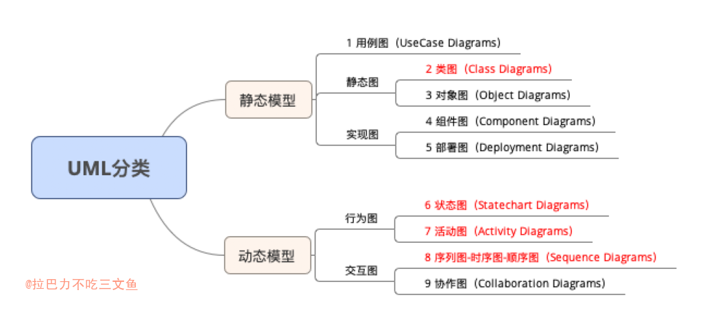
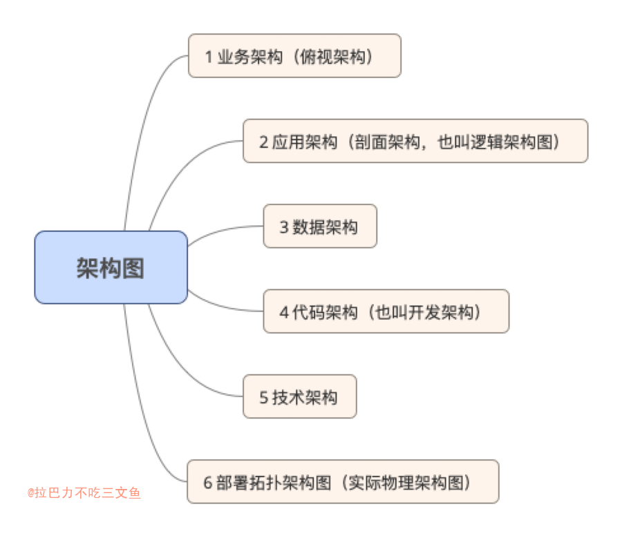

## 思维导图

+ 思维导图又叫脑图，使用一个中央关键词或想法引起形象化的构造和分类的想法，是一种结构化思维的树形发散图。

## UML

+ 基本上大多情况，类图、时序图、活动图、状态图 已经够用。

### 用例图

+ 从用户角度描述系统功能，并指出各功能的操作者。
+ 实际工作中，写功能说明，项目交接等情况可以使用。

###  类图
+ 复杂数据结构，方便说明时可以使用
+ 第一是领域模型设计，第二种是表实体关系设计。
+ 组合 > 聚合 > 依赖 > 关联

### 时序图（顺序图）
+ 按时间顺序描述系统之间的交互。
+ 在方案设计中，涉及外部服务的调用、新增新组件（Redis、DB）或设计中涉及组件的关联较多等情况，应该有时序图。

### 协作图
+ 可视化的组织对象及相互作用（和时序图类似，后者强调时间顺序）
+ 在方案设计中，需要描述多个对象之间的相互作用关系时，可以使用。

### 状态图 （状态机）
+ 描述类的对象所有可能的状态，以及事件发生时状态的转移条件
+ 在方案设计中，涉及数据状态的（比如订单的支付状态，UGC的审核状态等）可以使用。
+ 图不好表达双向状态转移，一般使用状态图+状态表来穷举描述状态变化。

### 活动图
+ 活动图和产品经理出的流程图差不多，都是动态图，活动图相对时序图关注更粗粒度的业务流程变化，其中一个活动可能包含多个时序。活动图可以通过纵向泳道和横向泳道划分，纵向泳道表示系统，横向泳道表示业务阶段。

### 组件图
+ 描述代码部件的物理结构及各部件之间的依赖关系，组件图有助于分析和理解部件之间的相互影响程度。
+ 方案设计中，类似于架构设计，组件逻辑关系。

###  部署图
+ 定义系统中软硬件的物理体系结构。
+ 灾备方案设计或新项目部署等场景，可以使用。

## 架构图

+ 架构图是为了抽象地表示软件系统的整体轮廓和各个组件之间的相互关系和约束边界，以及软件系统的物理部署和软件系统的演进方向的整体视图。

### 业务架构

+ 包括业务规划，业务模块、业务流程，对整个系统的业务进行拆分，对领域模型进行设计，把现实的业务转化成抽象对象。

### 应用架构
+ 硬件到应用的抽象，包括抽象层和编程接口。应用架构和业务架构是相辅相成的关系。业务架构的每一部分都有应用架构。
+ 应用作为独立可部署的单元，为系统划分了明确的边界，深刻影响系统功能组织、代码开发、部署和运维等各方面。应用架构定义系统有哪些应用、以及应用之间如何分工和合作。这里所谓应用就是各个逻辑模块或者子系统。
+ 逻辑分层、对外接口协议、RPC调用协议等 

### 数据架构
+ 数据架构指导数据库的设计. 不仅仅要考虑开发中涉及到的数据库，实体模型，也要考虑物理架构中数据存储的设计。

### 代码架构
+ 子系统代码架构主要为开发人员提供切实可行的指导，如果代码架构设计不足，就会造成影响全局的架构设计。比如公司内不同的开发团队使用不同的技术栈或者组件，结果公司整体架构设计就会失控。
+ 框架、类库、配置、编码规范、代码分层等

### 技术架构
+ 确定组成应用系统的实际运行组件（lvs，nginx，tomcat，php-fpm等），这些运行组件之间的关系，以及部署到硬件的策略。
+ 平常所说的技术栈

### 部署拓扑架构图
+ 拓扑架构，包括架构部署了几个节点，节点之间的关系，服务器的高可用，网路接口和协议等，决定了应用如何运行，运行的性能，可维护性，可扩展性，是所有架构的基础。

## 其他

### 活动图与流程图的区别
1. 流程图着重描述处理过程，它的主要控制结构是顺序、分支和循环，各个处理过程之间有严格的顺序和时间关系。而活动图描述的是对象活动的顺序关系所遵循的规则，它着重表现的是系统的行为，而非系统的处理过程。
2. 活动图能够表示并发活动的情形，而流程图不行。
3. 活动图是面向对象的，而流程图是面向过程的。

## 个人总结

1. 需要对数据实体设计进行详细清晰的说明时，考虑使用类图；
2. 新增功能涉及其他外部服务或组件的交互时，一般情况下都应该有时序图；
3. 数据涉及多种状态且流转较复杂时，考虑使用状态图；
4. 新服务搭建时，可以有部署图、组件图等；
5. 较复杂的业务设计中，除了时序图，还可以考虑协作图、活动图等；
6. 在需要对整体进行描述、规划时，可以使用架构图；
7. 概要设计、详细设计

+ 图的分类很多种，也没有统一的归类；参考不同图的意义，画出能清晰表达的图才是重点。

+ 一份好的设计文档需要提供清晰的问题描述、整体的概要设计、涵盖各个细节的详细设计等。
+ [怎么写出一份令人惊叹的设计文档？](https://jishuin.proginn.com/p/763bfbd77085)

+ [如何写出一篇好的技术方案？](https://mp.weixin.qq.com/s/IG4HRjU-pOeaKBZ1ZRSiSQ)

### Reference
+ [UML九种图的分类](https://blog.csdn.net/nangeali/article/details/48953587)
+ [思维导图、UML图、架构图怎么画](https://zhuanlan.zhihu.com/p/376084792)
+ [架构设计-谈谈架构](http://www.uml.org.cn/zjjs/202003061.asp?artid=23031)
+ [如何画好一张架构图？](https://zhuanlan.zhihu.com/p/148670093)
+ [uml中活动图与流程图的区别](https://www.cnblogs.com/nizuimeiabc1/p/5909790.html)
+ [架构制图：工具与方法论](https://mp.weixin.qq.com/s/oRrZIBLwjCRJG3xJcm5bdA) -- 抽象，没怎么看懂
+ [我是怎么画架构图的？](https://mp.weixin.qq.com/s/QfVhutaw_iJy57v0VVatuA)