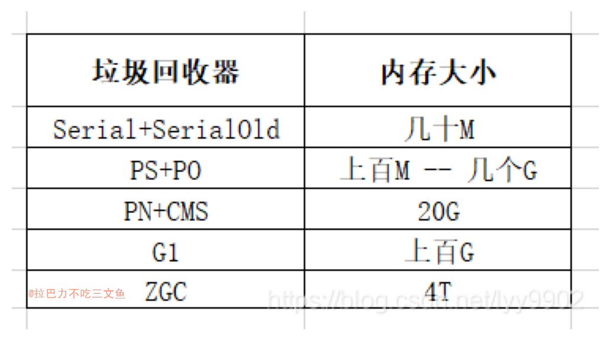
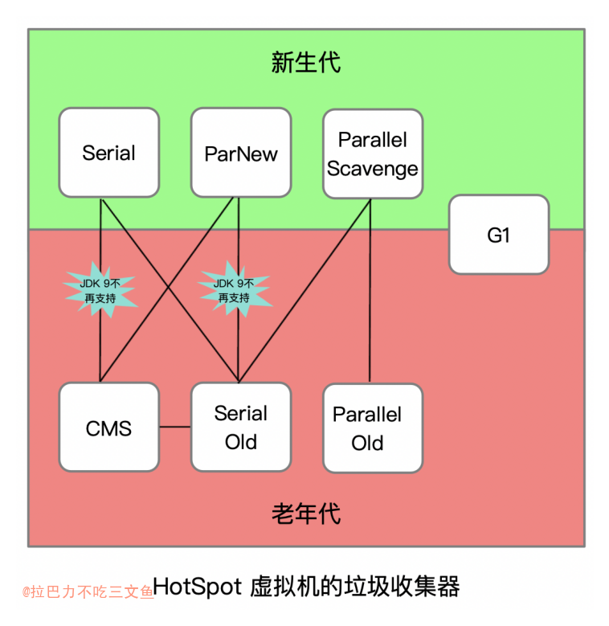

+ Java中成熟的垃圾回收器有串行垃圾回收器、并行垃圾回收器、并发标记回收器（Concurrent Mark Sweep, CMS）、垃圾优先回收器（Garbage First，也称为G1）。在JDK 11中引入了一款新的垃圾回收器ZGC，在JDK 12中又引入了另一款新的垃圾回收器Shenandoah。虽然新的垃圾回收器不断地涌现，但是垃圾回收的基本算法变化并不大。简单来说，回收算法主要有复制、标记清除、标记压缩。JVM中不同的垃圾回收器都是基于这些基本算法实现的，不同的垃圾回收器区别在于：选择的算法不同，实现时后台线程采用的并行/并发方式不同。

+ 垃圾回收针对的是堆空间

+ 目前垃圾回收算法主要有两类：
	- 引用计数法：在堆内存中分配对象时，会为对象分配一段额外的空间，这个空间用于维护一个计数器，如果对象增加了一个新的引用，则将增加计数器的值；如果一个引用关系失效，则减少计数器的值。当一个对象的计数器的值变为0，则说明该对象已经被废弃，处于不活跃状态，可以被回收。引用计数法需要解决循环依赖的问题
	- 可达性分析法（也称为根引用分析法），基本思路就是通过根集合（root set）作为起始点，从这些节点出发，根据引用关系开始搜索，所经过的路径称为引用链，当一个对象没有被任何引用链访问到时，则证明此对象是不活跃的，可以被回收。在JVM中常见的根（root）有线程栈帧（thread frame，用于跟踪线程中活跃对象）、符号表（symbol dictionary）、字符串表（string table）、对象监视器（object synchronizer）、元数据对象（universe）等，这些根共同构成了根集合。

+ JVM的垃圾回收采用了可达性分析法。垃圾回收算法也在不断地演化，按照不同的标准有不同的分类：
	- 从垃圾回收算法实现主要分为复制（copy）、标记清除（mark-sweep）和标记压缩（mark-compact）。
	- 从回收方式上可以分为串行回收、并行回收、并发回收。
	- 从内存管理上可以分为代管理和非代管理。

+ JVM垃圾回收器基于分代管理和回收算法，结合回收的方式，实现了串行回收器、并行回收器、CMS、G1、ZGC和Shenandoah。

+ 从程序执行方式的角度可以分为以下3类：
	- 串行执行：应用程序和垃圾回收器交替执行，垃圾回收器执行的时候应用程序暂停执行。串行执行指的是垃圾回收器有且仅有一个后台线程执行垃圾对象的识别和回收。
	- 并行执行：应用程序和垃圾回收器交替执行，垃圾回收器执行的时候应用程序暂停执行。并行执行指的是垃圾回收器有多个后台线程执行垃圾对象的识别和回收，多个线程并行执行。
	- 并发执行：应用程序和垃圾回收器同时运行，除了在某些必要的情况下垃圾回收器需要暂停应用程序的执行，其余的时候在应用程序运行的同时，垃圾回收器的后台线程也运行，如标识垃圾对象并回收垃圾对象所占的空间。

+ JKD7 默认垃圾收集器Parallel Scavenge（新生代）+Parallel Old（老年代）
+ JKD8 默认垃圾收集器Parallel Scavenge（新生代）+Parallel Old（老年代）
+ JKD9的默认垃圾回收器是G1
+ JDK15 正式删除CMS。JDK11就已经把CMS标记为过期。JDK9开始使用G1作为「默认」的垃圾回收器（JDK11中ZGC开始崭露头角）

+ Minor GC：又称新生代GC
+ Full GC：又称为Major GC或老年代GC

### 垃圾收集器 种类
1. Serial 垃圾收集器（单线程、复制算法）['sɪriəl]
2. ParNew 垃圾收集器（Serial+多线程）【Serial收集器的多线程版本】
3. Parallel Scavenge 收集器（多线程复制算法、高效）['perə.lel] ['skævəndʒ] 【“吞吐量优先”收集器】
自适应调节策略也是 ParallelScavenge 收集器与 ParNew 收集器的一个
重要区别。
4. Serial Old 收集器（单线程标记整理算法 ）【Serial收集器的老年代版本】
5. Parallel Old 收集器（多线程标记整理算法）【Parallel Scavenge收集器的老年代版本】
6. CMS 收集器（多线程标记清除算法） （Coucurrent Mark Sweep）【并发收集、低停顿】
最主要目标是获取最短垃圾回收停顿时间
7. G1 收集器 （Garbage-First）【面向服务端应用的垃圾收集器】

+ 相比与 CMS 收集器，G1 收集器两个最突出的改进是：
	- 基于标记-整理算法，不产生内存碎片。
	- 可以非常精确控制停顿时间，在不牺牲吞吐量前提下，实现低停顿垃圾回收。

+ CMS收集器的关注点尽可能地缩短垃圾收集时用户线程的停顿时间，而Parallel Scavenge收集器更关注系统的吞吐量（Throughput）。

+ CMS
	- 多线程，使用标记清除算法。并发收集，垃圾回收停顿时间短。但对CPU资源较敏感，CPU核心较少时会导致并发标记、并发清除时吞吐量骤减；无法处理浮动垃圾，老年代空间不能完全使用,需要预留一部分空间；由于基于标记清除算法，会产生大量空间碎片，将会给大对象分配带来很大麻烦，往往会出现老年代还有很大空间剩余，但是无法找到足够大的连续空间来分配当前对象，不得不提前触发一次Full GC。

+ G1
	- 多线程，从局部（两个Region之间）来看，是基于复制算法，从整体来看是基于标记整理算法，不会产生空间碎片，相比于CMS，可预测停顿时间。适合大堆，追求低停顿。

### ## JVM GC参数
+ -XX:+UseSerialGC 开启此参数使用Serial & Serial Old搜集器（client模式默认值）
+ -XX:+UseParNewGC 开启此参数使用ParNew & Serial Old收集器
+ -XX:+UseParallelGC 开启此参数使用parallel scavenge & Serial old收集器（server模式默认值）
+ -XX:+UseParallelOldGC 使用Parallel scavenge & Parallel old收集器
+ -XX:+UseConcMarkSweepGC 使用ParNew & CMS收集器 (使用ParNew + CMS + Serial Old的收集器组合进行垃圾回收，Serial Old作为CMS出现Concurrent Mode Failure失败后的后备收集器)
+ -XX:+UseG1GC

## 总结和适用场景

### CMS
+ 以获取最短回收停顿时间为目标的收集器。
+ CMS收集器工作时，GC工作线程与用户线程可以并发执行，以此来达到降低收集停顿时间的目的。
+ 优点：并发收集、低停顿
+ CMS收集器之所以能够做到并发，根本原因在于采用基于“标记-清除”的算法并对算法过程进行了细粒度的分解。
+ CMS是老年代的垃圾回收器，在老年代分配不下的时候，触发CMS。
+ CMS的最大问题：CMS会使内存碎片化，老年代产生了很多的碎片，然后从年轻代过来的对象无法找到空间，造成了promotion failed。这时候，CMS既没有机会进行垃圾回收，又放不下新来的对象，在这种情况下，CMS会调用SerialOld来进行垃圾回收。这是一件很恐怖的事情。

### G1
+ 致力于在多CPU和大内存服务器上对垃圾回收提供软实时目标（soft real-time goal）和高吞吐量（high throughput）
+ G1适合8/16G以上的内存使用
+ 整体采用标记-整理算法，局部是通过是通过复制算法，不会产生内存碎片
+ G1垃圾收集器相对比其他收集器而言，最大的区别在于它取消了年轻代、老年代的物理划分，取而代之的是将堆划分为若干个区域（Region），这些区域中包含了有逻辑上的年轻代、老年代区域。这样做的好处就是，我们再也不用单独的空间对每个代进行设置了，不用担心每个代内存是否足够。
+ G1重新定义了堆空间，打破了原有的分代模型，将堆划分为一个个区域。这么做的目的是在进行收集时不必在全堆范围内进行，这是它最显著的特点。区域划分的好处就是带来了停顿时间可预测的收集模型：用户可以指定收集操作在多长时间内完成。即G1提供了接近实时的收集特性。
+ 可预测的停顿
+ G1在逻辑上分代，在物理上不分代。G1引入了分而治之的思想，把内存分为一个一个的小块(region)。每个region逻辑上属于下面四种分代中的一种。
+ 四种分代：
	a. Old区：老对象
	b .Survivor区：存活对象
	c. Eden区：新生对象
	d. Humongous区：大对象，如果这个对象特别大，可能会跨两个region。

### ZGC
+ 和G1类似，但ZGC的region的大小更加灵活和动态。zgc的region不会像G1那样在一开始就被划分为固定大小的region。
+ zgc的region核心亮点就是：动态。
+ 停顿时间控制在10ms之内停顿时间不会因为堆变大而变长堆大小支持TB级。
+ ZGC在对象回收的吞吐量方面略逊于G1回收器（差距小于15%）

### Shenandoah
+ ZGC是Oracle JDK的。而Shenandoah只存在于OpenJDK中，因此使用时需注意你的JDK版本

### 新生代关系和组合关系
+ 当 CMS回收失败时, 备选 Serial Old GC

## Reference
+ 新一代垃圾回收器ZGC设计与实现
+ [弄明白CMS和G1，就靠这一篇了](https://www.cnblogs.com/heyonggang/p/11718170.html)
+ [十种常见的垃圾回收器简介](https://blog.csdn.net/lyy9902/article/details/111504800)
+ [Java 虚拟机系列三：垃圾收集器一网打尽，船新的 ZGC 和 Shenandoah 听说过吗](https://segmentfault.com/a/1190000021786789)
+ [JVM垃圾回收-垃圾回收的各种分类& 垃圾收集器的组合关系(https://blog.csdn.net/qcl108/article/details/108875189)