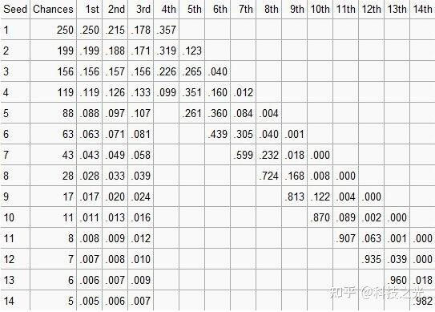

[nba选秀抽签具体是如何操作的？](https://www.zhihu.com/question/52895544)
+ 14个乒乓球分别贴上1-14数字，随机滚出4个，加起来是1001可能，其中11、12、13、14这个组合不算，剩下1000种可能。




+ 闲来无事，使用Go粗暴模拟了一下

```go
package main

import (
	"fmt"
	"math/rand"
	"sort"
	"time"
)

/**
https://www.zhihu.com/question/52895544
*/
func main() {
	n := 14
	m := 4
	nn := 1
	mm := 1
	nm := 1
	for i := 1; i <= n; i++ {
		nn = nn * i
	}
	for i := 1; i <= m; i++ {
		mm = mm * i
	}
	for i := 1; i <= (n - m); i++ {
		nm = nm * i
	}

	all_result := make([]string, 1000)
	all_result_map := make(map[string]int)

	count := 0
	for i := 1; i <= 11; i++ {
		for j := i + 1; j <= 12; j++ {
			for k := j + 1; k <= 13; k++ {
				for l := k + 1; l <= 14; l++ {
					//fmt.Printf("%d -> %d -> %d -> %d\n", i, j, k, l)
					if i == 11 && j == 12 && k == 13 && l == 14 {
						continue
					}
					all_result[count] = fmt.Sprintf("%d-%d-%d-%d", i, j, k, l)
					count++
					all_result_map[fmt.Sprintf("%d-%d-%d-%d", i, j, k, l)] = count
				}
			}
		}
	}

	weight_arr := [14]int{250, 199, 156, 119, 88, 63, 43, 28, 17, 11, 8, 7, 6, 5}
	all_weight := 0
	source_map := make(map[int]int)

	for num, weight := range weight_arr {

		for i := 0; i < weight; i++ {
			source_map[i+1+all_weight] = num + 1
		}
		all_weight = all_weight + weight
	}

	/**
	模拟前三顺位
	*/
	all_hit_result := []int{0, 0, 0, 0, 0, 0, 0, 0, 0, 0, 0, 0, 0, 0}
	all_hit_result_second_round := []int{0, 0, 0, 0, 0, 0, 0, 0, 0, 0, 0, 0, 0, 0}
	all_hit_result_third_round := []int{0, 0, 0, 0, 0, 0, 0, 0, 0, 0, 0, 0, 0, 0}
	r := rand.New(rand.NewSource(time.Now().Unix()))
	for xx := 0; xx < 1000000; xx++ {

		hit_map := make(map[int]int)
		for round := 0; round < 3; round++ {
			all_ball := []int{1, 2, 3, 4, 5, 6, 7, 8, 9, 10, 11, 12, 13, 14}

			chosen_ball := make([]int, 4)
			for i := 0; i < 4; i++ {

				hit := r.Intn(14 - i)
				chosen_ball[i] = all_ball[hit]
				index := hit
				all_ball = append(all_ball[:index], all_ball[index+1:]...)

			}

			sort.Ints(chosen_ball)
			result := fmt.Sprintf("%d-%d-%d-%d", chosen_ball[0], chosen_ball[1], chosen_ball[2], chosen_ball[3])

			if result == "11-12-13-14" {
				round--
				continue
			}

			result_rank := source_map[all_result_map[result]]

			value := hit_map[result_rank]
			if value == 1 {
				round--
				continue
			}

			if round == 0 {
				all_hit_result[result_rank-1]++
			}
			if round == 1 {
				all_hit_result_second_round[result_rank-1]++
			}
			if round == 2 {
				all_hit_result_third_round[result_rank-1]++
			}

			hit_map[result_rank] = 1
		}

	}
	fmt.Println("第一轮")
	for i, resut_hit := range all_hit_result {
		fmt.Printf("%d -> %d\n", i+1, resut_hit)
	}
	fmt.Println("第二轮")
	for i, resut_hit := range all_hit_result_second_round {
		fmt.Printf("%d -> %d\n", i+1, resut_hit)
	}
	fmt.Println("第三轮")
	for i, resut_hit := range all_hit_result_third_round {
		fmt.Printf("%d -> %d\n", i+1, resut_hit)
	}

	/**
		模拟100万次
		第一轮
	1 -> 249512
	2 -> 198836
	3 -> 155714
	4 -> 118849
	5 -> 88395
	6 -> 63352
	7 -> 43285
	8 -> 28016
	9 -> 16892
	10 -> 11093
	11 -> 7894
	12 -> 7004
	13 -> 6100
	14 -> 5058
	第二轮
	1 -> 215647
	2 -> 188267
	3 -> 157704
	4 -> 125474
	5 -> 96543
	6 -> 71033
	7 -> 49195
	8 -> 32360
	9 -> 19803
	10 -> 13185
	11 -> 9521
	12 -> 8252
	13 -> 7031
	14 -> 5985
	第三轮
	1 -> 177455
	2 -> 171603
	3 -> 155736
	4 -> 133323
	5 -> 106458
	6 -> 81193
	7 -> 58185
	8 -> 38863
	9 -> 24146
	10 -> 15550
	11 -> 11508
	12 -> 10064
	13 -> 8634
	14 -> 7282
	*/

}
```

