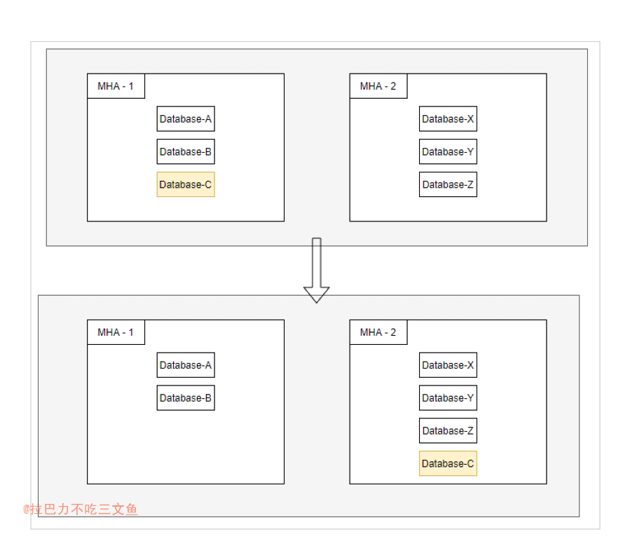

先抛出以下问题：
把MHA-1集群的Database-C 迁到 MHA-2 集群中，有没有简单高效的方案?

---

+ 方案1、在两个MHA集群，在建一套MHA3。MHA2的主作为MHA1的从？这样MH3切换的时候，应用服务就可以直接感知切到新库了；
+ 方案2、先把C同步到2集群，然后做otter同步

---

+ 方案1： 存在的问题：
	- 中间再搞一套MHA，不是运维麻烦，而是多了一套中间库，可能会导致MHA的切换逻辑紊乱。
+ 方案2： 
	- 业务方的服务要自行选择数据源进行切换 （流量低且数据一致性要求不高，考虑通过开关切换；否则需考虑停服等其他方案）
	- otter双向同步，业务最好同时只写一边（要注意旧库是否有自增主键；同步冲突策略设置，默认会冲突会同步中断）
