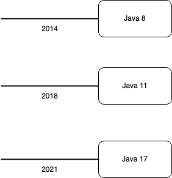
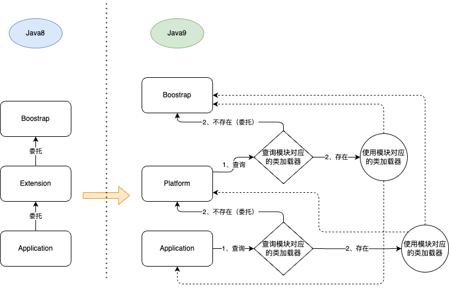

# 一、为什么选择java11

Java 11 是 Java 8 之后的首个 LTS 版本（Long-term support 长期支持版本），所以有不少开发者表示会选择升级至 Java 11。



1、目前相对来说，Java 8 太旧，Java 17 太新，Java11 刚刚好；
2、支持以类路径方式运行，适合过渡阶段升级；
3、其他原因（下文会说明）

# 二、模块系统

模块系统是Java 9的旗舰功能，使用java9，有必要了解一下。

## java9之前存在哪些痛点

### 1、没有封装
类一旦公开，意味着没有封装。

如果将一个类设置为protected，那么就可以防止其他类访问该类，除非这些类与该类位于相同的包中。但这样做会产生一个有趣的问题：如果想从组件的另一个包中访问该类，同时仍然防止其他类使用该类，那么应该怎么做呢？事实是无法做到。

让类公开，意味着对系统中的所有类型都是公开的，也就意味着没有封装。

Java在过去经历过相当多的安全漏洞。这些漏洞都有一个共同的特点：不知何故，攻击者可以绕过JVM的安全沙盒并访问JDK中的敏感类。从安全的角度来看，在JDK中对危险的内部类进行强封装是一个很大的改进。同时，减少运行时中可用类的数量会降低攻击面。在应用程序运行时中保留大量暂时不使用的类是一种不恰当的做法。而通过使用模块化JDK，可以确定应用程序所需的模块。

### 2、编译时无法感知依赖缺失或类重复

Java确实使用了显式的import语句。但不幸的是，从严格意义上讲，这些导入是编译时结构，一旦将代码打包到JAR中，就无法确定哪些JAR包含当前JAR运行所需的类型。

在Java 9出现之前，JAR文件似乎是最接近模块的，它们拥有名称、对相关代码进行了分组并且提供了定义良好的公共接口。

（1）依赖缺失
所有类按照-classpath参数定义的顺序加载类。由于类会延迟加载，JVM无法在应用程序启动时有效地验证类路径的完整性，即无法预先知道类路径是否是完整的，或者是否应该添加另一个JAR。

（2）类重复
当类路径上有重复类时，则会出现更为隐蔽的问题。出现相同库的两个版本（如Guava 19和Guava 18）是非常常见的，这两个库JAR以一种未定义的顺序压缩到类路径中。库类的任一版本都可能会被首先加载。此外，有些类还可能会使用来自（可能不兼容的）其他版本的类。此时就会导致运行时异常。


## 关于类重复

目前存在以下方法缓解或解决

### 1、通过插件检查类重复
在编译时，检测类是否重复，比如使用插件 maven enforcer plugin，但本质上是通过解压全部jar包，检查所有文件是否存在重复类来判断的，效率可想而知。

### 2、通过构建工具保证只存在一个版本的jar包

构建工具冲突失败策略设置如gradle中
```gradle
configurations.all {
    resolutionStrategy {  failOnVersionConflict() }
}
```

这种设置仅仅是针对jar包冲突，不能保证不同名的jar包是否存在相同的类。

处理jar包冲突有两种策略：

1）强制指定版本：版本冲突太多，指定版本的情况，后续有新的版本间接依赖也无法直接发现。
2）取最高版本：同样有可能引起高版本导致不兼容的问题。

要彻底解决，只有项目依赖完全模块化。


## 构建工具

Maven、Gradle等构建工具，在运行时没有任何作用。Maven构建了想要运行的工件，但是最后仍然需要配置Java运行时，以便运行正确的模块路径和类路径。虽然手动配置模块路径比类路径要容易得多，但它仍然是重复的工作，因为相关信息已经在pom.xml文件中了。

## 模块化的好处

模块化 可以 在编译时和运行时获得所有这些信息所带来的优势。这可以防止对来自其他非引用模块的代码的意外依赖。通过检查（传递）依赖关系，工具链可以知道运行模块需要哪些附加模块并进行优化。

Java平台模块系统带来了如下最重要的好处：

1．可靠的配置在编译或运行代码之前，模块系统会检查给定的模块组合是否满足所有依赖关系，从而导致更少的运行时错误。
2．强封装型模块显式地选择了向其他模块公开的内容，从而防止对内部实现细节的意外依赖。
3．可扩展开发显式边界能够让开发团队并行工作，同时可创建可维护的代码库。只有显式导出的公共类型是共享的，这创建了由模块系统自动执行的边界。
4．安全性在JVM的最深层次上执行强封装，从而减少Java运行时的攻击面，同时无法获得对敏感内部类的反射访问。
5．优化由于模块系统知道哪些模块是在一起的，包括平台模块，因此在JVM启动期间不需要考虑其他代码。同时，其也为创建模块分发的最小配置提供了可能性。此外，还可以在一组模块上应用整个程序的优化。

在模块出现之前，这样做是非常困难的，因为没有可用的显式依赖信息，一个类可以引用类路径中任何其他类。

此外还有：
（1）JDK9的模块化可以减少Java程序打包的体积，同时拥有更好的隔离线与封装性。
在JDK9之前，JVM的基础类以前都是在rt.jar这个包里，这个包也是JRE运行的基石。这不仅是违反了单一职责原则，同样程序在编译的时候会将很多无用的类也一并打包，造成臃肿。在JDK9中，整个JDK都基于模块化进行构建，以前的rt.jar, tool.jar被拆分成数十个模块，编译的时候只编译实际用到的模块，同时各个类加载器各司其职，只加载自己负责的模块。
（2）经过破坏后的双亲委派模型更加高效，减少了很多类加载器之间不必要的委派操作

## 模块系统的基础

本质上就是一个jar包切成多模块（更细的jar包）来引用

### 1、module-info.java描述文件 关键字说明

requires代表依赖的模块，只有依赖的模块存在才能通过编译并运行.需要注意的是，所有模块均自动隐式依赖java.base模块，不需要显示声明
exports指出需要暴露的包，如果某个包没有被exports，那么其他模块是无法访问的。

Readability:指的是必须exports的包才可被其他模块访问
Accessibility:指的是即使是exports的包，其中的类的可访问下也要基于java的访问修饰符，仅有public修饰的才可被其他模块访问

Implied Readability(隐式Readability, requires transitive):
Readability默认情况下是不会被传递的
requires transitive，传递性依赖生效

由于requires transitive的存在，就可以支持聚合模块。有些聚合模块可以没有任何代码，就一个module-info.java描述文件，比如java.se, java.se.ee模块
不建议直接引用java.se模块，因为它就相当于java9以前版本的rt.jar的内容。

Qualified Exports(有限制的exports)
比如我只想exports某个包给部分模块,而不是所有模块

### 2、模块化基础

（1）模块拥有一个名称，并对相关的代码以及可能的其他资源进行分组，同时使用一个模块描述符进行描述。模块描述符保存在一个名为module-info.java的文件中。
（2）模块描述符还可以包含exports语句。强封装性是模块的默认特性。只有当显式地导出一个包时（比如示例中的java.util.prefs），才可以从其他模块中访问该包
可访问性和可读性的结合可以确保在模块系统中实现强封装性。
（3）其他模块无法使用未导出包中的任何类型——即使包中的类型是公共的。这是对Java语言可访问性规则的根本变化。
（4）Java 9出现之后，public意味着仅对模块中的其他包公开。只有当导出包包含了公开类型时，其他模块才可以使用这些类型。这就是强封装的意义所在。

在模块出现之前，强封装实现类的唯一方法是将这些类放置到单个包中，并标记为私有。这种做法使得包变得非常笨重，实际上，将类公开只是为了实现不同包之间的访问。通过使用模块，可以以任何方式构建包，并仅导出模块使用者真正必须访问的包。如果愿意的话，还可以将导出的包构成模块的API。

（5）模块提供了导出包的显式信息，从而能够高效地对模块路径进行索引。当从给定的包中查找类型时，Java运行时和编译器可以准确地知道从模块路径中解析哪个模块。而在以前，对整个类路径进行扫描是找到任意类型的唯一方法。

在解析过程中还会完成一些额外的检查。例如，具有相同名称的两个模块在启动时（而不是在运行过程出现类加载失败时）会产生错误。此外，还会检查导出包的唯一性。

模块解析过程以及额外的检查确保了应用程序在一个可靠的环境中运行，降低了运行时失败的可能性。

（6）通过使用未命名模块，尚未模块化的代码可以继续在JDK 9上运行。
当将代码放在类路径上时，会自动使用未命名模块。这也意味着需要构建一个正确的类路径。可一旦使用了未命名模块，前面讨论的模块系统所带来的保障和好处也就没有了。

当在Java 9中使用类路径时，还需要注意两件事情。首先，由于平台是模块化的，因此对内部实现类进行了强封装。

（7）模块系统执行的另一个检查是循环依赖。
在编译时，模块之间的可读性关系必须是非循环的。而在模块中，仍然可以在类之间创建循环关系

（8）通过使用ServiceLoader API可在模块描述符和代码中表示服务
使用这个功能可以对代码的实现进行良好的封装

### 3、以非模块化方式开发和运行应用

在java9中也是允许你以非模块化方式开发和运行应用的(也就是说，模块化开发是可选的)，如果你的应用中没有module-info.java，那么这就是一个unnamed module. java9对于unnamed module的处理方式就是所有的jdk模块均直接可用(模块图中是以java.se模块作为root模块的，也意味着单独处于java.se.ee下的一些包，比如JAXB API是无法访问到的)。

但是需要注意的是，在java8以及之前的版本中，我们可以访问jdk中的一些不推荐访问的内部类，比如com.sun.image.codec.jpeg,但在java9模块化之后被强封装了，所以在java9中无法使用这些内部类，也就是说无法通过编译，但是java9为了保持兼容性，允许之前引用这些内部类的已有的jar或已编译的类正确运行。换言之，就是java9不允许源码中引用这些类，无法通过编译，但是之前版本中引用这些类的已编译class文件是允许正常运行的。

# 三、迁移

（1）为了便于将基于类路径的应用程序迁移到Java 9，在对平台模块中的类应用深度反射时，或者使用反射来访问非导出包中的类型时，JVM默认显示警告

（2）那些在JDK 8和更早的版本上运行没有任何问题的代码现在会在控制台上显示一个醒目的警告——即使是在生产环境中也是如此。这表明严重破坏了强封装。除了这个警告之外，应用程序仍然照常运行。如警告消息所示，在下一个Java版本中行为将发生变化。将来，即使是类路径上的代码，JDK也会强制执行平台模块的强封装。

（3）可以使用--add-opens标志授予对模块中特定包的类路径深度反射访问。同样，当类路径上的代码尝试访问非导出包中的类型时，可以使用--add-exports来强制导出包。

（4）为了使逐步迁移成为可能，可以混合使用类路径和模块路径。但这不是一种理想的情况，因为只能部分受益于Java模块系统的优点。但是，“小步”迁移是非常有帮助的。


## 自动模块

Java模块系统提供了一个有用的功能来处理非模块的代码：自动模块。只需将现有的JAR文件从类路径移动到模块路径，而不改变其内容，就可以创建一个自动模块。这样一来，JAR就转换为一个模块，同时模块系统动态生成模块描述符。相比之下，显式模块始终有一个用户自定义的模块描述符。

自动模块的行为不同于显式模块。自动模块具有以下特征：

（1）不包含module-info.class；
（2）它有一个在META-INF/MANIFEST.MF中指定或者来自其文件名的模块名称。
（3）通过requires transitive请求所有其他已解析模块。
（4）导出所有包。
（5）读取路径（或者更准确地讲，读取前面所讨论的未命名模块）。
（6）它不能与其他模块拆分包。

自动模块并不是一个设计良好的模块。虽然请求所有的模块并导出所有的包听起来不像是正确的模块化，但至少是可用的。

自动模块中仍然没有明确的信息来告诉模块系统真正需要哪些模块，这意味着JVM在启动时不会警告自动模块的依赖项丢失。

作为开发人员，负责确保模块路径（或类路径）包含所有必需的依赖项。这与使用类路径没有太大区别。

模块图中的所有模块都需要通过自动模块传递。这实际上意味着，如果请求一个自动模块，那么就可以“免费”获得所有其他模块的隐式可读性。

当使用自动模块时，也会遇到拆分包。在大型应用程序中，由于依赖关系管理不善，通常会发现拆分包。拆分包始终是一个错误，因为它们在类路径上不能可靠地工作。

## 未命名模块

模块路径上的非模块化JAR变成了自动模块。而类路径变成了未命名模块。

类路径上的所有代码都是未命名模块的一部分。

存在一个很大的限制：未命名模块本身只能通过自动模块读取（只有自动模块可以读取类路径）

当读取未命名模块时自动模块和显式模块之间的区别。显式模块只能读取其他显式模块和自动模块。而自动模块可读取所有模块，包括未命名模块。

未命名模块的可读性只是一种在混合类路径/模块路径迁移方案中有助于自动模块的机制。

JVM为什么没有那么“聪明”呢？它有权访问自动模块中的所有代码，那么为什么不分析依赖关系呢？如果想要分析这些代码是否调用其他模块，JVM需要对所有代码执行字节码分析。虽然这不难实现，但却是一个昂贵的操作，可能会大量增加大型应用程序的启动时间。而且，这样的分析不会发现通过反射产生的依赖关系。由于存在这些限制，JVM不可能也永远不会这样做。相反，JDK附带了另一个工具jdeps，它可以执行字节码分析。

现代构建工具通常有一个“在重复依赖项上失败”的设置，这使得依赖关系管理问题变得更加清晰，从而迫使尽早解决这些问题。强烈建议使用这个设置。关于该问题，Java模块系统比类路径要严格得多。当它检测到一个包从模块路径上的两个模块导出时，就会拒绝启动。相比于以前使用类路径时所遇到的不可靠情况，这种快速失败（fail-fast）机制要好得多。在开发过程中失败好过在生产过程中失败，尤其是当一些不幸的用户碰到一个由于模糊的类路径问题而被破坏的代码路径时。但这也意味着我们必须处理这些问题。盲目地将所有JAR从类路径移至模块路径可能导致在生成的自动模块之间出现拆分包。而这些拆分包将被模块系统所拒绝。

为了使迁移变得容易一些，当涉及自动模块和未命名模块时，上述规则存在一个例外，即承认很多类路径是不正确的，并且包含拆分包。当（自动）模块和未命名模块都包含相同的包时，将使用来自（自动）模块的包，而未命名模块中的包被忽略。

如果在迁移到Java 9时遇到了拆分包问题，那么是无法绕过的。即使从用户角度来看基于类路径的应用程序可以正确工作，你也必须处理这些问题。

拆分包会导致无法以模块系统的方式启动服务

## 未命名模块（unnamed module）和自动模块（automatic module）总结

（1）一个未经模块化改造的 jar 文件是转为未命名模块还是自动模块，取决于这个 jar 文件出现的路径，如果是类路径，那么就会转为未命名模块，如果是模块路径，那么就会转为自动模块。注意，自动模块也属于命名模块的范畴，其名称是模块系统基于 jar 文件名自动推导得出的
（2）两者还有一个关键区别，分裂包规则适用于自动模块，但对未命名模块无效，也即多个未命名模块可以导出同一个包，但自动模块不允许。
（3） 未命名模块和自动模块存在的意义在于，无论传入的 jar 文件是否一个合法的模块（包含 module descriptor），Java 内部都可以统一的以模块的方式进行处理，这也是 Java 9 兼容老版本应用的架构原理。运行老版本应用时，所有 jar 文件都出现在类路径下，也就是转为未命名模块，对于未命名模块而言，默认导出所有包并且依赖所有模块，因此应用可以正常运行。
（4）基于未命名模块和自动模块，相应的就产生了两种老版本应用的迁移策略，或者说模块化策略。
（5）等所有 jar 包都完成模块化改造，应用改为 -m 方式启动，这也标志着应用已经迁移为真正的 Java 9 应用
（6）-cp 和 -m 可以同时存在 并运行？？可以（类路径和模块系统可以混合运行）

## java9 自动模块 的意义

（1）个人理解，只是为了让开发者能像模块一样使用起来，引入。实际上封装性方面和类路径没任何区别。
（2）未命名模块和自动模块存在的意义在于，无论传入的 jar 文件是否一个合法的模块（包含 module descriptor），Java 内部都可以统一的以模块的方式进行处理，这也是 Java 9 兼容老版本应用的架构原理。

## 其他

（1）如何用最快的速度判别它是不是一个模块？它又是如何定义的？
试试看 jar -d -f <jar_file>。
（2）通过JDK11内置jdeps工具查找过期以及废弃API以及对应的替换
`./jdk-11.0.10.jdk/Contents/Home/bin/jdeps --jdk-internals ./build/libs/service.jar`
`./jdk-11.0.10.jdk/Contents/Home/bin/jdeps --jdk-internals -R --class-path ./build/deploy/* ./build/libs/*`
`jdeps --jdk-internals -R --class-path 'libs/*' $project`
libs是你的所有依赖的目录，$project是你的项目jar包
（3）我们可以在线上使用OpenJDK，开发时，使用任意的JDK。
https://zhuanlan.zhihu.com/p/87157172

## 库迁移

迁移库和迁移应用程序之间最大的区别在于库被许多应用程序使用。这些应用程序可能运行在不同版本的Java上，所以库通常需要在各种Java版本上工作。期望库的用户在你迁移库的同时切换到Java 9是不现实的。

库的迁移过程由以下步骤组成：

1）确保库可以作为自动模块在Java 9上运行。
2）使用Java 9编译器编译库（主要使用满足需求的最低Java版本），而不使用新的Java 9功能。
3）添加一个模块描述符，并将库转换为显式模块。
4）重构库的结构，以便增加封装性，识别API，并尽可能分割成多个模块（可选）。
5）开始使用库中的Java 9功能，同时保持向后兼容Java 9的早期版本。

库管理需要使用java8编译，模块描述需要用java9编译，且不能使用新特性，否则java8编译不过

项目模块化后，很多第三库（基于反射的），深度反射项目代码，或jdk，可能不能用，要进行特殊处理

历史解决jar包冲突问题得改造成模块化


# 四、模块系统实践例子

## 1、相同模块不同版本，新版废弃方法

结论：运行时才会报错

module_2-1.0  依赖 module_1-1.0 printInfo.print2()方法，项目依赖 module_1-2.0 printInfo.print3()；
build的时候并不能识别到错误，只有运行时才会发现错误 java.lang.NoSuchMethodError: com.kxw.module1.info.PrintInfo.print2()V

## 2、不同模块含重复类

结论：不同模块可以存在相同类，在引入时指定模块，可以正确加载到对应类

（1）如果同时引入两个不同模块（不管是直接还是间接），编译时会检测引入的模块是否包含可读的相同路径
编译报错：错误: 未命名的模块同时从 com.kxw.module.four 和 com.kxw.module.three 读取程序包 com.kxw.module.config

（2）如果模块存在相同类，但是却没有通过export声明，仅内部使用，那么编译时将无法检测，但运行时报 （两个模块都没有export的情况，结果一样）
Error occurred during initialization of boot layer
java.lang.LayerInstantiationException: Package com.kxw.module.config in both module com.kxw.module.three and

没声明（export）的情况下，运行时怎么检测有相同的package？
报：Checks for split packages between modules defined to the built-in class loaders.
 ModuleBootstrap#checkSplitPackages 会检查所有module的package是否重复，通过String other = packageToModule.putIfAbsent(p, name);来实现

结论：只要是一个模块，且被引入，有相同包名都可以在启动时被检测出来并报错 （为什么编译时不做的呢？main方法不明确？还是要指定主模块？）

注意：类路径加载的模块都是未命名模块，且不会因为包冲突而报错 

# 五、classloader的变化


## 1、类加载器变化概览
### 双亲委派机制

（1）任意一个 ClassLoader 在尝试加载一个类的时候，都会先尝试调用其父类的相关方法去加载类，如果其父类不能加载该类，则交由子类去完成。 这样的好处：对于任意使用者自定义的 ClassLoader，都会先去尝试让 jvm 的 Bootstrap ClassLoader 去尝试加载(自定义的 ClassLoader 都继承了它们)。那么就能保证 jvm 的类会被优先加载，限制了使用者对 jvm 系统的影响。

（2）jdk9中的双亲委派机制仍然存在，只是在委派之前会优先寻找模块所属的加载器进行加载。

### jdk9之前

Boostrap -> Extension -> Application

（1）bootstrap classloader加载rt.jar，jre/lib/endorsed （用来加载 jvm 自身需要的类，c++ 实现，用来加载 rt.jar）
（2）ext classloader加载jre/lib/ext （ 在 jdk9 中已经被移除。）
（3）application classloader加载-cp指定的类 (负责加载ClassPath路径下的类)

### jdk9及之后

Application -> Platform -> Boostrap

（1）bootstrap classloader加载lib/modules 中的核心模块 （主要用来加载 java.base 中的核心系统类）
（2）ext classloader被废弃，新增platform classloader，加载lib/modules的非核心模块 （用来加载 jdk 中的非核心模块类）
（3）application classloader加载-cp，-mp指定的类 （用来加载一般的应用类）

#### 注意
JDK9开始，AppClassLoader父类不再是 URLClassLoader；而是BuiltinClassLoader

之前对于动态加载的类，我们总是通过将这个类通过反射调用URLClassLoader加到classpath里面进行加载。这么加载在JDK11中已经无法实现，并且这样加载的类不能卸载。 对于动态加载的类，我们在OpenJDK11中只能自定义类加载器去加载，而不是通过获取APPClassLoader去加载。同时，这么做也有助于你随时能将动态加载的类卸载，因为并没有加载到APPClassLoader。

建议使用自定义的类加载器继承SecureClassLoader去加载类：java.security.SecureClassLoader

### BuiltinClassLoader

BuiltinClassLoader 是 jdk9 中代替 URLClassLoader 的加载器，是 PlatformClassLoader 与 AppClassLoader 的父类。其继承了 SecureClassLoader，其核心的方法主要是 loadClassOrNull(...) 方法

### 如何自定义加载器

（1）java9之前
```java
public class ArthasClassloader extends URLClassLoader {
public ArthasClassloader(URL[] urls) {
super(urls, ClassLoader.getSystemClassLoader().getParent());
}

@Override
protected synchronized Class<?> loadClass(String name, boolean resolve) throws ClassNotFoundException {
final Class<?> loadedClass = findLoadedClass(name);
if (loadedClass != null) {
return loadedClass;
}

// 优先从parent（SystemClassLoader）里加载系统类，避免抛出ClassNotFoundException
if (name != null && (name.startsWith("sun.") || name.startsWith("java."))) {
return super.loadClass(name, resolve);
}
try {
Class<?> aClass = findClass(name);
if (resolve) {
resolveClass(aClass);
}
return aClass;
} catch (Exception e) {
// ignore
}
return super.loadClass(name, resolve);
}
}
```
（2）java9之后

TODO

## 2、扩展机制

（1）版本9之前的Java SE允许扩展机制，可以通过将JAR放置在系统属性java.ext.dirs指定的目录中来扩展运行时映像。 如果未设置此系统属性，则使用jre\lib\ext目录作为其默认值。 该机制通过扩展类加载器（这是引导类加载器的子类）和系统类加载器的父级加载了该目录中的所有JAR。 它加载所有应用程序类。 这些JAR的内容对于在此运行时映像上编译或运行的所有应用程序都可见。

（2）Java SE 9不支持扩展机制。 如果需要类似的功能，可以将这些JAR放在类路径的前面。 使用名为JAVA_HOME\lib\ext的目录或设置名为java.ext.dirs的系统属性会导致JDK 9中的错误。

（3）在JDK 9之前，扩展类加载器和应用程序类加载器是java.net.URLClassLoader类的一个实例。 在JDK 9中，平台类加载器（以前的扩展类加载器）和应用程序类加载器是内部JDK类的实例。 如果你的代码依赖于URLClassLoader类的特定方法，代码可能会在JDK 9中崩溃。

## 3、类加载器的加载流程



### 在JDK 9之前

a. JDK使用三个类加载器来加载类
b. JDK类加载器以分层方式工作 —— 引导类加载器位于层次结构的顶部。 类加载器将类加载请求委托给上层类加载器。

例如，如果应用程序类加载器需要加载一个类，它将请求委托给扩展类加载器，扩展类加载器又将请求委托给引导类加载器。 如果引导类加载器无法加载类，扩展类加载器将尝试加载它。 如果扩展类加载器无法加载类，则应用程序类加载器尝试加载它。 如果应用程序类加载器无法加载它，则抛出ClassNotFoundException异常。

c. 引导类加载器是扩展类加载器的父类。 扩展类加载器是应用程序类加载器的父类。 引导类加载器没有父类。 默认情况下，应用程序类加载器将是你创建的其他类加载器的父类。

### 在JDK 9之前的类加载机制

（1）【Boostrap】引导类加载器加载由Java平台组成的引导类，包括JAVA_HOME\lib\rt.jar中的类和其他几个运行时JAR。 它完全在虚拟机中实现。 可以使用-Xbootclasspath/p和-Xbootclasspath/a命令行选项来附加引导目录。 可以使用-Xbootclasspath选项指定引导类路径，该选项将替换默认的引导类路径。 在运行时，sun.boot.class.path系统属性包含引导类路径的只读值。 JDK通过null表示这个类加载器。 也就是说，你不能得到它的引用。 例如，Object类由引导类加载器加载，并且Object.class.getClassLoader()表达式将返回null。

（2）【Extension】扩展类加载器用于通过java.ext.dirs系统属性指定的目录中的位于JAR中的扩展机制加载可用的类。要获得扩展类加载器的引用，需要获取应用程序类加载器的引用，并在该引用上使用getParent()方法。

（3）【Application】应用程序类加载器从由CLASSPATH环境变量指定的应用程序类路径或命令行选项-cp或-classpath加载类。应用程序类加载器也称为系统类加载器，这是一种误称，它暗示它加载系统类。可以使用ClassLoader类的静态方法getSystemClassLoader()获取对应用程序类加载器的引用。

### 在JDK 9及之后

a. JDK9保持三级分层类加载器架构以实现向后兼容。但是，从模块系统加载类的方式有一些变化。
b. 在JDK 9中，应用程序类加载器【Application】可以委托给平台类加载器【Platform】以及引导类加载器【Boostrap】；平台类加载器【Platform】可以委托给引导类加载器【Boostrap】和应用程序类加载器【Application】。

（1）在JDK 9中，引导类加载器是由类库和代码在虚拟机中实现的(不再是c++实现)。 为了向后兼容，它在程序中仍然由null表示。 例如，Object.class.getClassLoader()仍然返回null。 但是，并不是所有的Java SE平台和JDK模块都由引导类加载器加载。 举几个例子，引导类加载器加载的模块是java.base，java.logging，java.prefs和java.desktop。 其他Java SE平台和JDK模块由平台类加载器和应用程序类加载器加载，这在下面介绍。 JDK 9中不再支持用于指定引导类路径，-Xbootclasspath和-Xbootclasspath/p选项以及系统属性sun.boot.class.path。-Xbootclasspath/a选项仍然受支持，其值存储在jdk.boot.class.path.append的系统属性中。

（2）JDK 9不再支持扩展机制。 但是，它将扩展类加载器保留在名为平台类加载器的新名称下。 ClassLoader类包含一个名为getPlatformClassLoader()的静态方法，该方法返回对平台类加载器的引用。 下表包含平台类加载器加载的模块列表。 平台类加载器用于另一目的。 默认情况下，由引导类加载器加载的类将被授予所有权限。 但是，几个类不需要所有权限。 这些类在JDK 9中已经被取消了特权，并且它们被平台类加载器加载以提高安全性。
下面是JDK 9中由平台加载器加载的模块列表。

（3）应用程序类加载器加载在模块路径上找到的应用程序模块和一些提供工具或导出工具API的JDK模块，如下表所示。 仍然可以使用ClassLoader类的getSystemClassLoader()的静态方法来获取应用程序类加载器的引用。


### 在JDK 9及之后的的类加载机制

三个内置的类加载器一起协作来加载类。

（1）当应用程序类加载器需要加载类时，它将搜索定义到所有类加载器的模块。 如果有合适的模块定义在这些类加载器中，则该类加载器将加载类，这意味着应用程序类加载器现在可以委托给引导类加载器和平台类加载器。 如果在为这些类加载器定义的命名模块中找不到类，则应用程序类加载器将委托给其父类，即平台类加载器。 如果类尚未加载，则应用程序类加载器将搜索类路径。 如果它在类路径中找到类，它将作为其未命名模块的成员加载该类。 如果在类路径中找不到类，则抛出ClassNotFoundException异常。

（2）当平台类加载器需要加载类时，它将搜索定义到所有类加载器的模块。 如果一个合适的模块被定义为这些类加载器中，则该类加载器加载该类。 这意味着平台类加载器可以委托给引导类加载器以及应用程序类加载器。 如果在为这些类加载器定义的命名模块中找不到一个类，那么平台类加载器将委托给它的父类，即引导类加载器。

（3）当引导类加载器需要加载一个类时，它会搜索自己的命名模块列表。 如果找不到类，它将通过命令行选项-Xbootclasspath/a指定的文件和目录列表进行搜索。 如果它在引导类路径上找到一个类，它将作为其未命名模块的成员加载该类。

JDK 9包含一个名为-Xlog::modules的选项，用于在虚拟机加载时记录调试或跟踪消息，可以看到类加载器及其加载的模块和类。其格式如下：

`-Xlog:modules=<debug|trace>`
`java -Xlog:modules=trace --module-path lib
--module com.jdojo.prime.client/com.jdojo.prime.client.Main > test.txt`


### JDK 9各类加载器对应加载的模块

（1）bootstrap classloader加载lib/modules
```conf
java.base java.security.sasl
java.datatransfer java.xml
java.desktop jdk.httpserver
java.instrument jdk.internal.vm.ci
java.logging jdk.management
java.management jdk.management.agent
java.management.rmi jdk.naming.rmi
java.naming jdk.net
java.prefs jdk.sctp
java.rmi jdk.unsupported
```
（2）platform classloader，加载lib/modules
```conf
java.activation* jdk.accessibility
java.compiler* jdk.charsets
java.corba* jdk.crypto.cryptoki
java.scripting jdk.crypto.ec
java.se jdk.dynalink
java.se.ee jdk.incubator.httpclient
java.security.jgss jdk.internal.vm.compiler*
java.smartcardio jdk.jsobject
java.sql jdk.localedata
java.sql.rowset jdk.naming.dns
java.transaction* jdk.scripting.nashorn
java.xml.bind* jdk.security.auth
java.xml.crypto jdk.security.jgss
java.xml.ws* jdk.xml.dom
java.xml.ws.annotation* jdk.zipfs
```
（3）application classloader加载-cp，-mp指定的类
```conf
jdk.aot jdk.jdeps
jdk.attach jdk.jdi
jdk.compiler jdk.jdwp.agent
jdk.editpad jdk.jlink
jdk.hotspot.agent jdk.jshell
jdk.internal.ed jdk.jstatd
jdk.internal.jvmstat jdk.pack
jdk.internal.le jdk.policytool
jdk.internal.opt jdk.rmic
jdk.jartool jdk.scripting.nashorn.shell
jdk.javadoc jdk.xml.bind*
jdk.jcmd jdk.xml.ws*
jdk.jconsole
```
## 4、其他

（1）如果你想访问classpath下的内容，你可以读取环境变量：
```java
String pathSeparator = System
.getProperty("path.separator");
String[] classPathEntries = System
.getProperty("java.class.path")
.split(pathSeparator);
```
（2）设置虚拟机参数为”-XX:+TraceClassLoading”来获取类加载信息
（3）如何判断类是有未命名模块加载，还是正常模块加载的 ：clazz.getModule()


# 六、垃圾回收器
## JDK 11 默认使用G1

G1会比CMS有更多的内存消耗，多了两个内存结构：

Remembered Sets：每个区块Region都有一个与之对应的Remembered Set来记录不同区块间对象引用（其他收集器只是记录新生代、老年代间互相引用）。用来避免全堆扫描
Collection Sets：将要被回收区块对象的集合，GC时收集器将这些区块对象复制到其他区块中
## ZGC

ZGC（The Z Garbage Collector）是JDK 11中推出的一款低延迟垃圾回收器，它的设计目标包括：

停顿时间不超过10ms；
停顿时间不会随着堆的大小，或者活跃对象的大小而增加；
支持8MB~4TB级别的堆（未来支持16TB）。

从设计目标来看，我们知道ZGC适用于大内存低延迟服务的内存管理和回收。

对吞吐量优先的场景，ZGC可能并不适合。
ZGC作为下一代垃圾回收器，性能非常优秀。ZGC垃圾回收过程几乎全部是并发，实际STW停顿时间极短，不到10ms。这得益于其采用的着色指针和读屏障技术。

后续考虑在生产环境使用ZGC。


# 七、新特性
## 1、HttpClient API
```java
HttpClient client = HttpClient.newHttpClient();
HttpRequest request = HttpRequest.newBuilder()
.uri(URI.create("http://openjdk.java.net/"))
.build();
client.sendAsync(request, BodyHandlers.ofString())
.thenApply(HttpResponse::body)
.thenAccept(System.out::println)
.join();
```
## 2、使用Stream dropWhile 简化代码

获取列表从lastId开始到结尾的子集

java8
```java
int index = 0;
for (UserDynamicSortSetMemberWithScoreBO bo : sortSetKeyList) {
if (bo.getId() == lastId) {
break;
}
index++;
}
return sortSetKeyList.stream()
.skip(index + 1)
.limit(DynamicConfig.feedListPageSize())
.collect(Collectors.toList());
```
java9
```java
return sortSetKeyList.stream()
.dropWhile(v -> !v.getId().equals(lastId))
.skip(1)
.limit(DynamicConfig.feedListPageSize())
.collect(Collectors.toList());
```
## 3、Optional.ifPresentOrElse
```java
optional.ifPresentOrElse( x -> System.out.println("Value: " + x),() ->
System.out.println("Not Present."));
```


# 八、迁移实践
## 目标1：可运行

由于项目历史沉重（代码不兼容或依赖未模块化），先使用旧方式运行（类路径而不是模块系统）

1、目标：用最简单快速的方式使用java11编译和运行代码
2、收益：使用属于Java 9-11 新的API、工具和性能改进。
3、未使用Java 9的旗舰功能——模块系统，仍使用类路径方式运行服务


## 目标2：使用模块系统运行

模块化改造，在现有的项目中如何发挥模块化的作用

### 自动模块会exports所有包，导致分包问题，不同模块包含相同包

解决的方法：
（1）改代码，去除这种不规范（难，第三方包很多这种）
（2）把这种包放在未命名模块

### 由于完全模块化分包的问题无法解决，所以要混合两种方式运行项目

gradle对混合两种（类路径和模块系统）的支持不足
直接命令行使用混合两种运行是可以的：

```shell
./jdk-11.0.10.jdk/Contents/Home/bin/java --add-opens=java.base/jdk.internal.loader=ALL-UNNAMED -cp "build/deploy/*" -p "build/module/*" --add-modules "com.xx.xx.xx" com.xx.xx.xx.Application
```


## 目标3：使用java17
### 1、Gradle 7.3 is the first version fully supporting Java 17
### 2、Spring Boot 2.5.5是Spring Boot 第一个支持Java 17的版本

# 其他
+ 新版本jdk现在基本都是规定时间内免费，比如半年或三年，一般情况下直接用openjdk就足够了。
+ [OpenJDK和Oracle JDK有什么区别和联系](https://cloud.tencent.com/developer/article/1598291)
+ [openjdk与Oraclejdk的区别](https://www.fokyl.com/news/openjdk%20oracle%20jdk%20.html)
	- 在2006年11月13日的JavaOne大会上，Sun公司（当时还没被收购）宣布计划要把Java开源，在随后的一年多时间内，它陆续地将JDK的各个部分在GPL v2（GNU General Public License v2）协议下公开了源码，并建立了OpenJDK组织对这些源码进行独立管理。除了极少量的产权代码（Encumbered Code，这部分代码所有权不属于Sun公司，Sun本身也无权进行开源处理）外，OpenJDK几乎拥有了当时SunJDK 的全部代码。
	- 但是随着JDK版本的不断发布，Oracle失去了维护OpenJDK的耐心，因为不赚钱啊。RedHat从Oracle手上接过OpenJDK的管理权利和维护职责。
+ <https://www.zhihu.com/question/19646618>
+ <https://www.zhihu.com/question/353325963>
	- OpenJDK 实际上不适合拿来和 OracleJDK 进行对比，OpenJDK 不提供 LTS 服务，而 OracleJDK 每三年都会推出一个 LTS 版进行长期支持。


# Reference
+ [Java 9模块化开发_核心原则与实践]
+ [模块化加载_Java9模块化的类加载机制实现剖析](https://blog.csdn.net/weixin_34378888/article/details/112584392)
+ [【JDK 11】关于 Java 模块系统，看这一篇就够了](https://blog.csdn.net/eMac/article/details/107131444)
+ [Java 9 揭秘（8. JDK 9重大改变）](https://www.cnblogs.com/IcanFixIt/p/7131676.html)
+ [从JDK8升级到JDK11，看这篇就足够了](https://zhuanlan.zhihu.com/p/87157172)
+ [Load class from exploded module using custom classloader](https://stackoverflow.com/questions/47685388/load-class-from-exploded-module-using-custom-classloader)
+ [Class Loaders in Java](https://www.baeldung.com/java-classloaders)
+ [How to load JAR files dynamically at Runtime?](https://stackoverflow.com/questions/60764/how-to-load-jar-files-dynamically-at-runtime)
+ [Is it possible to load and unload jdk and custom modules dynamically in Java 9?](https://stackoverflow.com/questions/46112809/is-it-possible-to-load-and-unload-jdk-and-custom-modules-dynamically-in-java-9)
+ [聊聊java9的classloader](https://juejin.cn/post/6844903666932006926)
+ [JVM_类加载机制详解](https://segmentfault.com/a/1190000020110723)
+ [新一代垃圾回收器ZGC的探索与实践](https://mp.weixin.qq.com/s/ag5u2EPObx7bZr7hkcrOTg)


