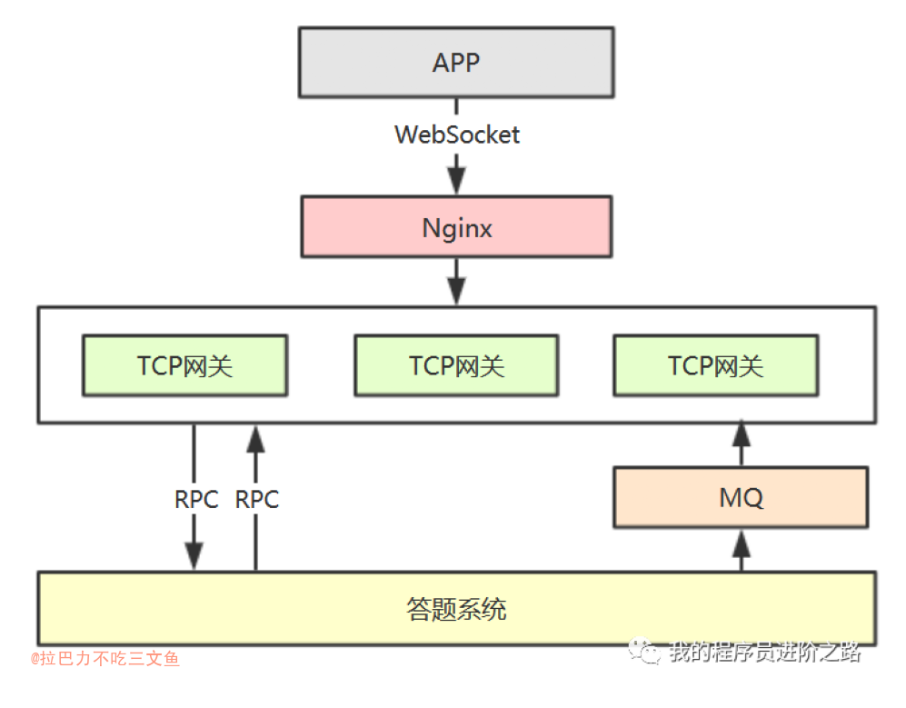

# 视频直播的实现原理
+ [网络协议-流媒体协议 ](https://www.cnblogs.com/stringarray/p/13027230.html)
+ 首先，网络协议将编码好的视频流，从主播端推送到服务器，在服务器上有个运行了同样协议的服务端来接收这些网络包，从而得到里面的视频流，这个过程称为接流。
+ 服务端接到视频流之后，可以对视频流进行一定的处理，例如转码，也即从一个编码格式，转成另一种格式。因为观众使用的客户端千差万别，要保证他们都能看到直播。流处理完毕之后，就可以等待观众的客户端来请求这些视频流，观众的客户端请求的过程称为拉流。
+ 如果有非常多的观众，同时看一个视频直播，那都从一个服务器上拉流，压力太大了，因而需要一个视频的分发网络（CDN），将视频预先加载到就近的边缘节点，这样大部分观众看的视频，是从边缘节点拉取的，就能降低服务器的压力。
+ 当观众的客户端将视频流拉下来之后，就需要进行解码，也即通过上述过程的逆过程，将一串串看不懂的二进制代码，再转变成一帧帧生动的图片，在客户端播放出来，这样你就能看到直播视频啦。

# 基本概念

+ <https://cloud.tencent.com/document/product/267/43393>

## 转码
+ 转码是将视频码流转换成另一个视频码流的过程，是一种离线任务。通过转码，可以改变原始码流的编码格式、分辨率和码率等参数，从而适应不同终端和网络环境的播放。使用转码功能可以实现：
	- 适配更多终端：将原始视频转码成拥有更强终端适配能力的格式，使视频资源能够在更多设备上播放。
	- 适配不同带宽：将视频转换成流畅、标清、高清或超清输出，用户可根据当前网络环境选择合适码率的视频播放。
	- 节省带宽：采用更先进的编码方式转码，在不损失原始画质的情况下显著降低码率，节省播放带宽。

## 视频编码
+ H.265是新的编码协议，也即是H.264的升级版。H.265标准保留H.264原来的某些技术，同时对一些相关的技术加以改进。
+ 视频编码：指通过特定的压缩技术，将某个视频格式的文件转换成另一种视频格式文件的方式。常见的音频视频编码有MPEG系列与H.26X系列。

## 容器
+ <https://blog.csdn.net/lxc1014/article/details/45666281>
+ mp4,rmvb,mkv,avi从形式上来说首先都是视频文件的扩展名，其次它们也是视频文件的封装格式（即容器）， mp4是MPEG-4标准的第14部分所制定的容器标准。所谓容器，就是把编码器生成的多媒体内容（视频，音频，字幕，章节信息等）混合封装在一起的标准。容器使得不同多媒体内容同步播放变得很简单，而容器的另一个作用就是为多媒体内容提供索引，也就是说如果没有容器存在的话一部影片你只能从一开始看到最后，不能拖动进度条（当然这种情况下有的播放器会话比较长的时间临时创建索引），而且如果你不自己去手动另外载入音频就没有声音。

# 普通直播
+ 直播类应用在产品功能上基本是这两类：
  - 1、直播的基础功能：连麦互动直播（支持多码率、多协议）等非功能性需求。--- 流相关服务
  - 2、应用本身的个性化功能：比如答题场景中的发题目、作答、公布答案等。--- 长连接相关服务

# 多人连麦/PK/聊天
+ [直播多人连麦技术简介](https://juejin.im/post/6844903777837776910)
+ [直播连麦技术对比-互动直播调研必看](https://zhuanlan.zhihu.com/p/43629518)
	- 基于WebRTC和RTMP结合的方案
	- 基于RTC的方案(声网、即构)
	- anyRTC直播方案
+ [直播连麦技术方案对比及测试方法](https://zhuanlan.zhihu.com/p/27086190)
	- SD-RTN™:这是声网的连麦架构，直播连麦的鼻祖。基于UDP，主播端、连麦端、观众端都在基于SD-RTN™进行实时通信，大大降低延时。主播端和连麦端也可以转码到CDN推流。
	- RTMP改进方案:基于TCP协议，基本思路是：主播接受连麦嘉宾的视频，在本地合图；主播和连麦嘉宾的视频同时传到服务端合图，然后通过CDN推到观众端。
	- WebRTC改进:主播和连麦嘉宾，基于WebRTC进行“视频会议”，将“视频会议”在服务端合图后推到CDN进行分发。

## 传统直播形式
+ 一个主播推流，广播给直播间所有的观众。一个直播间对应一个主播，并且仅有一路推拉流。
+ 基于协议RTMP做的单路直播互动。该模式下主播一个人表演，其他观众根据IM系统跟主播进行文字互动。
+ 总结：主播端推一路流，观众端CDN拉一路流。

## 连麦直播形式
+ 两个主播（另一个主播可能是观众）推流，广播给直播间所有观众。
+ 基于UDP做的多路实时互动直播。该模式下主播跟观众除了基于IM系统沟通外，还可以进行音视频互动，极大的方便了观众，互动效果更直观，更能有效吸引用户。

### 1基于RTMP协议优化方案
+ 主播A和主播B之间通过原有的推拉流路径去拉取对方的流内容。也就是说，主播A在推流同时，拉取主播B的流，主播B推流的同时拉取主播A的流。对于两个主播来说互为对方的观众。此时对于直播间内的其他观众而言，是分别拉取主播A和主播B的流，并展示出来。
+ 在此基础上可以进一步对主播两路流做混流，这样观众端只需要拉一路流。
+ 混流：可以在服务端做，也可以在其中一个主播的客户端做混流再推流（对主播设备性能有一定要求）

### 2基于P2P协议方案
+ 此方案的实现方式是，主播A和主播B之间通过P2P协议进行音视频连接，正常情况下能够保证较低的延迟，保证主播A和主播B之间的互动。主播A在自己的流内容基础上加入主播B的流内容，统一推向服务端。此时直播间内仅有一路流，并且其他观众也只需要拉取这一路流内容。
+ 此方案的优点是显而易见的，主播AB之间的延迟降低，交互体验好，观众保持原有逻辑不变，拉取直播间固定流地址。但是缺点是：主播A在连麦过程中需要承担两路推流一路拉流的压力，即拉取主播B的流内容，将自己的流内容推给主播B，将主播A和主播B的流内容推给服务端；主播A的网速压力和性能压力将会巨大，同时主播AB之间一对一的连接也导致扩展性较差，无法满足2人以上的业务场景需求。

### 3基于多人视频通话系统方案 （目前主流）
+ 此方案的实现方式是将主播A和主播B的视频交互交由第三方处理，目前比较成熟的技术有视频会议系统和Google开源的WebRTC系统。在此架构下，主播A与主播B的流合成处理上传都是由这个交互系统完成。此方案对于方案2来说减轻了主播端的压力，并且采用UDP协议传输方式降低延迟。同时也兼容多人连接交互。
+ 此方案缺点是对服务端开发量大，要求高。

### 第三方支持
+ 语音连麦聊天室集成介绍:<http://docs-im.easemob.com/rtc/scenario/tc>
+ 腾讯音视频技术平台：<https://cloud.tencent.com/document/product/267/44710>

---

## 推流
+ 使用ffmpeg推流到rtmp服务
	- `ffmpeg -re -i 1.mp4 -c copy -f flv rtmp://127.0.0.1:1935/live/movie`
	- [如何开发一款H5小程序直播](https://juejin.cn/post/6909479346646286343)

+ OBS 推流:<https://cloud.tencent.com/document/product/267/32726>
+ VLC播放器：<https://www.videolan.org/vlc/index.zh.html>,
<https://cloud.tencent.com/document/product/267/32727>

## 混流
+ 混流就是把多路音视频流合成单流。准确的说，混流应该叫做混音（音频流）混画（视频流）混流的过程包括解码、混流、编码和推流四个部分。混流这个环节包括做动冲，目的是把多路流进行画面对齐和音画同步，同时通过缓冲对抗网络抖动，以便混合成一路流以后能够达到良好的效果。在混流的过程中，难点是如何对抗网络抖动等不确定因素。

### 不混流的优势和劣势
+ 不混流的优势
	- 延迟低：不用混流，节省了混流消耗的时间，显著地降低了延迟
	- 成本低： 如果是在服务端进行混流，将会耗费计算资源。考虑到服务端计算资源比较昂贵，如果不用混流，将会节省宝贵的计算资源，显著地降低成本。虽然拉多流比起拉单流会消耗更多的带宽成本，但是拉多流节省计算资源成本，整体而言，成本是降低了。
	- 灵活性:在观众端，业务侧可以比较灵活的操控多路流，来满足多样化的业务需求。比如画中画大小画面相互切换，和对半分屏画面左右调换等效果，来提高观众端的用户体验。
+ 不混流的劣势
	- 拉多流会消耗更多的带宽。多路流被从服务端推到CDN, 然后观众端从CDN拉多流，都会耗费比较多的带宽成本。对于带宽成本占了运营成本显著，的确是需要慎重考量的。
+ 混流的优势
	- 成本：可以分为计算资源成本和带宽成本。由于预先做混流，因此计算资源成本会上去，但是由于只拉单流，因此带宽成本会下来。
	- 可录制：如果业务上有录制音视频流的需求，以备监管抽查或者观众回放的话，那么需要进行混流。如果不进行混流的话，录制的时候只能录制到其中一个路音视频流，也就是只能看到其中一个主播的画面。要录制全画面的话，必须要进行混流。
	- 易传播：如果业务上有通过音视频流地址链接(HLS)进行转发传播的需求，那么也需要进行混流，因为地址链接只会指向一路音视频流。如果不混流，使用转发的地址链接就只会播放出一个主播的音视频流。
+ 混流的劣势
	- 高延迟：由于在做混流的过程中，需要做抖动缓冲和实时转码等计算处理，将会耗费时间，从而造成额外的延迟。
	- 不灵活：由于观众端拉单流观看，多路音视频流已经被混合成单流，所以观众端无法再灵活地对多流进行操控，比如切换画中画的主次画面。
	- 服务器计算成本高：由于混流需要额外的计算资源，这里会导致额外的运营成本。

+ 服务端混流的优势
	- 低延迟
	- 计算资源可控
	- 网络带宽资源可控
	- 可控可扩展
+ 服务端混流的劣势
	- 服务器计算成本高
	- 服务端压力大

+ 混流工具: FFmpeg
	- 混流命令: `./ffmpeg -i “背景图” -i “rtmp://输入流1” -i “rtmp://输入流2” -filter_complex “nullsrc=size=1600x720 [base];[0:v] scale=1600x720 [main]; [1:v] crop=320:180:0:0 [photo1];[2:v] crop=320:180:0:0 [photo2];[base][main] overlay=x=0:y=0 [temp];[temp][photo1] overlay=x=1280:y=0 [temp1];[temp1][photo2] overlay=x=1280:y=180 [temp2]” -c:v libx264 -r 50 -bufsize 10M -f flv “rtmp://推流地址”`
	- 录制命令: `./ffmpeg -i rtmp://混流地址 test.mp4`

+ [基于FFmpeg混流及录制rtmp直播流](https://blog.csdn.net/Peng__Chao/article/details/107716008)

## 混音
+ [实时音频的混音在视频直播中的技术原理和实践总结](https://zhuanlan.zhihu.com/p/121010029)
+ 混音，顾名思义，就是把两路或者多路音频流混合在一起，形成一路音频流。实时音频混音，指的只是音频流的混合。
+ 混音的逻辑可以在终端设备上实现，也可以在服务器上实现，因此可以分为终端混音和云端混音。终端混音一般应用于背景配音，音乐伴奏等场景。云端混音可以是云端混流的一部分，主要目的是利用云端的计算能力去做多路音视频流的音画对齐，还有降低下行带宽成本；也可以做纯粹的云端混音，来实现合唱直播等场景的需求。

---

# 实现例子1
+ 火爆的直播应用，你了解背后的技术架构吗？:<https://mp.weixin.qq.com/s/2ucFww9MEdsKbMO8Wepg1A>
+ 音视频流采用了腾讯云的直播解决方案，而业务数据流（活动、题目、答案、弹幕、红包等）则采用了自研的长连接方案。

## 产品功能
+ 直播类应用在产品功能上基本是这两类：
  - 1、直播的基础功能：连麦互动直播（支持多码率、多协议，多主播同框）、美颜特效、弹幕、IM聊天、点赞、屏幕共享等功能性需求，以及防盗链、涉黄涉政鉴别等非功能性需求。
  - 2、应用本身的个性化功能：比如答题场景中的发题目、作答、公布答案，电商场景中的商品展示、一键下单购买，网红直播场景中的礼物打赏。

## 面临的技术挑战
+ 音视频处理及传输：涉及音视频编码、实时美颜、视频推流、CDN加速分发、终端适配和播放，流量统计等诸多技术点
+ 高带宽压力：按照标清视频的标准，观看直播的码流至少为1Mbps，如果100W用户在线，光视频流的出口带宽能达到976.56G bps。1条弹幕可达到130字节，1秒要滚屏20条弹幕，如果需要同时推送给100W用户，弹幕的出口带宽也将达到19.37G bps.  
+ 低延迟性要求：直播场景下如何整合视频流和业务数据流，做到声音、主播画面和题目同步，以保证用户体验

## 音视频处理及传输的方案选型
+ 第三方支持方案：音视频处理及传输，可以使用腾讯云的直播解决方案。主持人侧：通过演播室的专业摄像设备，搭载腾讯云提供的obs推流软件，即可进行视频录制和推流。用户侧：APP端集成腾讯云的SDK，动态拿到推流地址后即可观看直播。

## 业务数据流的方案选型
+ 业务数据是指除音视频以外的，和答题应用场景相关的数据（比如题目、答案、弹幕、红包等）。腾讯云提供了两种可选方案：
  - 1、题目预先设置好，直接由腾讯云的SDK通过音视频通道下发，打入直播流中。
  - 2、让题目先通过腾讯云的IM通道快速送达观众端APP，在观众端先缓存下来，等待播放器通知了预期的 NTP 时间戳之后，再把题目显示出来。
+ 自研业务数据流通道。这样视频流和业务数据流会分两个通道下发，因为业务流相对视频流的数据量很小，只要能保证业务逻辑的处理速度和业务数据的下行速度，“音-画-题”的延迟是可以接受的。毕竟当时已经是4G时代，如果用户侧的网速不行，视频流可能都无法正常观看了。

### 长连接、高性能的网关服务器
+ （支持100W用户同时在线，20W并发答题，弹幕实时推送等要求），我们的技术选型是：Netty、ProtoBuf、WebSocket，选型理由：
+ 1、Netty：Netty是当时最流行的高性能和异步NIO框架，直播答题的业务场景中，涉及到题目下发、弹幕、下红包雨等非常多的推送场景，而且一场答题活动中，客户端和服务端的通信频繁，长连接比短连接在性能上更优。
+ 2、ProtoBuf：作为客户端和服务端的数据交换格式，PB是一种效率和兼容性都很优秀的二进制数据传输格式，在码流和序列化速度上明显优于JSON、XML、hessian等主流格式，同时支持向前向后兼容以及各种主流语言。
+ 3、WebSocket：是 HTML5 一种新的协议，用来实现客户端与服务器端的长连接通讯。
  - 为什么使用WebSocket不使用TCP呢？TODO

### 基于TCP长连接的通信架构

+ 上面的通信架构用于业务数据流的传输，流程如下：
  - 1、客户端使用websocket与服务端进行通讯，用户进入答题直播间时建立连接，退出直播间时断开连接。
  - 2、Nginx对websocket做负载均衡。
  - 3、TCP网关基于netty实现，用于维持长连接和转发业务请求，不负责具体的业务逻辑，它和下层业务系统（答题系统）通过RPC接口进行交互，主要考虑后续其他业务可以复用TCP网关层，所以将业务下沉。客户端和网关之间通过心跳机制保证连接的有效性以及检测僵尸连接。
  - 4、消息推送（比如弹幕、下发题目、公布答案等诸多场景）由下层业务（答题系统）通过MQ通知TCP网关，再由TCP网关推送给客户端。

### 长连接通信中的数据传输格式定义
+ 客户端请求消息的格式
+ 客户端响应消息的格式

## 直播架构简单总结:
+ 1、音视频编码和传输，这些基础性的直播功能，除非公司有钱有实力，否则建议直接用腾讯云或者阿里云的解决方案（斗鱼、蘑菇街这些知名的直播应用都还用的腾讯云）。
+ 2、架构设计重点放在应用本身，根据直播应用的用户量级和业务特性先确定通信架构（长连接还是短链接，或者两者混用）。

# 实现例子2
+ 视频相亲背后的音视频方案 （多人连麦）
+ <https://cloud.tencent.com/developer/article/1579968>
+ [互动直播相亲交友源码低成本开发搭建如何处理音视频技术难点](https://www.bilibili.com/read/cv7985514/ 出处：bilibili)

1. 开发成本高、周期长
	- 实时音视频技术栈包含音视频编解码、音视频前后处理、信令、网络传输、高并发、高可用、系统监控、多个平台的终端开发，技术储备和开发成本是非常大的挑战。
2. 弱网环境下的音视频质量
	- 现实的网络环境非常复杂、用户使用中小网络运营商的服务，存在着非常多的不确定性，或多或少的丢包、不确定的网络延时和抖动。
3. 终端极致的性能要求
	- 多人同屏视频连麦的直播间，面对终端有限的算力、内存，实时音视频终端软件架构的设计会对通信的质量、时延都带来影响。

+ 一套互动直播相亲交友程序源码主播端到观众端有下面几个步骤：
	- 1、视音频信号实时采集；
	- 2、经过预处理和音视频编码；
	- 3、封装发送到CDN源站；
	- 4、播放端从CDN边缘拉到数据；
	- 5、然后进行解码；
	- 6、经过音视频同步之后；
	- 7、给观众展现出来。

+ 互动直播相亲交友系统的主要技术难点在于：
	- 1）低延迟互动：保证主播和互动观众之间能够实时互动，两者之间就像电话沟通，因此必须保证两者能在秒级以内听到对方的声音，看到对方的视频；
	- 2）音画同步：互动直播中对音画同步的需求和单向直播中类似，只不过互动直播中的延迟要求更高，必须保证在音视频秒级传输情况下的秒级同步。
	- 3）音视频实时合成：其他观众需要实时观看到对话结果，因此需要在客户端或者服务端将画面和声音实时合成，然后以低成本高品质的方式传输观众端。 

# 实现实例3
+ 会议系统
+ <https://www.juhe.cn/news/index/id/1568>
+ 缺点：
	- 会议系统很大程度上依赖专线服务，成本过高；
	- 会议系统很多不能在服务器做转码合成视频，对主播设备依赖过大。因为合图视频主要是由主播端编码、推送到CDN，一部分需要主播设备比较高端，另外需要主播网络比较好，否则依然解决不了连麦问题

+ RTC技术（WebRTC）

# 其他
+ 播放网络视频，通常解析库我们可以有多个选择，如FFMPEG，Daniulive SDK 或者 vitamio。
+ [H5 直播流播放器 Jessibuca]

# Reference
+ 火爆的直播应用，你了解背后的技术架构吗？:<https://mp.weixin.qq.com/s/2ucFww9MEdsKbMO8Wepg1A>
+ 直播新红海，狼人杀火爆背后的语音视频技术:<https://zhuanlan.zhihu.com/p/33092831>
+ 实时视频通话超低延迟架构的思考与实践：<https://blog.csdn.net/zego_0616/article/details/79651875>

