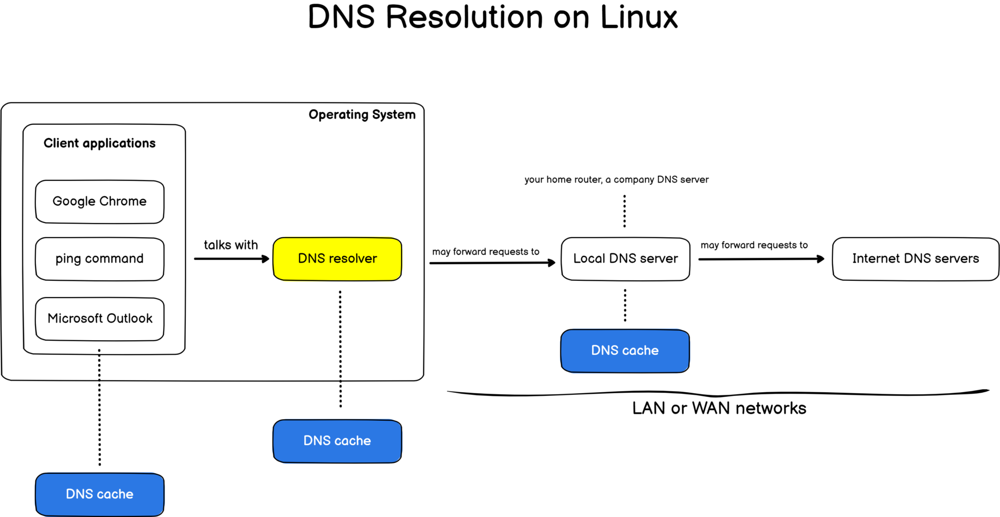

## 相关名词
+ DNS（Domain Name System）域名系统: 域名和IP地址映射关系
+ LocalDNS : 本地DNS服务器，一般是ISP（Internet Service Provider）提供。ISP，即是互联网服务提供商(比如电信、联通和移动三大电信运营商)；对于不同运营商间的互联互通，一般是采用BGP peering（对等）的方式进行
+ 地址解析协议，即ARP（Address Resolution Protocol）是将IP地址转换为MAC地址（TCP/IP数据链路层协议）；DNS协议则是将域名转换为IP地址（TCP/IP应用层协议）
+ ICANN  互联网名称与数字地址分配机构（The Internet Corporation for Assigned Names and Numbers）,全世界域名的最高管理机构。
+ CNNIC：中国互联网络信息中心（China Internet Network Information Center，CNNIC）是经国家主管部门批准，于1997年6月3日组建的管理和服务机构，行使国家互联网络信息中心的职责。
+ 可逆DNS（rDNS，reverse DNS）是一种把一个IP地址分解成一个域名的方法，正像域名系统（DNS）把域名分解成关联的IP地址。

## DNS解析流程
+ 不考虑每部分DNS缓存的情况下，DNS解析流程大致如下：

1. 【递归查询】用户机器（比如浏览器）-> 本地DNS服务器 
2. 【迭代查询】本地DNS服务器 -> DNS根服务器(返回域服务器)
3. 【迭代查询】本地DNS服务器 -> 域服务器(返回DNS服务器列表)
4. 【迭代查询】本地DNS服务器(选择一个DNS服务器) -> DNS服务器(返回域名对应的IP)（或返回其他权限服务器的IP地址，取决于域名的解析配置）
5. 本地DNS服务器 -> 权限服务器（可选步骤，取决于上一步的返回）
6. 用户机器（根据IP发送请求访问）

+ <https://devconnected.com/how-to-flush-dns-cache-on-linux/>

+ 浏览器等各个部分一般会缓存DNS记录一段时间
+ 本地DNS服务器（LocalDNS）使用迭代查询的方式请求；请求发起方（浏览器）使用递归查询的方式请求

+ 递归查询：本机向本地域名服务器发出一次查询请求，就静待最终的结果。如果本地域名服务器无法解析，自己会以DNS客户机的身份向其它域名服务器查询，直到得到最终的IP地址告诉本机
+ 迭代查询：本地域名服务器向根域名服务器查询，根域名服务器告诉它下一步到哪里去查询，然后它再去查，每次它都是以客户机的身份去各个服务器查询。
+ 通俗地说，递归就是把一件事情交给别人，如果事情没有办完，哪怕已经办了很多，都不要把结果告诉我，我要的是你的最终结果，而不是中间结果；如果你没办完，请你找别人办完。
迭代则是我交给你一件事，你能办多少就告诉我你办了多少，然后剩下的事情就由我来办。

## 域名的管理
+ .com等国际顶级域名的管理机构是ICANN；.cn等国内域名的管理机构是CNNIC
+ 用whois可以查询域名的相关信息
+ 域名具有管理密码和转移密码，域名转移密码又称为授权码（Authorization code）或 域名EPP代码（EPP Key）

+ 域名其实是具有一定的层次结构的，从上到下依次为：根域名、顶级域名（top level domain，TLD）、二级域名、（三级域名）
先来讲讲顶级域名（TLD），即最高层级的域名。简单说，就是网址的最后一个部分。比如，网址www.baidu.com 的顶级域名就是 .com。ICANN 的一项主要工作，就是规定哪些字符串可以当作顶级域名。
+ ICANN 自己不会去管理这些顶级域名，因为根本管不过来。想想看，顶级域名有1000多个，每个顶级域名下面都有许多批发商，如果每个都要管，就太麻烦了。ICANN 的政策是，每个顶级域名都找一个托管商，该域名的所有事项都由托管商负责。ICANN 只与托管商联系，这样管理起来就容易多了。举例来说，.cn 国家顶级域名的托管商就是中国互联网络信息中心（CNNIC），它决定了 .cn 域名的各种政策。
+ 由于 ICANN 管理着所有的顶级域名，所以它是最高一级的域名节点，被称为根域名（root domain）。在有些场合，www.xxx.com 被写成 www.xxx.com.，即最后还会多出一个点。这个点就是根域名。
+ 理论上，所有域名的查询都必须先查询根域名，因为只有根域名才能告诉你，某个顶级域名由哪台服务器管理。事实上也确实如此，ICANN 维护着一张列表（根域名列表），里面记载着顶级域名和对应的托管商。

## DNS服务器类别

### 权威 DNS
+ 权威 DNS 指域名在域名注册商处所设置的 DNS 服务器地址。该地址决定了该域名的解析管理权（新增，删除，修改等）。比如 DNSPod 的权威服务器：*.dnspod.net, * dnsv3.com 等。当域名设置权威服务器并设置了解析记录后，客户端请求域名时，权威服务器将返回该域名的对应的解析记录信息。

### Local DNS
+ Local DNS 是 DNS 查询中的第一个节点。Local DNS 作为客户端与 DNS 域名服务器的中间人。客户端发送 DNS 查询时，Local DNS 将使用缓存的数据进行响应，或者将向根域名服务器发送请求，接着向根域名服务器发送另一个请求，然后向权威 DNS 发送最后一个请求。收到来自包含已请求 IP 地址的权威 DNS 服务器的响应后，Local DNS 将向客户端发送响应。

+ 在此过程中，Local DNS 将缓存从权威 DNS 服务器收到的信息。当一个客户端请求的域名 IP 地址是另一个客户端最近请求的 IP 地址时，Local DNS 可绕过与域名服务器进行通信的过程，并仅从第二个客户端的缓存中为第一个客户端提供所请求的记录。

### 公共 DNS
+ 公共DNS，指面向所有互联网用户的全球公共递归域名解析服务。和仅使用本地 LocalDNS 的传统解析服务相比，公共解析服务，一般具备更加“快速”、“稳定”、“安全”互联网访问。

## DNS常用命令
+ dig、 host、nslookup、traceroute、whois

## 解惑

### 域名提供商和电信服务提供商之间DNS的关系？
1. 域名提供商(域名注册商)（ICANN等授权的管理机构）；电信服务提供商（ISP）
2. ISP的DNS：LocalDNS
3. 域名提供商的DNS （腾讯、阿里云等），将自己的dns服务的ip直接在各个ISP中进行登记，使得ISP的DNS服务能转发过来查找，得到域名对应的ip
4. 域名并不依赖平台，比如阿里万网只是个注册商，注册完域名后有相应的转移密码。转移密码有多种用途，比如可以在多个DNS服务商托管域名解析（有的域名注册商不一定有对应的DNS服务，而且在多个DNS服务商解析可以起到容灾作用）

### 运营商DNS和公共DNS
+ 如何不特意去设置，我们用的就是运营商DNS（由DHCP分配）
+ 目前国内电信运营商通过使用DNS劫持和DNS污染的方法，干扰用户正常上网，使得用户无法访问众多国外常用服务，因此可以使用公共DNS

### 自己创建的域名怎么让其他dns服务器解析
+ 除非用户自行设置指定你的dns服务公网ip，否则只有成为认证通过的注册服务商才行
+ 比如阿里云域名的解析生效，第一步是 阿里云 DNS 必须首先生效，然后等待世界各地 Local DNS 生效，可以通俗的理解为各大电信运营管理的 DNS 需要及时同步 阿里云 DNS 解析记录，才能最终生效。 网站是否能访问，直接相关的是 Local DNS， 阿里 云解析都是实时生效的，一般只需几秒即可同步到各地 Local DNS 上，但各地 Local DNS 均有缓存机制，解析的最终生效取决于各运营商刷新时间。

### DNS解析相关疑问
+ DNS协议是应用层的协议，解析过程发生在用户态。
+ DNS协议既使用了UDP，也使用了TCP，使用的端口号都为 53。大多数情况下 DNS 都使用 UDP 进行传输。
+ DNS在区域传输的时候使用TCP协议，其他时候使用UDP协议；DNS区域传输的时候使用TCP协议
+ 举个例子：浏览器返回某个HTTP服务
    1. 浏览器调用“DNS解析模块”发出UDP请求得到域名的ip（DNS 应用层）
    2. 浏览器调用TCP（内核系统调用）发出HTTP请求（TCP 传输层）
    3. TCP通过ARP协议得到mac地址 （ARP 数据链路层）
+ “DNS解析模块” 是在哪里实现的？
    1. 程序自行解析实现（从/etc/resolv.conf中取出本地dns server地址列表， 发送DNS请求(UDP报文)并获得结果）
    2. 调用到c标准库的getaddrinfo或getnameinfo函数
        - 要想知道getaddrinfo是如何查询信息的，可以用strace工具，追踪getaddrinfo函数 在执行时打开了哪些文件
        - resolv.conf是各种操作系统域名系统解析器（DNS Resolver）的配置文件。每当一个程序需要通过域名来访问Internet上面的其它主机时，需要利用Resolver库函数将域名转换成对应的IP，然后才可进行访问。
        - 域名系统解析器（DNS Resolver）并非一个可执行程序，而是C语言的一系列库函数，用于解析resolv.conf获取域名对应的IP。
    3. 操作系统中并不存在“DNS 查询”这个系统调用; 不同程序可能采用不同的策略获取名字对应的 IP 地址

### dns-resolver相关
+ <https://docs.microsoft.com/en-us/windows/win32/dns/dns-resolvers>
+ <https://datacadamia.com/os/linux/resolv.conf>    
+ [DNS Resolver Module](https://www.kernel.org/doc/html/latest/networking/dns_resolver.html)
    - The DNS resolver module provides a way for kernel services to make DNS queries by way of requesting a key of key type dns_resolver. These queries are upcalled to userspace through /sbin/request-key.

## Reference
+ [DNS、CDN加速和域名解析之间的关系](https://cloud.tencent.com/developer/article/2000101)
+ [权威DNS、Local DNS、公共DNS有什么区别](https://www.vpsgongyi.net/archives/2197.html)
+ [DNS用的是TCP协议还是UDP协议](https://www.cnblogs.com/wuyepeng/p/9835839.html)
+ [超详细 DNS 协议解析](https://zhuanlan.zhihu.com/p/351059293)
+ [DNS（域名解析协议）详解](https://blog.csdn.net/baidu_37964071/article/details/80500825)
+ [getaddrinfo工作原理分析](https://www.cnblogs.com/battzion/p/4235562.html)
+ [Linux DNS 查询剖析](https://zhuanlan.zhihu.com/p/42898476)