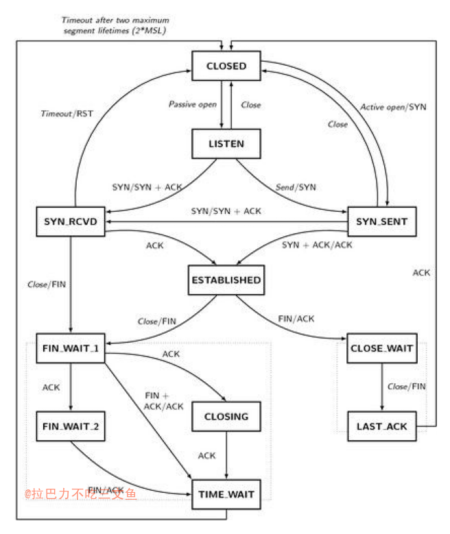

## 状态说明
+ CLOSED：无连接是活动的或正在进行
+ LISTEN：服务器在等待进入呼叫
+ SYN_RECV：一个连接请求已经到达，等待确认
+ SYN_SENT：应用已经开始，打开一个连接
+ ESTABLISHED：正常数据传输状态
+ FIN_WAIT1：应用说它已经完成
+ FIN_WAIT2：另一边已同意释放
+ ITMED_WAIT：等待所有分组死掉
+ CLOSING：两边同时尝试关闭
+ TIME_WAIT：另一边已初始化一个释放
+ LAST_ACK：等待所有分组死掉

### flags 标志
+ S(SYN)
+ F(FIN)
+ P(PUSH)
+ R(RST)

## 常用命令

### 查看主机上的TCP连接状态
+ `netstat –an`
+ `netstat –an |grep 'CLOSE_WAIT'`
+ `ss -t -n|grep 5000`

### 统计当前各种状态的连接的数量的命令
+ `netstat -n | awk '/^tcp/ {++S[$NF]} END {for(a in S) print a, S[a]}'`

### 查看指定端口的连接
+ `netstat -an | awk 'NR==2 || $4~/65016/'`（client）
+ `netstat -an | awk 'NR==2 || $5~/8080/'`（server）

### Linux netstat命令详解
+ <http://www.cnblogs.com/ggjucheng/archive/2012/01/08/2316661.html>

### tcpdump
+ 想知道我们可以通过哪几个网卡抓包，可以使用-D参数 : `tcpdump –D`
+ 将抓包结果存放在文件中(可以用Wireshark打开查看) : `tcpdump –w google.cap`
+ 其中http协议的数据包都给过滤出来: `tcpdump –r google.cap http`

+ <http://www.cnblogs.com/zhuimengle/p/5737848.html>

## Reference
+ [TCP/IP TIME_WAIT状态原理](http://elf8848.iteye.com/blog/1739571) 

## todo
+ [tcp 三次握手和四次断连深入分析：连接状态和socket API的关系](https://blog.csdn.net/yunhua_lee/article/details/40513677)
    - close函数其实本身不会导致tcp协议栈立刻发送fin包，而只是将socket文件的引用计数减1，当socket文件的引用计数变为0的时候，操作系统会自动关闭tcp连接，此时才会发送fin包。
    - 这也是多进程编程需要特别注意的一点，父进程中一定要将socket文件描述符close，否则运行一段时间后就可能会出现操作系统提示too many open files

