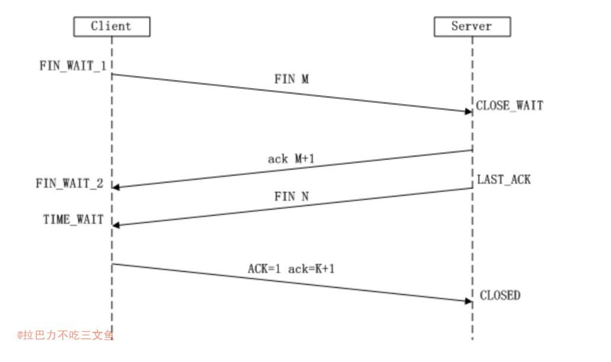

## TIME_WAIT
+ 通信双方建立TCP连接后，主动关闭(FIN)连接的一方就会进入TIME_WAIT状态
    - 客户端主动关闭连接时，发送最后一个ack后，会进入TIME_WAIT状态，再停留2个MSL时间，进入CLOSED状态

## TIME_WAIT状态存在的理由
1. 可靠地实现TCP全双工连接的终止
    - TCP协议在关闭连接的四次握手过程中，最终的ACK是由主动关闭连接的一端（后面统称A端）发出的，如果这个ACK丢失，对方（后面统称B端）将重发出最终的FIN，因此A端必须维护状态信息（TIME_WAIT）允许它重发最终的ACK。如果A端不维持TIME_WAIT状态，而是处于CLOSED 状态，那么A端将响应RST分节，B端收到后将此分节解释成一个错误（在java中会抛出connection reset的SocketException)。
    - 因而，要实现TCP全双工连接的正常终止，必须处理终止过程中四个分节任何一个分节的丢失情况，主动关闭连接的A端必须维持TIME_WAIT状态 。
    - 对一个具体实现所给定的MSL值，处理的原则是：当TCP执行一个主动关闭，并发回最后一个ACK，该连接必须在TIMEWAIT状态停留的时间为2倍的MSL。这样可尽可能让TCP再次发送最后的ACK以防这个ACK丢失(另一端超时并重发最后的FIN)。
    - 总结：尽量避免主动关闭方ack丢失导致被关闭方异常（理论上从应用层看，被关闭方需要对这种异常进行处理，因为万一主动关闭方断电了呢）


2. 允许老的重复分节在网络中消逝
    - TCP分节可能由于路由器异常而“迷途”，在迷途期间，TCP发送端可能因确认超时而重发这个分节，迷途的分节在路由器修复后也会被送到最终目的地，这个迟到的迷途分节到达时可能会引起问题。在关闭“前一个连接”之后，马上又重新建立起一个相同的IP和端口之间的“新连接”，“前一个连接”的迷途重复分组在“前一个连接”终止后到达，而被“新连接”收到了。为了避免这个情况，TCP协议不允许处于TIME_WAIT状态的连接启动一个新的可用连接，因为TIME_WAIT状态持续2MSL，基本可以保证当成功建立一个新TCP连接的时候，来自旧连接重复分组已经在网络中消逝。
    - IP包的最大生存时间记录在其TTL字段中，即MSL，超过将过期丢弃


## MSL时间
+ MSL就是maximum segment lifetime(最大分节生命期），这是一个IP数据包能在互联网上生存的最长时间，超过这个时间IP数据包将在网络中消失 。MSL在RFC 1122上建议是2分钟，而源自berkeley的TCP实现传统上使用30秒。
TCP报文段以IP数据报在网络内传输，而IP数据报则有限制其生存时间的TTL字段  
+ TIME_WAIT状态维持时间是两个MSL时间长度，也就是在1-4分钟。Windows操作系统就是4分钟。
+ 为什么需要2MSL？
    - 第一个MSL是为了等自己发出去的最后一个ACK从网络中消失，同时让旧的数据包基本在网络中消失；
    - 第二MSL是为了等在对端收到ACK之前的一刹那可能重传的FIN报文从网络中消失（主要目的）
    - 问题：重传的FIN报文会重传多少次？
        - 重发次数由 tcp_orphan_retries 参数控制
    - 所以如果最后一个ack丢了，且对端又重试发FIN，那么还是无法避免FIN包没过期，所以2MSL只是尽可能，但这时旧的数据包基本消失了    


## 总结
+ TIME_WAIT主动关闭方的状态  
+ TIME_WAIT存在的原因
    1. 防止主动关闭方最后的ACK丢失，确保远程TCP接收到连接中断的请求
    2. 允许老的重复数据包在网络中过期


## TIME_WAIT产生的场景
+ 进入TIME_WAIT状态的一般情况下是客户端。
+ 大多数服务器端一般执行被动关闭，服务器不会进入TIME_WAIT状态。
但在服务器端关闭某个服务再重新启动时，服务器是会进入TIME_WAIT状态的。
可以使用SO_REUSEADDR选项来复用端口。

<pre>
举例：
1.客户端连接服务器的80服务，这时客户端会启用一个本地的端口访问服务器的80，访问完成后关闭此连接，立刻再次访问服务器的
80，这时客户端会启用另一个本地的端口，而不是刚才使用的那个本地端口。原因就是刚才的那个连接还处于TIME_WAIT状态。
2.客户端连接服务器的80服务，这时服务器关闭80端口，立即再次重启80端口的服务，这时可能不会成功启动，原因也是服务器的连
接还处于TIME_WAIT状态。
</pre>

## 作为客户端和服务器
1. 服务端提供服务时，一般监听一个端口就够了；
2. 客户端则是使用一个本地的空闲端口（大于1024），与服务器的端口建立连接；
    - 如果使用短连接请求，那么客户端将会产生大量TIME_WAIT状态的端口（本地最多就能承受6万个TIME_WAIT状态的连接就无端口可用了，后续的短连接就会产生address already in use : connect的异常）
    - 因此，作为短连接请求的压测服务器，不能在短时间连续使用；
    - 一般来说一台机器可用Local Port 3万多个，如果是短连接的话，一个连接释放后默认需要60秒回收，30000/60 =500 这是大概的理论TPS值
3. 一个提供高并发的服务器，同时依赖第三方服务（间接看来服务端也作为第三方服务的客户端），怎么应对 ？
    - 一般情况都是启用keepalive选项，避免短连接服务（一般依赖方也不会多达几千个，即调用的ip和端口不一样）
    - 启用SO_REUSEADDR选项
4. 大多数服务器端一般执行被动关闭，服务器不会进入TIME_WAIT状态


## 如何复用TIME_WAIT端口
1. 应用层发出请求前指定，如何Java HttpClient中设置reuseaddr
```java
httpClient.setHttpRequestRetryHandler(new DefaultHttpRequestRetryHandler());
httpClient.setReuseStrategy(new DefaultConnectionReuseStrategy());
httpClient.setKeepAliveStrategy(new DefaultConnectionKeepAliveStrategy());
```
2. 调整内核参数（net.ipv4.tcp_tw_reuse）

## 总结避免TIME_WAIT的方法
1. 使用长连接（基本大部分业务场景都可以）
2. 避免主动关闭
3. 关闭的时候使用RST的方式 （比如程序中设置socket的SO_LINGER选项）(应用层貌似不是很方便实现)
4. TIME_WAIT状态的TCP允许重用
5. 增大可用端口范围，默认是 net.ipv4.ip_local_port_range = 32768 61000 （即对同一个服务器的ip+port可创建28233个连接）（只能缓解问题，不能根本解决问题）

## Reference
+ [TCP/IP TIME_WAIT状态原理](https://www.iteye.com/blog/elf8848-1739571)
+ [发现大量的TIME_WAIT解决办法](https://blog.51cto.com/kerry/105233)
+ [《TCP IP详解卷一》18.6.1]
+ [为什么 TCP 协议有 TIME_WAIT 状态](https://mp.weixin.qq.com/s/LNWv5I-klJCBCX4e84WbTQ)
+ [TCP四次挥手为何需要TIME_WAIT以及为何是2MSL？](https://www.cnblogs.com/joker1937/articles/12487776.html)
+ [TCP 才不傻：三次握手和四次挥手的异常处理](https://zhuanlan.zhihu.com/p/398890723)
+ [tcp短连接TIME_WAIT问题解决方法大全](https://www.helloworld.net/p/4875307437)