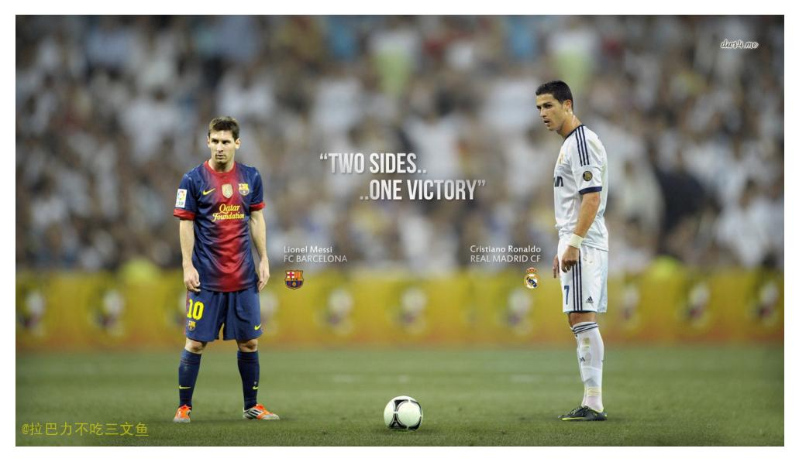

借本书记录自己的想法(从前混乱的头脑，没能及时总结)，阅读这本书有种相逢恨晚的感觉，有相似或者认同的想法.

>> “黑客精神”是这本书的核心理念所在。“黑客”本身具有各种各样的描述和象征意义。在不同场景下，人们对“黑客”的定义也不一样。在保罗的观念里，以及在YC和奇绩创坛的实践观察中，我们发现，黑客精神的真谛是动手去创造性地解决问题。“解决问题”必须跟人的需求有关，需要持久地满足越来越多人的需求。“动手”需要有勇气，很务实，以行动为导向，除此以外，黑客还必须是一个积极向上的人。“创造性”则意味着不受束缚、敢于探索。此外，黑客精神还意味着独立思考，坚持说真话。“动手去创造性地解决问题”代表了创造者一系列的核心行为和思想状态。这句话虽然听上去很简单，但它具有深刻含义，且完全反映了创造者的核心要素。

>> 在本书中，“黑客”就是指最优秀的程序员，而不是入侵计算机系统的人。

>> 作者想让公众了解，黑客并不神秘，更不是技术怪人。《黑客与画家》这个书名就是在提示应该把黑客与画家当作同一种人看待。和画家一样，黑客只是怀有一门特殊手艺、有创造天赋的普通人。这个书名还有另一层含义，即编程是一种艺术创作，黑客就是艺术家，开发软件与画家作画、雕塑家雕刻、建筑师设计房屋并没有本质不同。

+ 写通用的基础sdk就是一种艺术创作，封装，易用，优雅，安全，高效

##  第一部分 黑客如何成长及看待世界

### 1为什么书呆子不受欢迎

>> 为什么黑客那么在乎言论自由？我认为，部分原因在于，革新对于软件行业实在是太重要了，而革新和异端实际上是同一件事。优秀的黑客养成了一种质疑一切的习惯。

+ 我很喜欢质疑, 有些理论上成立的东西, 如果直觉不认可, 我喜欢亲自去验证它。

>> 我认为，这就是问题的根源。“书呆子”的目标具有两重性。他们毫无疑问想让自己受欢迎，但是他们更愿意让自己聪明。

+ 很多事情并是只有0或1, 不是你不想要, 只是事情总有优先级
+ 来自微信读书评论: 想和去做是两码事，没人不希望自己受欢迎，但聪明人有更重要的事要做。不在乎名利不见的有多聪明。
+ 来自微信读书评论: 没有人喜欢孤独，怎么样才会受欢迎很多人都知道，只不过不想去做罢了。

>> 举例来说，大多数人似乎认为，绘画能力与生俱来，画家就像高个子一样，是天生的。事实上，大多数“会画”的人，本身就很喜欢画画，将许多时间投入其中，这就是他们擅长画画的原因。同样，受欢迎也不是天生的，而是需要你自己争取来的。

+ 之前投入的大量时间, 才让现在似乎得心应手。

>> 一般来说，成年人就不会去欺负书呆子。为什么小孩子会这样做呢？一个原因是，青少年在心理上还没有摆脱儿童状态，许多人会残忍地对待他人。他们折磨书呆子的原因就像拔掉一条蜘蛛腿一样，觉得很好玩。在一个人产生良知之前，折磨就是一种娱乐。

+ 确实,很多人小时候都这样,特别是男孩子,后天正确的引导很重要。

>> 没有什么比一个共同的敌人更能使得人们团结起来了。

+ 这提醒我有时要看清问题的本质以及别人的真正目的,避免被误导,毕竟希望自己是个聪明的人。

>> 如果我没记错的话，最受欢迎的孩子并不欺负书呆子，他们不需要靠踩在书呆子身上来垫高自己。大部分的欺负来自处于下一等级的学生，那些焦虑的中间层。

+ 确实, 人类社交属性的同时, 也会产生对比和嫉妒, 时刻提醒自己不做这种无意义的事

>> 没错，成年人不知道孩子们内部发生的事。认识到这一点很重要。在抽象意义上，成年人知道孩子的行为有时是极端残酷的，这正如我们在抽象意义上知道贫穷国家的人们生活极端艰难。但是，像所有人一样，成年人不喜欢揪住这种令人不快的事实不放。你不去埋头探寻，就不会发现具体的证据，就会永远以为这件事是抽象的。

+ 很多成年人都忘记自己小孩子时所经历的感觉, 表现出很不理解小孩子的行为, 并粗暴的归结为叛逆, 其实他们根本不想去了解和回忆, 觉得这浪费他们的精力, 毕竟他们还有很多“正经事”

>> 总体上看，我就读的学校与上面说的监狱差不多。校方最重视的事情，就是让学生待在自己应该待的位置。与此同时，让学生有东西吃，避免公然的暴力行为，接下来才是尝试教给学生一些东西。除此以外，校方并不愿意在学生身上多费心思。就像监狱的狱卒，老师们很大程度上对学生是放任自流的。结果，学生就像犯人一样，发展出了野蛮的内部文化。

+ 将心比心, 很多人都这样, 无可厚非, 毕竟大部分人工作仅仅为了维持生活的收入, 多一事不如少一事, 当然还是有很多伟大负责任的老师

>> 当你所做的事情能产生真实的效果，那就不仅仅是好玩而已了，发现正确的答案就开始变得重要了，这正是书呆子的优势所在。你马上就能联想到比尔·盖茨。他不善于社交是出了名的，但是他发现了正确的答案，至少从收入上看是如此。

+ 当你有影响力的时候, 别人才会高看你, 很现实但很真实

>> 至于学校，不过是这个虚假环境中关住“牲口”的围栏。表面上，学校的使命是教育儿童。事实上，学校的真正目的是把儿童都关在同一个地方，以便大人白天可以腾出手来把事情做完。我对这一点没有意见，在一个高度工业化的社会，对孩子不加管束，让他们四处乱跑，无疑是一场灾难。

+ 工作的束缚, 时常在想这是什么阴谋和圈套, 我们真的需要每天工作这么长的时间? 或者我们真的需要这样被限制性的工作? 太多的疑问了.

>> 这种看法无所不在，甚至孩子们自己都相信了，但是相信这种话可能一点帮助也没有。你告诉一个人，他的脚天生就是坏的，并不能阻止他去怀疑他可能穿错了鞋子。

+ 时刻记住, 逻辑的严谨: 充分必要条件, 控制变量法

>> 还有别的问题存在，甚至可能是更糟糕的问题。那就是我们没有得到真正的工作，没能发挥我们的才能。人类喜欢工作，在世界上大多数地方，你的工作就是你的身份证明。但是，我们那时做的所有事情根本就是无意义的，至少那时看来是这样。

>> 而且，没有办法回避那些事情。成年人已经达成共识，认定通往大学的途径就是这样的。逃离这种空虚生活的唯一方法，就是向它屈服。

+ 读大学前学的很多知识, 很大概率是你下大半辈子没用的, 学习它仅仅是因为通向大学的筛选机制

>> 我们有一个专门的短语描述这种情况，即对于在没有任何严肃标准的前提下产生排名的情况，我们会说情况“倒退至人缘比赛”（degenerate into a popularity contest）。

+ 微信投票、升级加薪、绩效等

>> 没有外在的对手，孩子们就互相把对方当作对手

>> 如果存在针对真正能力的外部测试，待在等级关系的底层也不会那么痛苦。球队的新人并不会怨恨老队员的球技，他希望有一天自己也能球技高超，所以很高兴有机会向老队员求教。老队员可能也会因此产生一种传帮带的光荣感（noblesse oblige）。最重要的是，老队员的地位是通过他们本身出色的能力获得的，而不是通过排挤他人获得的。

+ 共同的敌人? 共同的目标?

>> 我误解最深的一个词是“老成”（tact）。成年人使用这个词，含义似乎就是“闭上嘴巴，不要说话”。我以为它与“缄默”（tacit）和“不苟言笑”（taciturn）有着相同的词根，字面意思就是“安静”。我对自己发誓，我绝不要变成“老成”的人，没有人能够让我闭上嘴巴。可是事实上，这个词的词根与“触觉”（tactile）相同，它真正的意思是“熟练”。“老成”的反义词是“笨拙”（clumsy）。进入大学以后，我才搞明白了这个词。

+ 叛逆、愤青? 很多人根本不知道怎么解释, 抑或是自己被洗脑了, 懦弱, 只会站在道德制高点给你贴标签. 而我可能注定“叛逆”到死
+ 来自微信读书评论: 许多人的所谓成熟，不过是被习俗磨去了棱角，变得世故而实际了。那不是成熟，而是精神的早衰和个性的夭亡。真正的成熟，应当是独特个性的形成，真实自我的发现，精神上的结果和丰收。  ——尼采

>> 校园生活的真正问题是空虚。除非成年人意识到这一点，否则无法解决这个问题。可能意识到这个问题的成年人，是那些读书时就是书呆子的人。

+ 作为一个“坏孩子”, 有时我很理解别人所认为的“坏孩子”的感受

### 2黑客与画家

>> 黑客与画家的共同之处，在于他们都是创作者。与作曲家、建筑师和作家一样，黑客和画家都试图创作出优秀的作品。他们本质上都不是在做研究，虽然在创作过程中，他们可能会发现一些新技术（那样当然更好）

+ 有时候, 写代码, 特别是对一些通用逻辑进行抽象的时候, 确实有种愉悦感, 甚至完成之后还会反复的欣赏自认为是优雅的设计

>> 我一直不喜欢“计算机科学”这个词，主要原因是根本不存在这种东西。

>> 计算机科学就像一个大杂烩，由于某些历史意外，很多不相干的领域被强行拼装在一起。这个学科的一端是纯粹的数学家，他们自称“计算机科学家”，只是为了得到国防部研究局（DARPA）的项目资助。中间部分是计算机博物学家，研究各种专业性的题目，比如网络数据的路由算法。另一端则是黑客，只想写出有趣的软件，对于他们来说，计算机只是一种表达的媒介，就像建筑师手里的混凝土，或者画家手里的颜料。所以，在“计算机科学”的名下，数学家、物理学家和建筑师都不得不待在同一个系里。

+ 很多技术的实现就是那样, 但有些人总能包装成高大上的东西, 特别是在大公司. 我并不是批判这种行为, 相反我实际上有点羡慕这种能力.

>> 黑客搞懂“计算理论”（theory of computation）的必要性，与画家搞懂颜料化学成分的必要性差不多大。一般来说，在理论上，你需要知道如何计算“时间复杂度”和“空间复杂度”（time and space complexity）；如果你要写一个解析器，可能还需要知道状态机（state machine）的概念；除此以外，并不需要知道特别多的理论。这些可比画家必须记住的颜料成分少很多。我发现，黑客新想法的最佳来源，并非那些名字里有“计算机”三个字的理论领域，而是其他创作领域。与其到“计算理论”领域寻找创意，你还不如在绘画中寻找创意。

+ 就像现在IT行业盛行的八股文一样, 简直走火入魔. 我并不认为理论和原理并不重要, 但是跟清楚“颜料成分是多少”一样, 你很厉害, 但实际上大部分情况下对工作用处不大. 世界上的知识太多了, 这些细节没有人的全部掌握. 而知识的广度, 快速学习和搜索知识的能力, 对于程序员来说才是更重要的. 当然我能理解, 考核人员的无能以及巨大的岗位竞争, 产生了如今的现状.

>> 如果黑客认识到自己与其他创作者——比如作家和画家——是一类人，这种诱惑对他就不起作用。作家和画家没有“对数学家的妒忌”，他们认为自己在从事与数学完全不相关的事情。我认为，黑客也是如此。如果大学和实验室不允许黑客做他们想做的事情，那么适合黑客的地方可能就是企业。不幸的是，大多数企业也不允许黑客做他们想做的事情。大学和实验室强迫黑客成为科学家，企业强迫黑客成为工程师。

+ 确实, 想任性的做自己的事, 可能是创业吧, 但是需求是什么?

>> 直到最近我才发现这一点。雅虎收购Viaweb的时候，他们问我想做什么。我对商业活动从来都没有太大兴趣，就回答说我想继续做黑客。等我来到雅虎以后，发现在他们看来，“黑客”的工作就是用软件实现某个功能，而不是设计软件。在那里，程序员被当作技工，职责就是将产品经理的“构想”（如果这个词是这么用的话）翻译成代码。这似乎是大公司的普遍情况。大公司这样安排的原因是降低结果的标准差。因为实际上只有很少一部分黑客懂得如何正确设计软件，公司的管理层很难正确识别到底应该把设计软件的任务交给谁，所以，大部分公司不把设计软件的职责交给一个优秀的黑客，而是交给一个委员会，黑客的作用仅仅是实现那个委员会的设计。

1. 很奇怪的现象, 很多大公司很喜欢全部员工一起开总结大会, 然后说员工需要提出自己的产品想法之类的. 实际上, 平常的工作中, 产品说了算, 甚至都不会听程序员的意见, 直接扔出一句“这是老板的需求”, 所以我一直认为开这种大会, 其实就是形式主义. 甚至开会的内容和现实对比, 可笑至极, 讽刺至极. 
2. 这样的产品, 把自己当成传话筒, 工具人, 直接躺平混日子了. 他们的目标只是满足老板的需求, 而不是用户的需求. 他们的目标只是保住工作混工资. 可是仔细想想, 很多人包括我自己, 又到达哪种境界呢? 可能大家其实半斤八两吧. 
3. 公司的目的是降低风险. 有时交给委员会, 实际上也是对普通员工的一种“保护”

>> 所有创作者都面临这个问题。价格是由供给和需求共同决定的。好玩的软件的需求量，比不上解决客户麻烦问题的软件的需求量；在小剧场里演出的酬劳，比不上穿着卡通大猩猩服装、在展览会上为厂商站台的酬劳；写小说的回报比不上写广告文案的回报；开发编程语言的收入，比不上把某些公司老掉牙的数据库连上服务器的收入。黑客如何才能做自己喜欢的事情？我认为这个问题的解决方法是一个几乎所有创作者都知道的方法：找一份养家糊口的“白天工作”（day job）。这个词是从音乐家身上来的，他们晚上表演音乐，所以白天可以找一份其他工作。更一般地说，“白天工作”的意思是，你有一份为了赚钱的工作，还有一份为了爱好的工作。

+ 对于“晚上”工作, 其实我并没有找到明确的目标, 又或者自身太过于“急躁”了

>> 因为黑客更像创作者，而不是科学家，所以要了解黑客，不应该在科学家身上寻找启示，而是应该观察其他类型的创作者。那么，从画家身上，我们还能借鉴到什么对黑客的启示呢？有一件事情是可以借鉴的（至少可以确认），那就是应该如何学习编程。画家学习绘画的方法主要是动手去画，黑客学习编程的方法也理应如此。大多数黑客不是通过大学课程学会编程的，而是从实践中学习，有的13岁时就自己动手写程序了。即使上了大学，黑客学习编程依然主要通过自己写程序。

+ 确实, 需要先模仿, 再创新. 很多东西确实有共同的特点

>> 绘画还有一个值得借鉴的地方：一幅画是逐步完成的。通常一开始是一张草图，然后再逐步填入细节。但是，它又不单纯是一个填入细节的过程。有时，原先的构想看来是错的，你就必须动手修改。无数古代油画放在X光下检视，就能看出修改痕迹，四肢的位置被移动过，或者脸部的表情经过了调整。绘画的这个创作过程就值得学习。我认为黑客也应该这样工作。你不能盼望先有一个完美的规格设计，然后再动手编程，这样想是不现实的。如果你预先承认规格设计是不完美的，在编程的时候，就可以根据需要当场修改规格，最终会有一个更好的结果。

1. 软件的设计, 比如一些通用框架, 或者服务架构, 当然是最好一开始就想清楚, 并设计好(并不代表后续不能改动), 这样有助于后续细节的实现, 也有一个基本的大局观, 同时也可以提前发现存在的问题, 避免后续的无用功, 还有提前确认好项目风险等等. 
2. 这个问题其实我是潜意识知道的，但还是因为懒，感觉太累不想思考，选择做一下具体的细节先，但有时也算是一种适当的放松吧

>> 黑客就像画家，工作起来是有心理周期的。有时候，你有了一个令人兴奋的新项目，你会愿意为它一天工作16个小时。等过了这一阵，你又会觉得百无聊赖，对所有事情都提不起兴趣。为了做出优秀的工作，你必须把这种心理周期考虑在内。只有这样，你才能根据不同的事情找出不同的应对方法。你有一辆手动变速的汽车，你把它开上山，有时不得不松开离合器，防止汽车熄火。同样，暂时放手有时也能防止热情熄火。对于画家和黑客这样的创作者，有些工作需要投入巨大的热情，另一些工作则是不需要很操心的日常琐事。在你厌倦的时候再去做那些比较容易的工作，这是一个不错的主意。对于编程，这实际上意味着你可以把bug留到以后解决。消灭bug对我来说属于轻松的工作，只有在这个时候，编程才变得直接和机械，接近社会大众想象中的样子。消灭bug的过程就像解一道数学题，已知许许多多的约束条件，你只要根据条件对方程求解就可以了。你的程序应该能产生x 结果，却产生了y 结果。哪里出错了？你知道自己最后肯定能解决这个问题，所以做起来就很轻松，就好像刷墙一样，接近于休闲了。

1. 深有同感, 松弛有度, 这样才能更愉快和保持热情的工作
2. 一味的逼迫自己把同一件事做好, 有时却会适得其反, 因为厌倦和抗拒, 虽然工作完成了,但是实际上完成质量和效率是存在疑问的. 或许你先做另一件事,在回来做这件事,整体的效率和质量是更高的.
3. 以前看过一种说法, 有时觉得累了并不是需要休息, 而是你的大脑需要换其他的事情

>> 我认为，这也是多人共同开发一个软件的正确模式。需要合作，但是不要“合”得过头。如果一个代码块由三四个人共同开发，就没有人真正“拥有”这块代码。最终，它就会变得像一个公用杂物间，没人管理，又脏又乱，到处堆满了冗余代码。正确的合作方法是将项目分割成严格定义的模块，每一个模块由一个人明确负责。模块与模块之间的接口经过精心设计，如果可能的话，最好把文档说明写得像编程语言规范那样清晰。

+ 提前分工明确能避免无用功, 同时能尽量确保交付时间

>> 普通黑客与优秀黑客的所有区别之中，会不会“换位思考”可能是最重要的单个因素。有些黑客很聪明，但是完全以自我为中心，根本不会设身处地为用户考虑。这样的人很难设计出优秀软件，因为他们不从用户的角度看待问题。

+ 换位思考实在是太重要了, 很多事情都能以此为切入点, 找到解决方案或者事情的本质

>> 判断一个人是否具备“换位思考”的能力有一个好方法，那就是看他怎样向没有技术背景的人解释技术问题。我们大概都认识这样一些人，他们在其他方面非常聪明，但是把问题解释清楚的能力却低下得惊人。如果聚会上外行人问他们“什么是编程语言”，他们会这样回答：“哦，高级语言就是编译器的输入代码，用来产生目标码。”高级语言？编译器？目标码？……如果对方不知道什么是编程语言，那么他显然也不会知道这些概念。

+ 学会类比, 使用通俗的语言, 言简意赅

>> 把代码写得便于阅读，并不是让你塞进去很多注释。我想引申一下阿尔贝森和萨斯曼的那句话：“程序必须写得供人们阅读，偶尔供计算机执行。”一种好的编程语言应该比英语更容易解释软件。只有在那些不太成熟、容易出现问题的地方，你才应该加上注释，提醒读者注意，就好像公路上只有在急转弯处才会出现警示标志一样。

1. 以前学了很多设计模式, 经常把自己搞乱, 也看了很多别人的代码, 搞了很多设计模式, 看起来好像高大上, 实际上阅读起来非常痛苦. 后来我相通了, 只有简单的代码才是最好最容易理解的, 复杂重复的地方就抽取封装, 至此, 我基本上没听说有人说我代码很难阅读, 至少在我没听过.
2. 当然, 遇到使用了设计模式, 实现优雅可读性强的代码, 也要借鉴学习.

### 3不能说的话

>> 让我先问你一个问题：大庭广众之下，你有没有什么观点不愿说出口？如果回答“没有”，那么你也许应该停下来想一想了。你的每一个观点都能毫不犹豫地说出口，你自己深深赞同这些观点，并且你也确信肯定会获得别人的赞同，这是否太过于巧合了？一种可能是，也许事情并没有这么巧合，你的观点就是从别人那里听来的，别人告诉你什么，你就相信了什么，你把别人灌输的观点当作了自己的观点。

>> 另一种可能是，你的思想观点确实是独立思考得到的，碰巧与社会主流的思想观点一模一样。这种情况的可能性似乎不大，因为这意味着，如果别人犯错了，你也必须碰巧犯一个同样的错误。

>> 有时候，别人会对你说：“要根据社会需要，改造自己的思想。”这种说法隐含的意思似乎是，如果你不认同社会，那么肯定是你自己的问题。你同意这种说法吗？事实上，它不仅不对，而且会让历史倒退。如果你真的相信了它，凡是不认同社会之处，你连想都不敢想，马上就放弃自己的观点，那才会真正出问题。

>> 过去和现在之间的变化有时代表了一种进步。在物理学领域，如果我们与前人看法不一样，那是因为我们是对的，他们是错的。但是，物理学是一门硬科学4，换成其他学科，我们很快就无法确定谁对谁错了。如果你遇到的是社会问题，请问过去的看法与现在的看法哪一个更正确？很多时候你无法回答，因为过去与现在之间的变化往往不是因为对错，而是因为社会观念变了。比如，法定结婚年龄的变化。

>> 4 在学术上，“硬科学”指的是那些严格精确、以事实为依据的学科，典型代表是自然科学，比如物理学。相对应的概念则是“软科学”，指的是不那么严格精确、难以用事实检验的学科，典型代表是社会科学。——译者注

>> 我们可能自以为是地相信，当代人比古人更聪明、更高尚。但是，了解的历史越多，就越明白事实并非如此。古人与我们是一样的人，他们既不更勇敢，也不是更野蛮，而是像我们一样通情达理的普通人。不管他们产生怎样的想法，都是正常人产生的想法。所以，我们就有了找出“不能说的话”的第三种方法：将当代观念与不同时期的古代观念diff5一下。diff得到的结果，有一些用当代标准衡量是很令人震惊的。古人认为可以说的话，我们认为是不可以说的。但是，你有把握断言你比古人更正确吗？

>> 但是，流行的道德观念不是这样，它们往往不是偶然产生的，而是被刻意创造出来的。如果有些观点我们不能说出口，原因很可能是某些团体不允许我们说。那些团体神经越紧张，它们所产生的禁止力量就越大。

>> 为了在全社会制造出一个禁忌，负责实施的团体必定既不是特别强大也不是特别弱小。如果一个团体强大到无比自信，它根本不会在乎别人的抨击。美国人或者英国人对外国媒体的诋毁就毫不在意。但是，如果一个团体太弱小，就会无力推行禁忌。

+ 来自微信读书评论: 强权就是公理。因为强权可以制造任何的其他客观条件，不管是社会舆论还是特定事件营销。并不觉得他们不在意，而且他们掌握更多的话语权，其他的话语流星般转瞬即逝。

+ 来自微信读书评论:  思考：
人也是如此。
当你手里有千万资产，你会在乎别人说你穷吗？不会，你甚至都不想证明。
同样，当你真的有能力，你会在乎别人说你无能吗？不会。

>> 有一种行为怪癖叫作“嗜粪症”，它的患者人数以及影响力眼下似乎就不太足够，无法把自己的观点推广给其他人。我猜想，道德禁忌的最主要制造者是那些在权力斗争中略占上风的一方。你会发现，这一方有实力推行禁忌，同时又软弱到需要禁忌来保护自己的利益。

>> 其次，我这样做是因为我不喜欢犯错。如果像其他时代一样，那些我们自以为正确的事情将来会被证明是荒谬可笑的，我希望自己能够知道是哪些事情，这样我就不会上当。

>> 为什么？可能仅仅是因为科学家比其他领域的学者更聪明。如果有必要的话，大多数物理学家有能力拿到法国文学的博士学位，但是反过来就不行，很少存在法国文学的教授有能力拿到物理学的博士学位。13或者，另一种原因是，在科学中，命题的真伪更显而易见，所以这使得科学家能够更勇敢地质疑传统观点。（这句话也可以这样说，因为科学命题的真伪更显而易见，所以你想在科学界谋职，就不得不训练自己的智力，去发现并解决那些真正的问题，而不能仅仅当一个政治家，通过搞人事关系和派系斗争立足。）

>> 13 这句话本身就是一种明显的“不能说的话”。它犯了大学中的一个大忌：评判各种学科的难易。大学校园中有一条默认的公理——各种领域的研究所要求的智力水平都是相同的。毫无疑问，这条公理确实能够减少冲突，让一切平稳运作。但是，如果这条公理为真，那将是多么巧合的事情啊，所有学科的难易程度居然一模一样！而且，承认这条公理比不承认它会使得一切都方便得多！你只要想到这些，怎能不质疑它呢！尤其是当你想到，一旦接受了这条公理所产生的必然推论，就更无法不质疑它了。比如，它意味着不会出现单个学科的停滞或爆发式发展，所有学科的发展形态必须是完全同步的，因为这条公理告诉我们，各个学科面对的问题难度是一样的！（要弥补这个推论，你真的会伤透脑筋。）此外，如果大学开设了烹饪系或运动管理系，你会怎么想？如果你接受上面的公理，那么大学到底还要开设什么系？你真的认为微分几何和烹饪学的难度相同吗？

>> 不管是哪一个原因，看来都存在一个很清晰的关系：智力越高的人，越愿意去思考那些惊世骇俗的思想观点。这不仅仅因为聪明人本身很积极地寻找传统观念的漏洞，还因为传统观念对他们的束缚力很小，很容易摆脱。从他们的衣着上你就可以看出这一点：不受传统观念束缚的人，往往也不会穿流行的衣服。做一个异端是有回报的，不仅在科学领域，在任何有竞争的地方，只要你能看到别人看不到或不敢看的东西，你就有很大的优势。

>> 一旦发现了“不能说的话”，下一步怎么办？我的建议就是别说，至少也要挑选合适的场合再说，只打那些值得打的仗。

>> 如果你以此作为人生目的，一定要为黄颜色平反昭雪，现在的局面可能正中你下怀。但是，如果你的兴趣主要是别的事情，变成他人眼里的“黄色分子”对你则是极大的干扰。与笨蛋辩论，你也会变成笨蛋。

+ 来自微信读书评论: 真理越辩越明？不会的，争辩让你妄想说服对方，争辩让你学会讨好观众，这些有时会让你失去自由。

>> 这时你要明白，自由思考比畅所欲言更重要。如果你感到一定要跟那些人辩个明白，绝不咽下这口气，一定要把话说清楚，结果很可能是从此你再也无法自由理性地思考了。

+ 社会本来就需要各种各样的人, 有时候不说话的人的利益, 就是说话的人牺牲的人带来的. 

+ 来自微信读书评论: 可如果所有人都遵守这个准则，那么又何来变化和进步呢？每个大的进步和改革背后，都是一群不愿闭嘴的人推动而成吧

+ 来自微信读书评论: 谭嗣同愿意以身犯险，最终奔赴黄泉，但推行“戊戌变法”，叫醒国人他功不可没！你说的没毛病，就看你怎么选择了

>> 我认为这样做不可取，更好的方法是在思想和言论之间划一条明确的界线。在心里无所不想，但是不一定要说出来。我就鼓励自己在心里默默思考那些最无法无天的想法。你的思想是一个“地下组织”，绝不要把那里发生的事情一股脑说给外人听。“格斗俱乐部”的第一条规则，就是不要提到格斗俱乐部。15

>> 我承认，“守口如瓶”看上去是一种“怯懦”的行为。可是问题在于，“不能说的话”太多了，如果口无遮拦，你就没时间做正事了。为了与他人论战，你不得不变成一个语言学家

> “守口如瓶”的真正缺点在于，你从此无法享受讨论带来的好处了。讨论一个观点会产生更多的观点，不讨论就什么观点也没有。所以，如果可能的话，你最好找一些信得过的知己，只与他们畅所欲言、无所不谈。这样不仅可以获得新观点，还可以用来选择朋友。能够一起谈论“异端邪说”并且不会因此气急败坏的人，就是你最应该认识的朋友。

>> 你的策略，简单地说，就是不赞同这个时代的任何一种歇斯底里的行为，但是又不明确告诉别人到底不赞同哪一种。

>> 如果你想要清晰地思考，就必须远离人群。但是走得越远，你的处境就会越困难，受到的阻力也会越大，因为你没有迎合社会习俗，而是一步步地与它背道而驰。小时候，每个人都会鼓励你不断成长，变成一个心智成熟、不再耍小孩子脾气的人。但是，很少有人鼓励你继续成长，变成一个怀疑和抵制社会错误潮流的人。

>> 如果自己就是潮水的一部分，怎么能看见潮流的方向呢？你只能永远保持质疑：什么话是我不能说的？为什么？

+ 来自微信读书评论: 离经叛道不是一件好事，尤其在我国。
作者让人们保持质疑，虽然只想不说，也很难说是不是好事。
这跟郑板桥提倡的难得糊涂恰好相反，我支持郑，因为对大部分个体，发现真相却不能做什么，只会陷入深切痛苦。
这时作者唤醒的就不是“嘲笑鸟”，而是沉睡的恶魔。

## 第二部分 黑客如何工作及影响世界

### 4良好的坏习惯

>> 对于适当的不服从管教保持宽容，这不会有太大的坏处，反而很有利于造就美国的国家优势，它使得美国不仅能吸引聪明人，还能吸引那些很自负的人。黑客永远是自负的。

>> 这种事情早有先例：人们惊慌失措时采取的措施到头来产生了适得其反的效果。

+ 来自微信读书评论: 紧急情况下猛打方向，结果汽车撞上护栏，最终翻车；碰到劫匪声嘶力竭地大叫，导致劫匪因惊慌临时动了杀心；碰到地震火情冲向还闭着的门，导致踩踏，打不开门，最终自食恶果。极度惊慌，是人类的最强大武器——头脑失效的时刻，也就演变成坐以待毙的时刻。

>> 那些占据高位、本能地想要约束黑客、强迫黑客服从的人，请谨慎施为，因为你们真有可能成为千古罪人。

### 5另一条路

>> 早一点发现bug就不容易形成复合式bug，也就是互相影响的两个bug。举例来说，一个bug是楼梯很滑，另一个bug是扶手松了，那么只有当这两个bug互相作用时，才会导致你从楼梯上摔下来。在软件中，复合式bug是最难发现的bug，往往也会导致最大的损失。

+ 来自微信读书评论: 复合式bug有一个子类型：两个bug是互相弥补的，好比“负负得正”，软件反而能正常运行。这种bug可能才是最难发现的bug。当你修正了其中的一个bug，另一个bug才会暴露出来。这时对你来说，你会觉得刚才修正错了，因为那是你最后修改的地方，你就怀疑自己在那里做错了，但是你其实是对的。

>> 向一个项目增加人手，往往会拖慢项目进程。随着参与人数的增加，人与人之间需要的沟通成本呈现指数级增长。人数越来越多，开会讨论各个部分如何协同工作所需的时间越来越长，无法预见的互相影响越来越大，产生的bug也越来越多。

+ 来自微信读书评论: 《人月神话》是一本软件项目管理名著。所谓“人月”就是一个人在一个月内所能完成的工作量。假如某个项目预估需要12个人月，那么派4个人处理这个项目，理论上需要3个月，派6个人则只需要2个月。但是，布鲁克斯认为这种换算机制在软件业行不通，是一个神话，因为软件项目是交互关系复杂的工作，需要大量的沟通成本，人力的增加会使沟通成本急剧上升，反而无法达到缩短工期的目的。在本质上，软件项目的人力与工期是无法互换的，当项目进度落后时，光靠增加人力到该项目中，并不会加快进度，反而有可能使进度更加延后。

>> 人数越来越少，软件开发的效率将呈指数式上升。

>> 不要只因为对方的头衔是市场专家、设计师或产品经理，就盲目听从他们的话。如果他们的观点真的很好，那就听从他们，关键是你要自己判断，不要盲从。只有懂得设计的黑客，才能设计软件，不能交给对软件一知半解的设计师。如果你不打算自己动手设计和开发，那就不要创业。

+ 实际在大公司, 通常只能按照产品说的做
+ 心中放置一种观点: 虽然我按照你说的做了, 但实际上我并不认同, 仅仅是因为工作需要

### 6如何创造财富

>> 承受较大的压力通常会为你带来额外的报酬，但是你还是无法逃避基本的守恒定律。

>> 现在先不考虑比尔·盖茨，因为名人不适合用来举例子，媒体只报道那些最有钱的人，而他们往往属于特例。比尔·盖茨很聪明，有决断力，工作也很勤奋，但是单单这样还不足以让你成为他，你还需要非同一般的好运气。

>> 任何公司的成功历程中，运气都是一个很大的随机因素。

>> 致富的方法有许多种，本文只谈论其中的一种，也就是通过创造有价值的东西在市场上得到回报，从而致富。

>> 通过创造有价值的东西而致富，这种方法的优势不仅仅在于它是合法的（许多其他方法如今都是不合法的），还在于它更简单，你只需要做出别人需要的东西就可以了。

>> 3 近代历史上，政府有时都搞不清楚金钱和财富的区别。亚当·斯密在《国富论》中提到，许多国家政府为了保住“财富”，禁止出口白银或者黄金。但是，黄金和白银实际上只是一种交换媒介，留住它们并不会让一个国家变得更富有。如果物质财富保持不变，金钱越多，导致的唯一结果就是物价越高。

>> 财富是最基本的东西。我们需要的东西就是财富，食品、服装、住房、汽车、生活用品以及外出旅行等都是财富。即使你没有钱，你也能拥有财富。

+ 来自微信读书评论: 如此说来，以后还是尽量避免说自己穷，如果真的要说的话直接说自己现在没有钱好了。

>> 你真正需要的是财富。财富才是你的目标，金钱不是。

>> 虽然在某些特定的情况下（比如某个家庭当月的收入），你能用来与他人交换的金钱数量是固定不变的，但是大多数情况下，世界上可供交换的财富不是一个恒定不变的量。人类历史上的财富一直在不停地增长和毁灭（总体上看是净增长）。

>> 假设你拥有一辆老爷车，你可以不去管它，在家中悠闲度日，也可以自己动手把它修葺一新。这样做的话，你就创造了财富。世界上因为多了一辆修葺一新的车，财富就变得更多了一点，对你而言尤其是如此。这可不是隐喻的用法，如果你把车卖了，你得到的卖车款就比以前更多。

>> 通过修理一辆老爷车，你使得自己更富有。与此同时，你也并没有使得任何人更贫穷。所以，这里明显不是一个面积不变的大饼。事实上，当这样观察的时候，你会很好奇，为什么有人会觉得大饼的面积无法增大。

+ 来自微信读书评论: 财富是创造出来的。如果我们养成健康的体魄，坚持锻炼，节制饮食，这也是我们所创造出的健康财富呀！

>>  如果在修理旧车的过程中，你对环境造成了一些微小的破坏，那么你可能使得每个人都变得更贫穷了一点。但是即使把环境的成本考虑在内，这依然不是一个零和游戏，依然存在财富的净增长。我们可以举出这样的例子，一台坏机器里有一个零件松了，你把零件拧紧，机器可以重新运作，那么你就没对环境造成任何破坏，并且创造了财富。

>> 最可能明白财富能被创造出来的人就是那些善于制作东西的人，也就是手工艺人。他们做出来的东西直接放在商店里卖。但是，随着工业化时代的来临，手工艺人越来越少。目前还存在的最大的手工艺人群体就是程序员。

>> 要致富，你需要两样东西：可测量性和可放大性。你的职位产生的业绩应该是可测量的，否则你做得再多，也不会得到更多的报酬。此外，你还必须有可放大性，也就是说你做出的决定能够产生巨大的效应。

+ 来自微信读书评论: 可放大性：使用人数的指数型上涨，如果你所创造的财富有缺陷，会被无限放大；可测量性：每个员工所做的工作都有其明确的反馈。

>> 任何一个通过自身努力而致富的个人，在他身上应该都能同时发现可测量性和可放大性。我能想到的例子就有CEO、电影明星、基金经理和专业运动员。

>> 有一个办法可以发现是否存在可放大性，那就是看失败的可能性。因为收入和风险是对称的，所以如果有巨大的获利可能，就必然存在巨大的失败可能。

>> 黑客都是极度厌恶风险的人

>> 我们宁愿以百分之百的把握去赚100万美元，也不愿以20%的把握去赚1 000万美元，尽管后者理论上的期望值比前者高出一倍。

>> 保险的做法就是在早期卖掉自己的创业公司，放弃未来发展壮大

>> 缓慢工作的后果并不仅仅是延迟了技术革新，而且很可能会扼杀技术革新。只有在快速获得巨大利益的激励下，你才会去挑战那些困难的问题，否则你根本不愿意去碰它们。

>> 每一个这样做的人差不多应用了同样的诀窍：可测量性和可放大性

>> 一旦自己的财产有了保证，那些想致富的人就会愿意去创造财富

>> 要鼓励大家去创业，只要懂得藏富于民，国家就会变得强大。让“书呆子”保住他们的血汗钱，你就会无敌于天下。

### 7关注贫富分化

>> 一旦通过创造财富而使致富成为可能，社会从整体上就会快速地变得更富有。

>> 首先，技术肯定加剧了有技术者与无技术者之间的生产效率差异，毕竟这就是技术进步的目的。一个勤劳的农民使用拖拉机比使用马可以多耕6倍的田，但是前提条件是他必须掌握如何使用新技术。

>> 但是，苹果公司推出了强大而且便宜的个人计算机，使得一切成为可能，这本身就是在创造财富。程序员马上接了上去，使用苹果公司的产品，再去创造更多的财富。

>> 技术应该会引起收入差距的扩大，但是似乎能缩小其他差距。100年前，富人过着与普通人截然不同的生活。他们住在大房子里，有许多仆人服侍，穿着华丽但是不舒适的服装，乘着马车旅行（因此还有马厩和马夫）。

>> 现在，由于技术的发展，富人的生活与普通人的差距缩小了。

>> 汽车就是一个很好的例子。如果富人不购买普通汽车，而是购买全手工制作、售价高达几十万美元一辆的豪华车，对他反而不利。因为对于汽车公司来说，生产那些销量很大的普通汽车要比生产那些销量很小的豪华车更有利可图，所以汽车公司会在普通车辆上投入更多的精力和资金，进行设计和制造。如果你购买专为你一个人定制的汽车，质量反而不可靠，某个部件肯定会出问题。这样做的唯一意义就是告诉别人你有能力这样做。

>> 无法被技术变得更便宜的唯一东西，就是品牌。这正是为什么我们现在越来越多地听到品牌这个词。富人与穷人之间生活的鸿沟正在缩小，品牌是这种差距的遗留物。

>> 无论在物质上，还是在社会地位上，技术好像都缩小了富人与穷人之间的差距，而不是让这种差距扩大了。

>> 如果参观雅虎、英特尔或思科公司，你会看到每个人都穿着差不多的衣服，有着同样的办公室（或者小隔间）、同样的家具，彼此直呼对方的名字，不加任何头衔或敬语。表面看大家没什么差距，但如果看到每个人银行户头上的余额差别之大，你一定会感到震惊不已。

>> 技术的发展加大了贫富差距，这是不是一个社会问题？

>> 好像没有那么严重。技术在加大收入差距的同时，缩小了大部分其他差距。

>> 我想提出一种相反的观点：现代社会的收入差距扩大是一种健康的信号。技术使得生产率的差异加速扩大，如果这种扩大没有反映在收入上面，只有三种可能的解释：（a）技术革新停顿了；（b）那些创造大部分财富的人停止工作了；（c）创造财富的人没有获得报酬。

>> 如果得不到报酬，人们是否愿意创造财富？唯一的可能就是，工作必须能提供乐趣。会有人愿意免费写一个操作系统，但是他们不愿意免费为你安装、提供电话支持、进行客户培训等。即使是最先进的高科技公司，也有至少90%的工作没有乐趣、令人生厌。

>> 一个社会需要有富人，这主要不是因为你需要富人的支出创造就业机会，而是因为他们在致富过程中做出的事情。

>> 我在这里谈的不是财富从富人流向穷人的那种涓滴效应（trickle-down effect），也不是说如果你让亨利·福特致富，他就会在下一场宴会雇用你当服务员，而是说如果你让他致富，他就会造出一台拖拉机，使你不再需要使用马匹耕田了。

### 9设计者的品味

>> 但是，如果你是一个设计师，并且你不承认有一种人们共同认可的东西叫作“美”，那么你就没有办法做好工作。

>> 如果品味只是一种个人偏好，那么每个人都是完美无缺的：你喜欢自己看上的东西，那就足够了。

>> 就像别的工作一样，只要你不断地从事设计工作，你就会做得越来越好。你的品味会出现变化，你会像别人一样有所提高。如果这样的话，那么你以前的品味就不只是与现在不同，而是不如现在的好。因此，所谓“品味没有好坏之分”的公理也就顿时见鬼去了

>> 众多不同学科对“美”的认识有着惊人的相似度。优秀设计的原则是许多学科的共同原则，一再出现。

+ 来自微信读书评论: 
    - 比如：艺术上的美感包括什么类型？鲜明、丰富、和谐、简约等多种类型。把这种美感映射到代码上，体现是：模块功能清晰、齐全、借口调用方便、设计简洁等等。映射到科研上，体现是：工作思路巧妙、分析严密、逻辑通畅、简明扼要等。
    - 懂审美买美的，爱慕虚荣的买贵的，懂技术的买性价比高的，爱明星买明星代言的。这些属性会有重合，重合越多这个产品的消费群体就越广。
    - 作者总结的共同原则有：
        好设计是简单的设计。
        好设计是永不过时的设计。
        好设计是解决主要问题的设计。
        好设计是启发性的设计。
        好设计通常是有点趣味性的设计。
        好设计是艰苦的设计。
        好设计是看似容易的设计。
        好设计是对称的设计。
        好设计是模仿大自然的设计。
        好设计是一种再设计。
        好设计是能够复制的设计。
        好设计常常是奇特的设计。
        好设计是成批出现的。
        好设计常常是大胆的设计。

    - 一般拥有这种品位和能力的人，都让人觉得有点洁癖，强迫症以及所谓的完美主义倾向，这些特质不是所谓的作秀和装逼，而是内心觉得看到觉得不对的就内心极为难受，压抑不住，创造者的特质就是在细节方面让人觉得有吹毛求疵的倾向。
    - 丘吉尔：Perhaps I can implore you not to feel the need to be too accurate.（我想恳请你不必画得太准确。）
    给丘吉尔画肖像画的画家：Why? Accuracy is truth.（为什么？准确才是真实。）
    丘吉尔：No. For accuracy, We have the camera. Painting is the higher art. And I never let accuracy get in the way of truth if I don't want it to.（不。想准确的话，我们有相机。绘画是更高一层的艺术。我从来不会让准确遮挡真相。）
    ——美剧《王冠》第一季
    - 以前历史老师总说，是历史成就了一个人，而不是一个人成就了历史，尽管当时不是那个人，也会有另一个人出现。经常是大势和环境成就了你，不一定因为你就多么与众不同。
    - 时势造英雄，个人的能力是渺小的，无论你认为你多么强大，在历史的洪流之下，我们顺势而行。无论你认为你做出多么英明的决策也不过是在环境和条件的自然反射。
    - 不得不说，发展就是让平均每个人可利用的资源越来越多。当总资源无法满足每个人的需求时，就会催生技术变革；当总资源很大程度可以满足每个人的需求时，生活水平就会极速提高。

## 第三部分 黑客的工具和工作方法

### 10编程语言解析  

>> 一个操作所需的代码越多，就越难避免bug，也越难发现它们

>> 程序员的时间要比计算机的时间昂贵得多，后者已经变得很便宜了，所以几乎不值得非常麻烦地用汇编语言开发软件。只有少数最关键的部分可能还会用到汇编语言，比如开发某个计算机游戏时，你需要在微观层面控制硬件，使得游戏速度得到最大限度的终极提高。

>> 语言设计者之间的最大分歧也许就在于，有些人认为编程语言应该防止程序员干蠢事，另一些人则认为程序员应该可以用编程语言干一切他们想干的事。Java语言是前一个阵营的代表，Perl语言则是后一个阵营的代表。（美国国防部很看中Java也就不足为奇了。）

+ 现在的人信息量太大了，没大多时间深入学习精通，大多数水平有限，但又要避免出错，所以go的限制，静态语言，一定程度上符合大家的利益
+ 来自微信读书评论: rust的设计哲学恰恰相反，认为编码的都是傻x，事实上rust这种思路更符合现实

### 11一百年后的编程语言

>> 任何一种编程语言都可以分成两大组成部分：基本运算符的集合（扮演公理的角色）以及除运算符以外的其他部分（原则上，这个部分可以用基本运算符表达出来）。

>> 如果我们把一种语言的内核设想为一些基本公理的集合，那么仅仅为了提高效率就往内核添加多余的公理，却没有带来表达能力的提升，这肯定是一件很糟的事。

>> 没错，效率是很重要，但是我认为修改语言设计并不是提高效率的正确方法。

>> 正确做法应该是将语言的语义与语言的实现予以分离。在语义上不需要同时存在列表和字符串，单单列表就够了。而在实现上做好编译器优化，使它在必要时把字符串作为连续字节的形式处理。

+ 来自微信读书评论: Common Lisp的变量是动态的，数据类型是静态的。比如declare function的时候，任何数据类型都可以作为变量；而一个有string type的语言，变量名就只能是string
用动态语言编写的程序会更简洁，互动性更强，更多hacks，更常用prototype而不是class。但同时运行的时候也会有更多type error，所以需要好好写测试。
用静态语言编写的程序在设计上更直观，程序更稳定，更常用class而不是prototype。程序在编译的时候就可以捕获大多数错误。
另一种理解动态静态的方式是：动态的思维是离散的、公理化的、prototypical的、象征着直觉；静态的思维是抽象的、定理推导式的、classified and hierarchical的、遵循着逻辑。
这篇文章既然在讨论程序语言的进化，那么一定是从动态的角度出发，从设计简洁的基本公理开始，以期达成创新。（后文提到是否应该用list来表达数字正是作者对简化公理的猜想。或许新的计算机出现以后这真会成为现实呢？）
由此推算，可能初创公司更适合用迭代快速的动态语言，而成熟的企业更需要静态语言来确保代码的可读性和实用性。
我等菜鸡还是先乖乖练好静态语言再说吧。动态语言也就是作者这样的满级人类用得比较爽，毕竟他已经把写代码比作写文章了……

>> 对于大多数程序，速度不是最关键的因素，所以你通常不需要费心考虑这种硬件层面上的微观管理。随着计算机速度越来越快，这一点已经越发明显了。

>> essay（论文）这个词来自法语的动词essayer，意思是“试试看”。从这个原始意义来说，论文就是你写一篇文章，试着搞清楚某件事。软件也是如此。我觉得一些最好的软件就像论文一样，也就是说，当作者真正开始动手写这些软件的时候，他们其实不知道最后会写出什么结果。

+ 来自微信读书评论: 好的软件是边探索边写边迭代出来的，作者大概指的是黑客写的小而精美的软件，而不是软件工程下的大型软件

>> 一般来说，如果你动手创造一种新语言，那是因为你觉得它在某些方面会优于现有的语言。Java语言之父詹姆斯·高斯林在第一份《Java白皮书》中说得很清楚，之所以要设计Java，就是想解决C++的一些弱点。所以结论就是，各种编程语言的编程能力是不相同的。

>> 编程时提高代码运行速度的关键是使用好的性能分析器（profiler）

>> 为了写出优秀软件，你必须同时具备两种互相冲突的信念。一方面，你要像初生牛犊一样，对自己的能力信心万丈；另一方面，你又要像历经沧桑的老人一样，对自己的能力抱着怀疑态度。在你的大脑中，有一个声音说“千难万险只等闲”，还有一个声音却说“早岁那知世事艰”。这里的难点在于你要意识到，实际上这两种信念并不矛盾。你的乐观主义和怀疑倾向分别针对两个不同的对象。你必须对解决难题的可能性保持乐观，同时对当前解法的合理性保持怀疑。

+ 有很多工作并不像计算机一样，不是0就是1，对待任务，我很有信心做好，但同时以往的经验告诉我，随着工作进行的深入，会有很多细节需要考虑，可能并不是简单就能完成的事，毕竟内心还是想尽可能接近完美

>> 做出优秀成果的人，在做的过程中常常觉得自己做得不够好。其他人看到他们的成果觉得棒极了，而创造者本人看到的都是自己作品的缺陷。这种视角的差异并非偶然，因为只有对现状不满，才会造就杰出的成果。

>> 如果你能平衡好希望和担忧，它们就会推动项目前进，就像自行车在保持平衡中前进一样。在创新活动的第一阶段，你不知疲倦地猛攻某个难题，自信一定能够解决它。到了第二阶段，你在清晨的寒风中看到自己已经完成的部分，清楚地意识到存在各种各样的缺陷。此时，只要你对自己的怀疑没有超过你对自己的信心，就能够坦然接受这个半成品，心想不管多难我还是可以把剩下的部分做完。

>> 让这两股相反的力量保持平衡是很难的。初出茅庐的年轻黑客都很乐观，自以为做出了伟大的产品，从不反思和改进。上了年纪的黑客又太不自信，甚至故意回避一些挑战性很强的项目。

+ 来自微信读书评论: 达克效应的两面：无知的人认为自己无所不知、无所不能，能力越差越自信无比；能力强的人经常怀疑自己的能力，自信不足。学会平衡两种状态

>> 大家都知道，让一个委员会负责设计语言是非常糟糕的主意。委员会只会做出恶劣的设计。但是我觉得，委员会最大的问题在于他们妨碍了“再设计”。在委员会的主持下，修改一种语言是非常麻烦的事，没有人愿意自讨苦吃。而且，即使大多数成员不喜欢某种做法，委员会最后的决定往往还是维持现状。

+ 大公司会有很多制度，有些人很不喜欢，但我恰恰认为这是保护员工的机制

>> 设计与研究的区别看来就在于，前者追求“好”，后者追求“新”。优秀的设计不一定很“新”，但必须是“好”的；优秀的研究不一定很“好”，但必须是“新”的。

>> 我认为这两条道路最后会发生交叉：只有应用“新”的创意和理论，才会诞生超越前人的最佳设计；只有解决那些值得解决的难题（也就是“好”的难题），才会诞生最佳研究。所以，最终来说，设计和研究都通向同一个地方，只是前进的路线不同罢了。

>> 如果把创造一种编程语言看成设计问题，而不是科研方向，那么有何不同？最大的不同在于你会更多地考虑用户。

>> 优秀的建筑师不会先设计，然后强迫用户接受，而是先研究最终用户的需求，然后做出用户需要的设计。

>> 注意，我说的是“用户需要的设计”，而不是“用户要求的设计”。

+ 来自微信读书评论: 
    - 乔布斯：“人们不知道他们想要什么，直到你把产品放到他们面前。” 用户不可能了解所有选择，特别是那些还未被创造的选择，直到你创造出了它们。王维嘉《暗知识》里对这种情况做了更basic的梳理：有些需求是已知的，有些需求是未知的。在你把未知的选项呈现在它们面前之前，你永远不可能通过倾听需求而得到最优解。
    - 用户提的需求不一定都是对的，要经过思考后加以取舍。分清目标和手段，目标只有一个，手段途径却有很多
    - 并不是来自用户的所有需求都是合理的，即便是面对合理的需求，从用户提出需求所解决的问题着手，去挖掘出他们的根本目的，再设计出完备的解决方案，会比直接照搬照套来得更有效果。

>> 在软件领域，贴近用户的设计思想被归纳为“弱即是强”（Worse is Better）模式2。这个模式实际上包含了好几种不同的思想，所以至今人们还在争论它是否真的成立。但是， 其中有一点是正确的，那就是如果你正在设计某种新东西，就应该尽快拿出原型，听取用户的意见。

+ 来自微信读书评论: 刚做软件的时候，我也很赞同这种模式，原因是因为我认为如果你发布了一个很磕碜的产品恶心到了用户，用户一定不会在给你任何尝试的机会，所以应该一气呵成出一个完美的产品交给用户，让他们忠实。后来发现根本不可行，闭门造车，永远造不出用户喜欢的东西。但是如何避免磕碜的产品恶心到用户呢？那就是采用天使用户模式，每次迭代产品让这部分愿意参与尝试的天使用户进行尝鲜，根据他们的反馈来决定是否大量发布，既保证了快速迭代，又保证了用户体验

>> 2 “弱即是强”指的是一种软件传播的模式，由Common Lisp专家理查德·加布里埃尔（Richard P. Gabriel）于1991年在“Lisp: Good News, Bad News, How to Win Big”一文中首先提出。它的含义非常广泛，涉及软件设计思想的各个方面，其中一个重要结论就是软件功能的增加并不必然带来质量的提高。有时候，更少的功能（弱）反而是更好的选择（强），因为这会使得软件的可用性提高。相比那些体积庞大、功能全面、较难上手的软件，一种功能有限但易于使用的软件可能对用户有更大的吸引力。加布里埃尔本人经常举Unix和C语言的例子，Unix和C在设计上考虑了实际环境，放弃了一些功能，但是保证了简单性，这使得它们最终在竞争中胜出，成为主流操作系统和编程语言。——译者注

>> 与之对照，还有另一种软件设计思想，也许可以被称为“万福玛丽亚”模式。它不要求尽快拿出原型，然后再逐步优化，它的观点是你应该等到完整的成品出来以后再一下子隆重地推向市场，就像圣母玛丽亚降临一样，哪怕整个过程漫长得像橄榄球运动员长途奔袭、达阵得分也没有关系。在互联网泡沫时期，无数创业公司因为相信了这种模式而自毁前程。我还没听说过有人采用这种模式而获得成功。

+ 我的另一种想法: 一个app用于试错，最后开发另外一个app替换，前一个app用来导流，制造竞争关系

>> 软件领域以外的人可能没听过“弱即是强”，所以意识不到这种模式在艺术领域普遍存在。以绘画为例，文艺复兴时期就有人发现了这一点。如今，绝大部分美术老师会告诉你准确画出一个东西的方法，不是沿着轮廓慢慢地一个部分一个部分地把它画出来，因为这样的话各个部分的错误会累积起来，最终导致整幅画失真。你真正应该采用的方法是快速地用几根线画出一个大致准确的轮廓，然后再逐步地加工草稿。

>> 先做出原型，再逐步加工做出成品，这种方式有利于鼓舞士气，因为它使得你随时都可以看到工作的成效。在开发软件的时候，我有一条规则：任何时候，代码都必须能够运行。如果你正在写的代码一个小时之后就可以看到运行结果，这好比让你看到不远处就是唾手可得的奖励，你因此会受到激励和鼓舞。

>> 跟你说实话吧，画家之间甚至流传着一句谚语：“画作永远没有完工的一天，你只是不再画下去而已。”

>> 士气也可以解释为什么很难为低端用户设计出优秀产品，因为优秀设计的前提是你自己必须喜欢这种产品，否则你不可能对设计有兴趣，更不要说士气高昂了。

>> 为了把产品设计好，你必须对自己说“哇，这个产品太棒了，我一定要设计好！”，而不是心想：“这种垃圾玩意，只有傻瓜才会喜欢，随便设计一下就行了。”

+ 现在写代码，对一些复杂的代码段，我喜欢针对做一下单元测试，这样可以快速看到效果，也可以避免后续整个流程时出现太多的bug
+ 来自微信读书评论
    - 学习编程语言也是这样，不要妄想着从书本上把所有东西都学精通，然后再开始接触实际的项目，没有实际的操作，不能对自己学到的东西加以巩固和思考，书上的东西始终是作者的
    - 先有整体概念，然后，再优化。先做一个框架，然后再丰富细节，一定要先想好，保证框架是对的，不然，重头再来的成本太高。
    -   如何能把事情做的更好：
    1、目标分解成小目标。2、在众多方案中采取能看到过程效果的方案。3、奖赏机制，如quick win。

