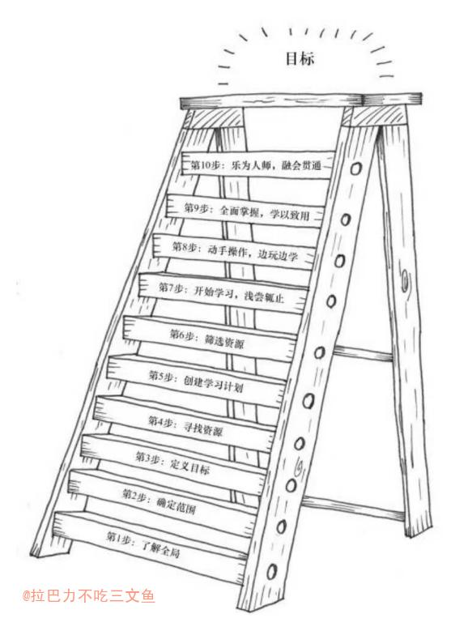

## 献言
+ 谨以本书献给所有自强不息、孜孜不倦地持续自我改进的开发人员。他们具备下列素质： 永远不会对“不错”感到心满意足永远寻求每一个机会来拓展自己的视野，探索未知事物对知识的渴求永远不会熄灭笃信软件开发并不仅仅意味着编写代码。知道失败不是结束，失败只是人生旅程上的小小一步有过挣扎，有过失败，但仍然会爬起来继续战斗拥有强烈意愿和决心，在人生的道路上不畏艰难以及最重要的，愿意一路上帮助他人。

## 前言
+ 不能只编写代码，还要有精彩的人生。

## 第1章 为何这本书与你先前读过的任何书籍都迥然不同
+ 我所说的“优秀的软件开发人员”，是那些能够把控自己的职业生涯、达成目标、享受生活的人。
+ 如果你想真正成为一个更好的软件开发人员（或者其他真正优秀的人才），你需要把重点放在整个“人”上，而不只是你生活中的一两个领域。
+ 想为这些内容分类和分组，最简易的方法是将它们看成是事业、思想、身体和精神四个方面。

# 第一篇 职业

+ 职业发展的驱动力一定是来自个体本身。记住：工作是属于公司的，而职业生涯却是属于你自己的。

+ 当你为了谋生一头扎进写代码的世界时，其实你和中世纪小镇上开铁匠铺的铁匠没什么差别。

+ 当你和别人打交道的时候，你应该知道的最重要的一个概念就是：以自己为核心，每个人都希望自己很重要。这是人类最深邃、最致命的欲望之一，也是社会和生活中取得伟大成就的主要动机。

### 面试

+ 与主流观念相反，大多数面试官决定雇用某个人其实是基于各种各样的非技术因素。

+ 简而言之，通过面试的最快捷的方式是让面试官对你怀有好感。达成该目标有很多方法，其中大多数可以在面试之前完成。
+ “破解”面试的要诀就是在面试开始之前就思考应对面试的策略。

+ 与雇用技术高超但需要生拉硬拽才能干活的人相比，我宁愿雇用这样的开发人员：知道的东西可以少一点，但是明确知道要做什么，以及怎样去做。从某种程度上，在你可控的范围之内，面试的时候你要集中精力证明自己就是无需督促也能自动自发做好事情的员工。

+ 你还必须要证明：在技术上你确实胜任工作。同时，如果你能说服面试官相信你非常能干，不会被困难阻挡，那么他们不仅会喜欢你，而且更有可能会录用你。

### 专业化

+ 专业化的规则是：专业化程度越深，潜在的机会就越少，但获得这些机会的可能性越大。
+ 做一个技术全面、多才多艺的软件开发人员非常棒。能够使用多项技术和多种编程语言，有助于你的职业发展，能让你比那些仅了解一项技术或一种编程语言的软件开发人员更有价值。然而，这种“万金油”式的人才在市场上并不吃香。

+ 从薪资和福利的角度评价一个潜在的工作机会是很容易的，但是从长期发展和工作环境的角度去评价可能对你更为重要。

### 大中小公司

+ 在为一家大公司工作时，你会注意到的最大的事情也许就是那里大量的规范和流程。

+ 在大公司工作时，你要遵守这里已有的做事方式。鲁莽和“变节者”在这种企业文化里不受欢迎。

+ 在大公司里倒是很容易就隐藏在芸芸众生之中。在我曾供职的几家大公司里里，有一些开发人员基本上终日无所事事，除非赶上一轮全公司范围内的大裁员，否则根本不会有人注意到他们。不过，这种自主权也可以被善加利用。你能够去琢磨自认为重要或有趣的项目，无需背负产品压力。

+ 如果公司的业务重心并非软件，那自然也不会给软件开发人员足够的尊重和发展空间。这些公司的软件开发实践极有可能非常松散。

+ 另一方面，那些以软件开发为生的公司则会更重视自己雇用的软件开发人员的价值。他们的工作环境不一定会更好，但会大不一样。

+ 在推行敏捷软件开发方法的时候，这两类公司之间的差异非常明显。软件为非核心业务的公司在采用敏捷过程中困难重重，这是由于敏捷过程通常是由开发团队驱动的。敏捷过程需要自上而下地采纳推行，但是仅仅因为一些开发人员认为敏捷是个好主意，就让公司改变自己的做事风格，异常困难。

### 突颖而出

+ 在任何公司里能让你脱颖而出的最重要法宝就是承担更多的责任。
+ 没有人愿意涉足的领域是搜寻机会最好的地方。
+ 如何能让自己承担更多责任
 有一个不受重视的项目，你能去负责它吗？ 
 你能帮助团队里的新人快速成长吗？
 你能负责文档制作流程，并保证及时更新这些文档吗？
 哪项工作是没有人愿意去做，你愿意承担起来，并将其简化或者自动化的？

+ 如何令自己引人注目
每天都记录自己的活动日志——把这个日志以周报的形式发送你的经理。
提供演讲或培训——选择一个对你的团队有用的话题。
发表意见——只要在会议上就这么做，或者只要你能得到的机会就这么做。
保证“曝光度”——定期与老板会面，确保你经常被注意到。

+ 在任何公司中，最有用的就是那种看似没有克服不了的障碍的人。

+ 有时候只要意识到自己的工作毫无前途，就需要寻找更好的机会。也许你的工作环境很艰苦，残害身心，也许裙带关系盛行，你只能原地踏步。无论什么原因，你可能都需要换工作了。

### 成为专业人士

+ 成为专业人士是一种心态。如果我们总是与恐惧、自毁、拖延和自我怀疑作斗争，那么问题就是：我们正在像外行那样思考问题。外行毫不起眼，外行人废话连篇，外行屈从于逆境。专业人士可不这么想。不管怎样，他引人注目，他恪尽职守，他始终如一。

+ 成为专业人士的全部在于：引人注目，恪尽职守，以及不屈服于挫折。

+ 专业人士会严肃对待自己的责任和事业，愿意作出艰难的选择去做自己认为是正确的事情——往往还要自己承担代价。

+ 作为一名专业人士需要养成的另一个强大的习惯是时间管理技能。

+ 有时候，专业人士必须对工作的优先级做出艰难的抉择。
+ 专业人士会评估需要完成的工作，判定优先级后再开始工作。

+ 专业人士是通过持续不断的自我完善达到自己所追求的高品质的。

### 为自己工作

+ 如果想辞职为自己打工，需要一个切实可行的计划。你必须要想方设法积攒够足够多的收入来支撑自己，直到你的新生活步入正轨。

+ 如果你想让自己的产品也同样成功（虽然也许在规模上达不到），首先打造一个成功的博客，使用播客、演讲、视频和其他媒体来发展自己的受众。接下来，一旦你有了受众，你就能够向这些受众销售自己的产品。你之所以购买这本书可能就是因为你已经是我博客的粉丝，或者因为关注我的其他工作而无意中发现这本书，或者你之前听过我的播客。这就是发展自己的受众的威力。

+ 你必须明白并意识到，自己的首次创业可能会失败，很可能第二次、第三次也是如此。直到经过足够多的失败，你才可能真正成功。如果你倾尽所有投入创业，如果你为一次创业成功赌上自己的整个未来，你可能会把自己置于绝境——没有资源，甚至没有意志再去尝试一次。所以别这么做。从小处着手，作为副业开发你的第一个产品。

+ 我们不能过分相信自己可以不受外界干扰或者能够智慧地管理时间。我们需要提前做好计划，否则会屡屡经受不住诱惑。

### 对技术保持开放

+ 如果你能让自己不成为某种技术的信徒，你会在职业生涯之路上走得更远。

+ 没有理由去强烈坚持自己选择的技术就是最好的，而轻视甚至无视其他技术。如果固执己见，最终受损失的是你自己。
+ 另一方面，如果你愿意技术保持开放的心态，而不是固守在自己已经了解的技术，声称它是最好的，你会发现有更多的机会为你敞开大门。

#  第二篇 自我营销

+ 营销就是一场争夺人们注意力的竞赛。
+ 营销追求的是“实现价值在先，要求回报在后”。
+ 自我营销的正确方式就是为他人提供价值。

+ 只要营销得法，即便是“菜鸟”或者“业余爱好者”的身份都是你的优势所在——很多人都喜欢向只比自己稍微优秀一点点的人学习，因为这些人才是可望而又可及的。

+ 自我营销的基本机制是，要想让人们追随你、倾听你，你就要带给他们价值：你能为他们的问题提供答案，甚至是给他们带去欢乐。如果你在持续自我提升的同时并没有给他人带来价值，那么你终究不会走得太远，因为每个人都会离你而去。

+ 要打造一个品牌，你需要四个要素——品牌所要传递的信息、品牌的视觉符号、品牌的一致性和品牌的曝光率。

### 打造自己的博客

+ 即使你对上面提及的博客能带给你的所有好处都打了折扣，有一个好处是你无法轻易抹杀的——提高你的沟通技巧。组织自己的思想，并将其转化为文字，是一项颇具难度却也极具价值的技能。

+ 定期写作能帮助你打磨此技能，有了很好的沟通能力会让你在生活的诸多领域受益。此外，如果你能约束自己定期更新博客，你也就在持续刷新自己的技能，保证自己处于自己所在专业领域的前沿。

+ 作为软件开发人员，学习如何写博客实际上都能帮你写出更好的代码，因为你能更轻松地传达自己的意图。博客还能帮你更好地传达自己的想法，令想法更有说服力。

### 为他人增加价值

+ 不要努力成为一个成功的人，而要努力成为一个有价值的人。——阿尔伯特·爱因斯坦

+ 当你营销自己的时候，如果你所做的一切都只是为了自己的利益而不给别人带来真正的价值，那么即使你所做的都正确无误，那也无济于事。

+ 人们最关心的还是自己。没人想听到你的成功故事，也不想知道为什么他们要帮你获得成功，但是他们肯定想听到你会怎样帮他们获得成功。所以，要想让自我营销的所有努力奏效，基本的方法就是帮助他人获得成功。

+ 免费内容比付费内容更容易被分享。你撰写博客、制作视频或者播客，然后将这些内容免费提供，与收费内容相比，人们更可能会分享和传播这些免费的内容。分享免费内容就跟在Twitter上发链接或发邮件一样简单。与付费内容相比，免费内容能让你触及更多的目标受众。

+ 虽然免费做这些事情看起来是在浪费时间，但是你要把它视为对未来的一项投资。通过为人们创造价值并且免费提供这种方式自我营销，你就赢得了为他人提供价值的声誉，也为自己的未来创造了机会。这种声誉的价值是无法衡量的。它能帮你赢得更好、更高薪水的工作，获得更多的客户，或者成功地发布一款产品。

+ 你很容易落入这样的陷阱：一直谈论自己并试图证明自己价值连城。然而，你会发现，能解决他人的问题，真正能够帮到他人，你更容易获得成功。

+ 帮助他人实际上就是在帮助自己获得成功。

### 克服恐惧

+ 如果你真的想在自我营销方面获得成功，你就一定要学着克服我们大多数人都会有的一种恐惧——看起来像个傻瓜。

+ 如果你想成功，你必须要学会收起自己脆弱的自尊心，勇敢走出去，别害怕让自己出丑。

+ 在我的职业生涯中，我一共错失了9000多次投篮，输掉了近300场比赛。我本来有26次绝杀的机会却投球不进。我失败了一次又一次。这就是我能够成功的原因。——迈克尔·乔丹

#  第三篇 学习

+ 教育就是当一个人把在学校所学全部忘光之后剩下的东西。——阿尔伯特·爱因斯坦
+ 软件开发人员可以学到的最重要的一项技能就是自我教育能力。
+ 无论如何，学会学习是自我教育的核心技能。

+ 最好的方法就是付诸于实践，如果你也能承担将自己所学的内容教给别人的任务，那么你会理解得更深刻。所以，你在自我教育方面的努力，应该聚焦在如何让自己切实参与，并且尽早付诸实践。

+ 我觉得学习知识的最好方式就是立即将其用于实践，即使你还不知道自己在做什么。

### 让学习玩起来

+ 如果关于某个主题你能够获得足够的知识能够操作，你就可以发挥自己心灵深处强大的创造力和好奇心。当我们能够在一件事情上尽情发挥的时候，我们的内心就更倾向于吸收更多的信息，思考更有意义的问题。这似乎有些奇怪，但事实的确如此。

+ 本方法的关键指导原则是通过玩儿、探索以及将自己所学教给他人来学习。这一简便易行的方法更符合我们的天性——在某种程度上，抛弃了“填鸭式教学”的自主学习才是最简单和最纯粹的学习方式。

### 如何快速学习

+ 我发现，为了能够掌握一门技术，我需要了解以下三个要点。
1．如何开始——要想开始使用自己所学的，我需要掌握哪些基本知识？
2．学科范围——我现在学的东西有多宏大？我应该怎么做？在开始阶段，我不需要了解每个细节，但是如果我能对该学科的轮廓有大致的了解，那么将来我就能发现更多细节。
3．基础知识——不止在开始阶段，要想使用一项特定的技术，我需要了解基本的用户案例和最常见的问题，也需要知道自己学的哪20%就能满足80%的日常应用。

+ 熟知了这三个关键点后，我可以高效地学习一门技术，无需通晓全部细节。我发现，如果我了解三项主题——如何开始，我能做什么，以及相关基础知识，那么我就能随着学习深入学会所需的其他知识。

+ 如果我想提前掌握所有知识，那只是在浪费时间，因为真正重要的内容会湮没在那些细枝末节中。

+ 这种新方法能让我关注重点。当我确实需要了解更多细节时，我可以利用参考资料来弥补这些不足。

+ “十步学习法”的基本思想就是：要对自己要学的内容有个基本的了解——了解自己不知道什么就足矣。然后，利用这些信息勾勒出学习的范围，即需要学哪些内容，以及学成之后又会获得什么。依靠这些知识，你可以找出各种资源（不局限于书）来帮助自己学习。最后，你可以创建自己的学习计划，列出要去学习哪些相关课程，筛选学习材料，只保留能帮助自己达成目标的优质内容。

### “十步学习法”体系

+ 一旦完成这些工作，你对自己要学什么和怎样学都了然于胸，你就可以把控自己的学习计划中的每个关键点，通过“学习—实践—掌握—教授”（Learning, Doing, Learning and Teaching，LDLT）的过程，获得对该学科的深刻理解，同时你也向着自己的目标前进。

+ “十步学习法”的第一部分是研究，它是一次性完成的。但是从第7步到第10步则是重复的过程，贯穿于你的学习计划的各个模块。这个方法非常奏效，因为它迫使你提前明确自己的学习目标，也持续不断的激励你通过实践（而不仅仅是读书或听讲座）向着目标前进。

+ 通过“聚焦学习范围，让你关注重点内容”来学习的一种快速学习方法，它迫使你通过“自我探索”和“主动教学”的方式将真正重要的内容印刻在自己的大脑中。

+ 在学习过程中，大家很容易犯的一个错误就是试图解决太大的问题而把自己搞得不堪重负。
+ 你无需提前了解全部内容，你要做的首要的一件事情就是亲自操作和亲身体验。
+ 采用这种方法，你通过探索和实践进行学习。
+ 把那些暂时还没有答案的问题记录下来，你在下一步中会有机会找出这些问题的答案。

+ 不要害怕回头再去操作，付出更多，因为这不仅能让你找到问题的答案，也能让你学到新东西。给自己足够多的时间去深入理解自己的主题，你可以阅读，可以实验，可以观察，也可以操作。

+ 不过请记住，你依然没有必要把收集到的所有资料全部仔细看一遍。你只需要阅读或观看与当前所学相关的部分。我们很少能有足够的时间把一本书从头读到尾。
+ 这些资料只是帮你自学，基本上你可以以解决在动手操作中发现的问题为主要目的。

+ 做导师的好处
帮助他人时的成就感。
深入学习和领悟知识的途径。
你的徒弟有朝一日会帮到你。
自身的成长。
帮助别人成长的过程也就是自己成长的过程。

+ 学习知识的一大方法，或许是唯一可以做到深入学习的方法，就是传道授业。

+ 知识短板会阻碍你进步。准确识别它们的最佳方式之一就是看看自己在哪些工作上花费了大量的时间，或者一直进行重复性劳动。通常，你会发现，自己的知识短板使工作速度放缓，额外需要大量的时间完成任务。

+ 另一种识别知识短板的方法就是，时刻都要试图了解自己不理解或不清楚的事物。你可以维护一份清单，列出自己需要去研究或者自己不清楚的所有事物，追踪有哪些主题总是不断出现在这个清单上。你会惊讶地发现这份清单的增长速度有多快。你只要对自己坦诚：如果遇到不理解的知识，不需要马上就学会，但是一定要把它添加到清单中，这样你至少可以找出自己的知识短板。

+ 假如你在准备面试，需要明确自己要学什么，这一方法最管用。尽量找出尽可能多的你在面试中可能会被问到的问题。

+ 检查知识短板

# 第四篇 生产力

+ 产量多只表明生产效率高，只有完成正确的工作才会成为高效的人。

### 一切始于专注

+ 想要达到专注工作的状态很难，但是一旦进入专注状态，就能轻松保持。

+ 要进入专注模式，必须要克服将自己的思绪集中于单一任务时的那种痛感。除非你完全享受完成这项任务，否则这种痛感一开始会很强烈。但是，这正是关键所在。你必须要意识到，这种痛苦和不适只是暂时的，不会持续很久。

### 工作计划

+ 我的计划都是从“季度”开始的。我把我的一年分成4个季度，每个季度3个月。在做季度计划时，我会尽力列出我想在本季度完成的每一个大项目，我还会制订一些较小的目标。我会思考我在每一周或每一天分别完成哪些工作。

+ 每个月的第一天我会打印出当月的月历，并且规划出每天要完成的工作。
+ 每个月我都会将该月要完成的所有任务列入计划。
+ 每周一的早晨，我会做我的周计划。

### 番茄工作法

+ 它的基本思路是：你规划出打算一天之内完成的工作，然后设置一个时长25分钟的定时器，去完成计划中的第一项任务；在这25分钟之内，你只专注于这一项任务，心无旁骛。一旦有干扰，可以用各种方法屏蔽掉干扰，但是通常你要努力保证自己完全不被打扰。总之，你不希望自己的专注的工作状态被打断。

+ 在25分钟结束的时候，设置一个5分钟的定时器，休息一下。这就是所谓的一个“番茄钟”。每4个番茄钟后，你都需要休息一会儿，通常为15分钟。从技术上讲，如果提前完成任务，你应该将剩余时间设置为“过度学习”时间。也就是说，你需要继续对已完成的工作做出小幅改进，或者重新阅读材料以便于你能够再学一些新东西。我往往会忽略这部分，立即跳转到下一个任务。

+ 这就是“番茄工作法”的基本流程。它就是这么简单。弗朗西斯科最初使用了一个番茄形状的厨房定时器给自己设置番茄钟

+ 第一次使用番茄工作法的时候，我并没有严格做到它规定的要求。我只是每天用它来设置若干个“25分钟”的番茄钟。我并没有留意自己每天完成了几个番茄钟，也没有估算某项任务要用掉几个番茄钟；因此我并没有从中受益。

+ 有一个大问题一直困扰着我：我总为自己没有做更多的事情而感到内疚。这与我一天完成多少工作无关，就好像我永远不能放松似的。我总觉得自己应该在做事，以至于坐下来玩游戏（我最喜欢的消遣之一）时我都无法享受其中，因为我觉得自己在浪费时间，我本应该做更多的工作。也许你也有同感。
+ 这个问题的根源在于，你无法准确地评估每天到底自己完成了多少任务，也没有为自己每天到底要完成多少任务设定明确的目标。

+ 制订任务列表全凭主观臆断，每天能够专注完成的工作量才是最重要的。

+ 这正是番茄工作法的真谛之所在。当你在一天中为自己设置了x个番茄钟的工作目标（这一目标你完全可控）并且达成的时候，你就可以知道自己一天到底可以完成多少工作，这会让自己感觉良好，更重要的是，还能让自己放松身心。

+ 对番茄工作法的正确理解令我的工作生活大为改观，它不仅能帮我能做更多事情，而且能让我可以尽情享受业余时间。一旦我完成了当天的目标（以番茄钟来度量的），我就可以自由自在地做自己想做的事情。

+ 如果我觉得自己状态不错，我可能还会多做一些工作。但是，如果我想坐下来玩游戏，甚至看电影消磨时间，或者其他不费脑子的活动，我也不会感到内疚，因为我知道我已经努力工作一整天了。

+ 如果你使用番茄工作法度过充实的一天，你完成的工作的要比平常完成的多很多。好消息是，你的生产效率更高；坏消息则是，你需要花一段时间才能适应它（我没骗你）。

+ 我一周的目标是50～55个番茄钟。如果我可以达成目标，我就知道自己做得很好，也能希望每周都能持续改进目标。

+ 如果你也打算采用番茄工作法，要先确保你对自己的能力有符合实际的预期。你每周工作40小时并不意味着你能完成80个番茄钟。（如果你能实现这一壮举，我会大吃一惊的。而且，坦白讲，我会担心你的心理健康。）

+ 每人每天能够专注地、富有成效地工作的时间是有上限的。你的时间只有这么多，要怎么利用你自己说了算。

### 定额工作法

+ 我用“定额工作法”确保自己每天、每周都朝着自己最重要的目标取得明确的、可度量的进展。

+ 我开始意识到，要想确保自己在追求目标的道路上获得持续的进展，唯一的方法就是确立一个明确的目标，规定自己要在预先确定的时间段内需要取得多大的进展。
+ 实行定额制后，我发现自己的工作成果比以往多了很多。最大的好处在于，长期坚持这么做，我就能随着时间的推移度量并标记自己的进度。我可以确切知道自己在给定的一段时间内能够完成的工作量。

+ 承诺是“定额工作法”的核心。除了想方设法完成自己的工作，不给自己留下任何其他的选择。在你心中，失败不是一个可以被接受的选项。因为如果你让自己失信一次，就会有第二次，很快定额在你眼中就会变得一文不值。
+ 如果你的承诺力度不够，“定额工作法”顷刻就会分崩离析，所以你必须选择可实现、可持续的定额。不要对自己承诺自己明知不可能达到的目标，否则你就把自己逼入注定失败的绝境。开始的时候承诺可以小一点，在能够达成之后再逐步做大胆的承诺。

+ 定额工作法的规则
挑选一项重复性任务。
明确有效时限，在此期间该任务被重复执行。
明确在给定的有效时限内该任务应该完成的次数的定额。
给自己承诺：一定要达成定额。
调整。调高或者调低定额，但是不能在有效时间段之内调整。

+ 定额工作法成功的秘密可以追溯到“龟兔赛跑”的故事。以缓慢但稳定的节奏工作，要优于快速但缺乏持久和坚持的工作方式。

+ 定额工作法还可以帮你克服意志力薄弱的问题，通过预先设定好的必须要遵循的过程，消除需要做出决策的部分。因为已经预先承诺在规定时间段内完成同一任务很多次，所以就不需要再判断要不要做某事——你知道必须要做。每一天，任何需要做决策的时刻，你都不得不被迫动用自己仅存的有限的意志力。以定额的形式将决策转变为命令，你无需再做决策，也就避免了意志力耗尽的问题。关于这一主题，可参考Kelly Mc Gonigal写的《自控力》

+ 采取行动
列出自己生活中需要重复做的所有任务。特别要专注于那些目前你还无法持续完成但一旦完成就会从中受益的事情。
选择至少一项任务，承诺在规定时间段内要完成的额度。认真对待这一承诺，试着坚持至少5个时间段。想象一下，如果自己能坚持几个月或几年，会发生什么。

### 对自己负责

+ 让人们完成工作主要有两大动机——内部动机（来自内心的动机）和外部动机（来自外部奖励或惩罚的动机）。

+ 内部动机要比外部动机有效得多。在内部动机的激励下工作时，我们能完成更多的工作，也更倾向于把工作做得更好。所以，秘诀是让你的主要动机来自内心而非外部。

+ 培养出在没有人监督自己的时候也能高效工作的自我责任感非常重要。

+ 要培养“对自己负责”的精神，首先要让自己的生活井然有序。

+ 你可能会发现，只对自己负责的时候很容易违反自己制订的规则。在这种情况下，需要借助一点儿外力。你仍然可以制订自己的规则，因此动机还是来自内部——因为你还是规则的制订者，只是你可以让别人帮你强制执行这些规则。
+ 请别人来监督自己履行责任，完成自己的承诺，并没有坏处。找到责任监督伙伴——理想情况下，最好是跟你有类似目标的人，这样会很有帮助。你可以告诉他你给自己制订的规则，或者你想达成的目标，通过定期互相汇报进度（不论成败），可以互相帮助对方强化责任感。

+ 通常，想到要告诉自己的责任监督伙伴自己没能完成设定的目标，就足以阻止自己不够自律的行为。

+ 采取行动
抉择一下：你想如何度过自己的一生。花点儿时间创建一些自己的规则，确保自己朝着正确的方向前进。
创建自己的责任制度，帮助自己严格执行规则。

### 是否多任务并行

+ 有的任务适合多任务并行，有的则不适合。如果你真想最大限度地提升自己的工作效率，就必须知道什么时候需要多任务并行，什么时候不需要，以及如何高效地进行多任务并行。

+ 对于很多活动，我们可能会自认为是在进行多任务并行，但实际上我们做的不过是在不断地进行任务切换。这样的任务切换看起来确实是工作效率下降的罪魁祸首。任务切换越多，浪费的时间也就越多，因为你的大脑并不能专注于一项任务。

+ 如果你认为自己出于专注状态时工作效率最高，且需要花些时间才能到达这种状态，你就能明白，在各种任务间快速切换并不会提高效率。

+ 真正的多任务并行使我极大地提升了自己的生产力。如果你可以将两项任务组合起来，并且真正做到同时处理它们两个，你才能完成更多。诀窍在于搞清楚哪些任务可以被真正组合起来而不会降低单独执行每项工作的生产效率。

+ 我发现，最有可能的就是，将一项不费脑筋的任务和一项一定程度上需要精神专注才能完成的任务组合起来。现在，我正一边听着耳机里的音乐一边打字写这一章。当然，听音乐本身并不是一项富有成效的工作，不过事实证明，在写作的时候听音乐能让我比单纯写作更富有成效。音乐似乎能让我写作更流畅，还能帮我减少其他会分散注意力的外界干扰。

+ 再来一个更有效率的例子？我通常会尝试把体育运动与培训活动组合在一起。在健身房跑步或举重的时候，我经常会听有声读物或者播客。我发现，一边做健身活动一边听一些培训材料没有任何负面影响。通过一边健身一边听有声读物，我已经读完了很多书。

+ 采取行动
停止任何并非真正的多任务并行的多任务并行。每天力争在一个时间段内只做一件事。番茄工作法对此有很大帮助。
一次性批量处理小任务，而不是每天或每周里做许多次。
找出能够真正实现多任务并行的领域。任何不需要耗费脑力的活动都可以跟其他活动结合起来。只要进行任何需要耗费脑力的活动，就将其与体育运动结合起来。

### 职业倦怠

+ 提高生产力的最大障碍之一就是身体和心理上的倦怠。

+ 项目刚开始的时候，我们总是热情高涨、精力旺盛，但是一段时间之后，即便我们再有激情，一想到它们也会让我们反胃。

+ 如果能咬紧牙关坚持到底，如果能穿越那堵墙战胜自己，最终你会发现，简单地无视它的存在，你的倦怠感已经不治而愈。经历痛苦就是克服倦怠的秘诀。你以后还会撞到更多的墙，但每穿越它一次，你将会体验到全新的动力、充沛的活力。另外，你的竞争者的数量会越来越少。

+ 本质上，你需要为自己创建一套确保自己继续前行的规则。
你需要突破这堵墙就以写这本书为例。刚开始动笔的时候我兴奋极了，想不出来有什么能比坐下来整天写“自己的书”更有趣的事情了。但是，没过多久这种新鲜感就消失殆尽。但是，你能读到这本书就证明我已然坚持到了最后。我是如何在动力和兴趣消失殆尽的时候坚持到底的呢？我为自己设定了一个时间表，并且坚决执行。无论刮风下雨，无论自己感觉如何，我都坚持每天写完一章。有些日子还会多写一点儿，但是总是保证至少一章。你可以采用类似的方法来帮自己突破阻挡了你的那堵围墙。想学会弹夏威夷四弦琴？每天留出一定的时间练习。在上第一堂课之前就制订好这样的计划——那时你的兴趣和动机都处于最高点。当你不可避免地撞到这样一堵墙的时候，这个计划能帮助你穿过它。

+ 采取行动
想一想以前都有哪些项目是你付出努力却没有最终完成而半途而废了。是什么原因让你放弃的？你现在对这件事儿有什么感受？
下次开始新项目的时候，下定决心：你一定会完成，或者完全掌握。设定规则和约束条件，强迫自己穿过那堵不可避免的墙。
如果你正面临职业生涯或者个人生活中的一堵墙，试着去穿越它。想想在墙的另一侧会有怎样的收获等着你。想象自己的动机和兴趣终将获得回报。

### 时间杀手

+ 一些常见的时间杀手
看电视。
社交媒体。
新闻网站。
不必要的会议。
烹饪。
玩电子游戏（尤其是网络游戏）。
工间喝咖啡休息。

+ 地雷：烹饪、工间喝咖啡休息或者其他你喜欢做的事情是在浪费时间吗？也是也不是。答案取决于你为什么做这些事情。为了享受快乐有意识地做这些事情，就不是浪费时间，只要你是因为喜欢才特意做这些事情，而不是为了逃避自己应该完成的实际工作。我曾经把玩电子游戏视为浪费时间，但是我喜欢玩电子游戏。这是否意味着我要完全放弃玩电子游戏呢？不是的。但是，当我有任务需要完成的时候，我就不能玩电子游戏。我不能用玩电子游戏来逃避自己本该完成的工作。同样的原则也适用于烹饪。也许你喜欢烹饪，为自己制作健康美食。如果是这样，那就太棒了。但是，如果你不特别喜欢烹饪，却要耗费大量时间来准备简单的一餐，那你就需要找出其他的健康饮食的方法来减少用于烹饪的时间。我的目的不是让你抛弃生活中的喜好，只是确保你没有把时间浪费在一些没必要做或者不那么喜欢做的事情上，或者吞噬掉你所有业余时间的事情上。

+ 采取行动
下一周，你精心地跟踪一下自己的时间花费情况。获取精确的数字，了解每天的每小时你都是怎样花掉的。看看数据，找出你最大的2～3个时间杀手。
如果你有看电视的习惯，尝试离开电视一周，即尝试度过一个“无电视周”，看看如果不看电视你都会做些什么。
弄清楚哪些时间是可以“买回来”的，如雇人为你修剪庭院、做保洁等。（如果切断有线电视，你甚至可以用这笔省下来的钱来支付上述费用。）

### 形成惯例的重要性

+ 生产力的真正秘诀在于：长期坚持做一些小事。

+ 他们没有意识到，横亘在自己与梦想之间的无非就是“惯例”。惯例塑造你的生活，让你变得更有生产效率，惯例是让你实现目标最强大的方式之一。你每天的行为日积月累下来，可以让你生活的每个方面都得到提升。

+ 每天都安排时间处理这些任务，以便你可以确保它们被完成。当我在办公室工作的时候，每天我会抽出30分钟时间学习自己工作中会用到的技术，我习惯将其称为“研究时间”。

+ 每天的生活越有条理，就越能把控自己的生活。

+ 想想看，如果你一直对外界作出反应，如果你总是在事情出现的时候被动地处理事情而不是主动地规划，那么周围的环境会左右你的生活，而不是你自己。

+ 例行安排示例

+ 地雷：注意不要过于沉迷于惯例你应该有自己遵循的惯例，但是也要有一定的灵活性。你可能会打乱一天的日程安排。不要忘记会有像车坏了这种不可预测的事件发生，车坏了可能会打乱你的例行安排。你需要学会从容应对这些事情。

+ 采取行动
你目前有哪些惯例？跟踪一下你的日常活动，看看你已经在遵循的惯例有哪些。
选择一个大目标，以每个工作日为单位制订例行安排。计算一下，如果你每天都朝着这个目标前进，一年下来你会取得多大的成就。

### 培养习惯

+ 成就我们的恰恰就是那些不断重复做的事情。因此，优秀不是一种行为，而是一种习惯。——亚里士多德

+ 我们每个人都有习惯，有好有坏。好习惯能够推动我们前进，帮助我们成长；坏习惯则阻止我们前进，阻碍我们成长。培养和养成良好的习惯可以让你不需要刻意努力就保持很高的生产效率。如同惯例可以帮我们缓慢而坚定地每次只砌好一块砖，最终建起一面巨大的墙一样，习惯也可以通过日积月累的努力，让我们前进或者后退。二者最大的区别在于，惯例是我们可以控制的，而习惯却不受控于我们。

+ 习惯主要由三个要素构成：暗示，惯例和奖励。

+ 我们的大脑非常善于养成习惯。我们会根据周围的事物自发地养成习惯。一件事情做的越多，越可能形成习惯。习惯的力量往往基于奖励的价值。我们都喜欢做能够带来更好回报的事情。然而，奇怪的是，可变化的奖励要比已知的标准奖励更让人着迷。这就是在赌场能看到那么多人的原因。不知道自己是否能得到奖励或者不知道奖励有多大，会形成一种很坏的习惯，即公认的“上瘾”。

### 分解任务

+ 造成拖延的首要原因之一，同时也是造成生产力低下的祸根，就是总是在感慨一个问题：好忙啊，问题好大啊……实际上，你并没有真正试着去解决问题。当我们从任务的全貌来审视任务的时候，它们看起来比真实情况都要大，并且更吓人。

+ 克服拖延的提高生产力的窍门：分解任务。通过将大任务分解为小任务，你会发现自己更有动力去完成它们，也更加稳妥地向着目标前进。

+ 这些大任务或大项目给我们带来了心理上的伤害，也削弱了我们的生产力——因为我们无法看清楚未来的前景。从宏观上审视一项大型任务的全貌时，它看起来几乎是不可能完成的

+ 大型任务给人带来沉重的心理负担。面对大问题时，我们倾向于花更多的时间思考问题本身，而不是采取行动去解决问题。人类倾向于选择阻力最小的路径。

+ 但是拖延还不是我们不喜欢大型任务的唯一原因。任务越大，越难明确定义。

+ 大型任务往往也很难估算完成时间。

+ 大型任务是一种智力挑战，与小任务相比，大任务更可能导致拖延，通常描述也更少，更容易出错，也更难估算完成时间。

+ 当把任务分解成小块的时候，这些任务就变得更易于完成，对完成任务所需的时间的估算也更精确，你也更有可能正确地完成它们。即使有些小任务没有正确完成，你也有很多机会改正，而不至过多地影响大项目。我发现，把大任务分解成小任务真是一个好主意。

+ 在管控代码的复杂程度问题上，我们也会做一些工作。这就是我们不会将所有的代码都写入一个方法中的原因。我们会将自己的代码分解为方法、函数、变量、类以及其他结构，从而简化代码。

+ 不管编程问题有多难，它总是可以被分解为更小的单元。如果你想要写出一个难度很大的算法，在一头扎进去写代码之前，先把这个问题分解为能够依次独立解决的小模块会更有帮助。无论应用程序多么庞大、多么复杂，它都可以被分解成一行行的代码。单独一行代码的复杂度绝对不会超过任何一位程序员的理解能力和编码水平，所以，如果你愿意将问题分解得足够小，只凭借写出单行代码的能力你就能写好任何应用程序。

### 努力工作的价值

+ 现实的情况是，一切有价值的东西无一不是努力工作的结果。生活中，特别是在软件开发的职业生涯中，如果你想看到成果，你就必须要学会坐下来，做好自己并不想做的工作——并且要坚持不懈。

+ 如果真想富有成效，你就不得不学会工作的时候既聪明又努力。光有聪明是不够的。一定量的机智是必须具备的，然而要想获得真正的成功，面对挫折的时候一定量的毅力也是必要的。

+ 努力工作总是枯燥的如果我必须猜测一下，为什么我们逃避艰苦的工作，我会说这是因为它们太枯燥了。在我刚开始写博客的时候，我很兴奋。我对这个表达自己的机会充满热情。然而，随着时间的推移，它变成了一项苦差事。如果我没有学会坚持，设法应对这项单调乏味的苦差事，我就不可能看到自己的行动的好处。

+ 你必须认识到，你要想实现目标，要想发挥出自己的全部潜力，唯一的途径就是自愿咬紧牙关、硬着头皮、开始工作

+ 你曾经投身到哪些艰苦的工作中？有哪些任务你会因为不喜欢而拖延？找出其中一项任务，毫不犹豫地马上去做。养成雷厉风行的习惯，并且立即在需要做的工作中付诸行动。

### 任何行动都比不采取行动好

+ 任何行动往往都比没有行动好，特别是当你一直停滞在不愉快的情势下很长时间的时候。如果这是一个错误，至少你学到了一些东西。这样一来，它就不再是一个错误。如果你仍然选择停滞不前，那么你就学不到任何东西。

+ 很少有人会后悔自己基于所掌握的最好的知识采取的行动，但是很多人会后悔自己没有采取行动。他们错失机会，只因为过分害羞、谨慎或者犹豫，让他们裹足不前，无所作为。

+ 很多时候，你需要试错好多次之后才能找出正确的行动方向。在任何行动上耽误的时间越长，完成整个试错过程找出正确方向的用时也就越长。

+ 大多数我们急于做出的选择往往都是微不足道的。我们经常试图耗费300%的努力寻找95分的解决方案，而不是满足于找到90分的解决方案。我们的生活就是这样的，我们写代码的时候也是这样的，我们甚至在决策该买什么样的电视机时也是这样的。

+ 即使是一些看似重要的选择——改变生活的那种，用随机掷骰子的方式都比优柔寡断、无所作为要好。很多大学生认为，选择专业和选择职业都是非常重要的决定。尽管这一决定可能很重要，但也不会比其他选择更重要，有多少大学生毕业的时候只有华而不实的学位或者是泛泛而谈的专业正是因为他们没有做到当断则断呢？举棋不定、优柔寡断让他们丧失了采取行动的机会。

+ 跑起来的汽车更容易转向

+ 通常，要找出一个方向是错的，唯一的方法就是向着那个方向前进。如果错误的代价很小，有所作为总好过无所事事。

+ 现在要怎么做那么，如何将上述原理现在就应用于你的生活呢？今天你要怎么采取行动？仔细查看表48-1所示的简单的检查表，看看它是否能帮你下定决心采取行动。

+ 表48-1 采取行动时的检查表

#  第五篇 理财

+ 金钱只是一种工具。它会带你去往任何你想去的地方，但不会取代你成为司机。
 ——爱思·然德（Ayn Rand）

+ 即使你对此心存疑问，我也鼓励你认真思考一下：改变财务状况会如何显著地改变你的生活，改变你在职业生涯中所做的决定。

+ 所谓资产，是指实用价值高于维护成本的东西。也就意味着，一样东西如果有资格被定义为“资产”，必须能够带来比自身成本更高的价值。

+ 但是，负债的含义则恰恰相反。所谓负债，是指成本高于带来的价值的东西。也就是说，要保有“负债”，你不得不往外掏钱，但是你永远也拿不回来与自己掏出的钱一样多的钱。

+ 关于资产，一个清晰的例子就是你持有的每个季度派发一次红利的股票。持有股票并不会花你分文，但是只要一直持有，每3个月它就会给你带来一次收入。股票自身的价格会上涨也可能会下跌，但是按照我的定义，只要它能带来红利，它就是资产。

+ 某些东西你买来后能够给你带来产出，或者产生的价值会高于你最初的投资，而别的东西则会消耗你的收入，或者不值你为它花的钱。

+ 如果想在财务上获得成功，就必须学会如何投资，别无选择。

### 薪酬谈判

+ 我强烈建议软件开发人员打造个人品牌，并积极地营销自己。

+ 为了做到这一点，基本策略就是尽可能让自己的名字出现在各种的媒体上。写博客、做播客、写书或文章、在大会或用户组中发表演讲、制作视频教程、为开源项目贡献代码等，尽一切可能让自己的名字出现在各种场合。

+ 获得工作的方式至关重要

+ 第一种，你看到一份招聘启事，然后发送自己的简历去申请该职位，最好再附上一封优美的求职信。事实上，许多求职者想当然地认为这是获得工作的唯一方式。其实，这是获得工作最糟糕的一种方式。如果以这种方式获得一份工作，很难在薪酬谈判时占据有利地位，因为和雇主比起来，你处于明显的弱势。你是竭尽所能渴望求得那份工作的人。

+ 需求最大的人在任何谈判中通常都会处于劣势。

+ 获得工作的另一种方法是通过他人推荐。

+ 你认识一家公司里的某个人，他们亲自推荐你应聘某个职位，最终你获得了这份工作。这种方式绝对要比自己申请职位好很多。

+ 你的最佳状态就是：一家公司知道你，然后无需任何面试就直接为你提供一个职位。在这种情况下，你尽可以根据自己的声望为自己标价。所以，任何时候，只要有雇主直接找你，你在谈判时就拥有有利地位。

+ 先出价者输

+ 你必须要了解的一条重要法则就是：先出价的人会处于明显的劣势。

+ 然而也有例外，唯一的例外会出现在雇主刻意压低价钱的时候。这种情况是非常罕见的，但是，如果你有充分的理由怀疑这种情况会发生，你可能会想先出价来设定个保底数。为什么？因为如果雇主给你的出价极低，你很难让他把价格抬高很多。当然，在这种情况下，无论你做什么，都不大可能成功。

+ 被要求先出价该怎么办千万不要先出价。直接说“不”。

### 期权

+ 期权背后的基本思想就是允许某人为在未来的某个日期买入或卖出股票的权利付费
+ 期权从根本上说就是赋予你在未来某个日期之前以固定价格购买一定数量股票的选择权。

+ 但你也可以购买另一种让自己在未来某个日期之前以固定价格出售一定数量股票的选择权。这种期权能让你在股价下跌的时候也赚钱，与附录B中讨论的卖空股票类似。

+ 允许在未来一段时间内以固定价格购买股票的期权被称为“看涨期权”，允许在未来一段时间内以固定价格出售股票的期权被称为“看跌期权”。

### 房地产

+ 在所有个人可以做的投资中，我认为房地产投资是目前为止最好的。再没有其他投资方式像房地产一样能够保障长期收益，能够允许如此高的资本负债。

+ 尽管房地产价格可能会大幅波动，但是我建议投资的是可租赁房产。这种房产的稳定的收入就是——租金。

+ 你选中的这处房产属于我们所说的“以租养贷”，意思是说所有费用，包括抵押贷款、税费和保险，都由它产生的租金收入来提供保障。在这种情况下，我们假设租金能够支付全部费用，不会有多余的现金流，或现金流很少。

+ 聪明的房地产投资（不是投机）始于认识到房地产投资是一项长期投资。如果你相信自己可以通过倒卖房产或者低价购买抵押房产而快速致富，那你终究会自食恶果。

+ 好的物业管理公司将会管理与物业出租有关的一切事务，包括寻找租户、确定租约、筛选租户、维修保养以及收取房租等。但是找到一家好的物业管理公司是很困难的。你要货比三家，找最诚信的物业管理公司。我因为能力不足、维修费用造假和玩忽职守等问题，至少解雇了三家物业管理公司。

### 退休计划

+ 事实是，在热带海滩上度过退休生活并非理所当然，也不只是60岁以上人群的专利。

+ 事实上，如果你希望乐享退休生活，你必须开始为此做一些计划，并且从现在就开始计划。

+ 一旦算出自己退休以后每个月的生活开销是多少，当你的“被动收入”达到每月所需的生活开销的时候，你就可以正式退休了。

+ 所谓被动收入，就是不用工作就能获得的收入。你必须确保被动收入会随着通货膨胀而增加——这也是说房地产是一个很好的投资选择的主要原因。

### 债务危害

+ 真正获得财务成功的唯一方法就是用钱生钱。

+ 采取行动 
列出你的所有债务的清单，把它们区分为两类：好的债务和不好的债务。
把不好的债务按照利率从高到低排序，计算一下多久你可以清偿所有的债务。

### 额外馈赠

+ 相反，我把退休定义为“自由”，具体而言，即财务自由——一种不会囿于财务状况被迫用自己别无选择的方式将自己的时间花费在不合心意的事情上的能力。

+ 我从不追求永远不再工作，但是我一直追求在我不想工作的时候就不工作。这就是我目前的状态。我有足够丰厚的“被动收入”去对抗通货膨胀，如果我愿意，我也可以躺在沙滩上来一杯鸡尾酒；但是，我依然可以投身自己感兴趣的项目——那只是因为我想投身于该项目，而不是因财务原因必须投身于该项目。

+ 我的观点是，运气是必要的。我不会假装自己从来没得到幸运女神的眷顾，但在一定程度上，是你给自己创造运气。如果你脚踏实地、努力工作，总是尝试提升自己和周围的人，那你获得好运气的可能性会大大增加。等式的最后一部分是努力工作。Pluralsight的很多作者也有着和我一样的机遇。我不是说他们不努力，只是我更积极、更努力，我是Pluralsight课程库中课程最多的作者。为了让自己梦想成真，我静下心来工作到很晚，周末也不例外。

+ 仅仅获得机遇是不够的——即便这一机会千载难逢。你必须充分利用机遇，否则再好的机遇也没用。

#  第六篇 健身

+ 如果你不注意自己的身体健康，老实说我并不看好你能成为顶尖的程序员。

+ 在很长一段时间内，我都认为，在软件开发人群中教育和普及体育健身方面的知识是非常迫切的需要。在我刚开始从事编程工作时，软件开发人员的典型形象就是一个书呆子，瘦骨嶙峋，戴着一副厚厚的眼镜，活脱一付笔尖保护套的模样。现在，这一形象似乎已经改变，不过是变得更糟了。如今，很多人认为，软件开发人员都是胖胖的男士，留着络腮胡子，穿着一件脏兮兮的白色T恤还吃着比萨。

+ 显然这两种刻板形象都是错的——有很多软件开发人员，不管是男性还是女性，都不是这种形象，但是第二种形象比第一种形象更让我害怕，因为我觉得有些开发人员已经开始认为自己应该就是那样的。本篇的目的是让你了解健身的基础知识，鼓励你打破成见，并且让你认识到，身为软件开发人员并不意味着男的不能健康，不能英俊潇洒，女的不能光彩照人。你同样可以保持好身材，可以拥有健康，但一切都始于正确的教育和坚定的信念——相信这些都是可能的。

### 破解自身健康密码

+ 健身不仅是保持健康体魄的关键要素之一，也是灵活的、具有创造性的脑力活动的基础。——约翰·肯尼迪

+ 健身能让你成为更好的软件开发人员。这就是原因。

+ 自信心

+ 从我的个人经验出发，我可以告诉你，我锻炼得越多就越健康，我在工作中的表现也越好。我注意到，当我体能最好的时候，我的注意力最集中，效率也最高。

+ 当你总觉得疲倦、无心工作的时候，或者你觉得自己状态不佳的时候，你可能会发现，改变饮食和加强锻炼可以让你的身心同时获得新活力。

+ 恐惧我不想马上打出恐惧牌，但我认为它仍然是如此重要，值得一提。如果你体重超标、处于亚健康状态，那你罹患各种可预防性疾病的风险就很高。

+ 不要让自己醒悟得太晚，从现在起就认真对待。不要等到出了健康问题才开始关心自己的健康。

### 设定健身标准

+ 没有目标，你永远也达不成目标，健身也不例外。正如你需要知道自己写的代码是用来做什么的一样，你也需要知道在忍饥挨饿、挥汗如雨之后，你要得到怎样的结果，否则你就是在浪费时间。

+ 挑选一个具体的目标
    - 减肥
    - 增肌

+ 这些应用还可以帮你找到举重或者跑步的同伴，甚至能让你开始新的节食计划，或者向朋友发起挑战。与他人交流，分享自己的经验，不论好坏，都能让你的健身之旅更乐趣无穷，并能让你持久保持动力。我发现，当我有一个举重同伴的时候我总是更勤快地跑去健身房。

+ 计划了就一定要执行如果你能让自己持久保持动力，这确实很棒。但是，有时候不论有没有动力，你都得咬紧牙关坚持计划。一定要提前做好决定，这能给你约束，让你致力于自己想要采取的一系列行动。

+ 试着通过提前计划，尽可能减少生活中的各种抉择。

+ 当你的动力消失殆尽的时候，用原则来代替激励。每当我精疲力竭不想再跑步的时候，我都会用自己高度尊崇的“善始善终”原则提醒自己。为自己的人生创建一组格言，在世事艰难的时刻信守这些格言。

+ 人生格言
善始善终。
成功者决不放弃，而放弃者永远不会成功。
一分耕耘，一分收获。
时间短暂，如果想在生命中做某件事，现在就去做。
一切都会过去。
坚持到底就是胜利。采取行动
列出你要健身或改善健康状况的原因。
从这份清单中，明确三项最重要的激励因素，打印出来并张贴在不同的地方，确保自己每天都能看到。

### 如何增长肌肉
### 如何获得腹肌
### 跑步
### 站立办公

### 高科技健身装备

+ 本章介绍的都是能帮助你实现健身目标的或者能让你的健身过程更充满乐趣的科技装备。我们已经进入了全新的时代，当下我们比以往任何时候都更了解自己，了解自己身体的运转规律。这种自我认知也被称为“量化自我”。在本章中，我会带领你领略各种技术，并从中选出一些最有用的装本来帮你“量化自我”。

+ 步行计数器和计步器我觉得从步行计数器和计步器开始说起可能比较合适，因为它们是你现在能看到的最常见的科技装备。我是拥有某种计步器的超级粉丝，因为它不仅能帮你明确自己的实际运动量是多少，还能通过了解你的运动量来改变你的行为习惯，从而让你更有活力。

+ 它不仅能记录我的体重，还能记录我的体脂率。尽管体脂率读数的精确性有待商榷，但我更关心的是读数是如何随时间变化而变化的。尽管可能我获得的数据不够精确，但我能够看到相对变化，了解自己的体脂率是在升高还是降低。

+ 我强烈推荐我正在用的这款体重计，因为它能让你更好地了解自己的当前体重和变化趋势。有人说有了测量才能改进。即使你每天都站在体重计上，但只有看到体重随着时间的变化曲线时，你才会真正受到触动，向着正确的方向前进。

+ 组合设备健身科技最令人兴奋的领域莫过于组合设备了，尽管目前尚不成熟，但正被逐渐推广。这些组合设备能够通过各种传感器测量多个数据点，为你提供大量关于你的身体的信息。

+ 耳机在我锻炼的时候，最重要的技术装备就是耳机。我经常在锻炼的时候听播客或有声书，因此我需要一副可以插入手机的好耳机。

+ 应用我们也别忘了应用。市面上有大量针对各种锻炼目的的健身应用。

#  第七篇 精神

+ 精神如果你不征服自己，你就会被自己征服。——拿破仑•希尔

+ 我们不只是一个与思想相连的躯壳。我们不能只下达指示然后就期望身体能完成执行这些指令。这个世界存在着另一股很强大的力量，它能带领我们走上成功之路，把我们推向成功。你可以按照自己的意愿随意称呼这种力量，但是为了本书的目的，我称之为精神。

+ 我的目标是用工具武装你，征服你所面对的最强大的敌人——你自己。

### 心灵如何影响身体

+ 从心灵开始如果你不相信自己能够做到，你几乎做不成任何事情。你的思想对身体的影响有多大、对你能够获得成功的影响有多大，这是令人惊叹的。“如果你相信，你就能做到”这个观点很容易被迅速忽视，但是这个观点确实有些道理。至少，这个观点的反面更有道理：如果你不相信，你肯定不会获得成功。

+ 那些想要改变自己信念、控制自己想法的人们，通过积极的正念可以将其想要的变为现实。

+ 信念决定思想，思想决定言语，言语决定行动，行动决定习惯，习惯决定价值，价值决定命运。——圣雄甘地

+ 不管这个机制是如何运转的，重要的是你要理解自己的所思所想影响并塑造了你现在的生活。你甚至不用读这一章就可以证明这一点。看看周围就知道了。

+ 如果你真的想为自己的生活定好方向并控制好它，那你就要学会如何利用心灵的力量、思想的力量。

+ 采取行动
找出心灵和身体之间的联系。试着在你自己的生活中找一个例子，什么样的想法给现实带来了积极的影响，什么样的想法又给现实带来了消极的影响？
你最近一次取得巨大成功的时候心态是什么样的？
你最近一次遭遇重大挫败的时候心态是什么样的？

### 拥有正确的心态

+ 让我问你一个问题：你将自己的想法归类为积极的还是消极的？这可不是给你自己贴上乐观主义者或悲观主义者的标签。有很多的乐观主义者，他们在表面上满怀期望和希望，但内心却怀着各种会直接破坏他们的工作成果的负面想法和情绪。实际上，积极思考的观点有科学证据可以支撑——积极思考不只是外表乐观，而且还对健康有益，能延年益寿，并且给你的生活提供其他的好处。同时——或许是更重要的——反过来想，消极的思考会产生完全相反的效果。消极思考会对你产生实质伤害，而且会妨碍你通向成功的人生.

+ 积极思考与现实主义是不矛盾的。事实上，积极思考在应用层面上是现实主义的最终体现，因为它是一种信念，这种信念让你有力量改变现实，让你确信你不是环境的受害者。

+ 积极思考问题的根源是这样一种信念——你比你随处的环境更伟大。这种信念让你总能先看到事物好的一面，因为无论身处何种环境，你都有能力改变自己的未来。这是人类成就的最高信念，是世界上最强大的力量。这种信念能让你利用这种力量，这股力量就静静地躺在你的心田，却又不那么虚无缥缈。

+ 积极的心态就是来自于这些想法的积累，随着时间的推移这些想法会由内向外地彻底改变你。当你拥有一个积极态度的时候，你就不是活在与现实分离的虚幻世界里，而是生活在一个最理想的世界里，一个你能看到的最理想的未来世界，一个你一直以来都在苦苦追求并努力实现的未来世界。

+ 从更现实的层面来讲，积极思考就是选择从好的一面（而不是从坏的一面）去思考问题。你对生活中遇到的每一种状况都可以有自己的理解。这些状况本身并不存在“好”或者“坏”。是你自己来解释这些状况，所以是你决定它是“好”的还是“坏”的。一个持有积极心态的人看到的好的一面往往比坏的一面要多，并不是因为这些状况客观上就是好的，而是因为他们认识到他们有选择的权利。

+ 积极性的正面作用记得当我说有真实存在的科学证据证明积极思考会对你的生活产生影响吗？我不是在开玩笑。这里有一份被证实效果的清单，这些效果都是由积极思考产生的。这些结果来自实际的科学研究：
发展友谊；
婚姻美满；
收入更高；
身体更健康；
延年益寿。

+ 我知道的一个事实是，我的工作态度会直接影响我的工作表现。关于这一点，我是用自己的工作效率来做的度量。我知道，当我保持一个积极的态度时我就更愿意去面对任何障碍，把挑战看成要克服的困难，而不是消极地认为是环境把我逼到了绝境。

+ 如何养成积极思考的习惯呢？大多数情况下，使用养成其他任何习惯的方法就能养成这个习惯——通过坚定地、持续不断地、有意识地重复做一件事情，直到由潜意识来掌握大局。

+ 劳逸结合
我个人可以追踪我的许多负面情绪与我忘记休息之间的关联关系。我发现当我花时间休息后更容易保持积极心态。可能这种方法没什么大不了，但是还是值得参考。

+ 一些帮助你养成一个积极心态的好书。如果你现在就想找到相关的书，试着看看由Norman Vincent Peale写的《积极思考就是力量》（The Power of Positive Thinking）［Touchstone，2003再版］。关键是积极思考不会从天而降，也不是一夜间就能获得的，你要付出持续的努力，将思想转向积极的方向。但这是值得付出的努力。不单是因为积极思考能让你活得更长久、更健康、更成功，还因为这绝对会让你活得更有乐趣，同时你可能会影响你周围的人同样生活得越来越有乐趣。

### 构建一个积极的自我形象

+ 那些不能激励自己的人一定是甘于平庸的人，无论他们的其他才能有多么令人印象深刻。——Andrew Carnegie

+ 自我形象是在甩掉别人对你的看法，摆脱所有用来自我安慰的谎言和欺骗以后，你看到的自己的样子。

+ 对你的大脑“重新编程”如何有目的性地对你的大脑“重新编程”？如何像我当年那样改变自我形象？公式相当简单：只需要花点儿时间，再加上持之以恒地正确执行。一开始，设定一个你想成为的清晰形象。你的大脑有惊人的能力去寻找摆在它面前的任何目标。你只需要想象一下这些目标，直到这个目标足够清晰到让你的大脑能够带领你走向你需要走向的那条道路。

+ 为你树立一个理想形象。在你的脑海中牢固地树立起一个形象——“这就是我想要成为的形象，没有什么能够阻止我”。想象一下你自己更坚定、更有自信地走进房间；想象一下你优雅地跳跃着、奔跑着，而不是将自己绊倒；想象一下你可以激励别人，可以非常时尚。不要给自己设定任何的人为限制，除非是那些你没有办法改变的身体特征（例如，不要把自己想象成个子很高，除非这么做能让你感到更自信。只是别指望这么想真的能让你长高。）一旦你在自己的脑海中设立了这样的形象，下来的任务就是开始执行“仿佛”模式。“仿佛”你已经变成了你想变成的那个人。无论是言行举止，还是穿着打扮，都像你想成为的那个人一样，甚至像你想成为的那个人一样刷牙。不要太关注现实是怎么样的，不要太在意别人如何议论你的“变化”；相反，假装你已经达到了你想要的目标，你的新行为只是这个新个性的自然延伸。你还要给自己很多正面的肯定，这会在你潜意识深处植下你的新思维模式的种子。事实证明，正面的肯定不是胡言乱语，你的大脑会真的开始相信你告诉它很多遍的东西。还记得我说过的改变信念是多么难的一件事吗？如果持续传递一致的信息给你的大脑，你就能改变自己的信念。

+ 我建议用一句名言或者一个肖像提醒你，你理想中的那种精神状态。让每一天都充满正面的肯定，这样就能更加确认并加强你的新信念。花一些时间，在精神层面上虚构一个你想成为的那个自己。很多体育运动员就是利用这样的过程来提高自己的成绩的。在参加重大赛事之前，他们会在脑海中做一次彩排。

### 爱情与恋爱

+ 总的来说，我们总想得到自己得不到的东西，我们总想得到别人也想得到的东西。所以，希望越大，失望越大，你就越不可能得到。

+ 关键是你要真正表达出这个意思。你必须要对自己表现出足够的自信，你真的相信你不需要别人给你带来快乐。你必须要相信你和别人在一起是因为你能给对方的生活带来好处，当然这并不意味着你自认为你是上帝恩赐给别人的礼物……来填补空白，但这确实意味着你对自己足够尊重，你只出现在自己想去的地方，你只想和想和你在一起的人相处。

+ 这并不意味着保证能成功，我无法保证。但是，如果你能明白大多数情侣关系其实是“你追我逃”的微妙心理游戏作用的结果，你就会更容易找到真爱。这不只适用于爱情问题，也适用于各种人与人之间的关系。做一个绝望的、缺乏自信的人，你可能会发现自己真的孤立无援。如果你发现你面试的对象就像大街上一个垂死挣扎的乞丐一样祈求你施舍给他工作岗位，你也会觉得他很惹人生厌。

+ 太多人会犯这样的错误——挑选一个人，然后把他/她当作理想人选放在神龛上，时刻想念着那个能让他们觉得“开心”的完美女生或者男生。假设只有这么一个完美的人，这种想法不但荒谬而且缺乏策略。如果扩大搜索范围，你的机会更好。

+ 所以，请不要害怕失败，哪怕失败很多次；不要害怕被拒绝，没什么大不了的。最差的情况又能差到哪里？你可能就像去敲开一扇扇门的销售员，他们面对上百扇甩向他们的门，只为做成一笔交易。你要知道，你每天需要做的就是完成一笔交易。

+ 除此之外，所有那些拒绝最终都会把你带到一个想和你在一起的人那里，这总比和不想和你在一起的人在一起要好很多。

### 私房成功书单

+ 人性的弱点
+ 让别人做你想做的事情的唯一方法就是让他们自己也想做这件事。

+ Napoleon Hill的《思考致富》（Think and Grow Rich）［Wilder Publications, 2007］

+ Robert Kiyosaki的《穷爸爸，富爸爸》（Rich Dad, Poor Dad）［Demco Media，2000］这是另外一本改变我生活的书，它改变了我对金钱和财富的看法。这本书改变了我对钱是如何运作的认识，改变了我对“拥有一份工作”以及“为别人工作意味着什么”的看法。读完这本书之后，我清楚地理解了建立资产和减少自己的开销有多么重要。

### 积极面对失败

+ 跌倒七次，爬起来八次。——日本谚语

+ 为什么我们总是害怕失败畏惧失败似乎是大多数人的本能。人都喜欢做自己擅长的事情，逃避做那些自己不能胜任的或是缺乏技能的事情。我们似乎与生俱来就畏惧失败。

+ 如果非要我猜猜为什么大多数人如此害怕失败，我不得不说这可能是基于保护脆弱的自尊的想法。或许我们害怕失败就是因为我们太过将失败归咎于个人，我们认为在特定领域下的失败是个人价值的流逝。

+ 我认为，对“失败”性质的误解还会助长这种对个人价值伤害的恐惧感。

+ 即使我们知道失败并不是终点，我们似乎也能感受到这一点。我们往往太过较真，把失败看得太重。因为我们接受过把失败看作通往成功道路——很多情况下这也是唯一的一条道路——的训练，所以我们不惜任何代价地避免失败。

+ 失败并不是被打败
+ 失败不同于被打败。失败是暂时的，被打败是永恒的。失败是那些碰巧发生在你身上的——你不能完全控制它。被打败却是你可以选择的——是对失败的某种程度的接受。

+ 要实现不畏惧失败，第一步就是真正意识到失败不是终点——除非你选择把它看作是终点。生活不易，你随时都会被击垮，但是否要重新站起来却完全取决于你自己。它取决于你是否决定为自己最值得拥有的东西战斗，取决于你是否要享受获得成功后的喜悦和乐趣，大多数情况下，它来自于战胜困难的成就感。

+ 如果在第一次受挫败被打死的时候你就扔掉了控制器，会发生什么？某种程度上，从很多次失败中获得的经验反而让你最终获得了成功的体验，这是不是更令你乐在其中？如果是这样，你为什么要把失败当作是一种永恒的状态而逃避生活中的失败呢？你不能指望拿起电玩遥控器，不经历掉下陷阱或者被火球烧焦就能通关，那么你为什么要指望一生不经历失败呢？

+ 失败是通往成功的必经之路不要畏惧失败，要拥抱失败。不只是因为失败和被打败不同，还因为失败是通往成功的必经之路。生活中所有值得拥有、值得去完成的事情都需要经历失败。问题是，我们学到的都是用负面的视角去看待失败。上学的时候，作业得了F，这被看为退步。没有人教你要把这个失败看作能让你离自己的目标越来越近的学习经验，你反而会被告知这整个都是负面的事情。现实生活不是那样的。我不是说你不应该为了考试而学习，也不是说为了获得学习经验和塑造个性而一定要努力考一个F，我想说的是，在现实生活中失败通常是必要的里程碑，它能带领我们离成功越来越近。在现实世界里，当你在某件事上失败的时候，你从中学到了经验并且有可能成长。我们的大脑就是被这样训练的。如果你曾经试过学习如何玩杂耍，或者打篮球，或者其他需要相互配合的体育活动，你会知道在成功前会失败很多次。

+ 学会拥抱失败重申一遍，我必须要说，即使你在本书中什么都没有学到，那也要记下下面这条建议：学会拥抱失败、期待失败、接受失败，并准备直面失败。只是不畏惧失败还不够，还要主动寻觅失败。想成长就必须把自己放在保证会失败的环境中。我们常常会因为停止做那些对我们有挑战或者危险的事情而停滞不前。我们寻找生活中的温室，关上小屋的门，拉上窗户，任凭外面狂风暴雨，我们绝不冲到雨中。但是，有时候你需要被淋湿，有时候你需要把自己放到一个不舒服的环境下强迫自己成长，有时候你需要积极地走出去寻找这样的环境，要知道，你越将你的船驶向失败，将你吹向失败的另外一面（成功）的风就会越强。要如何拥抱失败？要如何说服自己跳入波涛汹涌的大海？从接受失败是生活的一部分开始。你必须明白，在生活中你要面对很多失败，很多是不可避免的，任何事情第一次做都不可能做到完美，你会犯错。你还要明白，就算失败也没关系。犯错也没关系。你可以尝试避免犯错，但是不要因为害怕伤害自尊而以付出错失良机为代价。一旦你意识到失败是好事，失败并不能定义你的价值而你对待失败的态度恰恰才能说明你的价值，你才会真正学会对失败无所畏惧。最后，我还是要建议你将自己暴露在失败的环境里。去做那些让你不舒服的事情。在本书的前面我们讨论过不要害怕看起来像个傻瓜，对待失败我也要说一样的话。事实上，这两个观点是紧密相连的。走出去，有目的地去把自己放在那些不可避免地会导致某种失败的困境中。但关键是不要放弃——让失败点亮通往成功的道路。去经历尽可能多的失败吧，畏惧失败本身才会让你失去克服困难的能力。

+ 我要留给你最后一句关于失败的话，摘自Napoleon Hill的《思考致富》一书：“大多数伟大的人取得的最大成功与他们所经历的最大失败只有一步之遥。”

+ 采取行动
对失败的恐惧是如何让你退缩的？想想生活中那些你想做但由于一时犹豫或者自尊受损而没有做的事情。
承诺至少做一件因为害怕失败而一直回避的事情。不要敷衍了事。很多人明知道有些事会失败还去“尝试”，这样做不会让他们真正失败，因为“没有真正尝试过”才会是失败。真的去尝试，真的去体验失败吧。

### 结束语

+ 好吧，就到这里吧。我们终于来到了这本书的结尾。之所以说“我们”，是因为我希望你把读这本书当作是跟我写这本书一样的冒险旅程。当我开始动手写这本书的时候，我并不知道写一本这么长、这么厚的书这么难。我只知道我想要写一本书，分享我在自己作为软件开发人员的职业生涯中已经学到的一些重要的经验和教训——并不是关于如何编写优质代码、推动职业生涯上进的经验，而是关于如何做好更全面的人的经验，以及如何把我的人生价值发挥到最大同时又有利于他人的经验。我不是天才。我甚至都不是一位能够在反思他几十年的生活经验之后给你可以受益50年的智慧的长者，所以不要把我的这本书当作福音。这本书就是我的经验以及到目前为止让我获得成功的关键要素的分享。希望你能从中找到一些有用的东西，即便你可能不同意书中的所有观点——那也没关系。这正是这本书的要点。你不能把别人说的话都当作福音。没有人可以垄断真理。现实中，很大程度上，正是你自己发现了真理。这并不意味着你可以忽视这世界上的公认真理、只管自行其是，但这意味着你可以决定你想要过怎样的生活，你该怎样去生活。如果你能学会管理诸如成功、理财、健身以及自己的心理状态等事务的基本原则，你就可以利用这些原则来塑造你自己的现实世界。希望在读完这本书之后，你已经得出结论：那些你过去已经被告知的关于“你该如何生活”的狭窄的、笔直的道路，如你要取得好成绩、尽量不要搞砸了、上大学、找份工作然后安心工作50多年直到退休吧……并不是你可以走下去的唯一道路。当然，你也可以继续沿着过去被告知的那条道路前进，只要你愿意；不过，如果你正在读这本书，我相信你已经意识到，生活原本要比你所厌恶的朝九晚五的工作丰富多彩得多。希望这本书已经让你意识到，全世界都是你的机会，都在你的掌控之下。你可以更好地管理自己的职业生涯，可以从中获益更多，甚至可以把自己的职业生涯带向全新的方向，可以学会实际构建自己的个人品牌、营销自己——把自己的软件开发职业生涯提升到一个认为不可能达到的全新高度，让自己有机会影响更多的人。希望这本书教会了你学习和吸收信息的新方法，给了你足够的信心去超越自我——不只是为了学到东西而去学习，还要把你学到的知识与他人分享、使他人受益，不管你是沿着哪条路径前进。希望这本书能够激励你更有成效，更谨慎地管理和善用你的时间，并且能够激励你看到努力工作的价值，并付诸于实践——即使是在你觉得缺乏动力继续前行的时候。希望这本书能激励你以某种方式去健身，更好地照顾自己的身体健康，使你意识到实际上你也可以保持身材，并不因为你是软件开发人员就不能成为健壮的、运动型的人，只要你愿意，你至少可以主动控制自己的健康。最后，我希望这本书已经帮你意识到意志力是多么强大、多么重要，你的头脑可以作为一种工具，要么推动你前进，要么在你来不及做出反应、来不及应用自己所学的时候就摧毁你的前程。我希望这本书可以让你意识到你有能力成为你想成为的人，你也可以通过积极思考和坚持到底的力量重新塑造自己。

+ 是的，这些都是任何一本书都向往的崇高目标，尤其是一本与软件开发有关的书。不过，只要我能在一些很小的地方帮到你，让你改善了自己的生活哪怕一点点，我都会认为这是一场胜利。在你放下这本书之前，我有一个小小的请求：如果你发现这本书对自己有帮助，如果你认为其他人也可能会从中受益，请把它分享给别人。我这么说不是为了提高这本书的销量——尽管我很愿意这么做，但是着手写这本书真不是为了赚钱——我花500小时可以做很多很多更有利可图的事情，写这本书只是因为我认为我们不仅应该不遗余力地做好一个软件开发人员，而且应该做好一个人：去帮助他人。感谢你抽出时间来阅读这本书，并真诚地希望你能在本书中发现一些永久的价值。John Sonmez，http://simpleprogrammer.com
