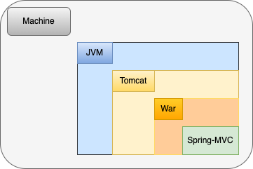
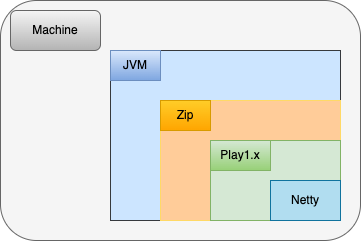
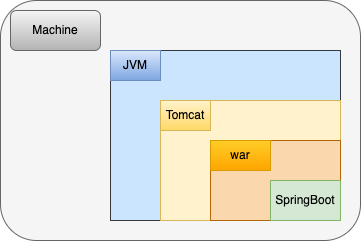
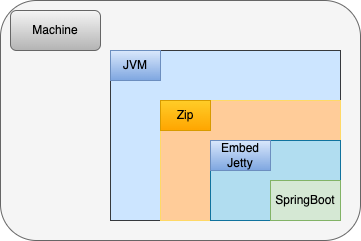
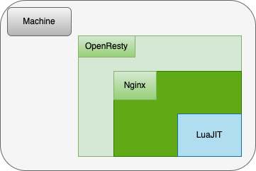
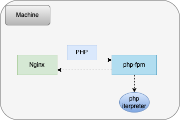
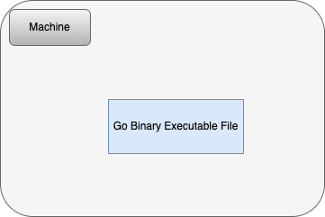

## 公司V

+ 使用Java作为编程语言
+ 使用Spring-MVC框架
+ 使用Tomcat作为Web容器

+ 打包运行方式：
    1. 服务器预安装了Java和Tomcat
    2. 将代码打包成war包
    3. 将war包上传到服务器的Tomcat的web目录
    4. 重启tomcat更新服务   

## 公司U

+ 使用Java作为编程语言
+ 使用二次开发的Play1.x作为web框架（底层基于Netty）
+ 公司在框架自行研发了服务发现等功能

+ 打包运行方式：
    1. 服务器预安装了Java
    2. 将代码打包成Zip包
    3. 将zip包上传到服务器的指定目录
    4. 通过信号停止服务（kill），通过Java命令启动服务

## 公司B

+ 使用Java作为编程语言
+ 使用Spring-Boot框架
+ 使用Tomcat作为Web容器

+ 打包运行方式：
    1. 服务器预安装了Java和Tomcat
    2. 将代码打包成war包
    3. 将war包上传到服务器的Tomcat的web目录
    4. 重启tomcat更新服务   

## 公司K

### Java

+ 使用Java作为编程语言
+ 使用二次开发的Spring-Boot和Spring-Cloud作为web框架
+ 公司在框架自行研发了服务发现，服务治理，数据库切换、容灾相关等功能

+ 打包运行方式：
    1. 服务器预安装了Java
    2. 将代码打包成Zip包
    3. 将zip包上传到服务器的指定目录
    4. 通过信号停止服务（kill），通过Java命令启动服务

### Lua

+ 使用Lua作为编程语言
+ 使用OpenResty作为服务器
+ 公司开发了一些通用的sdk，在OpenResty配置中include即可

+ 打包运行方式：
    1. 服务器预安装了OpenResty
    2. 将代码文件上传到指定的目录
    3. 执行 `nginx -s reload` 更新OpenResty的lua文件即可

### PHP    

+ 使用PHP作为编程语言
+ 使用OpenResty作为服务器

+ 打包运行方式：
    1. 服务器预安装了OpenResty和PHP
    2. 将代码文件上传到指定的目录
    3. 执行 `nginx -s reload` 更新OpenResty的PHP文件即可

### Go

+ 使用Go作为编程语言

+ 打包运行方式：
    1. 将代码打包成二进制可执行文件
    2. 使用nohup运行二进制即可（有的使用supervisor，有的使用systemctl）

## 对这些编程语言和运行方式的理解和看法

### Java
+ 编译语言
+ Java服务需要运行在JVM上，而JVM是使用C++实现的
+ Java代码编译后本质上是一堆字节码文件，不具备单独运行的能力
+ 运行Java字节码，需要JRE环境

### PHP
+ 脚本语言
+ PHP通常和Web服务器搭配（比如Apache和Nginx），对外提供Web服务
+ 以Nginx为例，Nginx不能直接处理PHP脚本，需要使用FastCGI协议将请求转发到PHP解释器
（因此，首先需要安装PHP和FastCGI进程管理器，例如php-fpm）
+ 通常情况下，PHP解释器会安装在机器本机上。当Nginx通过FastCGI协议与PHP解释器进行通信时，它会将请求转发到运行在本机的FastCGI进程管理器，然后再将请求转发到本机上运行的PHP解释器

### Lua
+ 脚本语言
+ 以OpenResty作为web服务器运行Lua脚本是一种方式
+ Nginx + LuaJIT = OpenResty

#### OpenResty
+ OpenResty本质上是将 LuaJIT 的虚拟机嵌入到 Nginx 的管理进程和工作进程中，同一个进程内的所有协程都会共享这个虚拟机，并在虚拟机中执行Lua代码。在性能上，OpenResty接近或超过 Nginx 的C模块，而且开发效率更高。
+ OpenResty中的核心技术cosocket将 Lua 协程和 Nginx 的事件机制结合在一起，最终实现了非阻塞网络IO。不仅和HTTP客户端之间的网络通信是非阻塞的，与MySQL、Memcached以及Redis等众多后端之间的网络通信也是非阻塞的。

#### Openresty 是怎么嵌入lua虚拟机的
+ OpenResty 是一个基于 Nginx 的 Web 应用服务器，它可以通过嵌入 Lua 脚本语言来实现高性能的 Web 应用程序。OpenResty 在运行过程中通过 LuaJIT 虚拟机来解释执行 Lua 代码。
+ OpenResty 在编译时会将 LuaJIT 虚拟机源代码打包成动态链接库，然后将其嵌入到 Nginx 中。OpenResty 运行时会通过 LuaJIT 虚拟机来加载和执行 Lua 代码，从而实现了高性能的 Web 应用程序。

### Go
+ 编译语言
+ 编译成二进制文件后，可以直接在服务器运行，相比其他语言，一般可以认为没其他依赖

### 个人看法
+ Lua比较小众，不适合做大型的业务开发，而且debug比较不方便；
+ PHP在业界已经是快被淘汰的语言了，不做仔细研究，初步体验感觉一般（可能是受限于公司的维护环境过于糟糕，各种老版本，和高深莫测的代码）；
+ Java是我职业生涯接触最久的编程语言，谈不上喜欢也谈不上讨厌，但自从学习了Go之后，有了新的体会；
+ 当初学习Go的其中一个原因是自己的个人项目比较轻量，Go其中一个优势是不依赖其他软件就可以运行，而且分发方便；
+ Go使用AOT的方式编译，针对特定平台，除了加快启动速度，也使程序打包体积大大减少；
+ 当然Java也可以用graalvm打成二进制文件启动（没尝试过，感觉还是有不少前置条件）；
+ 除此之外，还有很多其他以后补充
