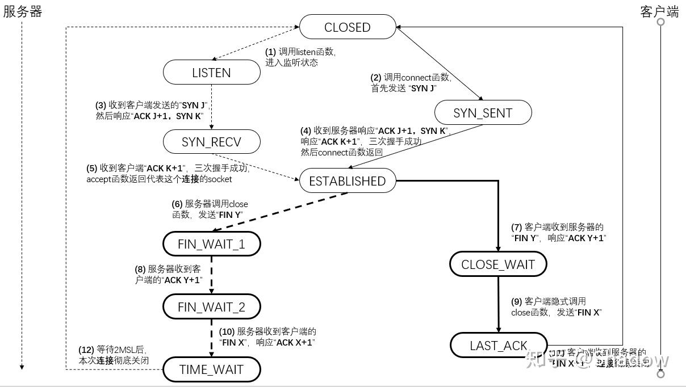
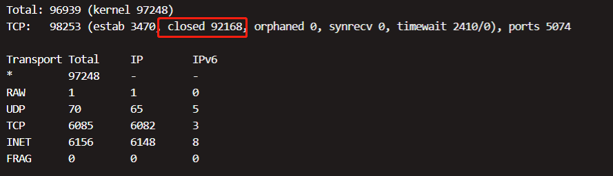
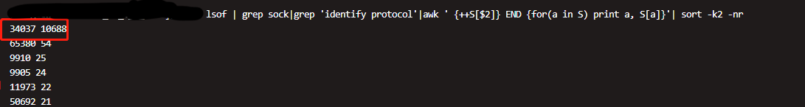
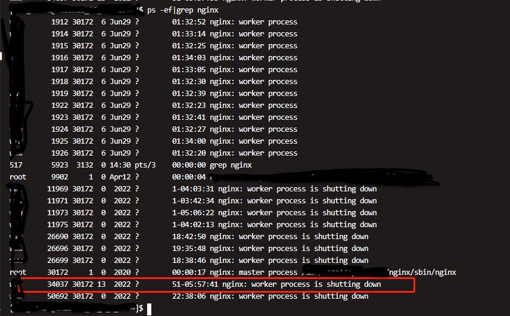
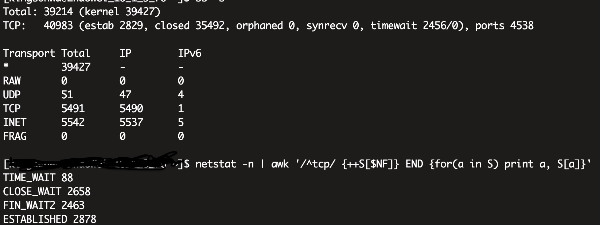
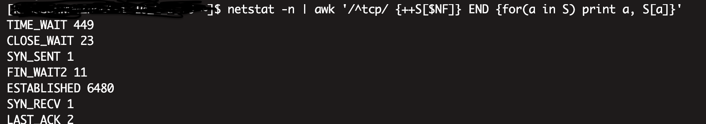

## 结论先行
+ 服务死锁导致大量请求hang住，进程无法提供服务且大量socket泄漏

### 具体过程
+ 服务某些逻辑处理不当导致死锁
+ 大量请求hang住没有响应
+ 上层的nginx超时主动关闭连接
+ 服务被关闭连接，导致大量CLOSE_WAIT
+ 由于服务对连接处理不当（待分析原因TODO），导致大量socket泄漏


---

## 前置知识

### TCP状态图
+ 从网上找的



### 相关排查命令

<pre>
sudo lsof | grep sock | awk '{++S[$1]} END {for(a in S) print a, S[a]}' | sort -nr
sudo lsof | awk '/sock/ {++S[substr($0, index($0, $9))]} END {for(a in S) print a, S[a]}'
sudo lsof | grep sock|grep 'identify protocol'|awk ' {++S[$2]} END {for(a in S) print a, S[a]}'| sort -nr
//打开句柄数目最多的进程
lsof -n|awk '{print $2}'| sort | uniq -c | sort -nr | head
//查看close_wait连接统计：
sudo netstat -anp|grep 'CLOSE_WAIT'|grep 'ssogo'| awk '{print $5}'|sort |uniq -c | sort -nr
//查看FIN_WAIT2连接统计：
sudo netstat -anp|grep 'FIN_WAIT2'|grep 'ssogo'| awk '{print $5}'|sort |uniq -c | sort -nr
//查看CLOSE_WAIT最多的进程
sudo netstat -anp|grep 'CLOSE_WAIT'| awk '{print $7}'|sort |uniq -c | sort -nr
sudo netstat -anp|grep 'FIN_WAIT2'| awk '{print $7}'|sort |uniq -c | sort -nr
</pre>

### ss 
+ 在 ss -s 命令的输出中，"closed" 表示已关闭的 TCP 连接的数量。

>>具体地，TCP 的 "closed" 状态表示连接已经关闭，不再使用，并且不再具有任何网络连接或状态信息。这些连接处于已经结束的状态，但它们的套接字资源还未被完全释放或回收。

>>在输出结果中，"closed" 数量是指当前处于已关闭状态的 TCP 连接的数量。这些连接可能是先前已经建立的连接，已经完成了其通信任务，双方都关闭了连接，并且连接的套接字资源等待系统进行资源回收。

>>需要注意的是，已关闭的连接数量的增加和减少是动态的，因为在系统的运行过程中，套接字的打开和关闭是常见的网络操作。

## lsof
+ `lsof| grep "can't identify protocol"`
如果存在很多，则代表socket泄漏，同时会显示哪个进程使用的sock未关闭。

+ [tcp-socket文件句柄泄漏](http://mdba.cn/2015/03/10/tcp-socket%E6%96%87%E4%BB%B6%E5%8F%A5%E6%9F%84%E6%B3%84%E6%BC%8F/)

---

## 架构图
+ TODO

---

## 处理过程1




+ 紧急重启服务（业务Go服务）后socket数量下降

+ 在现场已经没了的情况下，分析发现机器上本身已经存在大量socket泄漏的情况







+ nginx和gateway都reload，那么nginx会产生新的worker进程，但是应该shutdown的老进程因为和gateway还有连接，所以也不会销毁，这样时间长了会有很多处于shutting状态的进程，这些进程都会占用资源。

+ 初步怀疑是这些异常的nginx worker进程导致的，于是处理所有机器上这些异常（kill）
    1. 如果清掉这些异常进程后，问题不再发生，那么很大可能就是这个原因导致的
    2. 如果问题还继续发生，说明是其他的原因

---

## 处理过程2
+ 即使上次清理了所有有问题的nginx worker进程，释放了大量泄漏的socket，相同的问题后续还是发生了



+ 还是出现了大量的closed状态，已经大量的close_wait和fin_wait2状态


+ 通过lsof查看，确实是Go业务进程泄漏的socket



+ 上图的正常状态下，close_wait和fin_wait2状态的数量，并没那么多

+ todo： 后续统计一下：

<pre>
//查看close_wait连接统计：
sudo netstat -anp|grep 'CLOSE_WAIT'|grep 'ssogo'| awk '{print $5}'|sort |uniq -c | sort -nr
//查看FIN_WAIT2连接统计：
sudo netstat -anp|grep 'FIN_WAIT2'|grep 'ssogo'| awk '{print $5}'|sort |uniq -c | sort -nr
//查看CLOSE_WAIT最多的进程
sudo netstat -anp|grep 'CLOSE_WAIT'| awk '{print $7}'|sort |uniq -c | sort -nr
sudo netstat -anp|grep 'FIN_WAIT2'| awk '{print $7}'|sort |uniq -c | sort -nr
</pre>

+ 通过pprof输出进程的goroutine情况，从数量和堆栈分析，大量goroutine锁住，导致请求被hang住 

+ 至此，问题的基本表现分析如下
    1. Go进程出问题hang住大量请求
    2. 上层的nginx超时主动关闭连接，状态变成FIN_WAIT2，而Go进程对应的socket拦截则变成CLOSE_WAIT
        - 查看设置为 proxy_read_timeout 10（即10s）：proxy_read_timeout 是用来设置与后端代理服务器之间的读取超时时间，它控制 Nginx 从后端代理服务器读取响应的最长等待时间。当从后端服务器读取响应数据的时间超过了设置的超时时间，Nginx 将认为后端服务器的响应已经超时，并且会中断与后端服务器的连接。
    3. Go进程对已关闭的连接处理异常，导致大量“can't identify protocol” 
        - 请求被hang住，进程没释放，socket会占有（不然被新的请求占有造成数据包混乱）

### 扩展

#### can't identify protocol 是怎么出现的？
+ https://idea.popcount.org/2012-12-09-lsof-cant-identify-protocol/

```python
import socket
import os
import sys

PORT = 9918

sd = socket.socket(socket.AF_INET, socket.SOCK_STREAM)
sd.setsockopt(socket.SOL_SOCKET, socket.SO_REUSEADDR, 1)
sd.bind(('0.0.0.0', PORT))
sd.listen(5)

for i in range(10):
    if os.fork() == 0:
        sd.close()
        cd = socket.socket(socket.AF_INET,
                           socket.SOCK_STREAM)
        cd.connect(('127.0.0.1', PORT))
        sys.exit()

print "Server process pid=%i" % (os.getpid(),)
sockets = []
for i in range(10):
    (cd, address) = sd.accept()
    sockets.append(cd)
    cd.shutdown(socket.SHUT_WR)

os.system("lsof -p %i" % (os.getpid(),))
```   

+ `cd.connect(('127.0.0.1', PORT))`之后没有执行`cd.close()`（关闭客户端套接字，确保连接被正确关闭）, 直接执行 sys.exit()，导致连接没有正确关闭，从而出现了"can't identify protocol"的问题

#### 为什么lsof和ss的执行结果不同
+ ss命令显示closed状态的socket，在lsof显示的是can't identity protocol
+ 大概是两个命令实现的原理差异吧

#### 通过模拟client断开，server端hang住
+ https://raw.githubusercontent.com/Kingson4Wu/awesome-tools/main/network/http-print.c 加上 `sleep(600);`的代码
+ curl --connect-timeout 10 -m 20 "http://XXXXXXX"
+ 执行lsof 只出现了‘CLOSE_WAIT’,没有出现 can't identity protocol

#### go进程为什么没正确关闭socket
+ todo
+ strace -p

#### strace 怎么使用
+ todo

### gin怎么设置接受的socket数量
+ todo
+ gin接收请求数量上限设置


---

## 处理过程3
+ 分析Go进程死锁原因

+ 通过分析pprof的goroutine堆栈

```go
type GuardPolicy struct {
	mu      *sync.RWMutex
	errData map[*sql.DB]int
}

type sortPool struct {
	connPool gorm.ConnPool
	errCnt   int
}

func (s *GuardPolicy) countErr(db *gorm.DB) {
	if db.Error == nil || errors.Is(db.Error, gorm.ErrRecordNotFound) {
		return
	}
	if ins, ok := db.Statement.ConnPool.(*sql.DB); ok {
		s.mu.Lock()
		defer s.mu.Unlock()
		s.errData[ins] = s.errData[ins] + 1
	}
}

func (s *GuardPolicy) Resolve(connPools []gorm.ConnPool) gorm.ConnPool {
	var x = make([]*sortPool, 0, len(connPools))
	for i := range connPools {
		p, ok := connPools[i].(*sql.DB)
		if !ok {
			x = append(x, &sortPool{connPool: connPools[i], errCnt: 0})
		} else {
			s.mu.RLock()
			defer s.mu.RUnlock()
			x = append(x, &sortPool{connPool: connPools[i], errCnt: s.errData[p]})
		}
	}
	sort.Slice(x, func(i, j int) bool {
		return x[i].errCnt <= x[j].errCnt
	})
	return x[0].connPool
}
```

（1） goroutine1: s.mu.RLock()
（2） goroutine2: s.mu.Lock() - 等待（1）
（3） goroutine1: s.mu.RLock() - 等待（2）
相当于goroutine1自己等待自己


+ 问chatgpt：
是的，提供的代码存在死锁风险。死锁可能发生在Resolve方法中。

在Resolve方法中，对于sql.DB类型的连接，当读取errData映射的错误计数时，使用了RWMutex的读锁（s.mu.RLock()）。但是，在循环的每次迭代中都会调用defer s.mu.RUnlock()，这会在for循环结束时解锁，而不是在每次迭代结束时解锁。

这意味着如果在某次循环迭代中获取了读锁，但在获取下一个读锁之前已经进入了循环的下一次迭代，那么这两次迭代将持有读锁，但没有释放，从而导致死锁。

要解决这个问题，可以将读锁的获取和解锁放在同一次循环迭代中，确保每次获取读锁后都会及时释放，而不会在后续迭代中持有读锁。以下是修改后的代码：

```go
func (s *GuardPolicy) Resolve(connPools []gorm.ConnPool) gorm.ConnPool {
	var x = make([]*sortPool, 0, len(connPools))
	for i := range connPools {
		p, ok := connPools[i].(*sql.DB)
		if !ok {
			x = append(x, &sortPool{connPool: connPools[i], errCnt: 0})
		} else {
			s.mu.RLock()
			errCnt := s.errData[p]
			s.mu.RUnlock()
			x = append(x, &sortPool{connPool: connPools[i], errCnt: errCnt})
		}
	}
	sort.Slice(x, func(i, j int) bool {
		return x[i].errCnt <= x[j].errCnt
	})
	return x[0].connPool
}

```

---

## Reference
+ [tcp socket文件句柄泄漏](https://blog.csdn.net/wodatoucai/article/details/69389288)
+ [确认是否有socket泄露](https://www.cnblogs.com/rootq/articles/1403720.html)
+ [记一次排查socket fd泄漏](https://zzyongx.github.io/blogs/socket_fd_leak.html)
+ [又一次排查socket fd泄漏](https://zzyongx.github.io/blogs/socket_fd_leak_2.html)
+ [socket句柄泄漏问题的定位： losf和strace的联合使用](https://blog.csdn.net/stpeace/article/details/57103089)