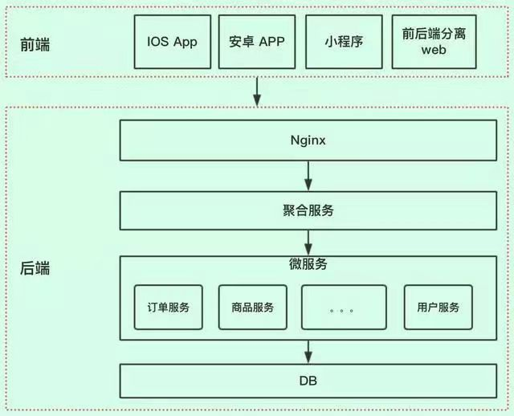

>> 以前刚毕业的时候，进入一个组，叫中间层，那时候还懵懵懂懂不知道想表达啥意思

+ 图来源网上，已未知出处

+ 这个组是直接给app提供接口的，主要的职能大概有以下
    + 业务适配
    + 服务聚合
    + 数据展示
    + 安全隔离

+ 聚合服务，简单的来说就是聚合底层的各个业务系统，给用户端应用提供接口
    - （直接对接用户前端的接口服务，手机app，网站，h5等用户终端）
    - BFF —— Backends for frontends（服务于前端的后端），是为了让后端API满足不同的前端使用场景，而演进出来的一种模式。
    - [BFF避坑指南](https://mp.weixin.qq.com/s/IZ5wD2Dc5k83dP6dR8M9xg)

+ 那么这个组有存在的必要吗？特别是现在服务内部都微服务化，很多业务服务都是直接对app提供接口的。

+ 先从表面上看看使不使用聚合层各自的特点和好处
    - 使用聚合层
        1. 前端需要对接的接口比较少，对前端来说比较友好
        2. 聚合层可以聚合底层业务的接口，相比前端直接对接，有些业务场景可以提升接口性能
        3. 能根据前端的业务场合适配和统一改动，便于快速迭代和打补丁等
        4. 可以根据前端对数据的不同使用场景，减少不必要的性能损耗
            - 如果统一接口，入参就会变得复杂，增加前端的对接成本
    - 不使用聚合层
        1. 有些业务场景，减少多一层调用，有利于提升性能
        2. 业务接口可以复用，不需要聚合层再包一层，减少开发时间
            - 前提：整个公司统一接口规范，同个接口可以复用于不同app    
        3. 分散接口故障风险。一个业务故障，不会导致其他业务也故障。
            - 相对使用聚合层，聚合层的服务不可用，整个app都会受影响 

+ 仔细想想，简单理解，其实使用聚合层就是水平架构，不使用就是垂直架构；根据康威定律，其实公司决定使用哪种方案，一定程度还受公司组织关系的影响。

+ 提外话：由于前后端分离的流行。聚合层服务有时候会由前端团队来维护。使用node服务用于聚合页面和后端接口，从而提升性能。相对于传统的聚合层，前端的聚合层比较轻量化，基本是无状态服务，不存储数据和加工数据，纯粹做聚合接口和页面。

