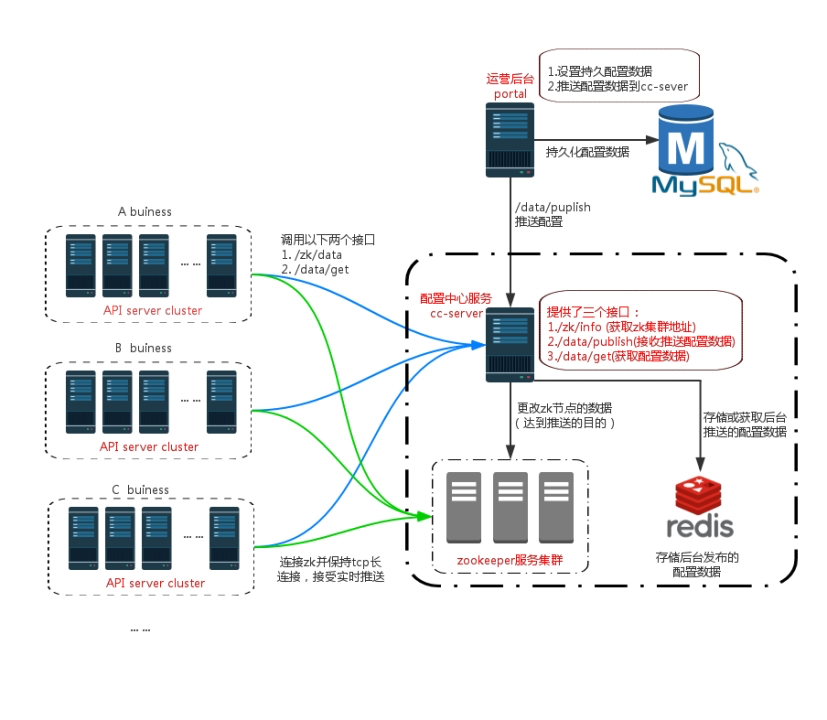

>> 第一次接触配置中心，是快十年前了，那时的配置中心还没像现在那么多成熟的开源项目，很多公司都需要结合自身业务自研。

## 使用配置中心的好处
1. 快速发布变更配置，实时生效
2. 对于不复杂的系统或业务配置，可以避免写繁琐的后台，但又具备快速变更的功能
3. 读取配置性能高，一般配置后，都是以内存变量的方式常驻在服务中，可以说读取配置几乎零成本

## 配置中心的核心-推送原理

>> 这里主要讲一下个人实际接触的三种原理，其实从宏观本质上看，三种方案原理是一致的

1. 第一家公司的配置中心自研方案，借助ZooKeeper的临时节点变更事件，从而实现实时推送

2. 第二家公司的服务治理中心的实现方案，使用Netty使服务中心和各服务之间建立TCP长链接，从而实现配置推送

3. 第三家公司使用Apollo开源项目作为配置中心，原理是使用HTTP的Long polling方案

+ 从原理的本质上看，三者都是通过保持TCP连接不断开，从而复用这个通道进行数据推送
+ 除了推送的实现很重要之外，后台管理系统的设计和客户端的SDK也很重要。因为光能实时推送是不够的，要让接入配置中心方便，以及能方便管理和发布配置也是很关键的。在这一点上，Apollo这个开源项目是很不错的。

