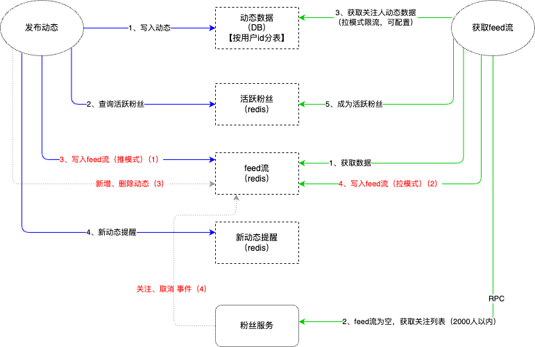
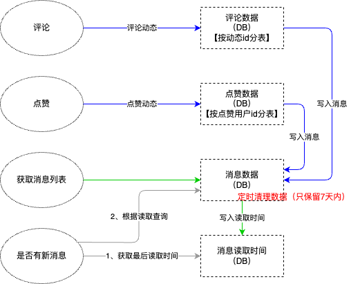
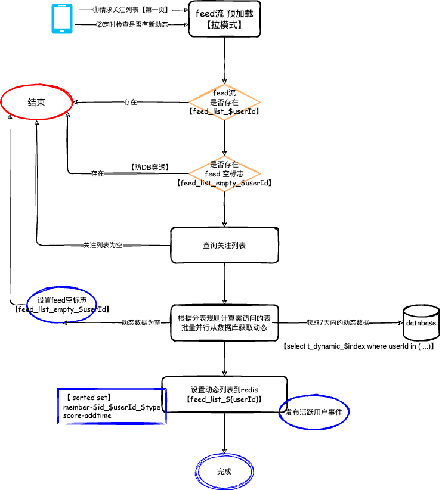
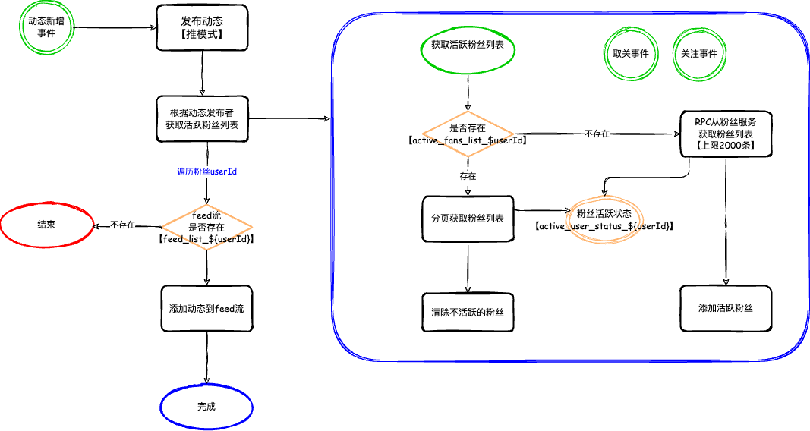
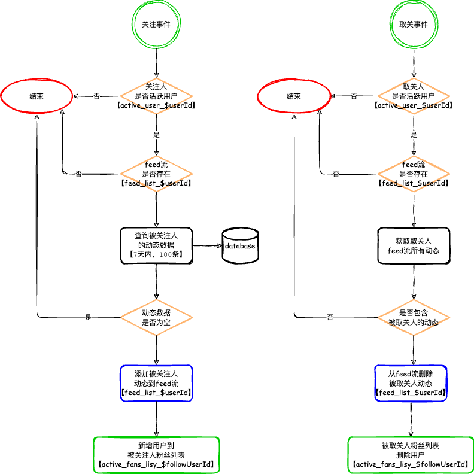
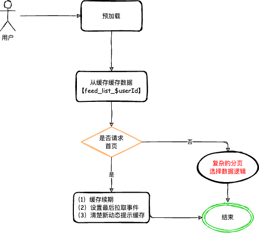
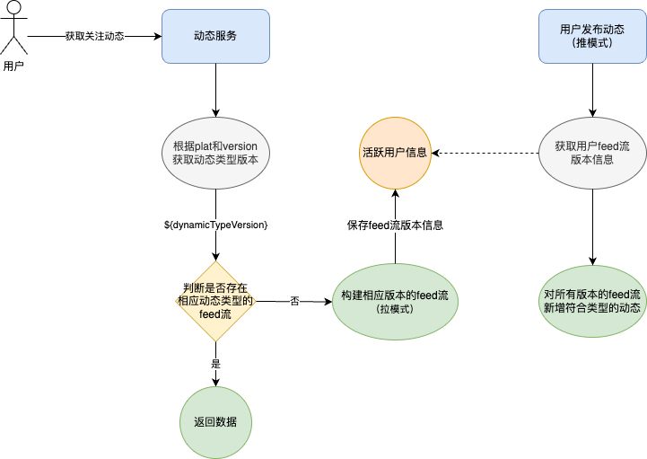

>> 几年前也做过feed流相关的服务，虽然网上相关的文章很多，这里也做个人的简要记录和总结
>> 方案并非原创，当时是参考其他业务团队的设计

+ 需求背景：做一个用户动态模块，可以发动态，可以关注别人动态，有推荐列表，有消息提醒（其实就是微博的基本功能）

# 实现逻辑流程

+ 整个feed流设计都是强依赖Redis来实现的，以下列出key设计和对应的功能模块
    - 粉丝的feed流 - 【feed_list_$userId】
        - member-$id_$userId_$type （score-addtime）
    - 粉丝的feed流为空标志 - 【【feed_list_empty_$userId】】- 防止每次请求都穿透到DB
    - 用户的活跃粉丝列表 - 【active_fans_list_$userId】
    - 用户的活跃属性 - 【active_user_status_${userId}】
    - 动态详情 - 【cache.user.dynamic_${dynamicId}】 - MGet获取

+ 数据库分表设计
    - 用户动态表 - 按用户id分库
    - 评论表 - 按动态id分库（根据业务，一般都是单个动态的所有评论）
    - 点赞表 - 按用户id分库（根据业务，一般都是动态列表中展示当前用户的点赞状态）

+ feed流使用sortset，score是addtime
+ 推模式，通过维护用户的活跃粉丝列表（有数量限制），推到粉丝的feed流
+ 拉模式，通过请求第一页或其他接口进行预加载，查询粉丝的关注人和对应动态（有数量限制），构建粉丝自己feed流

## 01.feed流 构建 整体流程

+ 用户发动态、删动态、关注和取关事件，都会对feed流有相应操作
+ 通过发布事件的设计进行业务逻辑解耦

### 用户发动态（推模式）
1. 用户发布动态（写入DB）
2. 查询用户的活跃粉丝列表（Redis）
3. 写入粉丝的Feed流（Redis）
4. 写入消息表

### 粉丝拉关注列表（拉模式）（请求第一页或其他接口，预加载）
1. 获取feed流（Redis）
2. 获取关注用户列表（RPC）（限制2000个粉丝）
3. 获取关注人的动态数据（DB）（限制没人100条动态）
4. 写入个人的Feed流（Redis）
5. 成为活跃用户（Redis）

## 02.动态消息交互

+ 消息表 和 消息读取时间表（用于控制用户红点提示和读取消息列表的范围）
+ 消息表保存7天定时清除

## 03.feed流预加载策略（pull模式）

+ 。。。。
+ 将用户加入为活跃粉丝

## 04.动态新增、删除（push模式），活跃粉丝处理

+ 用户的活跃粉丝列表逻辑
    1. 拉取过feed流或发布过动态等操作的用户，都会设置成有活跃粉丝属性的用户
    2. RPC获取用户的粉丝列表，过滤掉非活跃用户，保存到用户的活跃粉丝列表
    3. 关注和取关事件，也更新活跃粉丝列表

## 05.关注、取关 事件 对feed流的处理

## 06.获取feed流

+ 有了前面的推拉模式，用户直接从redis获取feed流即可

## 07.动态类型版本设计

+ 随着动态类型的新增，客户端旧版本不支持新类型动态，需要过滤；
+ 目前feed流是存在redis的，直接过滤可能会导致旧版本数据为空，可以通过多版本动态来区分

+ 实现描述
    1. 用户获取feed流，根据客户端的版本号等信息，判断出客户端支持的feed版本，并构建对应的feed流
    2. 用户发布动态，构建用户存在的活跃动态版本的feed流（为了用户的新旧版本都兼容）

# 扩展
+ 很久之前做的一次实验
    - 取消了微信黑名单，没看到之前的人的朋友圈。说明微信朋友圈也是feed持久化的方式实现
    - 微博也是这样，之前关注过，取关后再恢复，内容也能恢复，说明feed表只是逻辑删（应该是存数据库表了）
+ 微博feed实现（猜测）
    1. 为每个用户保存他所有关注的用户的feed表数据
    2. 假如取关，则重写关注能恢复数据（逻辑删除）
    3. 但如果之前没关注的用户，则他之前的动态不会出现在feed表中
