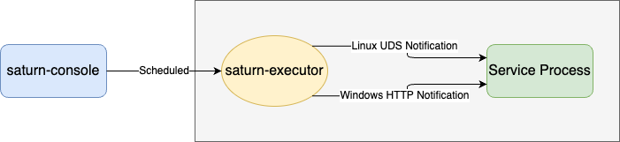
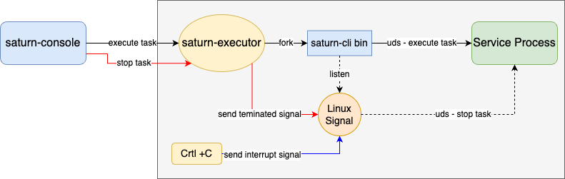

+ 基于之前写的这篇[谈谈定时任务的原理和应用](https://kingson4wu.github.io/2023/07/03/20230703-tan-tan-ding-shi-ren-wu-de-yuan-li-he-ying-yong/)继续聊。

+ 由于业务进程不是Java编写的，无法使用Saturn提供的Java定时任务，只能使用Shell定时任务

+ 这里选择用UDS实现Shell进程和服务进程之间的通信，实现和使用Java定时任务一样的效果
+ 在上次的实现中，只考虑了如何触发定时任务执行，并没有考虑如何停止

## 实现对执行中的任务进行停止

    

+ 通过测试可以知道，当在saturn控制台点击终止任务时，会对shell进程发出terminated信号
+ 如何不是通过saturn控制台触发，直接终端执行shell命令时，操作Crtl+C时，会对Shell进程发出interrupt信号

+ 基于上述研究，提供以下方式停止业务服务的运行中的定时任务
    1. 通过saturn控制台点击终止任务，发terminated信号
    2. 通过操作Crtl+C，发interrupt信号
    3. 通过执行shell命令，指定任务名称和-stop选项，直接发出终止任务请求

## 扩展
+ 经过测试，saturn的调度不会因为设置的频率太快导致并发运行，只会执行完一个任务再执行下一个

