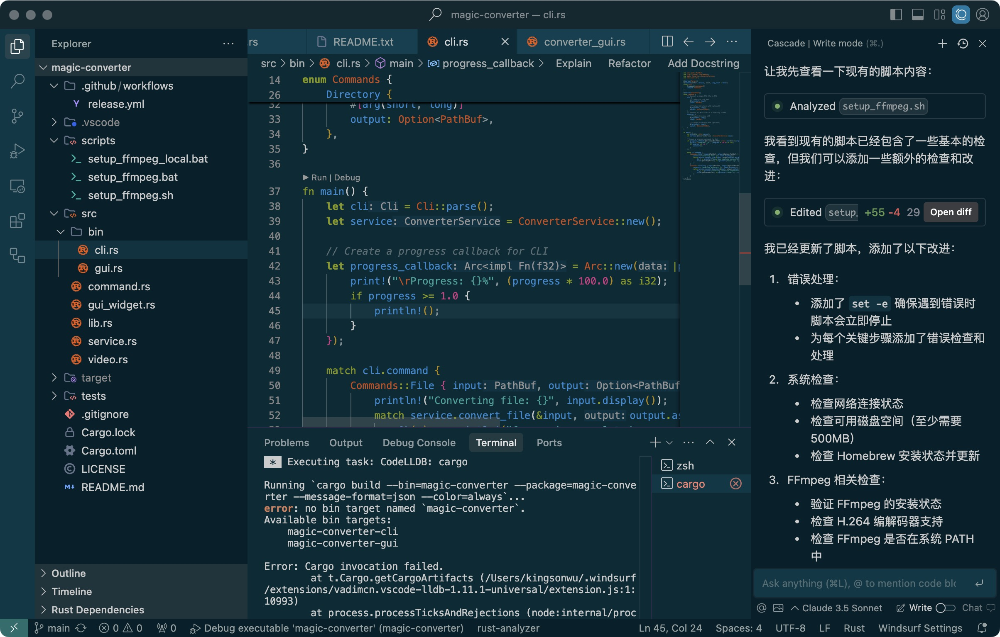

+ 今天使用Windsurf帮我写一个小工具。
+ 全程没有写过一行代码和一个字，全靠一直给AI提需求，配合授权运行纠正；有时感觉偏离正确的道路时，结合git命令回退代码，再重新提需求。就这样一直重复，就帮我把这个小工具写好了，包括使用文档，构建脚本等，通通都包了。
+ 自从两年前第一次用ChatGPT时一下子服气了，这次直接帮我把整个项目搞定了，不得不再次拜服。客观来讲，如果是我一个人来做，由于对Rust不熟练等原因，估计得一周，而且还会很费劲，然而它半天就搞定了，并且我做得不一定比它好。
+ AI为什么这么强大，对里面的细节是越来越好奇了。

+ 项目地址：https://github.com/Kingson4Wu/magic-converter

