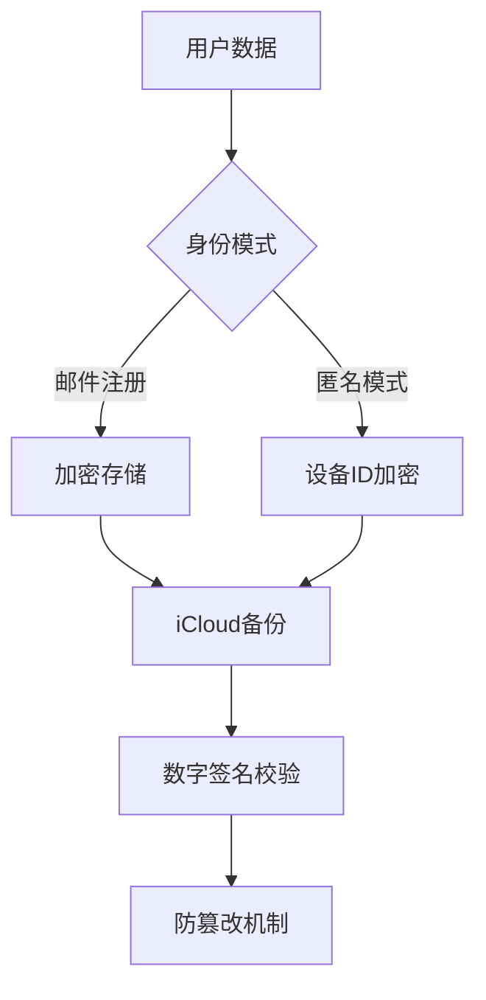

## 通信协议
1. 初始阶段：UDP广播发现
2. 建立连接后：切换到TCP进行可靠通信（也可以使用 UDP）（增加接收完成确认机制）

## AI生成的需求文档

=====

## 局域网去中心化通信工具 iOS 应用需求文档

### 项目概述
开发一款基于局域网的去中心化即时通信应用，支持可选的邮件注册、设备迁移，同时保证数据安全性和用户灵活性。

### 功能需求

#### 1. 用户身份与账号管理
##### 1.1 注册模式
- 提供两种账号模式：
  1. 邮件注册模式
  2. 匿名模式（无注册）

##### 1.2 邮件注册
- 支持邮箱作为唯一标识
- 注册流程：
  1. 输入邮箱地址
  2. 发送验证码
  3. 验证码校验
  4. 设置密码（可选）

##### 1.3 匿名模式
- 自动生成唯一设备ID
- ID生成算法：
  - 基于设备信息
  - 加入随机熵
  - 确保全球唯一性

#### 2. 身份与数据迁移
##### 2.1 数据备份
- 支持将关键数据备份到 iCloud
- 备份内容：
  - 好友关系
  - 本地配置
  - 唯一标识信息

##### 2.2 数据完整性与防篡改
- 使用密码学签名保护本地数据
- 备份数据加密存储
- 数据完整性校验机制：
  1. 每条记录生成哈希值
  2. 使用非对称加密签名
  3. 防止篡改和重放攻击

##### 2.3 账号绑定
- 匿名用户可随时绑定邮箱
- 绑定后保留原有数据和身份标识
- 邮箱绑定过程：
  1. 生成迁移凭证
  2. 邮箱验证
  3. 数据关联

#### 3. 网络发现与连接
- 保留原需求文档中的网络发现机制
- 新增身份验证层：
  1. 设备ID交换
  2. 可选的身份签名验证

#### 4. 消息通信机制
- 保留原需求文档中的消息队列功能
- 新增加密通信：
  1. 端到端加密
  2. 消息签名
  3. 防重放攻击

#### 5. 系统要求
- 目标平台：iOS 14.0+
- 开发语言：Swift
- 架构：ARM64
- iCloud 集成

### 技术实现建议
- 身份与加密：
  - CryptoKit
  - Apple 安全隔离区（Secure Enclave）
- 存储：
  - CoreData
  - iCloud 同步
- 网络：
  - Network.framework
  - 支持 HTTPS/TLS
- UI：SwiftUI

### 安全性要求
- 设备ID生成使用硬件随机数生成器
- 备份数据端到端加密
- 支持多重身份验证
- 用户可控的隐私设置

### 数据保护关键技术

### 开发交付物
1. 完整 Xcode 工程
2. 技术文档
3. 安全性审计报告
4. 单元和集成测试用例

### 开发注意事项
- 遵循 Apple 隐私指南
- 代码安全审查
- 最小权限原则
- 用户数据可控

### 隐私与合规
- GDPR 兼容
- 用户数据可导出
- 明确的隐私政策
- 用户可完全删除数据

### 性能目标
- 设备发现 < 3秒
- 消息延迟 < 1秒
- 低功耗
- 最小化系统资源占用