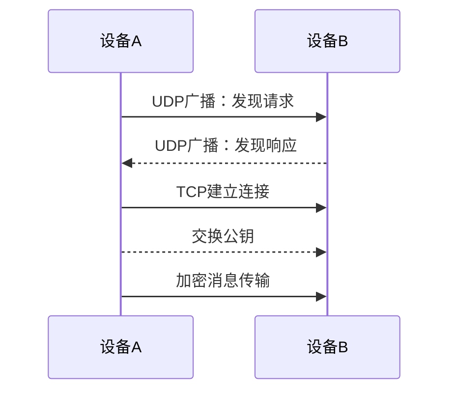
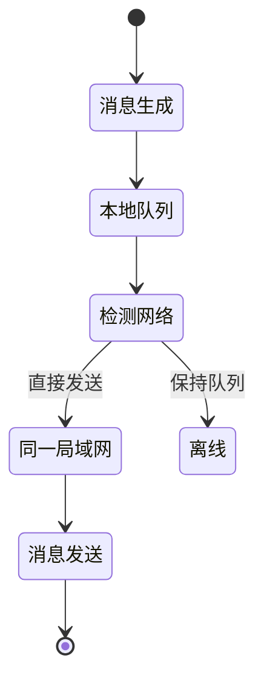
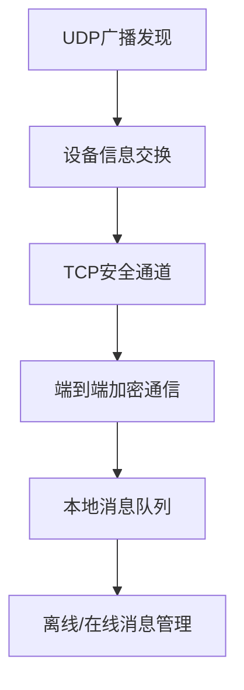

## 通信协议
1. 初始阶段：UDP广播发现
2. 建立连接后：切换到TCP进行可靠通信（也可以使用 UDP）（增加接收完成确认机制）

## AI生成的需求文档


=====

## 局域网去中心化点对点通信工具 iOS 应用需求文档

### 项目概述
开发一款完全去中心化的局域网点对点即时通信应用，无需中心服务器，通过UDP广播实现设备发现和通信。

### 核心设计理念
- 完全去中心化
- 基于局域网的点对点直接通信
- 无需任何中心服务器
- 设备间直接建立连接

### 网络通信技术架构

#### 1. 设备发现机制
##### 1.1 UDP 广播发现
- 使用UDP广播进行设备发现
- 广播地址：255.255.255.255
- 广播端口：固定端口（如 48689）
- 发现报文结构：
  ```json
  {
    "deviceId": "唯一设备标识",
    "nickname": "用户昵称",
    "timestamp": "时间戳",
    "publicKey": "公钥信息",
    "capabilities": ["支持的功能列表"]
  }
  ```

#### 2. 连接建立协议
- 发现阶段：UDP 广播
- 连接阶段：切换到 TCP
- 通信协议：自定义应用层协议
- 连接建立流程：
  1. UDP 广播发现
  2. 交换公钥
  3. 建立加密 TCP 通道

#### 3. 通信模型
- 无中心节点
- 每个设备既是客户端又是服务端
- 直接点对点通信
- 消息路由完全去中心化

### 功能需求详细描述

#### 1. 网络发现与连接
- 持续监听 UDP 广播
- 自动发现局域网内设备
- 支持手动/自动添加好友
- 好友关系本地持久化

#### 2. 消息通信机制
- UDP 广播发现
- TCP 建立稳定通道
- 消息队列管理
- 离线消息处理

#### 3. 安全性设计
- 设备间公钥交换
- 端到端消息加密
- 防重放攻击
- 消息签名验证

### 技术实现细节

#### 网络通信协议


#### 消息队列流程


### 系统架构图


### 技术选型
- 语言：Swift
- 网络框架：Network.framework
- 加密：CryptoKit
- 存储：CoreData
- UI：SwiftUI

### 关键技术挑战
1. 跨设备一致性
2. 网络发现可靠性
3. 安全性保证
4. 低功耗设计

### 性能目标
- 设备发现时间 < 3秒
- 消息延迟 < 1秒
- 电池资源占用 < 5%
- 网络资源占用最小化

### 安全性要求
- 端到端加密
- 防重放攻击
- 设备指纹验证
- 消息签名机制

### 隐私保护
- 无中心服务器
- 本地数据完全加密
- 用户完全控制通信
- 不依赖任何第三方服务

### 开发交付物
1. 完整 Xcode 工程
2. 详细技术文档
3. 安全性测试报告
4. 性能基准测试结果

### 版本迭代计划
- v1.0：基础局域网通信
- v1.1：增强安全性
- v1.2：优化性能
- v2.0：跨平台支持

### 开发注意事项
- 严格遵循 Apple 安全guidelines
- 代码安全审查
- 最小权限原则
- 用户体验优先

====

### Rust简易版本
+ https://github.com/Kingson4Wu/mesh-talk （使用windsurf生成）


====

## 扩展
>> 发现已经有了相关实现，非常棒！
+ https://github.com/localsend/localsend 局域网文件传输，广播发现，可以简易发消息
