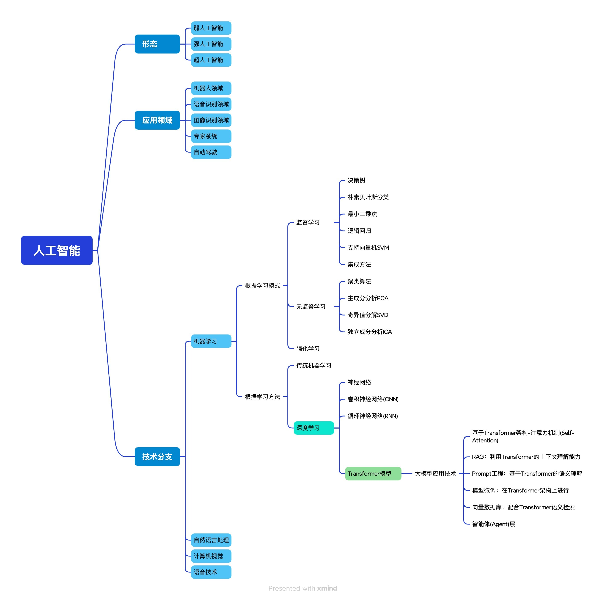

>> 持续补充...

## 人工智能的三种形态
+ 来自：[人工智能是什么？——人工智能图谱](https://zhuanlan.zhihu.com/p/64467701)
+ 弱人工智能：弱人工智能 (Artificial Narrow Intelligence, ANI) 是擅长与单个方面的人工智能，比如有能战胜象棋世界冠军的人工智能，但是它只会下象棋，你要问它怎样更好地在硬盘上存储数据，它就不知道怎么回答你了；
+ 强人工智能：强人工智能 (Artificial General Intelligence, AGI) ，是人类级别的人工智能，强人工智能是指在各方面都能和人类比肩的人工智能，人类能干的脑力活它都能干。创造强人工智能比创造弱人工智能要难得多，我们现在还做不到。Linda Gottfredson教授把智能定义为“一种宽泛的心理能力，能够进行思考、计划、解决问题、抽象思维、理解复杂理念，快速学习和从经验中学习等操作”。强人工智能在进行这些操作时，应该和人类一样得心应手；
+ 超人工智能：超人工智能 (Artificial Super Intelligence, ASI)，牛津哲学家，知名人工智能思想家Nick Bostrom把超级智能定义为“在几乎所有领域都比最聪明的人类大脑都聪明很多，包括科技创新、通识和社交技能”。超人工智能可以是各方面都比人类强一点，也可以是各方面都比人类强万亿倍，超人工智能也正是为什么人工智能这个话题这么火热的缘故，同样也是为什么永生和灭绝这两个词会在本文中多次出现。

## 关于大模型的扩展思考
+ 目前的AI是一个无限能量和记忆的辅助工具，但跟人有差别，比如犯错时难以追责，毕竟人需要信誉等等....
+ cursor、 Windsurf

## Reference
+ [人工智能是什么？——人工智能图谱](https://zhuanlan.zhihu.com/p/64467701)
