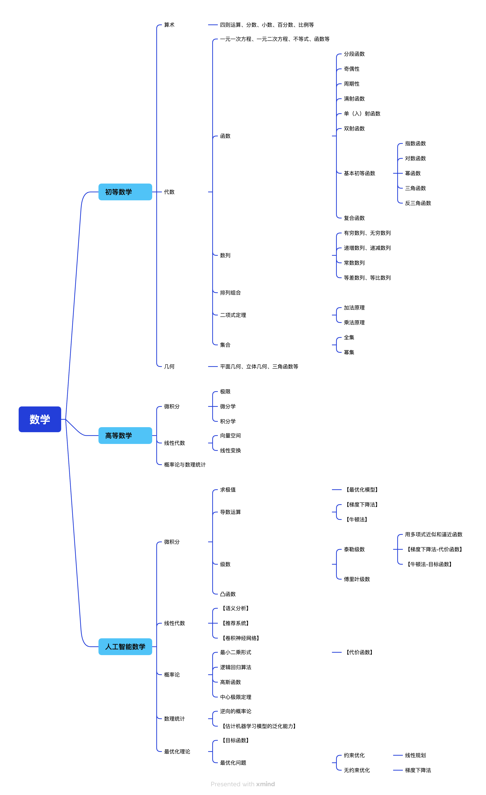
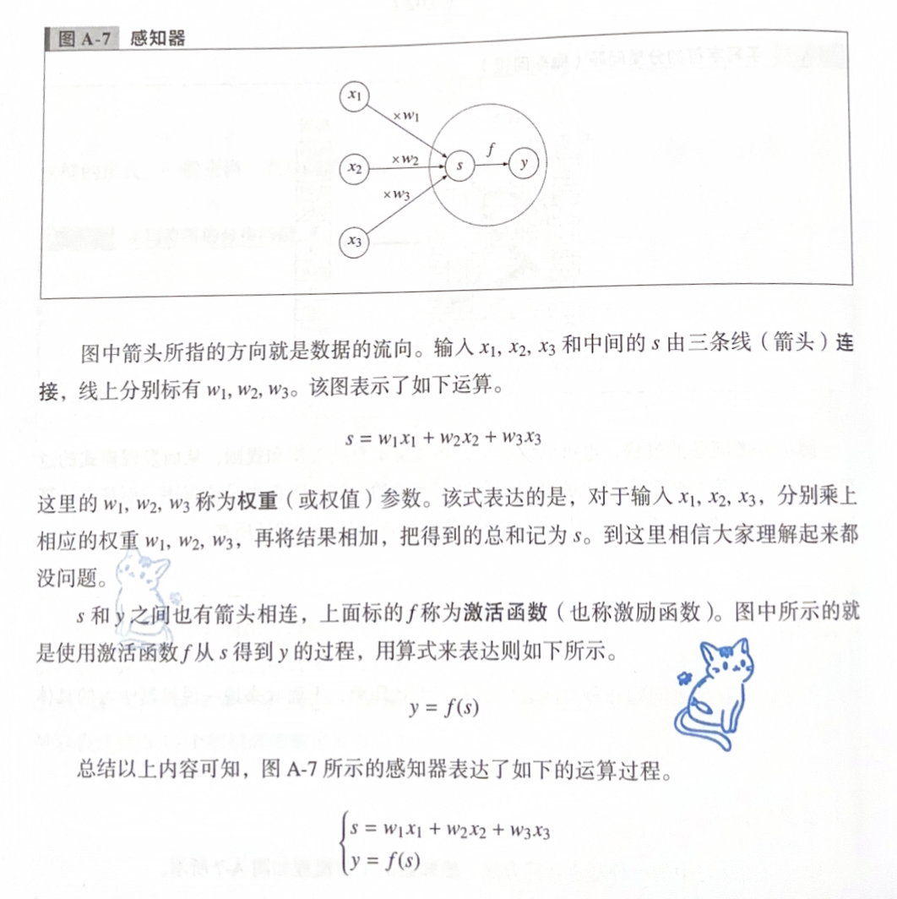
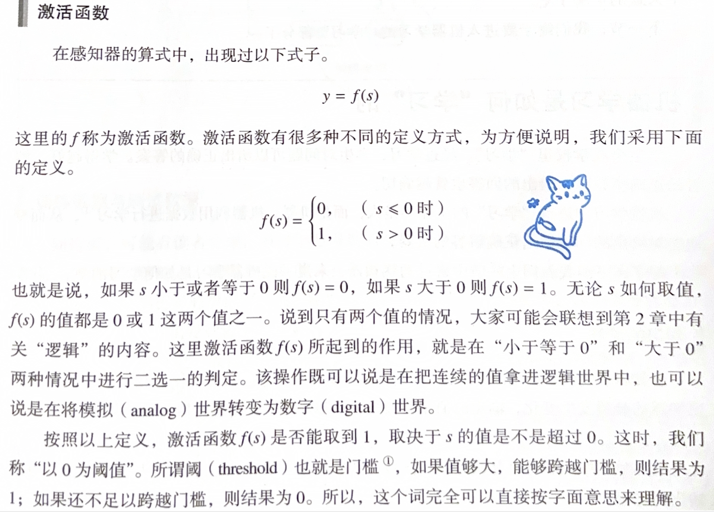
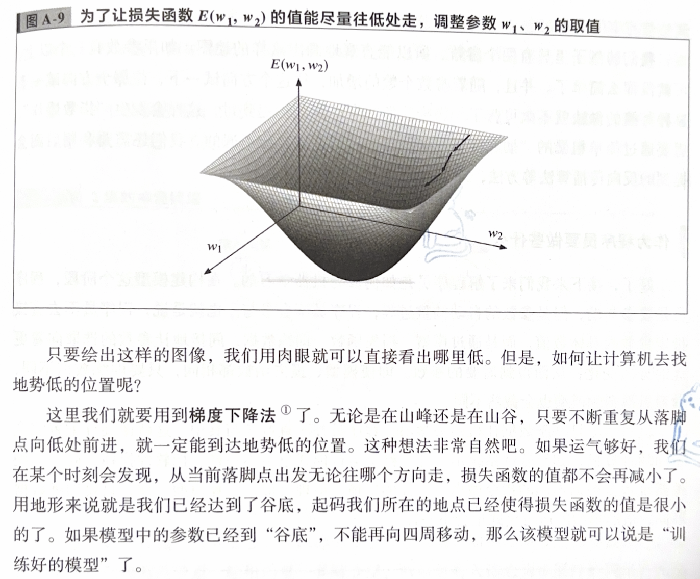
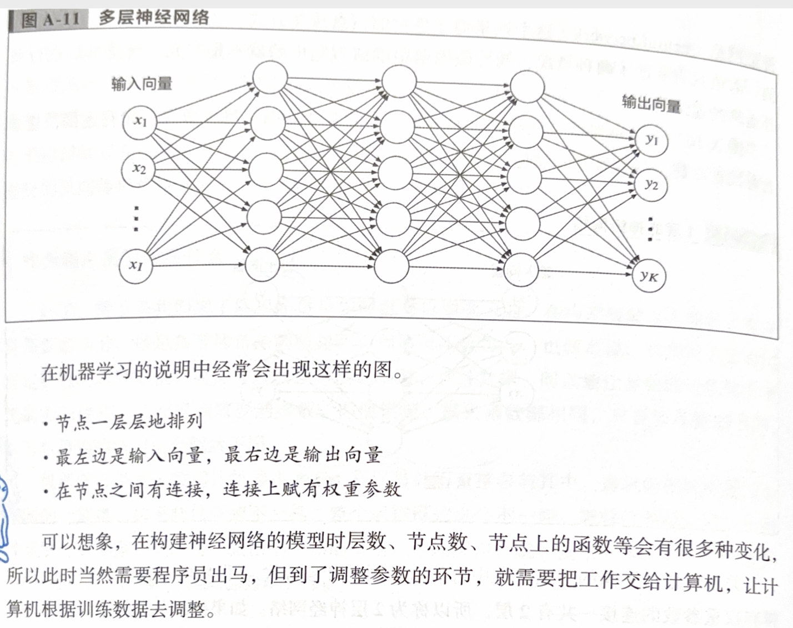

>> 简单记录，未完善
>> 内容基本来源书籍

=====

# 初等数学

## 函数
+ 函数的表示方法主要有三种：解析法（公式法）、图像法和表格法。在微积分中讨论的函数几乎都是用解析法表示的。

## 二项式定理
+ 二项式定理又称为牛顿二项式定理，它可将两个数之和的整数次幂展开为相应项之和。

=====

# 高等数学

## 微积分

=====

# 人工智能数学
+ 从发展历程来看，人工智能先后经历了推理机、专家系统及机器学习三个阶段。
+ 当前的人工智能系统多为学习型。为了减小误差，其用数据去训练假设模型，也就是进行所谓的学习，当误差降到最小时，就把这个假设模型用于其他现实问题。
+ 人工智能实际上是一个将数学、算法理论和工程实践紧密结合的领域。人工智能从本质上来看就是算法，是概率论、统计学等各种数学理论的体现。数学作为表达与刻画人工智能模型的工具，是深入理解人工智能算法原理必备的基础知识。人工智能与数学高度相关，可以说人工智能的核心是数学，计算机只是实现人工智能模型的工具。

+ 函数逼近：随着大数据和人工智能技术的发展，机器学习和深度学习在大数据挖掘、模式识别和智能分析越来越受重视。机器学习是一种基于数据的学习方法，其从观测数据所包含的有限信息中构造一个模型，利用该模型对未知数据或无法观测的数据进行尽可能准确的预测，这种模型称为学习机器。对数据科学而言，所有的数据都是以数字形式表示的，通过定义损失函数，选择合适的核函数或激活函数，反复学习后可达到一种最佳逼近状态，因此，机器学习问题实际上是函数估计问题或函数逼近问题。

## 微积分
+ 求导是微积分的基本概念之一，也是很多理工科领域的基础运算。导数是变化率的极限，是用来找到“线性近似”的数学工具，是一种线性变换，体现了无穷、极限、分割的数学思想，主要用来解决极值问题。人工智能算法的最终目标是得到最优化模型，其最后都可转化为求极大值或极小值的问题。
+ 比如，梯度下降法和牛顿法是人工智能的基础算法，现在主流的求解代价函数最优解的方法都是基于这两种算法改造的，如随机梯度法和拟牛顿法，其底层运算就是基础的导数运算。
+ 级数也是微积分中非常重要的概念，常见的级数有泰勒级数、傅里叶级数等，它们在人工智能算法中也有非常重要的地位。
+ 泰勒级数体现了用多项式近似和逼近函数的思想。
+ 泰勒级数在人工智能算法的底层起到了非常重要的作用，泰勒级数对理解很多基础算法的原理很有帮助。例如，梯度下降法的数学原理涉及代价函数的一阶泰勒近似，而牛顿法的推导过程应用了目标函数的二阶泰勒近似。
+ 凸函数也是微积分中的重要概念，人工智能算法中涉及的优化问题要求函数模型必须是凸函数，否则优化问题没有最优解。
+ 微积分中还有许多概念，如方向导数、梯度、伽马函数等，它们都在人工智能中有广泛的应用

## 线性代数
+ 线性代数的基本原理在人工智能算法中处于核心地位，在人工智能的语义分析、推荐系统、卷积神经网络等方面有大量应用，是目前最前沿的深度学习算法原理的基础。

## 概率论
+ 很多机器学习算法是以概率统计的理论为基础支撑推导出来的，比如代价函数的最小二乘形式、逻辑回归算法都基于对模型的最大似然估计。
+ 概率论中的高斯函数及中心极限定理被广泛用于人工智能算法。独立同分布的不同随机变量之和会随变量数的增加而趋于高斯分布，因此，很多模型假设都采用高斯函数进行建模。

## 数理统计
+ 概率论作用的前提是随机变量的分布已知，其根据已知的分布来分析随机变量的特征与规律；数理统计的研究对象则是分布未知的随机变量，其研究方法是对随机变量进行独立重复的观察，根据得到的观察结果对原始分布做出推断，数理统计可以看作逆向的概率论。
+ 若检验是通过随机抽取的样本来对一个总体的判断结果进行认可或否定，则可以将其用于估计机器学习模型的泛化能力。

## 最优化理论
+ 人工智能的目标就是最优化，就是在复杂环境与多体交互中做出最优决策。几乎所有的人工智能问题最后都会归结为一个优化问题的求解，因此，最优化理论同样是学习、研究人工智能必备的基础知识。
最优化理论研究的问题是判定给定目标函数是否存在最大值或最小值，并找到令目标函数取最大值或最小值的数值。如果把给定的目标函数看成连绵的山脉，最优化的过程就是找到顶峰（谷底）且到达顶峰（谷底）的过程。
+ 最优化理论的研究内容主要包括线性规划、（不）精确搜索、梯度下降法、牛顿法、共轭梯度法、拟牛顿法、（非）线性最小二乘法、约束优化最优性条件、二次规划、罚函数法和信赖域法等。
+ 要实现最小化或最大化的函数称为目标函数，大多数最优化问题都可以通过使目标函数最小化解决，最大化问题也可以通过最小化来解决。最优化方法找到的可能是目标函数的全局最小值，也可能是局部极小值，两者的区别在于全局最小值比定义域内所有其他点的函数值都小，而局部极小值只比所有邻近点的函数值小。
+ 当目标函数的输入参数较多、解空间较大时，大多数实用的最优化方法都不能满足全局搜索对计算复杂度的要求，因而只能求出局部极小值。但是，在人工智能和深度学习的应用场景中，只要目标函数的取值足够小，就可以把这个值当作全局最小值使用，以此作为对性能和复杂度的折中。

=====

>> 程序员的数学

## 迈向机器学习的第一步
+ 由输入和目标组成的数据称为训练数据。机器学习中所谓的学习，就是为了通过给定的输入得到和目标尽可能接近的输出，使用训练数据对参数进行调整的过程。使用训练数据对参数进行过调整的模型称为训练好的模型。对于训练好的模型，需要用测试数据对其进行测试，从而评价训练的效果。
+ 在机器学习中对参数进行调整的过程，不是由程序员完成的，而是由计算机通过训练数据自动完成的，这正是机器学习的一大特征。
+ 这里先做个总结吧。我们面对预测问题，首先要有好的模型加上大量的训练数然后，我们需要的是“能根据输入向量，得到和目标向量尽量接近的输出向量”这样一个训练好的模型。

+ 解决分类问题的过程，也可以说是从大量数据中总结规律和规则，从而发现模式的过程。机器学习并不会要求程序员提前研究手写字符的各种形态再去设计程序，而是由计算机根据训练数据来调整参数，从而得到分类模型，这才是它的特征所在。

+ 如果机器对训练数据能给出完美的输出，对测试数据给出的结果却不尽如人意，很有可能是发生了过拟合（overfitting）。用学生来说，就好比是课堂上做过的训练题都能解得很好，但考试成绩却不怎么理想。

+ 在学习的过程中，需要比较输出和正确的值。拿这个简单的例子来说，要比较的对象就是由输入x1，x2通过给定模型得到的输出y和目标t。如果y和的值一致，那当然好，但一般并不会这么理想。对学习结果（输出）的评价不是单纯的“好与不好”，而是要知道它与训练数据中给出的目标相比“到底有多不好”。为了实现这种评价，需要引入损失函数。
在具体的机器学习问题中，如何选取恰当的损失函数是个重要且有难度的问题。比如使用平方和误差函数。
+ 要通过调整模型中的权重参数，使得损失函数值尽可能接近于0。
+ 梯度下降法

+ 作为程序员要做些什么
    - 在构建模型这个阶段，程序员是要参与的，但是参数的自动调整过程，程序员不会参与。也就是说，程序员不去直接指定参数的具体数值，而是通过模型、损失函数、训练数据，间接地让参数的选取向着更优的方向变化，从而得到需要的参数。即使模型、损失函数都相同，只要训练数据不同，学习后得到的模型也会截然不同。
    - 机器学习是基于数据让机器去学习，程序员并不直接参与其中。这就像硬件配置完全同的计算机，如果软件系统不一样，整个运行模式也会不一样。把软件换掉，同一套硬件系统也会根据不同的指令做出不一样的事情。道理类似，就算模型一样，只要训练数据不同，最后模型的运行模式也会不一样。

+ 神经网络是指，把像感知器一样有输入和输出的节点排列起来形成的带有层次的结构。神经网络（neural network）这个词来源于生物的信息传递方式。在感知器中，输出是二元的，取值只有0或1两种情况，而神经网络中的节点输出的就不是二元，而是可以进行微分运算的连续值。

+ 深度学习是在神经网络的基础上，通过增加层数得到的更加“深化”的模型。增加层数是为了更加精确地拟合复杂函数，就算涉及的参数个数不做大的变动，也能得到更好的模型。至于如何“深化”在理论上更为有效，依然是现在研究的热点之一。
+ 强化学习是在“无监督”的条件下进行的“学习”。也就是说，在学习过程中没有标准答案可供参考。强化学习通过试错来寻找最优输出，对每个输出，系统都会提供反馈（奖励），模型的参数可以根据得到的反馈来调整。

+ 做出决策
    - 机器学习会根据输人的数据预测未来。这种意义下的预测，是基于先前的经验进行的，得到的是未来最有可能发生的情况（数值）。但是，得到预测值之后“应该做些什么”，机器是无法决定的。也就是说，它们无法进行决策。
    - 通过机器学习这个方法，机器可以告诉我们在未来什么样的行动会导致事情如何发展。
    - 但是，做决策这件事本身，并不能让机器来做。
    - 顺着这个话题继续讲下去，就不是技术问题，而是伦理问题了。比如，在减轻痛苦和延续生命之中二选一的问题等，只能由个人的意志来决定，不可能委托给机器学习。

=====

# Reference
+ 《人工智能数学基础》
+ 《程序员的数学》

