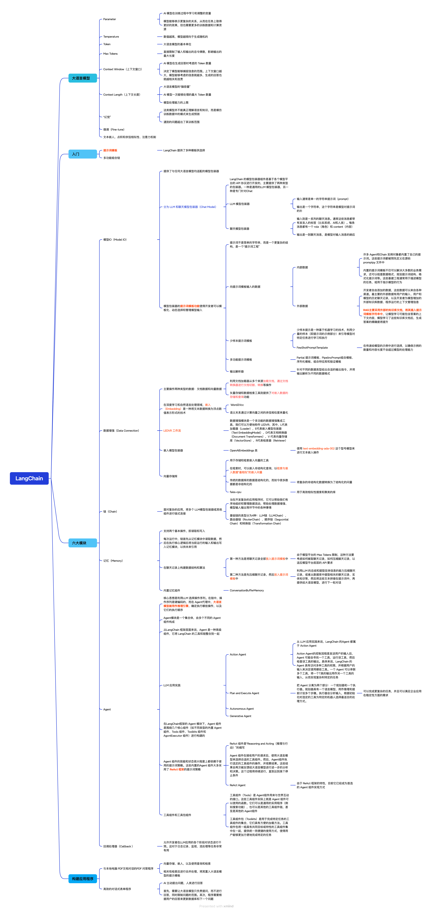

>> 基于书籍简单记录要点

# LangChain 提供了多种模板供选择

+ LangChain 提供了以下格式化 SQL 提示词模板（翻译）：
<pre>
1. 你是一个 PostgreSQL 专家。给定一个输人问题，首先创建一个语法正确的 PostgreSQL查询来运行，然后查看查询结果，扑返回针对输人问题的答案。
2. 除非用户明确指定了要返回的结果数量，否则应使用 PostgreSQL 的LIMIT 子句来限制查询结果，最多返回top.k条记录。你可以对结果进行排序，以返回数据库中最有信息价值的数据。
3. 绝对不要查询表中的所有列。你只能在询回答问题所需的列。用双引号（"）将每个列名包裹起来，表示官们是界定的标识符。
4. 注意只使用你在表巾可以看到的列名，不要责询不存在的列。此外，要注意哪一列在哪个表中。
5. 如果问题涉及“今天”，请注意使用 CURRENT_DATE 函数获取当前日期。

使用以下格式：

问题：这里的问题
SQL查询：要运行的 SQL 查询
SQL结果：SQL 查询的结果
答案：这里的最终答案

只使用以下表：

(table_info)

问题：｛input｝

</pre>

+ 想象一下，如果没有 LangChain 提供的这个提示词模板，当你要开始编写一段SQL查询代码时，会走多少弯路？LLM 应用开发的最后1公里，其意义是确保开发者无须为了一个小细节而多走弯路，正如居民无须跑很远坐公交车一样，每一个关键的细节都能得到及时而准确的处理，使得整个开发过程更为高效。

# 记忆提示词
+ 创建提示词是最重要的环节。在创建的过程中你可以理解为什么加人记忆组件后，“聊天备忘录”有了内容，让链组件有了“记忆”。使用提示词模板包装器，自定义一个提示词模板字符串。
+ 提示词内容分为四部分：
    - 一是对模型的指导词：“请你回答问题的时候，依据文档内容和聊天记录回答，如果在其中找不到相关信息或者答案，请回答不知道。”；
    - 二是使用问题检索到的相关文档内容；“文档内容是：｛context｝”；三是记忆组件输出的记忆内容：“聊天记录是：｛chat_history｝”；四是用户的输人：“Human：(human _input)"
<pre>
template = "n*你是说中文的 chatbot.
请你回答问题的时候，依据文持内容和脚天记录回答，如果在其中找不到相关信息戒着答案，请回答
不知道。
文档内容是：｛context）
聊天记录是：｛chat_history）
Human: (human_input)
Chatbot:"""
</pre>    

# Reference
+ 《LangChain入门指南构建高可复用、可扩展的LLM应用程序》
