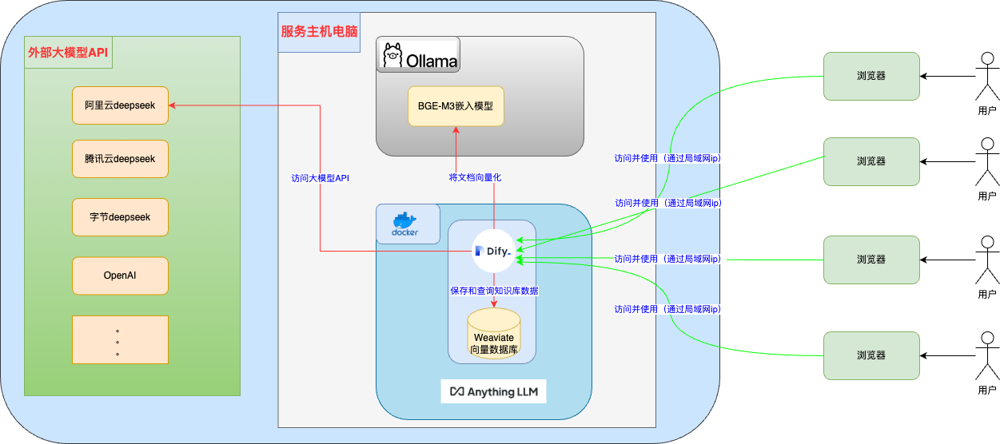

>> 帮助朋友的公司搭建内部知识库的原型
>> 简单记录一下相关技术

+ 目前看权限管理都很不精细，只在固定角色上进行控制，用于内部团队管理仍不是很方便
+ 文档嵌入效果一般，可能要研究里面一些复杂的选项用法，或者寻求其他方案

+ 除了dify，还有很多其他开源的知识库系统，比如 Cherry Studio、MaxKB、FastGPT、AnythingLLM、Ragflow等
+ dify功能很多，anythingllm功能较少，Cherry Studio 就是个人知识库
+ 所谓的各种助手其实就是提示词模版

# 扩展
+ 传统RAG通常依赖单次检索，这可能不足以处理需要逐步构建上下文的复杂查询
+ 向量相似性检索依赖知识库中明确提及的信息，可能无法捕捉隐含或关系信息。相比之下，知识图谱（如GraphRAG）通过利用数据结构中的关系，能更好地处理需要全面理解数据集的全局查询

