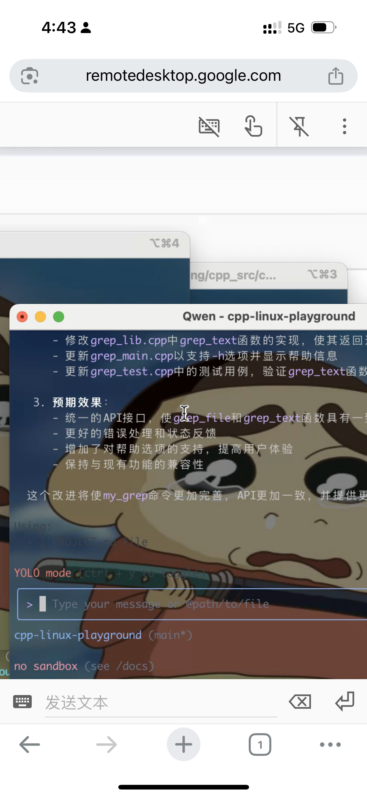
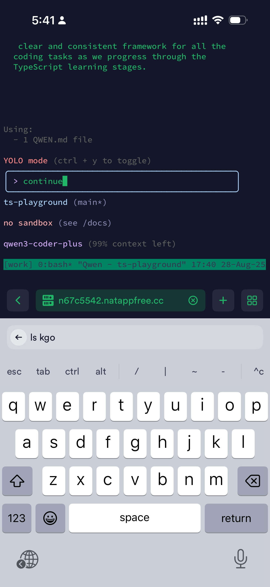

以前写代码是个挺“重”的事情：开一堆 IDE、文档、调试窗口，在桌面环境里来回切换。要是人在外面，就算能远程登录，也常常因为手机输入不方便、网络不稳定而放弃。

但现在情况不一样了。很多时候，你并不需要全套开发环境。只要能接上家里的机器，就能让零碎时间发挥点价值：不管是写点脚手架代码，跑几个命令，还是做些前期准备工作，都可以在外面先处理掉。等回到电脑前，再做深度开发和调试，就顺畅很多。

## 实际效果

---

## 思路很简单

其实只要搞定两件事，就能让“人在外面也能继续编程”变得靠谱：

### 1. 远程连上家里的环境

最简单的方式是用 **Chrome Remote Desktop** 直接把桌面搬到手机上。
但如果你更喜欢命令行的简洁，可以在 Mac 上开好 **SSH + tmux**，再配合 **内网穿透工具**（比如 Cloudflare Tunnel、frp、zerotier），这样就能在手机终端里直连家里的 tmux 会话。

### 2. 保持会话不中断

这里的关键是 `tmux`：

* 它能把会话挂在后台，不会因为你断开 SSH 就消失。
* 下次连上去，只要 `tmux attach` 就能回到之前的窗口，继续干活，丝毫不影响节奏。

---

## 这种方式的好处

* **轻量**：不用开完整远程桌面，命令行就够了。
* **连续性强**：断线没关系，tmux 会帮你“记住现场”。
* **利用碎片时间**：比如地铁上、咖啡店里，掏出手机就能跑些小任务。

---

## 总结

tmux + 内网穿透，说白了就是给自己搭了条随时可用的远程工作通道。
出门在外，你可以用手机连上去，把一些零碎的准备工作先做掉；回到家，再用大屏幕和 IDE 把任务完善。

